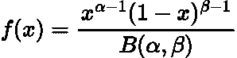
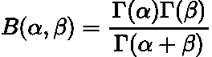
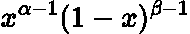
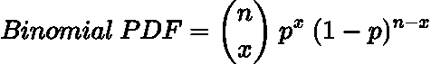
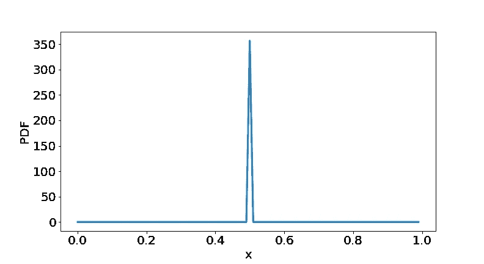

# 贝塔分布简单地解释了

> 原文：<https://towardsdatascience.com/beta-distribution-simply-explained-839b3acde6e9>

## 贝塔分布的简明解释。


照片由 [Lucas Santos](https://unsplash.com/@_staticvoid?utm_source=medium&utm_medium=referral) 在 [Unsplash](https://unsplash.com?utm_source=medium&utm_medium=referral) 上拍摄

# 介绍

[贝塔分布](https://en.wikipedia.org/wiki/Beta_distribution#Probability_density_function)是一种连续分布，通常被称为概率 的 ***概率分布。这是因为它只能取在 **0** 和 **1** 之间的值。***

当我们有一些关于成功和失败的数量的信息时，它被用来推断一个事件的概率。

贝塔分布的主要用途是作为贝叶斯统计中的<https://en.wikipedia.org/wiki/Conjugate_prior>**与 [**二项式**](https://en.wikipedia.org/wiki/Binomial_distribution) 和 [**伯努利**](https://en.wikipedia.org/wiki/Bernoulli_distribution) 分布的共轭先验。在我的下一篇文章中，我们将深入探讨这到底意味着什么，然而在这里，我们将只是获得 Beta 分布背后的一些直觉。**

# **数学定义**

**和往常一样，我喜欢从数学公式开始，然后深入研究分布的直觉。**

**贝塔分布的 [**概率密度函数(PDF)**](https://en.wikipedia.org/wiki/Probability_density_function) 为:**

****

**作者在 LaTeX 中生成的方程。**

**其中 ***0 ≤ x ≤ 1，*** 因此可以解释为我们上面提到的**概率**。**

> **这里有一个 StatExchange 线程链接[这里](https://stats.stackexchange.com/questions/277643/whence-the-beta-distribution)展示了 Beta 发行版的 PDF 的派生。**

**我们可以看到，它是由两个变量 ***α*** 和 ***β*** 和 ***B(α，β)*** 是[**β函数**](https://en.wikipedia.org/wiki/Beta_function) 它是**归一化常数**:**

****

**作者在 LaTeX 中生成的方程。**

**其中***γ(α)***是[**γ函数**](https://en.wikipedia.org/wiki/Gamma_function) :**

****

**作者在 LaTeX 中生成的方程。**

**你可以在我之前的帖子中读到更多关于伽马函数和 [**伽马分布的信息:**](https://en.wikipedia.org/wiki/Gamma_distribution)**

**</gamma-distribution-simply-explained-d95a9de16278>  

# 直觉

考虑贝塔分布的 PDF 的分子:



作者在 LaTeX 中生成的方程。

这让你想起什么了吗？

没错，就是很像[**二项分布**](https://en.wikipedia.org/wiki/Binomial_distribution) PDF:



作者在 LaTeX 中生成的方程。

即在给定概率下从***【x】***事件中获得 ***n*** 成功的概率

*例如，从 **10** 硬币中准确翻转出 **6** 人头的概率是 ***0.20508。****

*我们可以看到二项式分布和贝塔分布非常相似，除了一个关键点:*

*   *对于贝塔分布，**概率是一个我们试图估计的随机变量**。*
*   *对于二项分布，**概率是一个固定参数**，我们用它来推断 ***n*** 成功的概率。*

*因此，我们可以在已知成功次数、***【α-1】、*** 和失败次数、 ***β -1 的情况下，用贝塔分布来估计一个事件的概率。****

# *示例和图表*

*现在让我们通过几个例子来使这个理论更加具体。*

*让我们假设我们抛一枚有偏向的硬币 **50** 次，它正面着地 **30** 次，反面着地 **20** 次。*

*在这种情况下，我们有 **30 次**成功和 **20 次**失败，贝塔分布图如下:*

```
*# Import packages
from scipy.stats import beta as beta_dist
import matplotlib.pyplot as plt
import numpy as np# Plot the distribution
alpha = 31
beta = 21
x = np.arange (0, 1, 0.01)
y = beta_dist.pdf(x, alpha, beta)
plt.figure(figsize=(11,6))
plt.plot(x, y, linewidth=3)
plt.xlabel('x', fontsize=20)
plt.ylabel('PDF', fontsize=20)
plt.xticks(fontsize=20)
plt.yticks(fontsize=20)
plt.axvline(0.6,  linestyle = 'dashed', color='black')
plt.show()*
```

**

*作者用 Python 生成的图。*

*我们看到，这枚硬币正面朝上的最大概率是 **0.6，**，这可以理解为 **30/50 = 0.6** 。*

*此外，注意在 **0.4** 之前和 **0.8** 之后，硬币呈现这些值的概率实际上是 **0** 。如果我们获得更多的数据，比如说 100 个人头翻转 60 个人头，我们会看到这个峰值变窄，因为我们更确信人头的概率确实是 0.6 。*

> *记住 y 轴大于 **1** 的原因是因为这是概率密度函数。为了得到实际的概率，我们需要对概率密度函数进行积分，得到 [**概率质量函数**](https://en.wikipedia.org/wiki/Probability_mass_function) 。*

*现在让我们抛另一枚硬币，得到 100，000 个正面和 100，000 个反面。该数据的贝塔分布为:*

```
*alpha = 100_000
beta = 100_000
x = np.arange (0, 1, 0.01)
y = beta_dist.pdf(x, alpha, beta)
plt.figure(figsize=(11,6))
plt.plot(x, y, linewidth=3)
plt.xlabel('x', fontsize=20)
plt.ylabel('PDF', fontsize=20)
plt.xticks(fontsize=20)
plt.yticks(fontsize=20)
plt.show()*
```

**

*作者用 Python 生成的图。*

*我们现在看到峰值更窄，在 **0.5** 处。这是因为我们有更多的平衡数据，所以我们更确定这个硬币翻转的真实概率。*

*情节的完整代码可以在我的 GitHub 这里获得:*

*<https://github.com/egorhowell/Medium-Articles/blob/main/Statistics/Beta_Distribution.ipynb>  

# 结论

在这篇文章中，我们以定量和定性的方式描述了 Beta 分布，以及一些带有一些数据的基本图表，以获得背后的直觉。

在我的下一篇文章中，我们将解释贝叶斯统计中的共轭先验，以及贝塔分布是多么有用！

# 和我联系！

*   要在媒体上阅读无限的故事，请务必在这里注册！T35*💜*
*   *😀*
*   [*LinkedIn*](https://www.linkedin.com/in/egor-howell-092a721b3/)*👔*
*   *[*推特*](https://twitter.com/EgorHowell) 🖊*
*   *[*GitHub*](https://github.com/egorhowell) 🖥*
*   *<https://www.kaggle.com/egorphysics>**🏅***

> ***(所有表情符号都是由 [OpenMoji](https://openmoji.org/) 设计的——开源的表情符号和图标项目。许可证: [CC BY-SA 4.0](https://creativecommons.org/licenses/by-sa/4.0/#)******