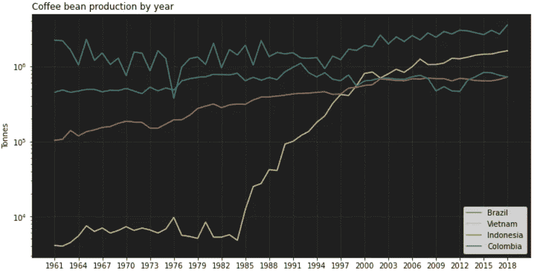
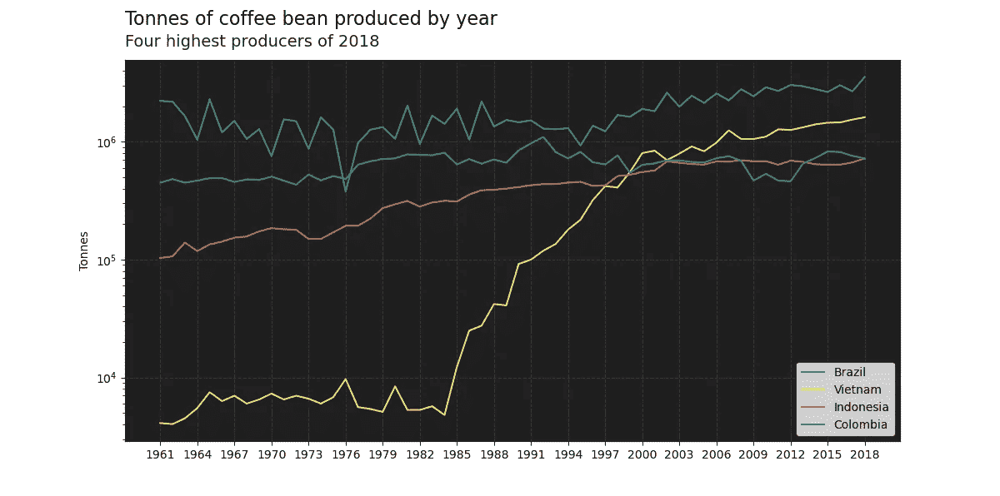
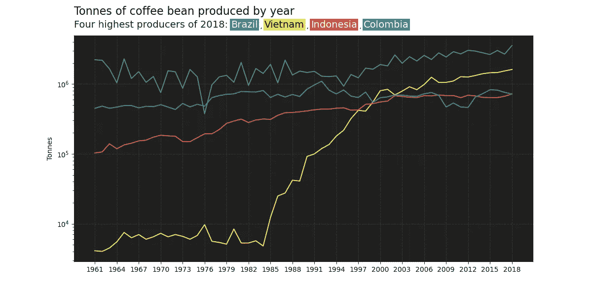
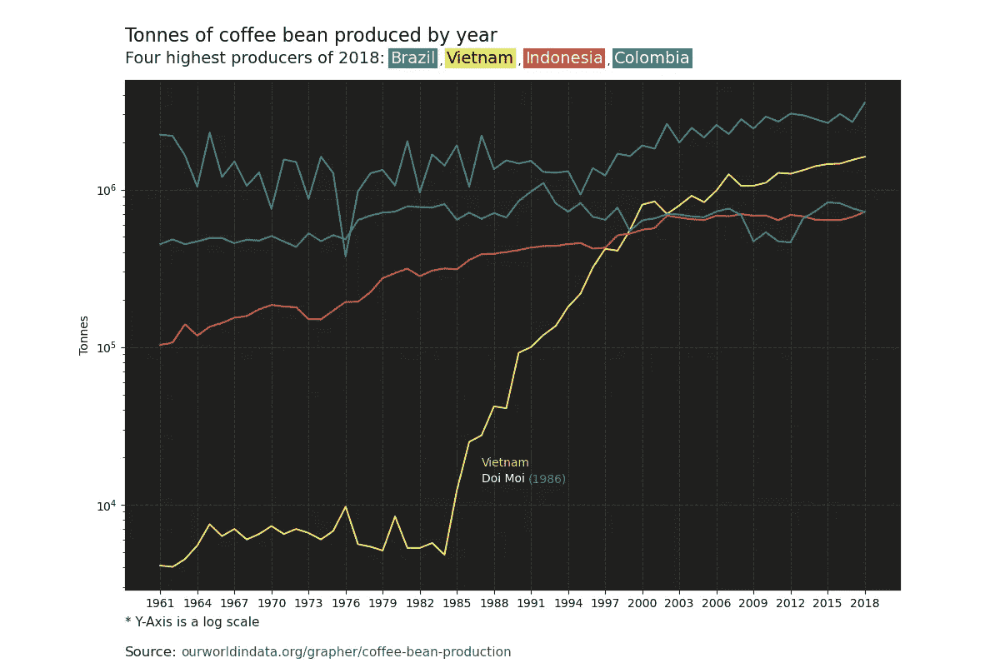

# 使用 Python 的 Matplotlib 进行更好的注释

> 原文：<https://towardsdatascience.com/better-annotations-with-pythons-matplotlib-46815ce098df>

## 如何在 Matplotlib 中轻松定制文本的快速指南


咖啡豆生产——作者图片

文本是为我们的数据可视化增加价值的一种无与伦比的方式。我们可以将注意力吸引到图表的特定方面，解释一个模式，或者给出关于该主题的额外信息。

本文将探讨如何用[高亮文本](https://github.com/znstrider/highlight_text)格式化 Matplotlib 文本。

对于下面的例子，我将使用来自数据中[我们的世界的咖啡产量数据。](https://ourworldindata.org/grapher/coffee-bean-production)

先说简单的。我们将绘制 2018 年咖啡产量最高的四个国家的历史数据。

```
import matplotlib.pyplot as plt
import numpy as np
import pandas as pd#[https://ourworldindata.org/grapher/coffee-bean-production](https://ourworldindata.org/grapher/coffee-bean-production)
df = pd.read_csv('../data/coffee-bean-production.csv')countries = ['Brazil', 'Vietnam', 'Indonesia', 'Colombia']
colors = ['#36AD63', '#EEEE50', '#DE4A43', '#3765B1']#figure
fig, ax = plt.subplots(1, figsize=(12,6))
ax.set_facecolor('#202020')# plot
for i, country in enumerate(countries):
    plt.plot(df[df['Entity'] == country].Year, df[df['Entity'] == country].tonnes, color=colors[i])# grid lines
ax.set_axisbelow(True)
ax.yaxis.grid(color='gray', linestyle='dashed', alpha=0.2)
ax.xaxis.grid(color='gray', linestyle='dashed', alpha=0.2)# ticks and labels
plt.xticks(np.arange(df.Year.min(),df.Year.max()+1, 3))
plt.ylabel('Tonnes')
ax.set_yscale('log')# legend and title
plt.legend(countries)
plt.title('Coffee bean production by year', loc='left')
plt.show()
```



咖啡豆生产——作者图片

没关系。但是有几个方面需要改进。

我想使标题更加突出，并在它下面添加图例作为我的副标题的一部分。我还想在图片底部写一些注释和这些数据的来源。

字幕和标题在 Matplotlib 中并不像我们预期的那样直观；对他们来说没有任何作用。

我们可以对副标题使用带有标题功能的换行符，但是没有办法对每一行进行不同的格式化。如果我们想让我们的字幕与众不同，我们需要同时使用标题和文本功能，然后努力调整坐标来放置字幕。

# 高亮文本

这个简单的包为我们在 Matplotlib 中格式化文本提供了很大的自由度。它允许我们拥有一个具有多种不同格式的字符串。

我们需要创建一个包含文本属性的字典列表。然后我们用标签(<>)为我们将要使用的不同格式编写字符串。

```
**from highlight_text import HighlightText, ax_text, fig_text**
import matplotlib.pyplot as plt
import numpy as np
import pandas as pd#[https://ourworldindata.org/grapher/coffee-bean-production](https://ourworldindata.org/grapher/coffee-bean-production)
df = pd.read_csv('../data/coffee-bean-production.csv')countries = ['Brazil', 'Vietnam', 'Indonesia', 'Colombia']
colors = ['#36AD63', '#EEEE50', '#DE4A43', '#3765B1']#figure
fig, ax = plt.subplots(1, figsize=(12,6))
ax.set_facecolor('#202020')# plot
for i, country in enumerate(countries):
    plt.plot(df[df['Entity'] == country].Year, df[df['Entity'] == country].tonnes, color=colors[i])# grid lines
ax.set_axisbelow(True)
ax.yaxis.grid(color='gray', linestyle='dashed', alpha=0.2)
ax.xaxis.grid(color='gray', linestyle='dashed', alpha=0.2)# ticks and labels
plt.xticks(np.arange(df.Year.min(),df.Year.max()+1, 3))
plt.ylabel('Tonnes')
ax.set_yscale('log')# legend and title
plt.legend(countries)**highlight_textprops = [{"fontsize":16, "color":'k'},
                       {"fontsize":14, "color":'#202020'}]****fig_text(x=0.125, y=0.9, va='bottom',
         s='<Tonnes of coffee bean produced by year>\n<Four highest producers of 2018>',
         highlight_textprops=highlight_textprops,
         ax=ax)**plt.show()
```



咖啡豆生产——作者图片

这使得我们可以快速地在一个对象中编写标题和副标题。

## 功能

字幕可以给我们的图表增加很多东西，有一种实用的添加方式是受欢迎的。但是一种更简单的格式化文本的方法提供了增强的可能性，这是默认使用 Matplotlib 所不能忍受的。

我们现在可以通过明确命名字幕中的每一行并格式化每个单词的背景来替换图例。

```
from highlight_text import HighlightText, ax_text, fig_text
import matplotlib.pyplot as plt
import numpy as np
import pandas as pd#[https://ourworldindata.org/grapher/coffee-bean-production](https://ourworldindata.org/grapher/coffee-bean-production)
df = pd.read_csv('../data/coffee-bean-production.csv')countries = ['Brazil', 'Vietnam', 'Indonesia', 'Colombia']
colors = ['#36AD63', '#EEEE50', '#DE4A43', '#3765B1']#figure
fig, ax = plt.subplots(1, figsize=(12,6))
ax.set_facecolor('#202020')# plot
for i, country in enumerate(countries):
    plt.plot(df[df['Entity'] == country].Year, df[df['Entity'] == country].tonnes, color=colors[i])# grid lines
ax.set_axisbelow(True)
ax.yaxis.grid(color='gray', linestyle='dashed', alpha=0.2)
ax.xaxis.grid(color='gray', linestyle='dashed', alpha=0.2)# ticks and labels
plt.xticks(np.arange(df.Year.min(),df.Year.max()+1, 3))
plt.ylabel('Tonnes')
ax.set_yscale('log')highlight_textprops = [{"fontsize":16, "color":'k'},
                       {"fontsize":14, "color":'#202020'},
                       **{"bbox": {"facecolor": "#36AD63", "linewidth": 0, "pad": 1.5}, "fontsize":14, "color":'w'},
                       {"bbox": {"facecolor": "#EEEE50", "linewidth": 0, "pad": 1.5}, "fontsize":14, "color":'k'},
                       {"bbox": {"facecolor": "#DE4A43", "linewidth": 0, "pad": 1.5}, "fontsize":14, "color":'w'},
                       {"bbox": {"facecolor": "#3765B1", "linewidth": 0, "pad": 1.5}, "fontsize":14, "color":'w'}**]fig_text(x=0.125, y=0.9,
              va='bottom',
              s='<Tonnes of coffee bean produced by year>\n<Four highest producers of 2018: >**<Brazil> , <Vietnam> , <Indonesia> , <Colombia>'**,
              highlight_textprops=highlight_textprops,
              ax=ax)plt.show()
```



咖啡豆生产——作者图片

同样，我们可以在图表底部区分注释和数据源。

我们甚至可以将字体颜色与背景颜色相匹配，创建一个空行，将两者分开。

```
from highlight_text import HighlightText, ax_text, fig_text
import matplotlib.pyplot as plt
import numpy as np
import pandas as pd#[https://ourworldindata.org/grapher/coffee-bean-production](https://ourworldindata.org/grapher/coffee-bean-production)
df = pd.read_csv('../data/coffee-bean-production.csv')countries = ['Brazil', 'Vietnam', 'Indonesia', 'Colombia']
colors = ['#36AD63', '#EEEE50', '#DE4A43', '#3765B1']#figure
fig, ax = plt.subplots(1, figsize=(12,8))
ax.set_facecolor('#202020')# plot
for i, country in enumerate(countries):
    plt.plot(df[df['Entity'] == country].Year, df[df['Entity'] == country].tonnes, color=colors[i])# grid lines
ax.set_axisbelow(True)
ax.yaxis.grid(color='gray', linestyle='dashed', alpha=0.2)
ax.xaxis.grid(color='gray', linestyle='dashed', alpha=0.2)# ticks and labels
plt.xticks(np.arange(df.Year.min(),df.Year.max()+1, 3))
plt.ylabel('Tonnes')
ax.set_yscale('log')# title
highlight_textprops = [{"fontsize":16, "color":'k'},
                       {"fontsize":14, "color":'#202020'},
                       {"bbox": {"facecolor": "#36AD63", "linewidth": 0, "pad": 1.5}, "fontsize":14, "color":'w'},
                       {"bbox": {"facecolor": "#EEEE50", "linewidth": 0, "pad": 1.5}, "fontsize":14, "color":'k'},
                       {"bbox": {"facecolor": "#DE4A43", "linewidth": 0, "pad": 1.5}, "fontsize":14, "color":'w'},
                       {"bbox": {"facecolor": "#3765B1", "linewidth": 0, "pad": 1.5}, "fontsize":14, "color":'w'}]fig_text(x=0.125, y=0.9,
              va='bottom',
              s='<Tonnes of coffee bean produced by year>\n<Four highest producers of 2018: ><Brazil> , <Vietnam> , <Indonesia> , <Colombia>',
              highlight_textprops=highlight_textprops,
              ax=ax)**# footnotes
notes_textprops = [{"fontsize":11, "color":'#202020'},
                   {"fontsize":8, "color":'w'},
                   {"fontsize":12, "color":'#202020'},
                   {"fontsize":11, "color":'#505050'}]****fig_text(x=0.125, y=0.07,
              va='top',
              s='<* Y-Axis is a log scale>\n<blankline>\n<Source:> <ourworldindata.org/grapher/coffee-bean-production>',
              highlight_textprops=notes_textprops,
              ax=ax)**plt.show()
```


咖啡豆生产——作者图片

## **注释**

使用 HighlightText 进行注释也同样简单。

代替 fig_text 函数，我们可以使用 ax_text，它使用我们的轴的坐标。

与图例类似，注释也可以受益于颜色。我们可以用它来关联其他元素——使用与注释线相同的颜色。

我们可以用它来突出或弱化上面的信息。

```
from highlight_text import HighlightText, ax_text, fig_text
import matplotlib.pyplot as plt
import numpy as np
import pandas as pd#[https://ourworldindata.org/grapher/coffee-bean-production](https://ourworldindata.org/grapher/coffee-bean-production)
df = pd.read_csv('../data/coffee-bean-production.csv')countries = ['Brazil', 'Vietnam', 'Indonesia', 'Colombia']
colors = ['#36AD63', '#EEEE50', '#DE4A43', '#3765B1']#figure
fig, ax = plt.subplots(1, figsize=(12,8))
ax.set_facecolor('#202020')# plot
for i, country in enumerate(countries):
    plt.plot(df[df['Entity'] == country].Year, df[df['Entity'] == country].tonnes, color=colors[i])# grid lines
ax.set_axisbelow(True)
ax.yaxis.grid(color='gray', linestyle='dashed', alpha=0.2)
ax.xaxis.grid(color='gray', linestyle='dashed', alpha=0.2)# ticks and labels
plt.xticks(np.arange(df.Year.min(),df.Year.max()+1, 3))
plt.ylabel('Tonnes')
ax.set_yscale('log')# title
highlight_textprops = [{"fontsize":16, "color":'k'},
                       {"fontsize":14, "color":'#202020'},
                       {"bbox": {"facecolor": "#36AD63", "linewidth": 0, "pad": 1.5}, "fontsize":14, "color":'w'},
                       {"bbox": {"facecolor": "#EEEE50", "linewidth": 0, "pad": 1.5}, "fontsize":14, "color":'k'},
                       {"bbox": {"facecolor": "#DE4A43", "linewidth": 0, "pad": 1.5}, "fontsize":14, "color":'w'},
                       {"bbox": {"facecolor": "#3765B1", "linewidth": 0, "pad": 1.5}, "fontsize":14, "color":'w'}]fig_text(x=0.125, y=0.9,
              va='bottom',
              s='<Tonnes of coffee bean produced by year>\n<Four highest producers of 2018: ><Brazil> , <Vietnam> , <Indonesia> , <Colombia>',
              highlight_textprops=highlight_textprops,
              ax=ax)# footnotes
notes_textprops = [{"fontsize":11, "color":'#202020'},
                   {"fontsize":8, "color":'w'},
                   {"fontsize":12, "color":'#202020'},
                   {"fontsize":11, "color":'#505050'}]fig_text(x=0.125, y=0.07,
              va='top',
              s='<* Y-Axis is a log scale>\n<blankline>\n<Source:> <ourworldindata.org/grapher/coffee-bean-production>',
              highlight_textprops=notes_textprops,
              ax=ax)# annotations
ax_text(x = 1987, y = 20000, ha='left', color='w',
        s='<Vietnam>\nDoi Moi <(1986)>',
        highlight_textprops=[{"color": '#EEEE50'},
                             {"color": 'grey'}],
        ax=ax)plt.show()
```



## 结论

总的来说，HighlightText 是一个很棒的软件包，可以让我们的可视化更上一层楼。能够毫不费力地格式化文本的各个部分给了我们很多自由。

尽管它是 0.2 版本，我在使用这个包的时候没有发现很多问题。

大部分时间我都很难在 Jupyter 进行绘图，那里的绘图会剪掉标题和注释。但是，在保存图形时不会发生这种情况。

当我尝试更广泛的文本时，我也遇到了一些麻烦。为更广泛的注释添加适当空间的支线剧情可以解决这些问题。

感谢阅读我的文章。

**资源:** [https://github.com/znstrider/highlight_text](https://github.com/znstrider/highlight_text)；
[https://ourworldindata.org/grapher/coffee-bean-production](https://ourworldindata.org/grapher/coffee-bean-production)；
[https://en.wikipedia.org/wiki/Economic_history_of_Vietnam](https://en.wikipedia.org/wiki/Economic_history_of_Vietnam)；

