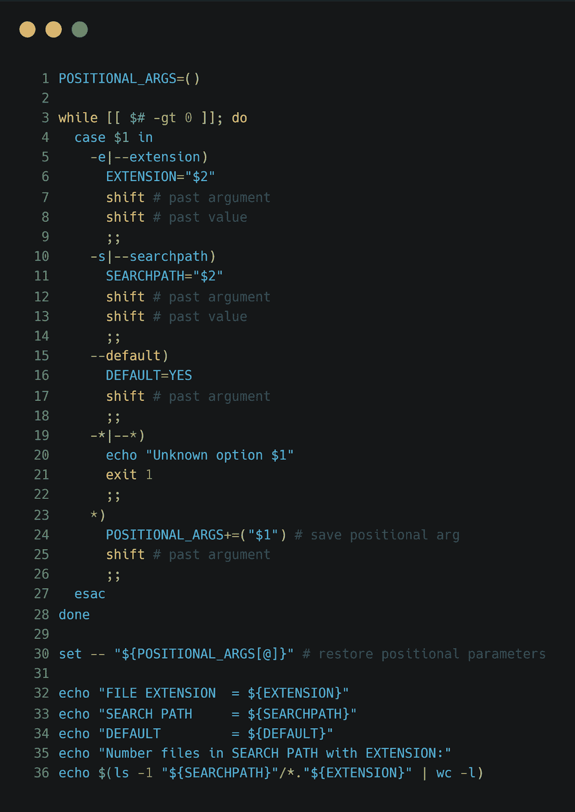
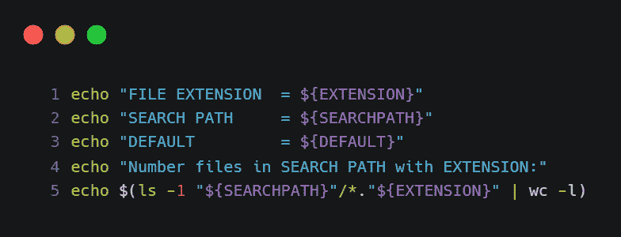
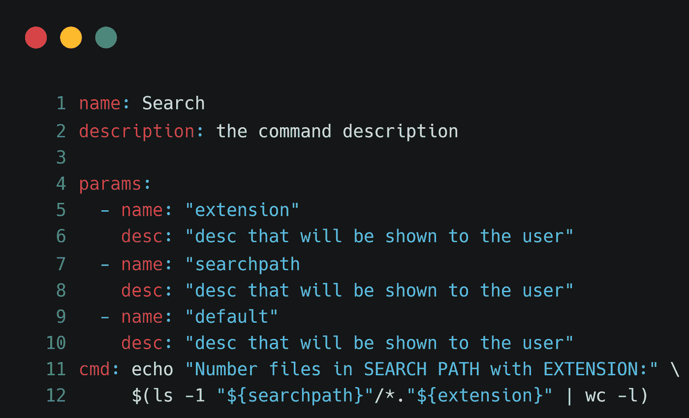
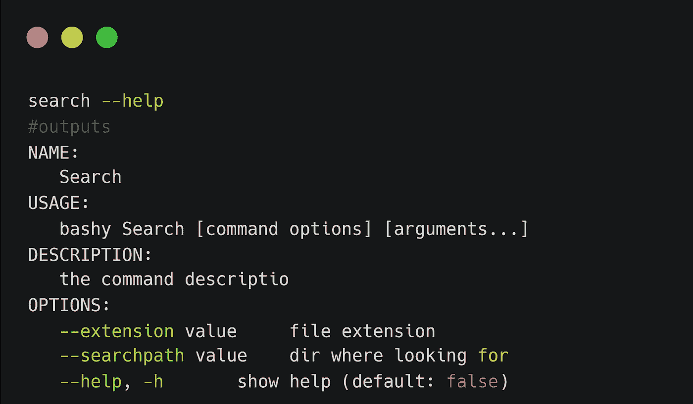
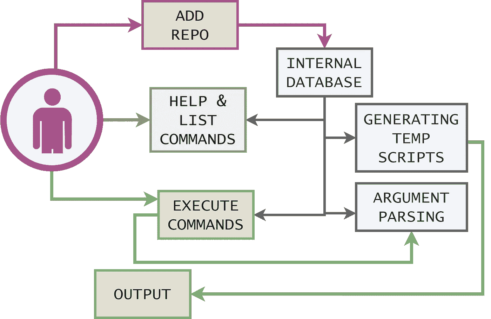
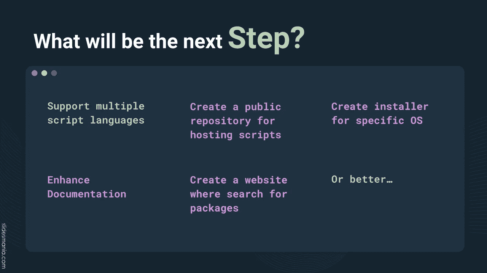

# 我是如何试图革新脚本体验的

> 原文：<https://towardsdatascience.com/better-bash-scripts-ae542fa37bd6>

## Bashy 背后的故事 Bash 脚本的脚本管理器

在本文中，我将介绍开源项目 Bashy，这是一个工具，它通过简化参数解析和像每个包管理器一样共享脚本来增强脚本体验。换句话说，我让 work Bash 像任何现代脚本框架一样。对于程序员和数据科学家来说，这有助于提高生产率和自动化重复性任务。

我将解释为什么我们需要一个像 Bashy 这样的工具，然后用一些实际例子展示如何使用它。最后，在我们发现它如何为开发人员节省数百个小时之后，我将进入内部组件来解释它是如何工作的。

让我们直接进入文章吧！

作者是❤️by。

# 我们为什么需要巴什？

Bashy 的目的是减少脚本编写中的摩擦。最常见的问题是:

*   解析输入并为我们创建的脚本提供帮助页面。这通常很麻烦，需要很多时间，所以这个阶段经常被跳过，我们有很难运行的脚本。通常，开发人员需要打开它们，并更改脚本本身内部的变量。
*   共享脚本。共享脚本最常见的方式是将文件从一台 PC 或服务器复制/粘贴到另一台 PC 或服务器。这种做法是非常古老的风格，很难在副本发生变化时更新脚本。

Bashy 愿意通过实施以下措施来解决所有这些问题:

*   Bash 的包管理器
*   解析参数的简单方法。

## 使用 bash 脚本的摩擦

Bash 脚本解决了很多问题，但是在大多数情况下:

1.  驻留在作者的个人电脑上:分享它们是非常困难的
2.  不是参数化的:参数在脚本内部，作者直接更改它们，而不是解析参数

为什么？现在这种行为看起来很奇怪，但是如果你看看有什么选择，很明显开发商没有选择。事实上:

1.  没有任何存储库可以让你的脚本共享
2.  使脚本参数化，需要大量代码

这就是我创造 Bashy 的原因:

> *BASHY 的目的就是要克服这个局限*

既然我们已经理解了创建管理 bash 脚本的工具的重要性，那么让我们看看它在实践中是如何工作的！

# **从结果开始介绍 Bashy】**

与其说很多 Bashy，我更愿意用一个例子来解释。让我们假设创建一个 bash 脚本，列出文件夹中的文件。给定的参数是用于过滤文件的文件夹路径和扩展名。

那么，为了在 bash 解析参数中实现它，您将在下面的代码片段中看到类似这样的内容。

传统 bash 脚本

请注意，在前面的脚本中，实现脚本只需要最后两行代码，上面所有的 34 行代码只需要用于解析参数。此外，您没有任何帮助页面，添加新参数会使事情变得复杂。巴什如何能让它变得更好？

使用 Bashy，您只需编写以下代码:

如您所见，您已经免费解析了参数，并且已经填充了一些可以使用的变量。这转化为一个巨大的简化，正如您稍后看到的，您还可以获得一个帮助页面，而无需任何额外的工作。

那是魔法？让我们在下一节看看这是如何可能的。

# 怎么可能呢？

因为信息是一门科学，所以没有咒语或魔杖。Bashy 的支柱是通过添加 YAML 格式的清单来描述脚本。YAML 和脚本一起构成了一个可移植的包，包含了 Bashy 需要的所有内容。

包装是如何制作的？作者是❤️by

下面的代码片段可以作为前面脚本的一个示例:

bashy 中阅读文件夹的脚本。作者是❤️by。

YAML 清单包含要在帮助页面上显示的所有信息和要执行的脚本(可以像在本例中那样嵌入，或者引用外部资源)。此外，您定义了参数解析引擎使用的参数列表。

此信息用于创建帮助页面，如下例所示:

命令帮助示例。作者是❤️by。

如您所见，该命令从 Bashy 注册为全局命令，您可以直接编写它，因为它是安装在操作系统上的真正的二进制文件。

用这种技术制作的脚本可以很容易地共享(你只需要在每一个 HTTP 服务器上发布，包括 git ),并帮助构建更多可用的脚本。

但是如何实施呢？Bashy 引擎是使用 Go 构建的，并作为开源应用程序提供。

巴什是怎么做出来的。作者和❤️一起做的

下图显示了应用程序的主要流程:

应用程序的主要流程，由作者用❤️制作

基本上，Bashy 引擎将 YAML 文件中包含的信息添加到内部数据库中(红色流)。有了这些信息，您就可以轻松地列出所有可用的命令，并提供帮助页面(蓝色流)。最后，Bashy 可以通过解析参数并将值作为变量传递给要运行的脚本来执行命令。然后将输出显示给用户。

要了解有关 bashy 的更多信息，您可以:

*   阅读教程“[编写 Bash 脚本的有效方法](https://medium.com/better-programming/effective-bash-scripts-108d976026bc)”，或者
*   阅读我一步一步解释 Bashy 是如何制作的文章[我如何在 GO 中创建脚本引擎](https://medium.com/better-programming/effective-bash-scripts-108d976026bc)

顺便说一句，我认为巴什的潜力还没有完全发挥出来。在下一节中，我将解释下一个可以添加的特性，以使它更加平滑。

# 后续步骤

像每个产品一样，开源应用程序也必须关注市场和用户的需求。从这里开始，您可以获得要添加到 backlog 中的特性列表。从我的经验和目前为止我得到的反馈来看，有一些改进可能会非常有用。我在下一张图中总结了它们:

巴什的下一步。由❤️by 执笔

因此，引用《精益创业》的作者埃里克·赖斯的话:

> 我们必须了解顾客真正想要的是什么，而不是他们说他们想要什么，或者我们认为他们应该想要什么。

这促使我去倾听用户对这些任务给予正确优先级的反馈。

基本上，最想要的特性是添加一个公共存储库，在那里添加脚本，允许用户通过 web UI 搜索它们，并在本地安装它们。此外，一个令人窒息的安装过程也是受欢迎的，因为网站上有更好的文档。

无论如何，任何反馈都是受欢迎的，也是改进过程的一部分！所以，如果你是一个 [*Bashy*](https://github.com/zeppaman/bashy) 用户或者你打算测试它，别忘了给我反馈😃

# 结论

Bash 是一种被广泛使用的技术，但是也有一些摩擦，使得它很难实现可重用的脚本。Bashy 的诞生就是为了克服这些问题，释放 bash 的力量。与每个产品一样，开源项目也需要倾听用户的需求，因此向作者提供反馈很重要(一般来说是这样，不仅仅是对 Bashy)。我希望能给你一个提高剧本体验的机会，不要犹豫，请在评论中写下你的反馈😄

## 参考资料:

*   GitHub 资源库[**https://github.com/zeppaman/bashy**](https://github.com/zeppaman/bashy)
*   Bashy 教程"[编写 Bash 脚本的有效方法](https://medium.com/better-programming/effective-bash-scripts-108d976026bc)
*   深入了解程序内部的技术"[我如何在 GO 中创建脚本引擎](https://medium.com/better-programming/effective-bash-scripts-108d976026bc)