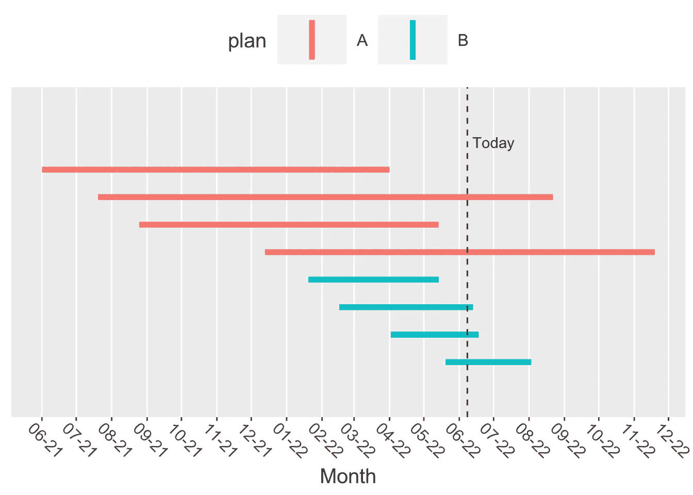

# 更好的流失预测

> 原文：<https://towardsdatascience.com/better-churn-prediction-f88b20c923f3>

## 流失还是不流失——这不是真正的问题！


来自 [Pixabay](https://pixabay.com/?utm_source=link-attribution&amp;utm_medium=referral&amp;utm_campaign=image&amp;utm_content=1147597) 的[灵感](https://pixabay.com/users/inspiredimages-57296/?utm_source=link-attribution&amp;utm_medium=referral&amp;utm_campaign=image&amp;utm_content=1147597)

这些年来，我一直在研究的一个主要课题是客户流失。减少客户流失是许多公司的首要任务，正确识别其根本原因可以大大提高他们的底线。

考虑到客户流失问题是多么广为人知和受重视，我经常被它在实践中的糟糕建模所困扰。

客户流失通常被表述为“谁最有可能流失？”。这个问题自然适合于分类建模。

然而，我认为客户流失并不是“谁”会流失的问题，而是“什么时候”流失的问题。

这是一个重要的区别，原因有二:

1.  问“谁”会流失会导致有偏见的建模，如下所示。
2.  在很多情况下，用户的价值很大程度上取决于他的订阅时间。这只能通过问“什么时候”而不是“谁”来回答。

# 手机用户示例

以手机用户的经典案例为例。他们每月支付一笔费用，直到某个时间点，他们决定终止合同(又名流失)。

最终它们都会发生变化:30 年后，它们要么会死去，要么会用全息图而不是手机来交流。

让我们想象一下典型订阅的样子:



顶层的第一个订户于 2021 年 6 月开始购买 A 计划，并于 2022 年 4 月开始购买。斜线代表“今天”(分析运行的时间)，即 2022 年 6 月 8 日。

在“谁”问题中，过去(在“今天”之前)搅动过的用户被标记为“搅动的”(y=1)，而未来搅动过的用户被标记为“未搅动的”(y=0)，因为当我们“今天”观察他们时，他们仍然是订阅的。

我们可以看到，计划 A 的用户倾向于花费更长的时间来流失(他们的队伍更长)。但是由于他们比 B 计划的订阅者更早加入，他们有更多的时间流失，也更容易被贴上“流失”的标签(A 计划的 50%对 B 计划的 25%)。

因此，我们会错误地得出这样的结论:A 计划用户的流失率高于 B 计划用户。

上述偏见是非常典型的，因为手机计划通常是相继推出的。在上面的例子中可以看到，在 2022 年 1 月，计划 A 被切换到计划 b。

# 一项小型模拟研究

为了说明这一点，我将在 r。

我们有一个从 0 开始的时间表。我们观察数据和拟合模型的时间(“今天”)是 22。

如果用户使用计划 A，则他开始订阅的时间来自均匀分布\(U~[0，20]\ ),如果用户使用计划 b，则来自均匀分布\(U~[20，22]\)。

```
today <- 22 
Na <- 700 
Nb <- 300 
plan <- rep(c("A", "B"), time = c(Na, Nb)) 
set.seed(1) 
join_time <- c(runif(Na, 0, 20), runif(Nb, 20, today))
```

下面我们可以看到平均加入时间:

```
tapply(join_time, plan, mean)##        A        B 
## 10.08968 20.97702
```

用户在交易前的订阅时间分布为泊松分布，如果他使用计划 A，则λ= 4，如果他使用计划 b，则λ= 3。

```
set.seed(1) 
time_to_churn <- c(rpois(Na, 4), rpois(Nb, 3))
```

下面我们可以看到客户流失的平均时间:

```
tapply(time_to_churn, plan, mean)##        A        B 
## 4.045714 2.993333
```

用户搅动的时间是他加入的时间+直到他搅动的时间:

```
churn_time <- join_time + time_to_churn
```

如果搅动时间大于 22(从“今天”算起的未来)，我们说他没有被搅动(y=0)。如果那个时间比我们今天短一天，他就做了搅动(y=1)。

```
churned <- churn_time < today
```

从原始流失率来看，我们可以看到计划 A 的用户流失率似乎更高:

```
tapply(churned, plan, mean)##         A         B 
## 0.8042857 0.2233333
```

但是我们知道 B 计划的用户是最近加入的，所以我们可能会尝试通过拟合用户流失与计划的逻辑回归以及用户加入后的时间来考虑这一点。

然而，从下面我们可以看到，这种偏差如此之大，以至于模型仍然告诉我们，采用 B 计划可以降低客户流失的可能性:

```
time_since_join <- today - join_time glm(churned ~ plan + time_since_join)## 
## Call:  glm(formula = churned ~ plan + time_since_join)
## 
## Coefficients:
##     (Intercept)            planB  time_since_join  
##         0.19101         -0.02035          0.05149  
## 
## Degrees of Freedom: 999 Total (i.e. Null);  997 Residual
## Null Deviance:       233.1 
## Residual Deviance: 102.9     AIC: 572.3
```

# 我们该怎么办？

用生存分析！

为了避免这篇文章太长，我将跳过介绍什么是生存分析，而是展示它是如何处理上述偏见的。

生存分析武库中的一个常见模型是“加速故障时间”模型。它产生的系数很像逻辑回归:

```
library(survival) 
observed_time <- ifelse(churned, time_to_churn, today - join_time) 
# add a tiny amount (0.01) to observed_time to avoid observed_time = 0 
survregExp <- survreg(Surv(observed_time + 0.01, churned) ~ plan, dist = "exponential" ) coef(survregExp)## (Intercept)       planB 
##   1.4558659  -0.2154432
```

我们对系数的解释如下:与总体平均值相比，采用 B 计划可以减少 20%的流失时间(1-exp(-0.2154432)= 0.2)。流失的平均人口时间是:

```
mean(time_to_churn)## [1] 3.73
```

B 计划的平均流失时间是 3，比 3.7 低 20%。

# 结论

问“什么时候”而不是“谁”的问题不仅能给我们公正的结果，还能让我们更深入地了解我们真正感兴趣的是什么:用户流失需要多长时间。

在接下来的几篇文章中，我将更深入地讨论生存分析，并展示流失预测中的高级用例，生存分析对于更好的流失建模至关重要。

*原载于 2022 年 6 月 8 日*[*https://iyarlin . github . io*](https://iyarlin.github.io/2022/06/08/better_churn_modeling/)*。*