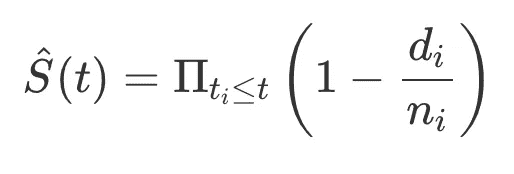
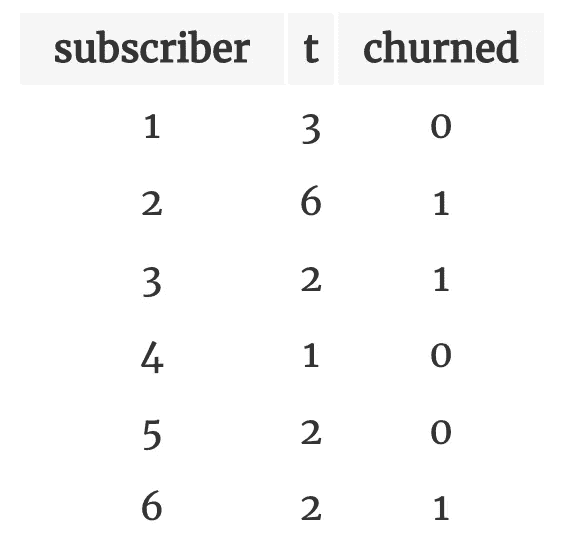
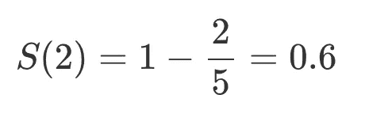
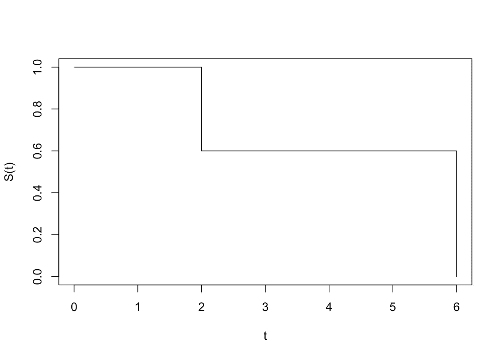
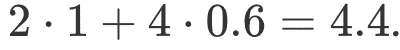

# 更好的客户流失预测—使用生存分析

> 原文：<https://towardsdatascience.com/better-churn-prediction-part-2-5a1086fd3f51>

## 回答“何时”的问题

由[马库斯·斯皮斯克](https://unsplash.com/@markusspiske?utm_source=medium&utm_medium=referral)在 [Unsplash](https://unsplash.com?utm_source=medium&utm_medium=referral) 上拍摄的照片

在之前的[帖子](/better-churn-prediction-f88b20c923f3)中，我提出了生存分析对于更好地预测客户流失是必不可少的。我的主要论点是，客户流失不是“谁”的问题，而是“何时”的问题。

在“何时”问题中，我们问用户何时会流失？换句话说，用户平均订阅多长时间？然后，我们可以回答一个最重要的问题:订户的平均生命周期值是多少？

让我们卷起袖子开始吧:生存曲线 S(t)衡量订户从开始订阅到时间 t“存活”(而不是流失)的概率。例如，S(3)=0.8 意味着订户在订阅的第 3 个月有 80%的机会不进行交易。

估算 S(t)最常用的方法是使用卡普兰-迈耶曲线，其公式如下:

作者图片

其中，t_i 是至少有一个用户流失的所有时间，d_i 是在 t_i 时流失的用户数量，n_i 是至少存活到 t_i 时的用户数量，我们可以将 d_i/n_i 项视为 t_i 时的流失率。

为了说明，让我们计算以下订户数据的存活曲线:

作者图片

列 t 表示到今天为止用户已经订阅的时间。如果他搅拌，这将是他搅拌的时间。

我们有 2 次流失事件发生的时间:t_i = {2，6}。

对于 t < 2，我们有 S(t)=1，因为没有人搅拌到这一点。

在 t_1=2 时，我们有 d_1=2(订户 3 和 6)和 n_1=5(除了 4 之外的所有订户)。使用上面的公式，我们得到:

作者图片

在 t_2=6 时，我们有 d_2=1(订户 2)和 n_2=1(同样，只有订户 2)。

因此，我们有:

作者图片

让我们画出这条曲线:

作者图片

这里需要注意的一点是，在曲线上的每一点，我们只考虑存活到该点的订户。如果订户是最近加入的(例如订户 4 ),则他在计算中不会起主要作用。

实际上，您最好使用 R `[survival](https://cran.r-project.org/web/packages/survival/)`包或 python `[lifelines](https://lifelines.readthedocs.io/en/latest/)`库中的生存曲线实现。

# 预期寿命

那么，为什么要首先计算 S(t)呢？结果是预期寿命是生存曲线下的面积(这里我不打算证明)。

所以在我们上面的例子中:

作者图片

例如，如果用户的月计划账单是 10 美元，那么我们可以说他的预期 LTV(生命周期价值)是 44 美元。

# 更好地回答“谁”的问题

在这篇文章中，我们看到了如何使用生存曲线来回答“何时”的问题——平均订阅多长时间。我们看到这可以用来表示订户的价值。

有时候，我们实际上也可能对“谁”这个问题感兴趣。例如“哪些订户在订阅的第一个月内最有可能流失”？在我的下一篇文章中，我将展示使用生存曲线我们也能更好地回答这个问题！

*原载于 2022 年 10 月 31 日*[*https://iyarlin . github . io*](https://iyarlin.github.io/2022/10/31/better_churn_modeling_part_2/)*。*