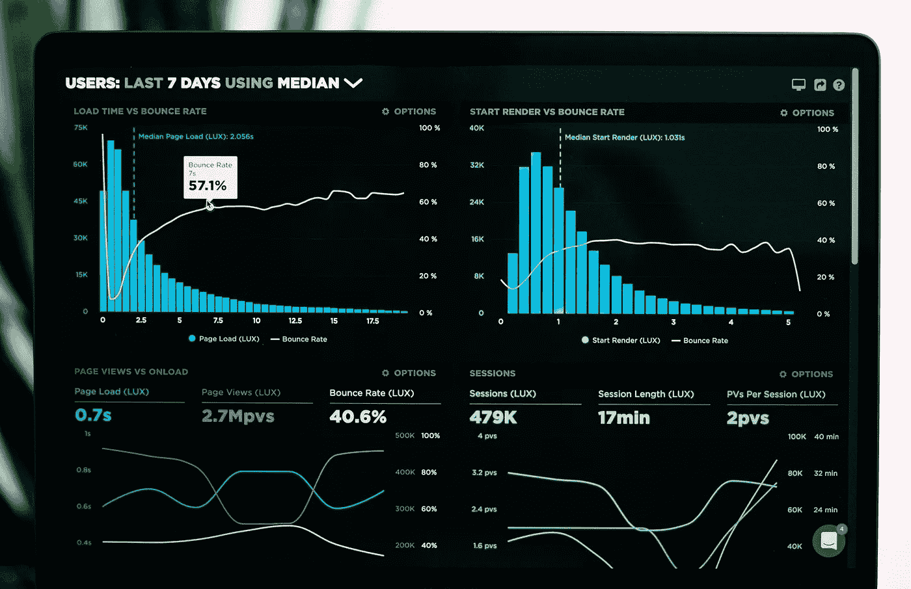
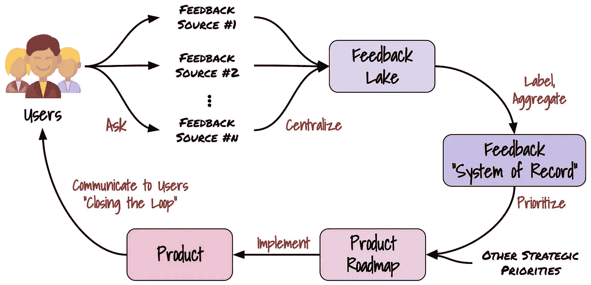
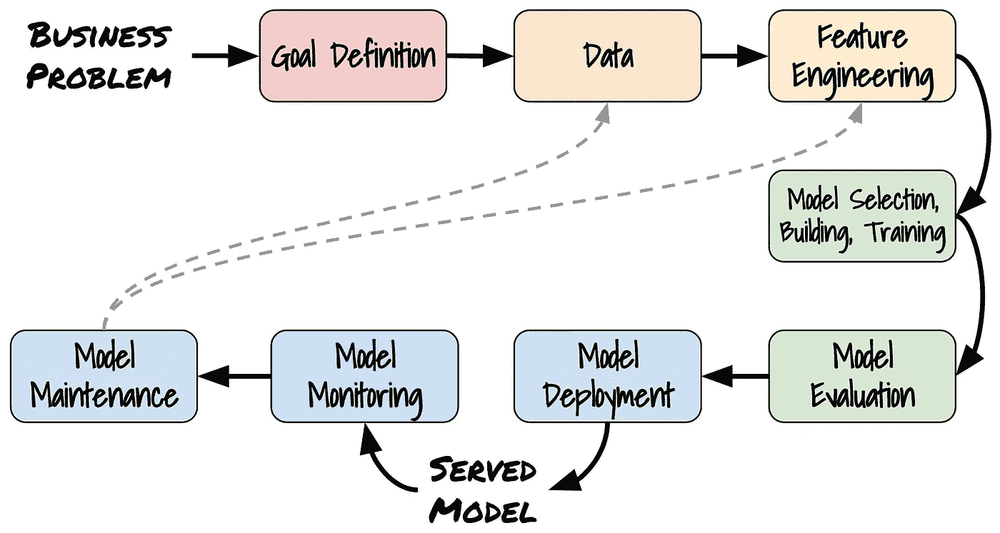
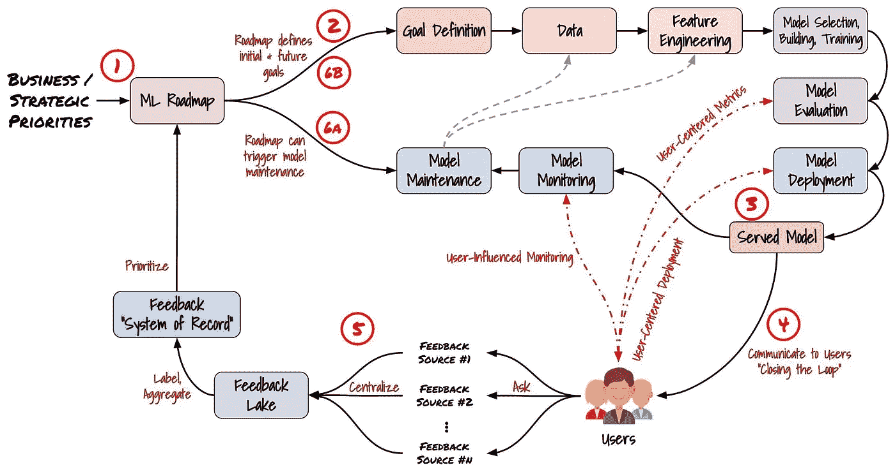

# 更好的指标⇏更快乐的用户

> 原文：<https://towardsdatascience.com/better-metrics-happier-users-8264479e4fba>

## 设计一个机器学习产品来关闭用户反馈回路

乔恩·泰森在 [Unsplash](https://unsplash.com/s/photos/customer-feedback?utm_source=unsplash&utm_medium=referral&utm_content=creditCopyText) 上的照片

我想象这个“假设的”场景:由于检测到一些“重要”类别的低精确度，开发了一个新的模型来代替现有的生产模型。新模型的指标要好得多，因此它被部署来取代当前的模型。

事实证明，新模式实际上让用户体验**更差**。即使它在指标上更好，用户也不觉得它更好。事后分析显示，尽管总体指标更好，但新模型牺牲了用户最关心的类的准确性，以改善用户不太关心的类。

最初的假设是*更好的指标更好的模型*当然*更好的模型更快乐的用户*。这个假设有严重缺陷。更好的度量可能意味着更好的模型，但仅仅是由度量判断的更好的模型*。由指标**判断的更好的模型并不**意味着更快乐的用户，由用户判断的更好的模型**意味着更快乐的用户。虽然这似乎很明显，但产品开发的 ***谁*** 和 ***为什么*** 在机器学习领域往往被遗忘。***

本文将介绍用户反馈回路的概念，它是任何 ML 产品设计中的重要组成部分。我们将讨论常见评估和监控方法的缺点，以及我们如何通过在机器学习开发过程中实现这一概念来减轻用户的不满。

# 目录

*   [初始定义](#245f)t34】∘[监控](#e961)t37】∘[用户(或客户)反馈回路](#5d96)
*   [评估&监控](#3e84)
    ∘ [资源与性能监控](#40df)
    ∘ [地面真实指标](#7853)
    ∘ [代理指标](#ae4b)
    ∘ [问题](#5997)
*   [以用户为中心的设计](#94fe)t16】∘[定义](#b8f9)t19】∘[UCD+ml](#a64b)
*   [引入用户反馈回路](#4051)
    ∘ [以用户为中心的指标](#6f57)
    ∘ [以用户为中心的监控](#c7fb)
    ∘ [以用户为中心的部署](#336f)
*   [谨防偏见](#5f2e)
*   [结论](#38a4)

# 初始定义

我将从定义本文中使用的关键术语开始。

## 监视

> 监控的目标是确保模型得到正确服务，并且模型的性能保持在可接受的范围内[1]

## 用户(或顾客)反馈回路

*注:我更喜欢使用术语“* ***用户*** *反馈回路”而不是“* ***客户*** *反馈回路”，作为一个用户同时兼顾客户***前景。然而，这些术语经常互换使用。**

> *“客户反馈循环是一种客户体验策略，旨在根据用户评论、意见和建议不断增强和改进您的产品。”[2]*

*反馈循环很重要，因为没有用户反馈，你怎么能指望一个组织(其主要目标是向客户销售)在向客户销售方面做得更好？*

*传统上，“闭合反馈回路”是:*

> *“…针对具体的产品反馈进行有针对性的个性化跟进沟通。闭环意味着让你的用户知道你是如何根据他们的意见改进产品的。”[3]*

*然而，在机器学习的上下文中，它被更好地定义为:*

> *利用用户对模型输出的反馈来影响模型开发的优先级。*

*一个重要的区别是与 ML 中经常描述的传统“反馈回路”的区别，在传统“反馈回路”中，模型的输出用于重新训练模型。这是指*数学*反馈，而不是*用户*反馈。*

# *评估和监测*

**

*卢克·切瑟在 [Unsplash](https://unsplash.com/s/photos/graph?utm_source=unsplash&utm_medium=referral&utm_content=creditCopyText) 上的照片*

*在这一节中，我们将讨论评估模型的当前方法，在监控阶段用于评估模型退化的度量，以及最重要的通用方法的**问题**。*

## *资源与性能监控*

***资源监控**包括监控模型部署的周围基础设施。这是一个传统的 DevOps 主题，除了提到它试图回答的这些关键问题之外，我们不会在本文中讨论它:*

> *“系统还活着吗？CPU、RAM、网络使用和磁盘空间是否符合预期？请求是否以预期的速度得到处理？”[4]*

***性能监控**包括监控实际模型。*

> *关键问题包括:模型是否仍然是新数据模式的准确表示？它的性能是否和设计阶段一样好？”[4]*

*如何有效地回答关于性能监控的问题是我们将在本文中讨论的内容。*

## *基本事实度量*

*“基本事实”指标是一个指标*“…已知是真实的或真实的，由直接观察和测量提供”**【5】。*在机器学习中，模型将产生的预期理想结果。有两种类型的地面实况度量:实时和延迟。我们还会提到有偏见的基本事实度量和基本事实的缺失。*对于下面描述的所有示例，如果您想要更深入的描述，请参见[6]。**

*理想情况是**实时地面实况**。这就是*“…对于每个预测，基本事实都浮现在你面前，并且在预测和基本事实之间有直接的联系，允许你直接分析你的模型在生产中的性能”[6]。*一个常见的例子是数字广告，根据用户的行为，你会收到关于广告投放是否成功的近乎即时的反馈。*

*比较常见的案例是**拖延地真相**。顾名思义，这是模型输出和学习你的模型应该如何执行之间有很大延迟的情况。一个常见的例子是欺诈检测:我们不知道某些交易是否是欺诈性的，直到持卡人报告它们是欺诈性的，这通常比交易日期晚得多。*

*实时和延迟地面实况的一个共同问题是**偏差**。我们以贷款违约预测为例。我们只能从负面预测(不会违约)中收集基本事实，我们无法收集任何关于正面预测(会违约)的信息，因为我们拒绝了他们的贷款。*

*最后，我们会遇到**没有地面真相**可用的情况。在这种情况下，我们通常可以使用代理指标。*

## *代理指标*

*如果我们正在处理延迟、缺失或有偏见的实时真相，我们经常使用**代理指标**，或者除了基础真相指标之外。他们制定了一个代表模型性能的指标，而没有使用基本事实。代理指标*“…为您的模型的表现提供一个更新的指标”[6]。*它们还允许你将业务成果的重要性纳入你的衡量标准。*

*代理指标最常见、最广泛使用的例子是**数据漂移**和**概念漂移**。理论上，自变量和/或因变量中出现的漂移可能代表模型性能下降。*

## *问题*

*关于如何监控生产模型，有大量(通常是坏的)建议。但是，很难找到考虑到 ***实际用户*** 的建议。大多数建议都是基于对构建不良的代理指标的过度依赖。问题来了:**代理指标并不完美。**它们旨在代表性能，而非直接指示。当不理解这种区别时，问题就出现了。*

*罪魁祸首是**漂移**，创造了 ML 监控的“以漂移为中心”的观点[7]，其中漂移被假设为模型性能的完美指标。像所有的代理指标一样，漂移是**不**完美的，完全依赖它不是模型监控的有效策略。*

*说明这一点的一个例子是使用合成数据来训练对象检测模型。研究表明[真实世界的数据最多可以减少 70%(用合成数据代替)，而不会牺牲模型性能](https://arxiv.org/abs/2202.00632)。我们预计合成数据的分布会与真实世界的数据大相径庭，但这种转变不会影响性能。*

*这并不是说永远不应该使用漂移。漂移应在监控中使用*“…如果您有理由相信某个特定特征会漂移并导致您的模型性能下降”[7]。然而，它不应该作为唯一的衡量标准。**

*总而言之，*

> *在常见的监控方法中使用代理指标所导致的问题是由模型评估和用户反馈之间的脱节引起的。*

*为了使代理指标有效，真正代表模型性能，并衡量什么是重要的，它必须以**用户为中心的观点**来形成。*

# *用户为中心的设计*

**

*在 [Unsplash](https://unsplash.com/s/photos/user-design?utm_source=unsplash&utm_medium=referral&utm_content=creditCopyText) 上由[amlie Mourichon](https://unsplash.com/@amayli?utm_source=unsplash&utm_medium=referral&utm_content=creditCopyText)拍摄的照片*

## *定义*

> *“以用户为中心的设计(UCD)是一系列将用户放在产品设计和开发中心的过程。你开发你的数字产品时会考虑用户的需求、目标和反馈。*
> 
> *换句话说，以用户为中心的设计是从用户如何理解和使用的角度来设计和开发产品，而不是让用户调整他们的行为来使用产品。" [8]*

## *UCD + ML*

*虽然 UCD 的传统定义非常适合产品设计，但它如何应用于模型评估和监控呢？*

*[8]定义的两个主要 UCD 原则是:*

*   *用户早期积极参与**评估**产品的设计。*
*   *结合**用户反馈**来定义需求和设计。*

*这些概念似乎很熟悉。还记得**用户反馈循环**吗？我们现在将讨论如何在模型评估和监控阶段实现用户反馈循环。*

# *引入用户反馈循环*

**

*营销“用户反馈环”(图片由作者提供)*

*以上是一个传统营销“用户反馈回路”的流程。从用户开始，循环的关键动作是:*

*   ***提问**:让你的用户参与进来，并征求对你产品的反馈。常见的反馈来源直接来自用户，如访谈和调查。来自客户成功和销售等团队的间接反馈也很有价值。*
*   ***集中** : *“当反馈被埋藏在一个文件夹中或分散在各种不一致的电子表格中时，将反馈转化为行动是很困难的”[3]。*反馈应持续收集并集中在“反馈湖”中。这通常采取集中式数据共享解决方案的形式，例如用于所有电子表格、采访等的集中式 Google Drive 文件夹。，但也可以简单到一个*#反馈*松弛通道。反馈湖将是非常无序的，并且将包含相当多的噪声。别担心:这才是重点。我们希望打破任何阻碍组织中的任何人分享他们从用户那里收到的反馈的障碍。我们将在下一步处理这个问题。*
*   *标签&汇总:为了获得可操作的见解，反馈必须以某种可理解的方式进行分类。反馈应标有*“…一个简短的描述，一个或多个其所属的功能或产品类别，以及请求者的姓名或数量”[9]。*然后输入到反馈“记录系统(SOR)”——用户反馈的真实综合来源。排序可以像电子表格一样简单，也可以像 JIRA 棋盘一样复杂。无论如何，它应该允许根据反馈类型和频率进行简单的汇总。*“这里的目标是创建一个高度系统化的流程，这样，当新的反馈通过各种输入来源时，它会被快速有效地处理到记录系统中”[9]。**
*   ***区分优先级**:SOR 现在可以用来为用户聚集和识别痛点。然而，并不是所有的反馈都是平等的:*“在将反馈整合到产品路线图流程中时，要记住的关键一点是，这样做的方式绝不是简单地将最常被请求的功能放在路线图的顶部”[9]。*我们应该将用户反馈作为产品路线图规划的一个组成部分，与其他业务目标或战略重点一起进行评估。*
*   ***实施** & **沟通**:当然，实际实施产品路线图很重要。然而，更重要的是，**通过与您的用户沟通，告诉他们他们的反馈已经得到处理，并且已经/将要实施，从而结束这个循环**。*

*有了这个基础，问题仍然存在:**我们如何将用户反馈循环应用于机器学习产品？***

*我们将从简化的数据科学流程开始:*

**

*数据科学流程(图片由作者提供)*

*我假设读者熟悉这个过程。如果没有，可以查看我的[上一篇文章](https://pub.towardsai.net/whats-it-like-to-work-in-applied-ai-6541a44a0cd7)(数据科学过程一节深入解释了这个图)。*

*我们可以看到，数据科学过程展示了之前讨论过的问题:它与用户及其反馈脱节。如果我们合并前面的两个图，我们会得到下面的流程图:*

**

*数据科学流程的客户反馈循环(图片由作者提供)*

*我们现在可以看到，用户反馈与模型开发过程相关联。用户反馈直接影响 ML 路线图，推动未来的开发工作。下面是示意图(数字与示意图上的数字相对应):*

1.  *该流程从推动 ML 路线图的业务或战略优先事项开始。*
2.  *路线图定义了启动数据科学流程的初始目标。*
3.  *数据科学过程产生一个服务模型**(**产品**)，然后对其进行监控。***
4.  ***然后，所提供的模型被“传达”给用户(即在生产中)。***
5.  ***反馈循环开始了:询问、集中、标记和汇总、优先排序。结果是用户对你的模型(产品)的优先反馈被注入到 ML 路线图中。***
6.  ***用户反馈会导致两种情况发生:(a)用户反馈触发对现有模型的维护(即用户对模型性能不满意),或者(b)您根据用户的反馈定义一个新的目标。不管怎样，现在通过重新启动数据科学过程，这个循环已经结束了。***

***我们还可以在图中看到来自用户的红色虚线箭头。这些表明了用户对数据科学过程的重要间接影响。遵循 UCD 的理念，不仅要利用用户的反馈**，用户还必须参与到设计过程中**。可以说，这比用户反馈更重要。如果你的用户直到反馈阶段才被考虑，你的模型将毫无用处。我们将在下面对此进行更详细的描述。***

## ***以用户为中心的指标***

***判断一款车型最重要的**指标是**实际用户需求和反馈**。理想情况下，用户的要求和需求在过程的早期就被确定，并被整合到评估指标中。这在图中显示为从“用户”到“模型评估”的红色虚线箭头。*****

***如果**地面实况指标**可用，则必须从用户需求中选择合适的指标。例如，在垃圾邮件检测中，我们可能已经确定我们的用户不在乎是否有几封垃圾邮件进入他们的收件箱，但他们确实在乎非垃圾邮件是否被归类为垃圾邮件。在这种情况下，我们最关心的基本事实是精确度，而不是召回率。如果我们使用 F1(作为一个例子)，这并不能反映我们用户的需求。这种情况似乎很明显，但是在处理代理指标时会变得更加复杂。***

***如果我们需要使用**代理指标**，我们必须*构建*一个以用户需求为中心的指标。构建代理指标很大程度上依赖于问题领域，因为它们通常需要特定领域的知识。通常，代理度量试图量化用户驱动的业务问题。这通常是一个很好的假设，因为在业务问题上表现良好通常意味着您的模型表现良好。***

***举个例子，让我们以之前讨论的贷款违约预测为例。我们知道基本事实指标是有偏差的，所以我们想开发一个代理指标来量化模型性能。假设一个商业目标是减少我们拒绝贷款的人数。因此，一个简单的代理指标是被拒绝贷款的人的百分比。虽然这是一个过于简单的玩具例子，但它说明了思维过程。***

## ***受用户影响的监控***

***这个主题联系到以用户为中心的指标。我们通常监控模型的评估指标如何随时间变化。通过适当地选择指标，我们将在模型性能下降开始影响我们的用户之前发出信号*，而不是在 KL-divergence(漂移检测)等任意指标超过预定义的阈值时。如果我们不根据用户需求选择我们的指标，可能会检测到一个降级的模型:****

*   ***过早和不必要的频繁，造成警戒疲劳。据说*“…警报疲劳是 ML 监控解决方案失效的主要原因之一”[7]。****
*   ***太迟了，在我们意识到之前就影响了我们的用户体验。***

***需要注意的是，我们的用户应该定义我们监控的细分市场。这是一个很好的例子:***

> ***“如果你熟悉 web 应用程序的监控，你就会知道我们关心像 99%这样的延迟指标，不是因为我们担心用户每百次查询会发生什么，而是因为对于一些用户来说，这可能是他们一直经历的延迟”[7]。***

***这也可以应用于模型预测:某些用户的某些特征可能会导致模型对他们不如对其他用户准确。回到贷款违约预测，该模型可能在预测某个位置(例如)方面非常糟糕。这绝对不是我们想要的行为。***

***为了防止这种情况，重要的是监控对业务很重要的**用户群**或**群组**的指标，并在任何群组表现出性能下降时发出信号。***

## ***以用户为中心的部署***

***在部署新模型时，考虑用户也很重要。不仅仅是为了防止用户烦恼:我们对汇总的和优先化的反馈以及如何将它们转化为新的业务目标进行了假设。我们必须通过确保预期的积极结果在用户行为中得到反映来验证这些假设。***

***常见的以用户为中心的模型部署策略包括:***

*   *****影子测试(静默部署)**:新型号与旧型号一起部署。新模型对相同的请求进行评分，但不为用户提供服务。这允许在生产环境中根据以用户为中心的指标来评估模型。一个明显的缺点是没有生成用户反馈，所以我们只依赖于指标。***
*   *****A/B 测试(Canary Deployment)** :新模型被部署并提供给少量用户。这种方法在性能较差的情况下最大限度地减少了受影响的用户，同时还允许收集用户反馈。然而，缺点是它不太可能捕捉到新模型中罕见的错误。***
*   *****多武装匪徒(MABs)** :这种方法可以看作是“动态 A/B 测试”。MABs 在探索(新模式)和开发(旧模式)之间进行平衡，以尝试选择性能最佳的解决方案。最终，MAB 算法将收敛到理想解，为所有用户提供性能最佳的模型。主要缺点是这种方法实现起来最复杂。***

# ***谨防偏见***

******

***马库斯·斯皮斯克在 [Unsplash](https://unsplash.com/s/photos/caution?utm_source=unsplash&utm_medium=referral&utm_content=creditCopyText) 上拍摄的照片***

***和大多数数据一样，偏差是存在的。有偏差的数据会产生有偏差的模型。因此，理解和减轻偏见在机器学习开发过程中非常重要。在这种情况下，有偏见的模型的一般结果是，用户群的某些部分比其他部分得到的服务差得不成比例。我们之前讨论了跨用户群的监控来暴露这个问题，但是这并没有缓解**指标**是偏差原因的情况。***

***如果在基本事实数据中存在**偏差，这将导致任何基本事实指标也有偏差。这里有两个解决方案:消除偏差，或者使用代理指标。*****

***然而，**代理指标**如果没有用心构建，也会导致偏差。Deloitte 白皮书称，*“…偏差通过代理变量进入机器学习系统”[10]，*给出了一个在抵押价值预测器中使用受保护特征的例子。虽然使用年龄、种族和性别等特征受法规保护，但邮政编码、住所类型和贷款目的等特征*“…并不直接代表受保护的特征，但确实与某个受保护的特征高度相关”[10]。*因此，即使我们将所有受保护的特征排除在特征之外，如果我们选择使用相关特征的代理指标，我们仍然会无意中引入偏差。***

# ***结论***

***我们用当前评估模型的方法、基本事实度量的类型、代理度量以及常见监控方法的问题来奠定基础。然后转向以用户为中心的设计，我们介绍了用户反馈循环以及如何将 UCD 应用到评估、监控和部署阶段。最后，我们讨论了用这些方法引入偏见的危险。***

***我希望这篇文章对模型开发给出一个更可持续的、以用户为中心的观点，并为如何将这些原则融入您自己的机器学习产品提供一个起点。***

***这只是开始！如果你喜欢这篇文章，请关注我以获得下一篇文章的通知！我感谢❤️的支持***

***<https://medium.com/@brandenlisk> *** 

## ***来源***

***[1] A. Burkov，[机器学习工程](https://mlebook.com/) (2020)，加拿大魁北克:True Positive Inc .***

***[2] D. Pickell，[如何创建有效的客户反馈回路](https://www.helpscout.com/blog/customer-feedback-loop/) (2022)，帮助 Scout***

***[3] H. McCloskey，[关闭客户反馈回路的 7 个最佳实践](https://uservoice.com/blog/close-customer-feedback-loop)，用户之声***

***[4] M. Treveil & the Dataiku Team，[介绍 MLOps](https://www.oreilly.com/library/view/introducing-mlops/9781492083283/) (2020)，奥赖利媒体公司。***

***[5] [地面真相](https://en.wikipedia.org/wiki/Ground_truth) (2022)，维基百科***

***[6] A. Dhinakaran，[监控你的模型在生产中的表现的剧本](/the-playbook-to-monitor-your-models-performance-in-production-ec06c1cc3245) (2021)，走向数据科学***

***[7] J .托宾，[你可能对你的模型监控有误](https://gantry.io/blog/youre-probably-monitoring-your-models-wrong/) (2022)，龙门***

***[8] [以用户为中心的设计](https://www.interaction-design.org/literature/topics/user-centered-design)，交互设计基础***

***[9] S. Rekhi，[设计您产品的持续反馈回路](https://medium.com/@sachinrekhi/designing-your-products-continuous-feedback-loop-4a7bb31141fe) (2016)，中型***

***[10] D. Thogmartin 等人，[在人工智能模型中争取公平](https://www2.deloitte.com/content/dam/Deloitte/de/Documents/Innovation/Deloitte_Trustworthy%20AI_Fairness_Whitepaper_Dec2021.pdf) (2022)，德勤***

***[11] P. Saha， [MLOps:模型监测 101](/mlops-model-monitoring-101-46de6a578e03) (2020)，走向数据科学***

***[12] K. Sandburg，[反馈回路](https://medium.com/strategy-dynamics/feedback-loops-31e0f78db918) (2018)，中等***

***[13] D. Newman，[您的组织使用反馈环的情况如何？](https://www.forbes.com/sites/danielnewman/2016/08/02/how-well-does-your-organization-use-feedback-loops/?sh=7910b95b594b) (2016)，福布斯***