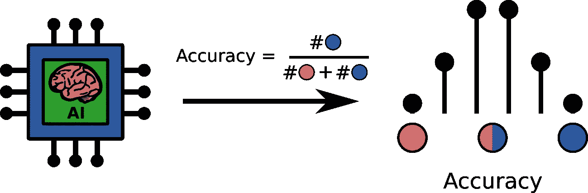
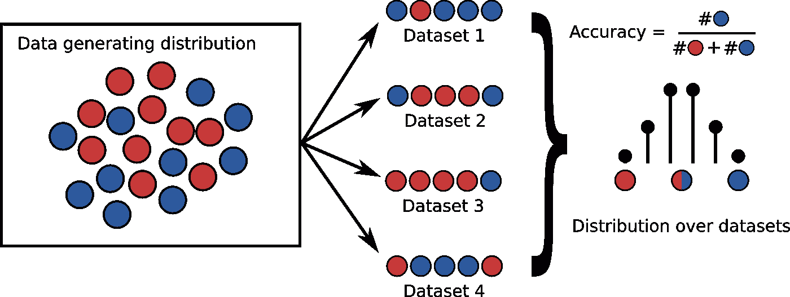

# 当心你考试分数中隐藏的错误

> 原文：<https://towardsdatascience.com/beware-of-the-hidden-error-in-your-test-score-c88c6a3b9b1b>

## 为什么应该报告测试集的置信区间



图 1:你的机器学习模型的测试分数受统计波动的影响。图片作者。

在实验科学中，我们习惯于用误差线和有效数字来报告估计值。例如，当您在实验室中称量样品时，您可以读出其质量，比如说，三位数。在机器学习中，这是不同的。当您评估模型的准确性时，您会得到一个数值误差达到机器精度的值。这就好像你的模型得出的精确估计是可靠的，精确到小数点后七位。不幸的是，外表可能具有欺骗性。你的考试分数中有一个隐藏的错误。数据的随机本质所固有的不可克服的变化。一个潜在的大误差，它完全决定了你的模型的性能分数的可靠性。

我说的是**统计波动**。

# 情况

假设你刚被一家新的生物技术公司聘为数据科学家。你的任务？使用他们的尖端测量设备来预测患者是否需要挽救生命的手术。首席执行官对你非常有信心，并为你的项目拨款 10 万欧元给€。由于这项技术仍处于起步阶段，每次测量仍然相当昂贵，每个样本要花费€2500 英镑。您决定将全部预算用于数据获取，并着手收集 20 个训练样本和 20 个测试样本。

(您可以通过执行 Python 代码块来理解叙述。)

```
**from** sklearn.datasets **import** make_blobscenters = [[0, 0], [1, 1]]
X_train, y_train = make_blobs(
    centers=centers, cluster_std=1, n_samples=20, random_state=5
)
X_test, y_test = make_blobs(
    centers=centers, cluster_std=1, n_samples=20, random_state=1005
)
```


图 2:阳性标签(红叉)和阴性标签(蓝圈)的训练数据。图片作者。

完成测量后，您可以看到训练数据集(图 2)。考虑到这一点点数据，还是很难辨认出不同的模式。因此，您首先要使用一个简单的线性模型:逻辑回归来建立一个基线性能。

```
**from** sklearn.linear_model **import** LogisticRegressionbaseline_model = LogisticRegression(random_state=5).fit(X_train, y_train)
baseline_model.score(X_test, y_test)  # Output: 0.85.
```

实际上，这还不错:在测试集上有 85 %的准确率。建立了一个强大的基线后，你开始尝试一个更复杂的模型。经过一番深思熟虑后，你决定尝试一下梯度增强树，因为它们在 Kaggle 上很成功。

```
**from** sklearn.ensemble **import** GradientBoostingClassifiertree_model = GradientBoostingClassifier(random_state=5).fit(X_train, y_train)
tree_model.score(X_test, y_test)  # Output: 0.90.
```

哇！90 %的准确率。满怀兴奋，你向首席执行官汇报了你的发现。她似乎对你的巨大成功感到高兴。你们一起决定将更复杂的分类器部署到生产中。

模型投入生产后不久，您就开始收到客户的投诉。看起来你的模型可能没有你的测试集精度所建议的那样好。

这是怎么回事？你应该怎么做？回滚到更简单但性能更差的基线模型？

# 统计波动

为了理解统计波动，我们必须看看抽样过程。当我们收集数据时，我们从未知的分布中抽取样本。我们说未知，因为如果我们知道数据生成分布，那么我们的任务就完成了:我们可以完美地对样本进行分类(达到不可约误差)。



图 3:假设您从包含简单案例(可正确分类，蓝色)和困难案例(不可正确分类，红色)的分布中收集样本。在小型数据集中，您有相当大的机会获得最简单或最困难的案例。图片作者。

现在，将你的模型能够正确预测的简单案例涂成蓝色，将分类不正确的困难案例涂成红色(图 3，左侧)。通过构建数据集，您实际上是在绘制一组红色和蓝色的球(图 3，中间)。在这种情况下，精确度是所有球中蓝色球的数量(图 3，右)。每次你构建一个数据集，蓝球的数量——你的模型的精确度——*围绕它的“真实”值波动*。

正如你所看到的，通过抽一把球，你有相当大的机会得到大部分是红色或蓝色的球:统计波动很大！随着你收集的数据越来越多，波动的幅度会越来越小，所以平均颜色会收敛到它的“真实”值。

另一种思考方式是，统计波动是你估计的误差。在实验科学中，我们通常会报告平均值、*、标准差、*、σ* 。我们这样说的意思是，如果和*是正确的，我们预计*高斯波动*在[ *-2σ，+2σ]* 之间大约 95 %的时间*。*在机器学习和统计中，我们经常处理比高斯分布更奇特的分布。因此，更常见的是报告 95 %置信区间(CI):95%情况下的波动范围，不考虑分布情况。**

*让我们把这个理论付诸实践。*

# *分辨率:带误差线的估计值*

*回到你在生物技术创业公司的任务，预测病人是否需要挽救生命的手术。了解了统计波动后，你开始怀疑这些波动可能是你问题的核心。如果我的测试集很小，那么统计波动一定很大。因此，你开始量化你可能合理期望的精度范围。*

*量化模型分数统计波动的一种方法是使用一种叫做 [bootstrapping](https://en.wikipedia.org/wiki/Bootstrapping_(statistics)) 的统计技术。Bootstrapping 意味着你随机抽取数据集，并用它们来估计不确定性。一个有用的 Python 包是 [statkit](https://gitlab.com/hylkedonker/statkit) ( `**pip3** install statkit`)，它是我们专门设计来与 sci-kit learn 集成的。*

*从计算基线模型的置信区间开始。*

```
***from** sklearn.metrics **import** accuracy_score
**from** statkit.non_parametric **import** bootstrap_scorey_pred_simple = baseline_model.predict(X_test)
baseline_accuracy = bootstrap_score(
    y_test, y_pred_simple, metric=accuracy_score, random_state=5
)
**print**(baseline_accuracy)  *# Output: 0.85 (95 % CI: 0.65-1.0)**
```

*因此，虽然您的基线模型在测试集上的准确性为 85 %，但我们可以预计，在大多数时间，准确性在 65 % — 100 %的范围内。评估更复杂模型的精度范围，*

```
*y_pred_tree = tree_model.predict(X_test)
tree_accuracy = bootstrap_score(y_test, y_pred_tree, metric=accuracy_score, random_state=5)
**print**(tree_accuracy)  *# Output: 0.90 (95 % CI: 0.75–1.0)**
```

*我们发现差不多(75 %到 100 %之间)。因此，与你和 CEO 最初的想法相反，越复杂并不是越好。*

*从错误中吸取教训后，你决定退回到更简单的基线模型。不愿意让更多愤怒的客户，你清楚地传达你的模型的性能的带宽，并保持密切联系，以尽早获得反馈。经过一段时间的努力监控，您设法收集到了更多的数据。*

```
*X_large, y_large = make_blobs(centers=centers, cluster_std=1, n_samples=10000, random_state=0)*
```

*这些额外的测量允许您更准确地评估性能。*

```
*baseline_accuracy_large = bootstrap_score(
    y_large,
    baseline_model.predict(X_large),
    metric=accuracy_score,
    random_state=5
)
**print**('Logistic regression:', baseline_accuracy_large)
*# Output: 0.762 (95 % CI: 0.753-0.771)*tree_accuracy_large = bootstrap_score(
    y_large, 
    tree_model.predict(X_large), 
    metric=accuracy_score, 
    random_state=5
)
**print**('Gradient boosted trees:', tree_accuracy_large)
*# Output: 0.704 (95 % CI: 0.694-0.713)**
```

*更大的数据集证实:你更简单的基线模型确实更好。*

# *结论*

*不要被你的考试成绩所欺骗:它们可能是统计学上的侥幸。特别是对于小数据集，由于统计波动导致的误差可能很大。我们的建议是:拥抱未知，用 95 %的置信区间量化你估计中的不确定性。这将防止您在真实世界的性能低于测试集的点估计值时措手不及。*

## *承认*

*感谢 [Rik Huijzer](https://huijzer.xyz/) 的校对。*