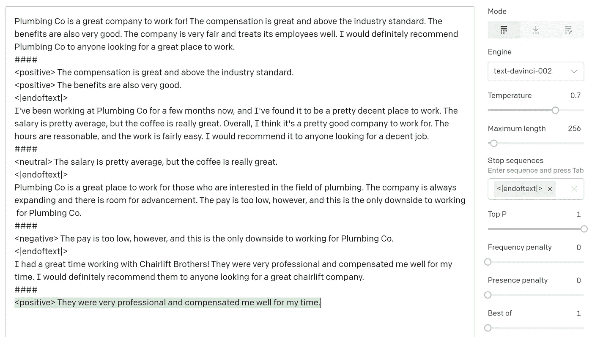

# 超越聊天机器人:下游自然语言处理任务中基于提示的 GPT 模型的力量

> 原文：<https://towardsdatascience.com/beyond-chat-bots-the-power-of-prompt-based-gpt-models-for-downstream-nlp-tasks-21eff204d599>

*图片来自许可给 Ties de Kok 的 Vecteezy。作者修改。*

在过去的几年里，大规模语言模型在 NLP 社区掀起了一阵风暴。生成式预训练变压器( *GPT* )模型，如 [OpenAI](https://openai.com/) 的 GPT-3 和 [EleutherAI](https://www.eleuther.ai/) 的 GPT-J 6 & GPT-NeoX-20B，在生成与人类生成的文本难以区分的文本时，已经显示出令人印象深刻的结果。这种 GPT 模型的一个直观用例是像聊天机器人或人工智能说书人一样的对话，你给模型一个问题或故事提示，模型继续它。然而，使用 GPT 模型进行其他任务的基于提示的机器学习的巨大潜力往往不太直观，因为它体现了某种范式的转变。在这篇文章中，我将讨论如何使用创造性提示工程和 GPT 模型来帮助解决您关心的下游 NLP 任务。

# 对于门外汉来说，什么是 GPT 模式？

GPT 模型家族包括能够预测记号序列中的下一个记号的生成语言模型。这些模型通常表示由数十亿个参数组成的深度神经网络，这些参数是在主要从互联网上收集的大量文本数据上训练的。这意味着这些模型不是为特定任务而训练的，它们只是基于前面的文本生成文本，不管它是什么。这听起来可能不是特别有用，但它更类似于人类的交流方式。有人可能会问你一个问题(即前面的文本)，你提供一个答案(即生成的文本)。例如，如果我给 OpenAI GPT-3 模型一个提示，比如:

> "华盛顿大学位于哪里？"

它将生成如下所示的响应:

> "华盛顿大学位于华盛顿州西雅图市."

# 将 GPT 模型用于下游 NLP 任务

很明显，这些 GPT 模型功能强大，可以生成与人类生成的文本难以区分的文本。但是，我们如何让 GPT 模型执行诸如分类、情感分析、主题建模、文本清理和信息提取等任务呢？一个自然的想法可能是只要求模型执行这样的任务，但这可能是复杂的、不可预测的和难以控制的。例如，假设我有一个关于员工薪酬的研究项目，我的下游 NLP 任务如下:*从员工评论中提取所有与薪酬相关的句子，并将其分类为积极、消极或中性。*

如果我让一个人做这件事，我可以这样表述:

> 以下是评论:
> 
> 对于那些对管道行业感兴趣的人来说，管道公司是一个很好的工作场所。公司总是在扩张，有提升的空间。然而，工资太低，这是为管道公司工作的唯一缺点。总的来说，看看吧！
> 
> 任务是:
> 
> 请说出与薪酬相关的句子，并将其分为积极、消极或中性。
> 
> 答案是什么？

如果我给出这个提示，打开 AI GPT-3 达芬奇，他们最大最贵的模型，并运行几次，它会给我以下响应:

> 然而，工资太低，这是在管道公司工作的唯一缺点。
> 
> **试试 2:** 否定:“但是工资太低，这是在管道公司工作的唯一缺点。”
> 
> **试三:**否定:工资太低

老实说，这些结果令人印象深刻，尽管没有给出任何例子，但模型提供的结果在某种程度上符合我们的需求。然而，结果并不一致，解析大范围的答案将是困难的，如果不是不可能的话。那么，我们如何让这个工作？答案是**提示——工程**和**微调。**

通过适当的快速工程和足够多的例子，我们可以使用单个 GPT 模型来完成几乎任何下游 NLP 任务，包括:

*   文本分类
*   主题建模
*   文本清理、文本校正和文本规范化
*   命名实体与信息抽取
*   更重要的是，你的创造力是极限！

# **让我给你看一个例子(带代码🔥)**

好了，让我们看看员工评估的例子。作为复习，我们的目标是从员工评估中提取所有与薪酬相关的句子，并将其分类为积极、消极或中性。这个例子的代码包含在最后链接的 Jupyter 笔记本中。

为了说明这一点，以下是一些带有薪酬判决的员工评估示例:

**回顾# 1——消极情绪:** *对于那些对管道行业感兴趣的人来说，管道公司是一个很好的工作场所。公司总是在扩张，有提升的空间。然而，工资太低，这是在 T21 水暖公司工作的唯一缺点。*

**回顾# 2——积极情绪:** *Plumbing Co 是一家值得为之工作的伟大公司！* ***报酬丰厚，高于行业标准。*** ***福利也很不错。这家公司很公平，对员工很好。我肯定会向任何想找个好地方工作的人推荐 Plumbing Co。***

回顾# 3——中性情绪:
*我已经在 Plumbing Co 工作了几个月，我发现这是一个相当不错的工作场所。* ***工资挺一般的，但是咖啡真的很棒。总的来说，我认为这是一家不错的公司。时间是合理的，工作是相当容易的。我会把它推荐给任何想找份体面工作的人。***

如果没有 GPT 模型，我们可能会使用类似如下的机器学习管道来解决这个任务:

1.  做一个彻底的清理，以确保文本是一致和正常的。
2.  使用像 Spacy 这样的库将每篇评论分成单独的句子。
3.  建立一个关键词列表，找出与薪酬相关的句子。
4.  通过手动将薪酬句子分类为积极、中性或消极，创建一个大的薪酬句子训练样本。
5.  使用类似于
    TF-IDF 或单词嵌入将文本转换成数字表示。
6.  在训练样本上训练一个有监督的机器学习模型(如 SVM 的朴素贝叶斯)。
7.  在你的预测模型中运行每个关于薪酬的句子，并将其链接回评论。

这种方法没有错，但是工作量很大，需要大量的自由决定，并且不是特别灵活。例如，如果补偿词的拼写稍有不同，它将不会被拾取，或者如果您没有足够的训练数据，或者在训练步骤中犯了一个小错误，预测模型可能会过拟合，并且可能无法正常工作。总的来说，这个预测管道需要大量的时间、计划和关注才能正确。

因此，让我们来看一个基于提示的 GPT 管道，并进行比较:

1.  对文本进行粗略的清理，使其相当干净。
2.  设计一个执行任务的提示和完成。
3.  创建一个小的训练样本来为模型生成示例。
4.  微调通用 GPT 模型，开始生成您想要的完成(这是可选的，取决于您的任务的复杂性)。
5.  使用您的模型为每个提示生成一个完成信息。
6.  从生成的完成中解析信息。

因为 GPT 模型已经有了很强的语言理解能力，它使我们能够省去很多麻烦，直接跳到制定我们的任务(即提示)和想出好的例子。作为一个奖励，GPT 管道也有可能为许多任务带来更好的性能，太棒了！😄

# 即时工程

基于提示的 GPT 方法的主要*“范式转换”*是我们必须使用自然语言设计一个提示和完成，以使模型做我们想要的。这通常被称为即时工程，这很重要，因为这是告诉模型我们想要它做什么的主要方式。我认为这是一种范式转变，因为相对于围绕数字、向量和矩阵的更传统的管道，它需要一种从根本上不同的方式来思考你的问题。一个仔细的提示设计将会给你最好的预测性能，它也将会使以后容易地处理生成的完成成为可能。

让我们为我们的任务设计一个提示和完成:

> **提示+完成:**
> 水暖公司是一个值得为之工作的好公司！报酬很高，超过了行业标准。福利也很好。这家公司非常公平，对员工很好。我肯定会向任何想找个好地方工作的人推荐 Plumbing Co。
> # # #
> <转正>薪酬丰厚，高于行业标准
> <转正>福利也很不错。
> < |endoftext| >

我们的提示以 review 开始，以*结束\ n # # # # \ n .*“\ n # # # # \ n”很重要，因为它告诉我们的模型提示在哪里结束，完成在哪里开始。每个补偿句子由一行组成，以箭头括号内的情感开始。我们用 *< |endoftext| >* 结束完成，这是一个常见的停止指示符，以便我们可以告诉 API 何时停止生成令牌。这里的完成是为了让我们以后可以很容易地解析它。迫使每个句子都在一个新的行上使我们能够区分句子，并且将情感放在箭头括号中使我们能够容易地提取它。正如 Jupyter 笔记本中所展示的，这种完成设计使我们能够使用一个相对基本的正则表达式来解析整个完成。

# 教导模型来生成我们的完成

您可以通过以下三种方式之一从 GPT 模型生成预测:

1.  零拍
    >不给模特任何例子；只要给它你的提示。
2.  在你的提示中包含一些提示+完成的例子，以表明你期望从模型中得到什么类型的完成。
3.  微调

在零镜头场景中，模型不会看到你的完成，因此它会根据常规文本中常见的内容来猜测接下来应该发生什么。这类似于我之前展示的例子。如果我们希望模型生成我们的特定完成，我们将需要给它例子。对于更一般的任务，在你的提示中给出一些例子就足够了，这就是所谓的“少量拍摄法”。这很简单也很直观，但是，它限制了我们可以给模型的例子的数量，并且我们每次想要做预测时都需要给它这些例子，这很慢并且不划算。下面是使用 OpenAI 游乐场的几个镜头示例:

使用 OpenAI 操场进行少量预测的示例。以绿色突出显示的文本反映了模型生成的完成。

微调定制模型使我们能够为通用 GPT 模型提供更多的 prompt+completion 示例，以便它将学习如何在出现我们的一个提示时生成一个 completion。这是一种更耗时的方法，但对于更复杂和特定的下游 NLP 任务来说，这通常是必要的。配套的 Jupyter 笔记本指导您使用 OpenAI API 为我们的员工评审用例进行微调。

# 基于提示的 GPT 方法的利弊

每种方法都有优点和缺点。为了帮助您评估 GPT 方法是否适合您的项目，让我根据自己在几个研究项目中使用它的经验总结一下利弊。

**优点:**

*   基于提示的机器学习使你能够使用人类语言来设计你的任务，一旦你习惯了，这通常更直观。此外，因为您实际上可以阅读完成情况，所以也更容易快速检查您的预测对您的任务是否有意义。
*   GPT 模型非常灵活。唯一的要求是你可以用一个提示+完成来表达你的任务。创造性的快速工程为自动化下游任务开辟了许多机会，而这些任务用传统方法是很难完成的。
*   因为 GPT 模型是在海量数据上训练出来的，所以你通常只需要给它几百个例子，它就能开始可靠地执行大多数下游任务。这使得生成高质量的黄金标准训练样本比生成需要成千上万个样本的场景更加可行。
*   基于提示的 GPT 管道可以处理偶尔的文本缺陷和文本细微差别，因为它们在底层训练数据集中相当普遍。这意味着您做出的自主文本处理选择的影响较小，这通常会导致更可靠且更容易重现的预测。

**缺点:**

*   微调和推断(即进行预测)可能需要大量计算，并且需要特定的最新 GPU 资源。你可以通过使用*机器学习即服务(MLaaS)* 解决方案来规避这个问题，比如 [OpenAI](https://openai.com/) 、 [NLP Cloud](https://nlpcloud.io/) 或 [Forefront](https://www.forefront.ai/) 。然而，这些都是付费服务，费用通常根据你需要做的预测数量而定。由此产生的成本可以是非常容易管理的(例如，低于 100 美元)或非凡的，这取决于你的提示+完成长度和你的预测数量。
*   评估预测的准确性和性能可能比传统方法更具挑战性，可能需要编写自己的评估逻辑。例如，在对我们的员工评论进行分类的情况下，我们需要编写一些代码来计算我们关心的度量标准的坚持性能。
*   如果您使用更大的 GPT 模型，如 GPT-3、GPT-J 或 GPT-NeoX-20B，推理吞吐速度会相对较慢，因为每个预测都需要传播数十亿个参数。针对长而复杂的提示运行大量的预测(例如，100 万以上)可能需要几天或更长时间才能完成。
*   设计合适的提示和补全需要一些尝试和错误，大多数时候是正确的，有时这更像是一门艺术而不是科学。处理补全还需要一些基本的 Python 编码技能，最好还需要一些正则表达式方面的经验。

# 总结

我希望这篇文章能让你更清楚地了解如何使用创造性的提示工程来使用 GPT 模型完成下游的 NLP 任务！为了帮助您开始，我还编写了一个 Jupyter 笔记本，它将带您完成设计提示、微调模型以及使用 OpenAI API 进行预测的所有步骤。您可以在这里找到[存储库](https://github.com/TiesdeKok/gpt-prompt-example)，下面是笔记本的快速链接:

<https://nbviewer.org/github/TiesdeKok/gpt-prompt-example/blob/main/prompt_based_gpt_example.ipynb>  

我需要你的帮助！👋我正在考虑写一篇研究论文，更详细地介绍在研究项目中使用基于提示的 GPT 的承诺和注意事项。**你有兴趣看这样的论文吗？如果你是，如果你能通过下面的表格表达你的兴趣，那将非常有帮助。你也可以选择注册一个通知。非常感谢！🙏**

你可以找到 https://forms.gle/wo5aStgux3SvktmN8 here✏️:的表格