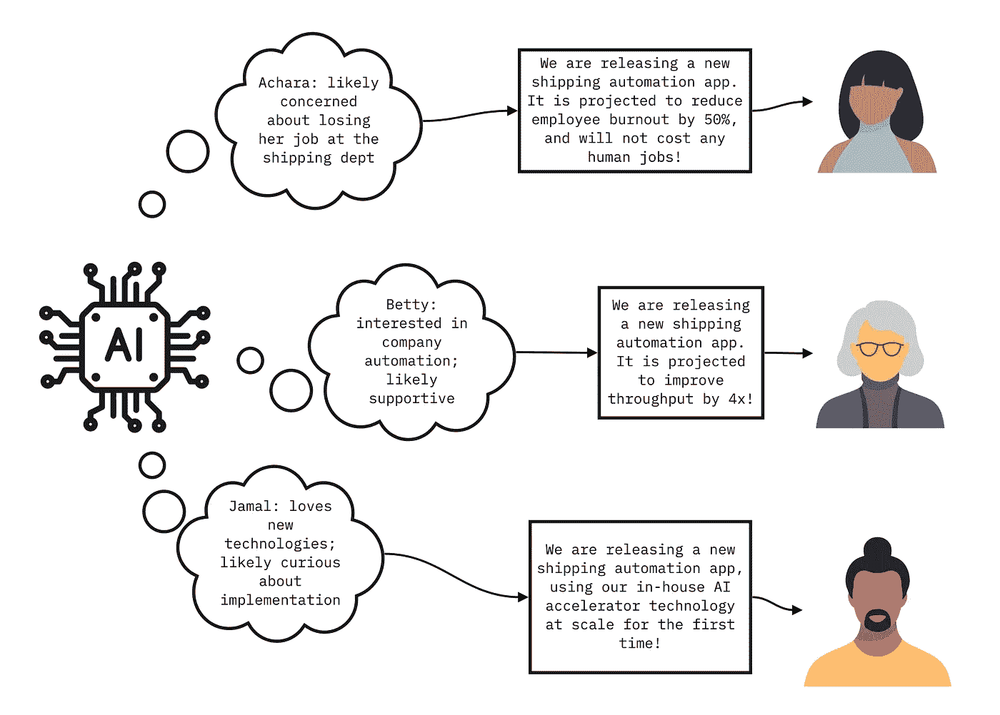

# 超越输入输出推理:认知人工智能的四个关键特性

> 原文：<https://towardsdatascience.com/beyond-input-output-reasoning-four-key-properties-of-cognitive-ai-3f82cde8cf1e>

## 世界模型、心理理论、持续学习和后约束环境的必要性

*图片来源:*[*James Thew*](https://stock.adobe.com/contributor/127684/james-thew?load_type=author&prev_url=detail)*via*[*土坯股票*](https://stock.adobe.com/) *。*

人工智能研究可能是一种令人谦卑的经历——有些人甚至声称，在复制人类智力的最基本方面时，它仍然处于相对停滞状态。它可以纠正拼写，可以进行金融投资，甚至可以作曲；但是如果没有被明确地“教导”这样做，它就不能提醒人们他们的 t 恤穿反了。更重要的是，它不明白为什么这可能是有用的信息。然而，一个刚刚开始自己穿衣服的五岁小孩，会注意到并指出她父亲脖子根部的白色标签。

人工智能领域的大多数研究人员都很清楚，在深度神经网络的众多进步中，人类智能和人工智能之间的差距并没有显著缩小，在复杂的现实生活环境中实现计算高效的自适应推理和决策的解决方案仍然难以实现。认知人工智能，即允许机器理解、学习和执行类似于人类的智力任务的智能，仍然像以往一样难以捉摸。在这篇博客文章中，我们将探索为什么这个鸿沟存在，如果我们有希望跨越它，人工智能研究必须走向何方。

# **为什么【艾先生】**不能保住工作

与一个可以整天跟着我们，收拾我们的烂摊子的人工智能助手并肩工作有多好？想象一下，如果算法能够真正将我们从工作日的“苦力”任务中解放出来，让我们能够专注于工作中更具战略性和/或创造性的方面，那该有多好？问题是，除了像 [GitHub Copilot](https://dl.acm.org/doi/pdf/10.1145/3520312.3534864) 这样的系统的部分例外，一个基于[当前最先进技术](https://workofthefuture.mit.edu/research-post/artificial-intelligence-and-the-future-of-work/)的虚构“AI 先生”可能会在工作日结束前收到解雇通知。

首先，艾未未非常健忘，尤其是在上下文记忆方面。它还受到严重缺乏关注的困扰。对于一些人来说，这似乎令人惊讶，因为今天有非常大的语言模型(LLM)，包括 [LaMDA](https://arxiv.org/pdf/2201.08239.pdf) 和 [GPT-3](https://arxiv.org/abs/2005.14165) ，在某些情况下，它们[可能很有意识](https://theconversation.com/is-googles-lamda-conscious-a-philosophers-view-184987)。然而，即使使用最先进的深度学习模型，艾未未的工作表现也总是达不到预期。它不能很好地适应不断变化的环境和需求。它不能独立确定它提供的建议在认识论上和事实上都是合理的。它甚至不能想出一个简单的计划！无论它的社交技能设计得多么精心，它都注定会在这个充满复杂社会和道德规范的高度动态的世界中跌倒。它根本不具备在人类世界茁壮成长的条件。

但那是什么？

# **高级智能的四个关键属性**

为了赋予机器更多类似人类的智能，人们必须首先探索是什么使人类智能与当前(大约 2022 年)许多通常用于人工智能应用的神经网络截然不同。进行这种区分的一种方式是通过以下四个属性:

## ***1。世界模型***

人类自然而然地发展出一种“世界模型”,这种模型允许他们设想无数短期和长期的“如果”,并以此来指导他们的决策和行动。人工智能模型[可以通过类似的能力](https://ai.facebook.com/blog/yann-lecun-advances-in-ai-research/)变得更加高效，这将允许它们以资源高效的方式从头到尾模拟潜在的场景。智能机制需要用多个相互作用的个体代理来模拟复杂的环境。一个输入到输出的映射函数(例如可以用一个复杂的前馈网络来实现)，需要“展开”所有潜在的路径和交互。在现实生活环境中，这种从输入到输出的展开模型的复杂性会迅速增加，特别是在考虑跟踪每个代理的相关历史的任意持续时间时。相比之下，智能机制可以在模拟环境中独立地对每个因素和代理进行建模，可以评估许多假设的未来场景，并通过复制参与者的副本来发展模型，每个参与者都有其可知的相关历史和行为。

获得具有这种模拟能力的世界模型的关键是世界模型的构建模块(认知推理过程)和它们随后在可能结果的模拟中的使用之间的解耦。即使模拟方法随着时间的推移而改变，由此产生的“假设”场景也可以保持一致的方式进行比较。这种方法的一个特殊案例可以在[数字双胞胎](https://ieeexplore.ieee.org/abstract/document/8424832)中找到，其中机器配备了(通过自学或显式设计)其环境的模型，可以模拟各种交互的潜在未来。

图一。数字孪生技术在互动环境中创造了复杂角色的多面模型。图片来源:[chesky](https://stock.adobe.com/contributor/202426864/chesky?load_type=author&prev_url=detail)via[Adobe Stock](https://stock.adobe.com/)

智能生物和机器使用世界模型(“世界观”)来理解观察结果，评估潜在的未来，以选择最佳的行动方案。在从“一般的”大规模设置(如回复网络查询)过渡到包括多个参与者的特定设置中的直接交互的过程中，世界模型必须被有效地缩放和定制。与试图在单个“输入-输出功能”步骤中模拟*和*推理相比，解耦、模块化、可定制的方法是一种逻辑上不同且远不复杂的架构。

## 2.心理理论

[【心理理论】](https://www.cell.com/current-biology/pdf/S0960-9822(05)00960-7.pdf)指的是一种复杂的心理技能，它被认知科学定义为一种能力，即[通过跟踪另一个人的](https://psycnet.apa.org/doiLanding?doi=10.1037%2Fa0016923)[注意力](https://scholar.google.com/scholar?hl=en&as_sdt=0%2C5&q=Precursors+to+a+theory+of+mind%3A+Understanding+attention+in+others.&btnG=)和[将一种心理状态](https://en.wikipedia.org/wiki/Theory_of_mind)归因于另一个人的行为和信念。

用最简单的话来说，这就是我们在试图读取另一个人的想法时所做的事情。我们在一生中发展和使用这种技能来帮助我们驾驭我们的社会交往。这就是为什么我们没有提醒我们的节食同事在休息室里有一大盘新鲜的巧克力饼干。

我们看到在人工智能应用中使用思维理论的痕迹，如[聊天机器人，它们根据他们打开聊天的原因、他们使用的语言等，独特地适应他们服务的客户的情绪](https://link.springer.com/article/10.1631/FITEE.1700826)。然而，用于训练这种社交聊天机器人的性能指标——通常定义为[每次会话的对话次数，或 CPS](https://direct.mit.edu/coli/article/46/1/53/93380/The-Design-and-Implementation-of-XiaoIce-an)——只是训练模型以最大限度地吸引人类的注意力，而不是强迫系统开发一个通过推理和规划任务衡量的人类思维的显式模型。

图二。具有心理理论能力的人工智能系统可以根据最终用户的需求和偏好修改其输出。图片来源:英特尔实验室。

在一个需要与一组特定的个体互动的系统中，心理理论需要一种更结构化的表示，这种表示服从于逻辑推理操作，例如那些在演绎和归纳推理、计划、意图推断等中使用的逻辑推理操作。此外，这种模型必须跟踪各种行为特征，可预测地随着新信息的流入而更新，并避免回到以前的模型状态。

## 3.持续学习

除了一些例外，今天的标准机器学习范式是批量离线学习，可能随后会针对特定任务进行微调。因此，生成的模型无法从部署时暴露的信息中提取有用的长期更新。人类没有这样的限制。他们不断学习，并利用这些信息建立认知模型，如世界观和心理理论。事实上，持续的学习使人类能够保持和更新他们的思维模式。

持续学习(也被称为终身和持续学习)的问题现在在人工智能研究界引起了更强烈的兴趣，部分原因是由于像[联邦学习](https://arxiv.org/abs/2105.06413)和像[医疗数据处理](https://www.thelancet.com/journals/landig/article/PIIS2589-7500(21)00076-5/fulltext)这样的工作流这样的技术的出现带来的实际需求。一个人工智能系统，使用一个世界模型的环境中，与该环境中的各种代理相关的思维理论，一个持续的学习能力将是至关重要的，以维护和更新每个对象和代理的历史和当前状态描述符。

尽管该行业的需求非常明确，但仍有许多工作要做。具体来说，能够持续学习信息，然后用于推理或规划的解决方案仍处于初级阶段——这种解决方案需要能够实现上述模型构建功能。

## 4.后期绑定上下文

后期绑定上下文是指上下文特定的(而不是一般的)响应的组合，并利用查询或决策时可用的最新相关信息。背景意识体现了人类学习的所有细微差别——它是“谁”、“为什么”、“何时”和“什么”通知人类的决定和行为。它防止人类诉诸推理捷径，跳到不精确的、概括的结论。相反，情境意识允许我们建立一套适应的行为，以适应需要解决的特定环境状态。如果没有这种能力，我们的决策将会大打折扣。后期绑定上下文也与持续学习紧密交织在一起。有关后期绑定上下文的更多信息，请参见之前的博客，[推进机器智能:为什么上下文决定一切](/advancing-machine-intelligence-why-context-is-everything-4bde90fb2d79)。

# **人类认知作为人工智能未来的路线图**

如果没有上面列出的关键认知能力，人类工业和社会的许多关键需求将无法得到满足。因此，相当迫切地需要分配更多的研究，以将人类的认知能力转化为人工智能功能——特别是那些使其不同于当前人工智能模型的特性。上面列出的四个属性是一个起点。它们位于人类认知功能的复杂网络的中心，并提供了一条通向计算高效的自适应模型的道路，这些模型可以部署在现实生活的多角色环境中。随着人工智能从集中化、同质化的大型模型扩散到集成在复杂社会环境中的多种用途，下一组属性将需要出现。

## 参考

1.  米契尔(2021)。为什么 AI 比我们想象的要难。arXiv 预印本 arXiv:2104.12871。【https://arxiv.org/abs/2104.12871 
2.  马库斯·g(2022 年 7 月 19 日)。深度学习正在碰壁。鹦鹉螺|科学连线。[https://nautil.us/deep-learning-is-hitting-a-wall-14467/](https://nautil.us/deep-learning-is-hitting-a-wall-14467/)
3.  歌手 g(2022 年 1 月 7 日)。认知人工智能的兴起——走向数据科学。中等。[https://towards data science . com/the-rise-of-cognitive-ai-a 29 D2 b 724 CCC](/the-rise-of-cognitive-ai-a29d2b724ccc)
4.  Ziegler，a .，Kalliamvakou，e .，Li，X. A .，Rice，a .，Rifkin，d .，Simister，s .，和 Aftandilian，E. (2022 年 6 月)。神经代码完成的生产率评估。《第六届 ACM SIGPLAN 机器编程国际研讨会论文集》(第 21-29 页)。[https://dl.acm.org/doi/pdf/10.1145/3520312.3534864](https://dl.acm.org/doi/pdf/10.1145/3520312.3534864)
5.  马龙，T. W .，俄罗斯，d .，，劳巴赫尔，R. (2020)。人工智能和工作的未来。麻省理工学院未来工作特别小组准备的报告,《研究简报》, 17，1–39。[https://work of future . MIT . edu/research-post/artificial-intelligence-and-the-future-of-work/](https://workofthefuture.mit.edu/research-post/artificial-intelligence-and-the-future-of-work/)
6.  Thoppilan，r .，De Freitas，d .，Hall，j .，Shazeer，n .，Kulshreshtha，a .，Cheng，H. T .，… & Le，Q. (2022)。Lamda:对话应用程序的语言模型。arXiv 预印本 arXiv:2201.08239。【https://arxiv.org/pdf/2201.08239.pdf 
7.  t .布朗、b .曼恩、n .赖德、Subbiah、m .卡普兰、J. D .、Dhariwal、p .…& amo dei，D. (2020 年)。语言模型是一次性学习者。神经信息处理系统进展，33，1877-1901。[https://arxiv.org/abs/2005.14165](https://arxiv.org/abs/2005.14165)
8.  柯蒂斯，b .，&萨武列斯库，J. (2022 年 6 月 15 日)。谷歌的 LaMDA 有意识吗？一个哲学家的观点。对话。[https://the conversation . com/is-Googles-lamda-conscious-a-哲人-view-184987](https://theconversation.com/is-googles-lamda-conscious-a-philosophers-view-184987)
9.  迪克森，B. (2022 年 7 月 24 日)。大型语言模型不会规划，即使写的是花里胡哨的论文。技术对话。[https://bdtechtalks . com/2022/07/25/large-language-models-cant-plan/](https://bdtechtalks.com/2022/07/25/large-language-models-cant-plan/)
10.  Mehrabi、f . mor statter、n . sa xena、Lerman、k .和 a . Galstyan(2021 年)。机器学习中的偏见和公平问题综述。美国计算机学会计算调查(CSUR)，54(6)，1–35。[https://dl.acm.org/doi/abs/10.1145/3457607](https://dl.acm.org/doi/abs/10.1145/3457607)
11.  纽约州勒村(2022 年)。通向自主机器智能 0.9 版的道路。2, 2022–06–27.[https://openreview.net/pdf?id=BZ5a1r-kVsf](https://openreview.net/pdf?id=BZ5a1r-kVsf)
12.  El Saddik，A. (2018)。数字双胞胎:多媒体技术的融合。IEEE 多媒体，25(2)，87–92。[https://ieeexplore.ieee.org/abstract/document/8424832](https://ieeexplore.ieee.org/abstract/document/8424832)
13.  Frith，c .，& Frith，U. (2005)。心理理论。当前生物学，15(17)，R644-R645。[https://www . cell . com/current-biology/pdf/S0960-9822(05)00960-7 . pdf](https://www.cell.com/current-biology/pdf/S0960-9822(05)00960-7.pdf)
14.  Apperly，I. A .，& Butterfill，S. A. (2009)。人类是否有两个系统来追踪信仰和类似信仰的状态？。心理评论，116(4)，953。[https://psycnet.apa.org/doiLanding?doi=10.1037%2Fa0016923](https://psycnet.apa.org/doiLanding?doi=10.1037%2Fa0016923)
15.  Baron-Cohen，S. (1991)。心灵理论的前兆:理解他人的注意力。自然心理理论:日常心理阅读的演变、发展和模拟，1，233-251。
16.  维基百科的贡献者。(2022 年 8 月 14 日)。心理理论。维基百科。[https://en.wikipedia.org/wiki/Theory_of_mind](https://en.wikipedia.org/wiki/Theory_of_mind)
17.  Shum，H. Y .，He，X. D .，&李，D. (2018)。从伊莉莎到小冰:社交聊天机器人的挑战和机遇。信息技术与电子工程前沿，19(1)，10-26。[https://link.springer.com/article/10.1631/FITEE.1700826](https://link.springer.com/article/10.1631/FITEE.1700826)
18.  周，l .，高，j .，李，d .，& Shum，H. Y. (2020)。移情社交聊天机器人 xiaoice 的设计与实现。计算语言学，46(1)，53-93。[https://direct . MIT . edu/coli/article/46/1/53/93380/The-Design-and-implement-of-XiaoIce-an](https://direct.mit.edu/coli/article/46/1/53/93380/The-Design-and-Implementation-of-XiaoIce-an)
19.  Reina，G. A .，Gruzdev，a .，Foley，p .，佩列皮奥尔金娜，o .，Sharma，m .，Davidyuk，I .，… & Bakas，S. (2021)。OpenFL:一个用于联合学习的开源框架。arXiv 预印件 arXiv:2105.06413[https://arxiv.org/abs/2105.06413](https://arxiv.org/abs/2105.06413)
20.  Vokinger，K. N .，Feuerriegel，s .，& Kesselheim，A. S. (2021)。医疗器械持续学习:FDA 行动计划及展望。《柳叶刀数字健康》，3(6)，e337-e338。[https://www . thelancet . com/journals/land ig/article/piis 2589-7500(21)00076-5/全文](https://www.thelancet.com/journals/landig/article/PIIS2589-7500(21)00076-5/fulltext)
21.  歌手 g(2022 b，5 月 14 日)。推进机器智能:为什么语境决定一切。中等。[https://towards data science . com/advancing-machine-intelligence-why-context-is-everything-4 bde 90 FB 2d 79](/advancing-machine-intelligence-why-context-is-everything-4bde90fb2d79)