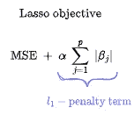
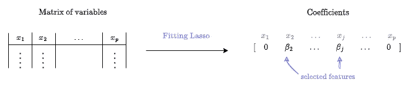
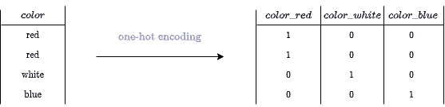
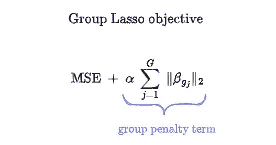
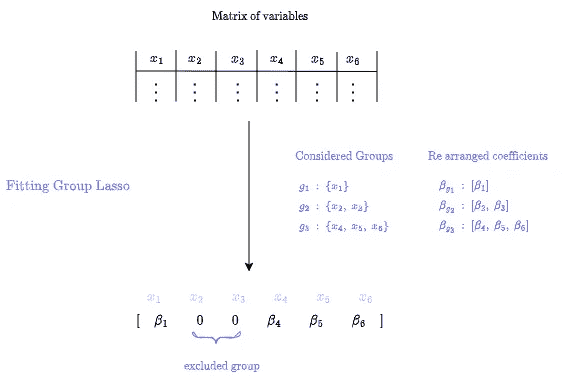
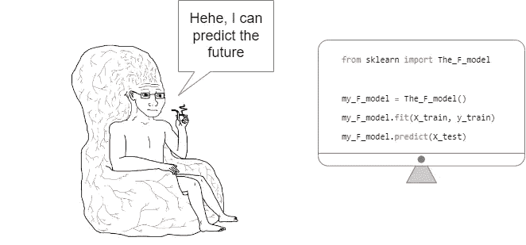
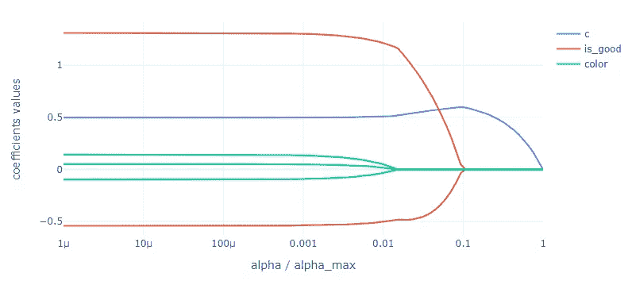
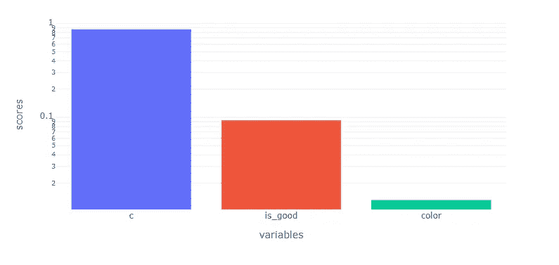

# 利用线性回归进行分类变量和连续变量的特征选择

> 原文：<https://towardsdatascience.com/beyond-linear-regression-467a7fc3bafb>

## 如何使用群组套索选择前 K 个最相关的特征

[感谢[https://www.craiyon.com/](https://www.craiyon.com/)生成]

线性回归是初级/入门级机器学习(ML)模型之一。这归功于它的…

*   **简单性**:它将给定的响应 *y* 建模为一些变量 *x_1，…，x_p* 的线性组合
*   **可解释性**:与变量 *x_j* 相关的系数暗示了它与响应 *y* 的关系
*   **可训练性**:在训练过程中不需要大量的超参数调整。

甚至可以说它是数据科学家的[《Hello world》节目](https://en.wikipedia.org/wiki/%22Hello,_World!%22_program)的同义词。尽管是基本的，线性回归仍然有一些其他非常有趣的特性要展现…

# 特征选择的惩罚线性回归

寻找线性回归系数 *β_1，…，β_p* 包括寻找接近响应的变量的“最佳”线性组合。换句话说，找到使[均方误差(MSE)](https://en.wikipedia.org/wiki/Mean_squared_error#:~:text=If%20a%20vector,is%20computed%20as) 最小的系数。

通过考虑 MSE 加上额外的惩罚项，可以赋予回归系数一些额外的性质。

要最小化的惩罚目标函数。[作者插图]

这类似于隐式地对模型说:**在考虑强度为 *α*** *的惩罚项的同时，尽可能多地保留数据保真度。碰巧的是，通过对惩罚项的特定选择，我们可以为线性回归提供特征选择属性。*

## 套索特征选择工作良好，直到你考虑分类变量

当我们将罚项设置为 [L1 范数](https://en.wikipedia.org/wiki/Norm_(mathematics)#:~:text=The%20name%20relates,of%20the%20columns) —回归系数的绝对值之和时，我们得到了一个具有很少非零系数的解。这在文献中被称为[套索模型](https://en.wikipedia.org/wiki/Lasso_(statistics))，其产生的解决方案享有特征选择属性，因为**(少数)非零系数指示与模型最相关的特征，并因此指示要选择的特征。**

**Top)** 套索的目标函数被最小化。**(Bottom)**拟合套索模型后得到的解决方案。[作者插图]

经常会遇到分类变量，例如，一个颜色变量的值是“红”、“白”和“蓝”。这些必须事先以数字形式编码，以便在回归模型中使用。为了做到这一点，我们经常求助于使用[一键编码](https://en.wikipedia.org/wiki/One-hot#Comparison_with_other_encoding_methods:~:text=important%20than%20%27laugh%27.-,Machine%20learning%20and%20statistics,-%5Bedit%5D)——将一个变量分解成它的虚拟值——来避免隐式地强制执行值之间的顺序。

对以“红色”、“白色”和“蓝色”为值的可变颜色应用一键编码后的结果。[作者插图]

在这种特定情况下应用 Lasso 作为特征选择技术是不合适的，因为它独立地处理变量，因此忽略了它们之间的任何关系，在我们的情况下，它忽略了虚拟变量作为一个整体代表相同的分类变量的事实。

例如，如果 Lasso 在 *color_white* 和 *color_blue* 中选择了 *color_red* ，那么它并没有说明“颜色”变量的相关性。

## 用于连续/分类特征选择的组合套索

理想情况下，我们需要一个将分类变量的虚拟变量作为一个整体来考虑的惩罚，换句话说，一个在处理分类变量时包含虚拟变量之间潜在的“组结构”的惩罚。

这可以通过稍微改变 Lasso 的惩罚来处理变量组来实现。为此，我们重新排列了向量中属于同一组的回归系数。然后，我们考虑它们的和 [L2 范数](https://en.wikipedia.org/wiki/Norm_(mathematics)#Euclidean_norm:~:text=of%20its%20norm.-,Euclidean%20norm,-%5Bedit%5D)。

**Top)** 组套索目标函数被最小化。**下图)**拟合一组套索模型后得到的解。[作者插图]

由此产生的模型在文献中被称为[组套索](https://en.wikipedia.org/wiki/Proximal_gradient_methods_for_learning#Group_lasso:~:text=few%20such%20methods.-,Group%20lasso,-%5Bedit%5D)。值得一提的是，通过考虑上述惩罚，我们获得了一个模型:

*   **具有分组特征选择属性。**一个组的变量要么全部被选择(分配非零系数)，要么被排除(分配零系数)。
*   平等对待一个群体的变量。我们使用的是 L2 范数，众所周知它是各向同性的，因此不会优先考虑一个组中的任何变量——在我们的例子中，是分类变量的虚拟变量。
*   **处理单个变量和组变量的混合。**一维空间中的 L2 范数是绝对值。因此，如果组由一个变量组成，组套索就简化为套索。

一维空间中的 L2 范数是绝对值。[作者插图]

基于此，我们可以使用组套索来执行连续/分类变量混合的特征选择。**连续变量将被视为单变量组，分类变量将被视为虚拟变量组。**

# 使用 celer 拟合群组套索模型

scikit-learn 是当今 ML 流行背后的著名 python 包之一。其用户友好的 API 和全面的文档降低了进入 ML 领域的门槛，并使非从业者能够毫无困难地从中受益。

[作者的迷因]

不幸的是，scikit-learn 实现中缺少组 Lasso。然而，这一点也不奇怪，因为无数的是今天的 ML 模型，更不用说当你考虑它们的变种！

很可能，有几个倡议旨在通过标准化 ML 模型的实现并使它们与 scikit-learn API 保持一致来保持 ML 对普通公众的可访问性。

## celer:一个 scikit-learn API conform 包，用于套索类模型

[**celer**](https://mathurinm.github.io/celer/)**是一个 python 包，它包含了 [scikit-learn 愿景](https://jmlr.csail.mit.edu/papers/v12/pedregosa11a.html#:~:text=This%20package%20focuses%20on%20bringing%20machine%20learning%20to%20non%2Dspecialists%20using%20a%20general%2Dpurpose%20high%2Dlevel%20language.%20Emphasis%20is%20put%20on%20ease%20of%20use%2C%20performance%2C%20documentation%2C%20and%20API%20consistency.)，并提供了完全在 scikit-learn API 下设计的模型，从而与它很好地集成在一起——可以与管道和 GridSearchCV 等一起使用。因此，拟合 **celer** 的模型就像为 scikit-learn 做同样的事情一样简单。**

**此外， **celer** 专门设计用于处理套索类模型，如套索和组合套索。因此，它具有定制的实现，使其能够快速适应这些类型的模型，比 scikit-learn 快 100 倍，并有效地处理大型数据集。**

## **celer Group Lasso 入门**

**在通过 pip 安装了 **celer** 之后，您可以轻松地安装一个群组套索模型，如下面的代码片段所示。这里，考虑一个具有一个连续变量和两个分类变量的玩具数据集。**

****celer** 组套索的启动器示例**

**我们已经成功地拟合了一组套索，今后剩下的工作就是检查结果解(非零系数)来决定要选择的变量。**

**理想情况下，在特征选择方面，我们对回答这个问题很感兴趣:**最相关的特征是什么？**因此，我们不能声称我们 100%回答了这个问题，因为非零系数——要选择的变量——取决于惩罚的强度 *α* ，因此我们不能完全控制它们。**

# **通过惩罚强度控制所选特征的数量**

**我们从 0 开始增加 *α* 越多——纯线性回归——过滤掉的变量越多——分配零系数。最终，对于“足够大” *α* ，我们得到一个零解——所有系数都为零。**

**这意味着一个变量被高*，*α驱逐后“幸存”得越多，它就越显示出它对模型的重要性。因此，我们可以依靠惩罚强度对变量进行评分。**

**有趣的是，给定一个响应和一组变量，我们可以证明[存在一个 *α_max*](https://arxiv.org/pdf/1602.06225.pdf) ，在这个值之上，零解是唯一一个折衷数据保真度和损失的解。**

****

**在一个网格(0， *α_max)上对玩具数据集上的*进行套索分组。注意，在α_max 以上，所有系数都为零。*【作者插图】***

**这意味着每个变量都有一个介于 0 和 *α_max 之间的有限分数。*此外，由于我们有一个明确的公式 *α_max，*我们可以通过 *α_max* 进一步归一化分数，以获得介于 0 和 1 之间的分数。**

**总结一下方法，我们先在 0 和 *α_max 之间生成一个 *α* 的网格。*然后，我们在每个 *α* 上拟合群组套索，并跟踪变量何时被分配零系数——这将是它们相应的分数*。*最后，我们将这些分数标准化，然后根据这些分数对变量进行排名。**

**除了最后一步，以上所有步骤都由 [celer_path](https://mathurinm.github.io/celer/generated/celer.celer_path.html) 精心处理——celer 模型的构建模块。**

**回到原来的问题:**最热门的 *K 的*最相关的特征是什么？**剩下的就是**根据分数对特征进行降序排序，选择前 *K* 个。****

****

**使用所考虑的方法得到的玩具数据集的特征分数。[作者插图]**

# **总结和结论**

**线性回归无疑仍然是最简单和易于理解的模型之一，它与精心选择的惩罚相结合，产生了更多可解释的结果。**

**在本文中，我们扩展了线性回归，使用套索组模型对连续/分类变量的混合物进行特征选择。**

**最后，我们使用 **celer** 来拟合组 Lasso，并依靠其核心解算器— *celer_path —* 来控制所选特征的数量。**

**我制作了一个详细的 GitHub 存储库，其中我将介绍的特征选择技术应用于一个真实的数据集。您可以在[链接](https://github.com/Badr-MOUFAD/beyond-OLS-med-supp-material)中查看源代码，并利用开发的 python 实用程序将其应用到您自己的用例中。**

****有用链接:****

*   ****真实数据集上的例子:**[https://github.com/Badr-MOUFAD/beyond-OLS-med-supp-material](https://github.com/Badr-MOUFAD/beyond-OLS-med-supp-material)**
*   ****策勒文档:【https://mathurinm.github.io/celer/】T22****
*   ****celer GitHub 库:**https://github.com/mathurinm/celer**