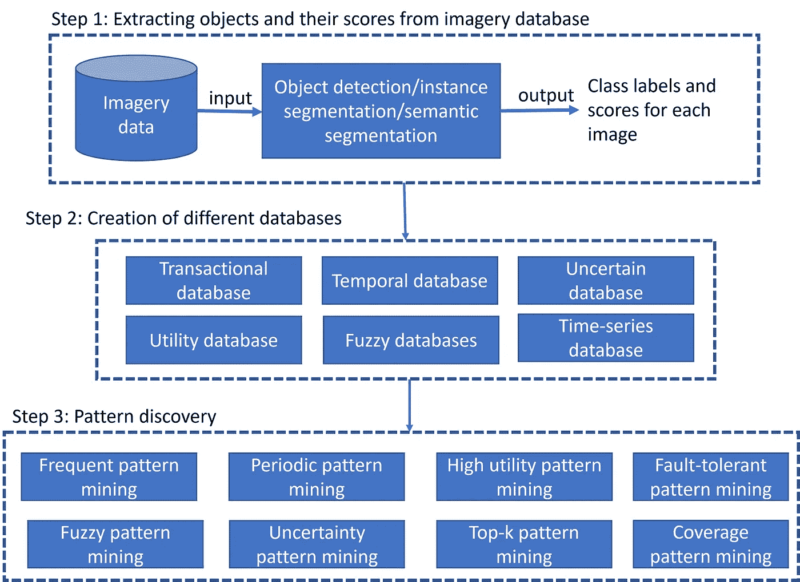
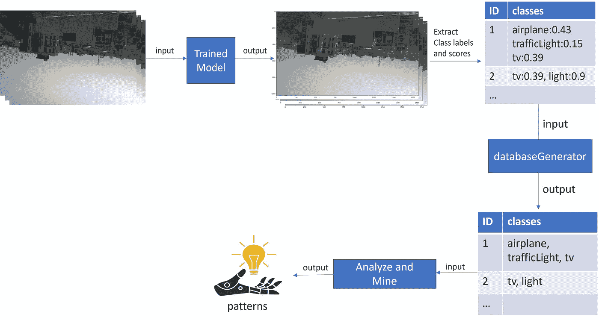

# 超越目标识别:图像数据中模式发现的巨大飞跃

> 原文：<https://towardsdatascience.com/beyond-object-identification-a-giant-leap-into-pattern-discovery-in-imagery-data-ca6fbb46ff4a>

## 一个关于发现影像数据中对象之间相关性的简短而有趣的教程

在识别图像数据库中的对象(或类别标签)之后出现的一个关键问题是:“*在图像数据库中发现的各种对象是如何相互关联的？*“本文试图通过提供一个通用框架来回答这个问题，该框架可以帮助读者发现图像数据库中对象之间隐藏的相关性。(本文的目的是鼓励即将到来的研究人员在顶级会议和期刊上发表高质量的研究论文。本文部分摘自我们发表在 IEEE BIGDATA 2021 [1]上的工作。)

发现影像数据库中对象之间相关性的框架如图 1 所示。它包括以下三个步骤:

1.  提取存储库中每个图像的对象(或类别标签)及其概率分数。用户可以使用对象检测/实例分割/语义分割技术来提取对象。
2.  将对象及其概率分数转换到您选择的数据库中。(如有必要，删除具有低概率分数的不感兴趣的对象以减少噪声。)
3.  根据生成的数据库和所需的知识，应用相应的模式挖掘技术来发现影像数据中对象之间令人兴奋的相关性。



图 1:发现影像数据中有趣模式的框架

**演示:**在本演示中，我们首先将图像数据传递到一个经过训练的模型(例如 resnet50)中，并提取对象及其分数。接下来，提取的数据被转换成事务数据库。最后，我们在生成的事务数据库上执行(最大)频繁模式挖掘，以发现图像数据中频繁出现的对象集。图 2 显示了我们的演示的概况。



图 2:在影像数据中发现模式的概述

**先决条件:**

1.  我们假设读者熟悉实例/语义分割和模式挖掘主题。我们推荐 [Phillipe 关于模式挖掘的视频讲座](https://www.youtube.com/watch?v=idQEwXWcQfM&ab_channel=PhilippeFournier-Viger) s。
2.  安装以下 python 包: *pip 安装 pami torchvision*
3.  从[2]下载图像数据库

(请根据您的计算环境安装任何所需的附加软件包。)

**步骤 1:从图像数据中提取对象及其分数**

**步骤 1.1:加载预训练的对象检测模型**

将以下代码保存为 objectDetection.py。该代码接受 imagery 文件夹作为输入，实现预训练的 resnet50 模型，并输出包含类标签及其分数的列表(即 self.predicted_classes)。该列表中的每个元素表示在图像中找到的类别标签。

```
import glob
import os
import csv
import torchvision
from torchvision import transforms
import torch
from torch import no_grad
import cv2
from PIL import Image
import numpy as np
import sys
import matplotlib.pyplot as plt
from IPython.display import Image as Imagedisplay
from PAMI.extras.imageProcessing import imagery2Databases as obclass objectDetection:
    def __init__(self):
        self.model_ = torchvision.models.detection.fasterrcnn_resnet50_fpn(pretrained=True)
        self.model_.eval()
        for name, param in self.model_.named_parameters():
            param.requires_grad = Falsedef model(self, x):
        with torch.no_grad():
            self.y_hat = self.model_(x)
        return self.y_hatdef model_train(self, image_path):
        # label names 
        self.coco_instance_category_names = [
            '__background__', 'person', 'bicycle', 'car', 'motorcycle', 'airplane', 'bus',
            'train', 'truck', 'boat', 'traffic light', 'fire hydrant', 'N/A', 'stop sign',
            'parking meter', 'bench', 'bird', 'cat', 'dog', 'horse', 'sheep', 'cow',
            'elephant', 'bear', 'zebra', 'giraffe', 'N/A', 'backpack', 'umbrella', 'N/A', 'N/A',
            'handbag', 'tie', 'suitcase', 'frisbee', 'skis', 'snowboard', 'sports ball',
            'kite', 'baseball bat', 'baseball glove', 'skateboard', 'surfboard', 'tennis racket',
            'bottle', 'N/A', 'wine glass', 'cup', 'fork', 'knife', 'spoon', 'bowl',
            'banana', 'apple', 'sandwich', 'orange', 'broccoli', 'carrot', 'hot dog', 'pizza',
            'donut', 'cake', 'chair', 'couch', 'potted plant', 'bed', 'N/A', 'dining table',
            'N/A', 'N/A', 'toilet', 'N/A', 'tv', 'laptop', 'mouse', 'remote', 'keyboard', 'cell phone',
            'microwave', 'oven', 'toaster', 'sink', 'refrigerator', 'N/A', 'book',
            'clock', 'vase', 'scissors', 'teddy bear', 'hair drier', 'toothbrush'
        ]
        self.transform = transforms.Compose([transforms.ToTensor()])
        self.image_path = image_path
        self.image = Image.open(self.image_path)
        # resize and plotting the image
        self.image.resize([int(0.5 * s) for s in self.image.size])
        del self.image_path
        self.image = self.transform(self.image)# predictions without any threshold
        self.predict = self.model([self.image])
        self.predicted_classes = [(self.coco_instance_category_names[i], p) for
                                  i, p in
                                  zip(list(self.predict[0]['labels'].numpy()),
                                      self.predict[0]['scores'].detach().numpy())]return self.predicted_classes
```

**步骤 1.2:从每幅图像中检测物体**

以下代码识别每个图像中的各种对象，并将它们附加到一个名为 *detected_objects_list* 的列表中。在下一步中，这个列表将被转换成一个事务数据库。

```
from PAMI.extras.imageProcessing import imagery2Databases as ob
# input images path folder 
images_path = 'aizu_dataset'# list to store output items
detected_objects_list = []# opening the images folder and reading each image
for filename in glob.glob(os.path.join(images_path,'*.JPG')):
    with open(os.path.join(os.getcwd(),filename),'r') as f:

        # loading pretrained resnet-50 model to train on our dataset
        model_predict = objectDetection()

        # input each image to the pre-trained model
        # model returns detected objects
        objects_detected = model_predict.model_train(filename)
        detected_objects_list.append(objects_detected)
```

**第二步:创建交易数据库**

使用下面的代码删除不感兴趣的类标签。将剩余数据保存为事务数据库。

```
#Prune uninteresting objects whose probability score is less than a particular value, say 0.2
obj2db = ob.createDatabase(detected_objects_list,0.2)#save the objects identified in the images as a transactional database
obj2db.saveAsTransactionalDB('aizu_dataset0.2.txt',',')
```

通过键入以下命令查看生成的事务数据库文件:

*！head -10 aizu_dataset0.2.txt*

输出如下所示:

```
motorcycle,backpack,person
book,baseball bat,refrigerator,cup,toaster
bottle,bowl,tv,toilet,chair,mouse,refrigerator,cell phone,microwave,remote,sink
microwave,refrigerator,bowl,bottle,cell phone,oven,car,person
bench
potted plant
bottle,handbag,suitcase,book
book,laptop,tv,umbrella
oven
parking meter,car
```

**第三步:在事务数据库中提取模式。**

在生成的事务数据库上应用最大频繁模式增长算法来发现隐藏模式。在下面的代码中，我们找到了在影像数据库中至少出现了十次的模式(即类别标签集)。

```
from PAMI.frequentPattern.maximal import MaxFPGrowth as algobj = alg.MaxFPGrowth('aizu_dataset0.2.txt',10, ',')
obj.startMine()
print(obj.getPatterns())
obj.savePatterns('aizuDatasetPatterns.txt')
print('Runtime: ' + str(obj.getRuntime()))
print('Memory: ' + str(obj.getMemoryRSS()))
```

通过键入以下命令查看生成的模式:
*！head-10 aizudatasetpatterns . txt*

输出如下所示:

```
refrigerator	microwave	:11
toilet	:10 
cell phone	:11 
traffic light	:12 
truck	:12 
potted plant	:12 
clock	:15 
bench	:17 
oven	:17 
car	:18
```

第一个图案/线条表示图像库中的 11 幅图像包含分类标签*冰箱*和*微波炉*。对于剩余的图案/线条可以做出类似的陈述。

了解不同对象/类别标签之间的相关性有利于用户做出决策。

**结论:**

在工业和学术界中已经广泛研究了图像数据中对象的有效识别。识别对象后的一个关键问题是，*图像数据中各种对象之间的潜在相关性是什么？本博客试图通过提供一种通用方法来回答这个关键问题，该方法将图像数据中发现的对象转换成事务数据库，应用模式挖掘技术，并发现令人兴奋的模式。*

**免责声明:**

1.  本页显示的所有图片均由作者绘制。
2.  该图像数据库由作者本人创建，是开源的，可用于商业和非商业目的。

**参考文献:**

[1] [Tuan-Vinh La](https://dblp.org/pid/311/1191.html) 、 [Minh-Son Dao](https://dblp.org/pid/12/6320.html) 、[友川 Tejima](https://dblp.org/pid/311/0699.html) 、Rage Uday Kiran、 [Koji Zettsu](https://dblp.org/pid/46/184.html) : **通过分析生活日志图像和物联网空气污染数据，提高对可持续智慧城市的认识。**[IEEE BigData 2021](https://dblp.org/db/conf/bigdataconf/bigdataconf2021.html#LaDTKZ21):3589–3594

[2]影像数据集: [aizu_dataset.zip](https://1drv.ms/u/s!Ar09XhBKBP2Mk4Z2gc3W1kKfg_NLyw?e=qTbmQb)