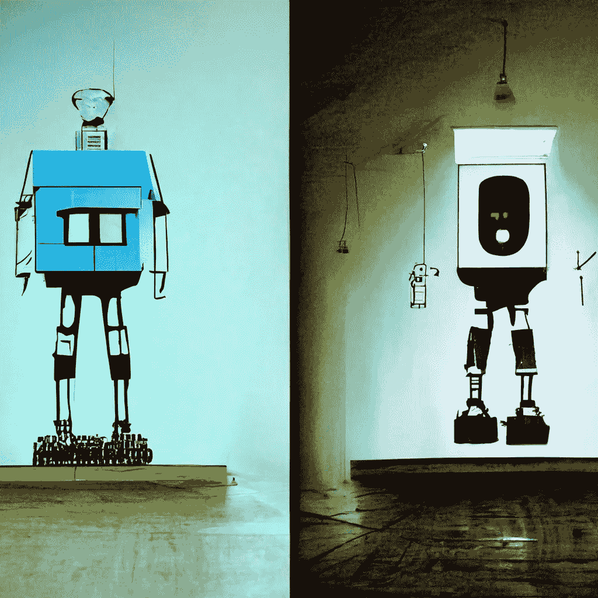
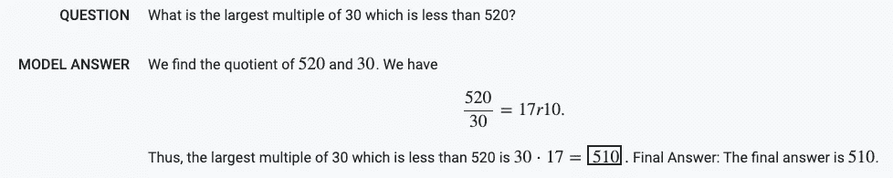
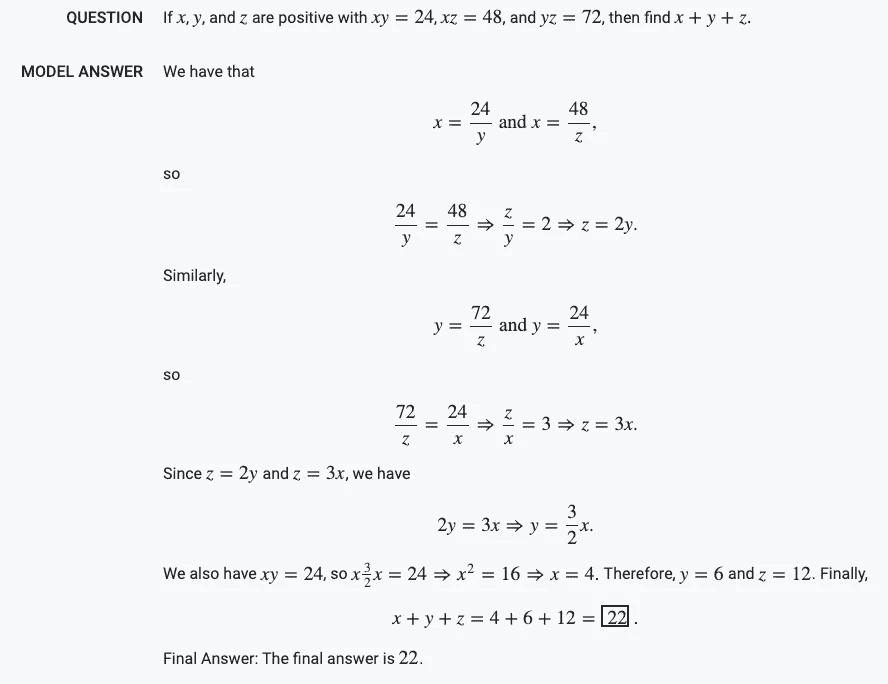
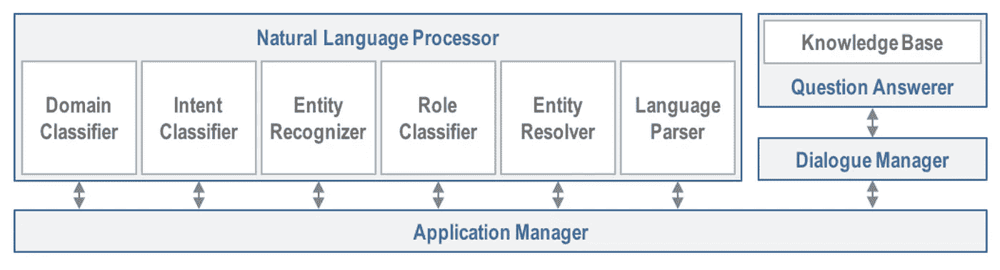
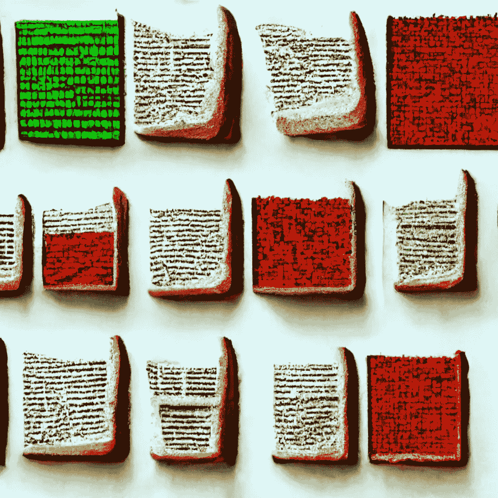

# 语言模型会行动，而不只是说话

> 原文：<https://towardsdatascience.com/beyond-text-generation-language-models-that-act-not-just-talk-127236c0976d>

## 谷歌的 Minerva 如何承诺机器可以行动的未来

> 像 GPT-3 这样的大型语言模型大多被用来完成同样的任务:文本生成。然而，语言只是达到目的的一种手段。在未来几年，我们将会看到一个转变，模特们会“行动”，而不仅仅是“说话”。

[中途](https://midjourney.com)生成的图像(生成型 AI)。参见相关文章:[dalle 能接管 Medium 吗？](https://medium.com/@turc.raluca/can-dall-e-take-over-medium-51ec48538748)

像 GPT-3 这样的大型语言模型(LLM)主要用于文本生成，这是它们最明显的应用——毕竟，这是它们被训练去做的事情:给定一段文本，预测接下来会发生什么。过去两年，在广告、内容营销( [copy.ai](https://www.copy.ai/) 、 [frase.io](https://www.frase.io/) )、小说写作和游戏( [latitude.io](https://latitude.io/) )等创意行业部署 LLM 的初创公司激增。在完全进入真正的赚钱世界之前，这些行业是生殖人工智能萌发一段时间的有利环境。首先，因为他们的面包和黄油是自由形式的文本，这正是 GPT-3 开箱即用的产品；开发人员可以简单地从 OpenAI 中调用推理 API，而几乎不需要了解模型的内部工作原理。第二，这些行业的创造性允许他们对幻觉视而不见，这是当前模型的一个众所周知的限制，允许他们偶尔产生事实上不正确但听起来似乎可信的文本。

然而，LLM 被训练生成文本的事实并不意味着这就是它们的全部用途。对人类来说，自然语言是达到目的的手段，而不是最终的归宿(或许诗歌是个例外)。构建能够理解并生成文本的 ai，就相当于与机器建立了一个沟通的通道，让我们可以轻松地用自己的语言发出命令。我们已经开发这个渠道很长时间了，使用越来越抽象的构建模块:从穿孔卡片到汇编等低级语言，再到 Python 等高级语言，最后是自然语言。现在这个频道几乎完成了，我们开始将注意力转向教 AI 如何*行动*。

# 除了文本生成，第一步:推理

在*说*和*做*之间的中间步骤是*推理*。在过去的几年里，关于逻辑推理硕士是否能推理的争论一直很激烈。杰出的研究人员声称，这种模型只不过是随机鹦鹉学舌，学习语言符号的概率分布，从而鹦鹉学舌训练数据的一些变化，没有任何真正的推理能力。相比之下，另一个学派声称 LLM 能够进行一些推理，因为它们遵守像因果关系这样的常识性规则。例如，当提示短语“因为球员用力击球”时，GPT-3 生成“球飞得很远”——这是一种延续，符合我们对物理世界因果关系的预期。

随着谷歌新模型[Minerva](https://ai.googleblog.com/2022/06/minerva-solving-quantitative-reasoning.html)(2022 年 6 月 30 日)的到来，*随机鹦鹉*的说法失势了。Minerva 令人信服地展示了*一步一步的定量推理*:当提出一个 STEM 问题(与科学、技术、工程或数学相关)时，模型可以产生一个答案，并解释它是如何得出的:

来自 [Minerva 样本浏览器](https://minerva-demo.github.io/#category=Algebra&index=7)的代数问题和模型答案。

虽然 STEM 问题确实需要自然语言理解，但它们还涉及符号和数字操作。数字是一种特别复杂的记号。首先，它们实际上是无限的——你可能会在训练集中遇到大多数品种的狗，但肯定不是大多数。第二，它们的共现模式比普通词少；例如，同时包含“狗”和“猫”的文档比同时包含“520”和“17”或任意一对数字的文档要多得多。这就是为什么“随机鹦鹉”的说法在判断 GPT-3 生成的语句(如“狗追猫”)时听起来可信(即，该模型只是鹦鹉学舌两种动物之间习得的同现)，但当 Minerva 声明“我们有 520/30 = 17r10”时就不那么令人信服了。

另一个值得注意的方面是，Minerva 在提出证据或证明数字响应时会执行*多步*推理。除了最终答案，它还提供了导出最终答案的有序步骤序列。这是*定量推理*的有力证明(与记住答案或选择高可能性标记作为答案相反)。毕竟，我们在评价学生时使用的是同样的原则:如果他们能解释一个结果，那么他们很可能没有作弊。

模型答案中的多步推理(来自 [Minerva 样本探索者](https://minerva-demo.github.io/#category=Algebra&index=22))。

同样值得注意的是，Minerva 不使用任何外部工具，如计算器或 Python 解释器。整个定量推理都编码在训练好的权重中。相比之下，以前的工作[2]使用 LLM 简单地将自然话语转换成可以在传统机器上执行的正式语言；计算器的结果最终被合并到模型的自然语言输出中。

虽然 Minerva 确实有其局限性(它的一些答案是错误的，它的一些推导是*假阴性*——即它从错误的假设中得出正确的结论)，但它在文本生成的基础上迈出了一大步。将定量推理嵌入 LLM 打开了许多现实世界应用的大门，包括教育。只要达到一定的质量标准，学生就可以找到自己的私人人工智能导师来指导他们解决 STEM 问题(…或者帮助他们在作业中作弊🤔).或者，我们可以利用这项技术来构建自动化评估框架，节省人类教育者的时间。

# 超越文本生成，第二步:表演

一旦我们能够制造出能够让*推理*(并因此理解它们被要求做什么)的机器，下一步就是让它们能够*行动*。这不一定是一个全新的任务——毕竟，*助手*已经帮我们开关灯有一段时间了。然而，改变的是它们的实现:多个 NLP 组件的传统管道开始被越来越强大的 LLM 所取代。这种转变将开启更多的用例，并带来更流畅的人机交互。

来自 [MindMeld](https://www.mindmeld.com/) 的传统流水线架构，这是一个 2011 年建立的对话式 AI 平台，2017 年被思科收购。

如上所述，*传统的*对话式人工智能平台，如 [MindMeld](https://www.mindmeld.com/) 将多个独立构建的 NLP 组件链接在一起:领域分类器，接着是意图分类器，然后是其他组件，一直到最终的语言解析器(我假设它将用户输入映射到机器可以执行的正式语言)。然而，根据最近的研究，越来越有可能的是，这些组件将由 LLM 隐式学习并编码在其权重中，而不是由工程师显式实现。毕竟，谷歌的 Minerva 已经包含了某种计算器。

事实上，研究人员已经在*语义解析*(将自然语言映射到正式语言)的背景下研究 LLM 很长时间了。许多论文使用 SQL(标准查询语言)——这有助于与数据库的交互——作为目标正式语言。虽然 LLM 在学习将自然语言转换成针对训练中遇到的特定数据库模式的查询方面表现很好，但推广到看不见的模式仍然是一个挑战[3]。换句话说，一个被训练为与美国航空公司数据库交互的模型可能在 Delta 数据库上表现不佳。类似地，如果灯和扬声器的 API 不同，一个被训练来开关灯的模型可能不知道如何打开和关闭音乐。这是将该技术扩展到许多不同用例的瓶颈，因为每个用例都需要自己的训练数据。

有人可能会合理地问:我们怎么能期望 LLM 理解他们以前没有见过的正式语言(例如，说话者的 API)？这个问题并非不可能解决，因为我们之前已经惊喜地发现多语言模型令人印象深刻的*零触发*功能。事实上，最近有几家初创公司着手应对这一挑战。2022 年 4 月，一群前谷歌员工(包括[瓦斯瓦尼](https://www.adept.ai/team/ashish)、[变形金刚](https://arxiv.org/abs/1706.03762)的第一作者)宣布了他们的新创业公司 [AdeptAI](https://www.adept.ai/) ，旨在让人工智能*对人类发出的自然语言命令*采取行动:

> 真正的通用智能要求模型不仅能读和写，还能以对用户有帮助的方式行动。这就是为什么我们开始 Adept:我们正在训练一个神经网络来使用世界上的每一个软件工具和 API，建立在人们已经创造的大量现有能力的基础上。(摘自 Adept 的[介绍博客](https://www.adept.ai/post/introducing-adept))

同样，2022 年 5 月， [InflectionAI](https://inflection.ai/) 筹集了 2 . 25 亿美元，以实现其让人类能够用自然语言与机器互动的使命:

> 人工智能的最新进展有望从根本上重新定义人机交互。我们很快就有能力用我们与人交流时使用的自然对话语言将我们的思想和想法传递给计算机。随着时间的推移，这些新的语言能力将彻底改变数字体验的含义。([屈折变化](https://inflection.ai/))

# 结论

像 GPT-3 这样的大型语言模型生成的文本吸引了我们的注意力，因为它们具有模仿人类散文的怪异能力。虽然这可能会让我们认为生殖技术已经达到了一个上限，但语言只是达到目的的一种手段。下一个挑战是让正在说话的*移动*并教会机器如何*行动*。谷歌的 Minerva 已经隐含地学会了如何执行符号操作和数字计算，并且有越来越多的努力来教 LLM 如何向底层执行环境发出命令。

本文标题提示时，[中途](https://midjourney.com)(创成式 AI)生成的图像。见相关文章:[DALL E 能否接手 Medium？](https://medium.com/@turc.raluca/can-dall-e-take-over-medium-51ec48538748)

# 参考

[1] Lewkowycz 等，2022: [用语言模型解决定量推理问题](https://arxiv.org/abs/2206.14858)

[2] Andor 等人，2019: [给 BERT 一个计算器:用阅读理解找运算和论点](https://arxiv.org/abs/1909.00109)

[3] Suhr 等人，2020: [探索跨数据库语义解析的未探索的泛化挑战](https://research.google/pubs/pub49288/)