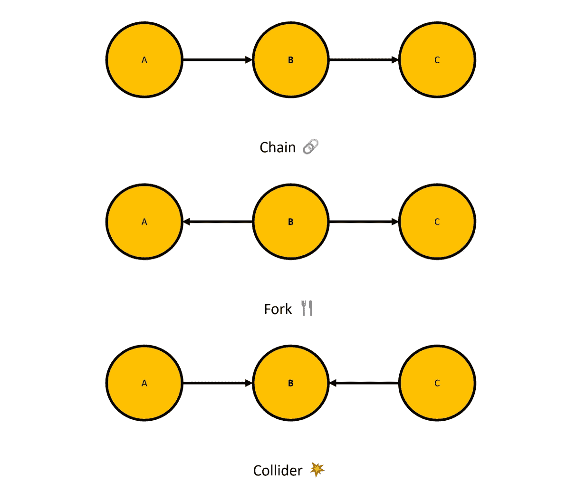
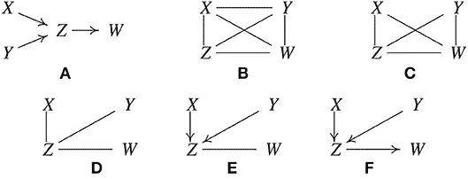
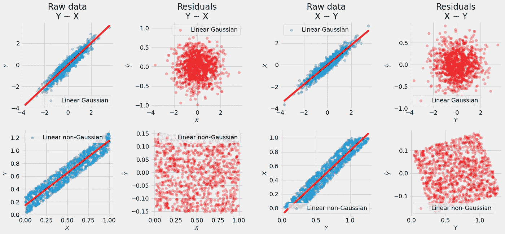
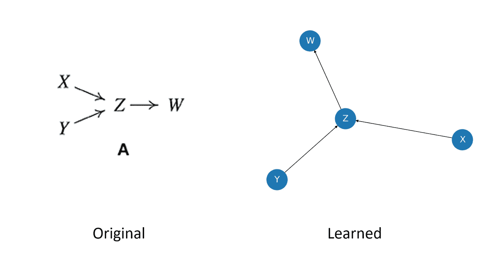
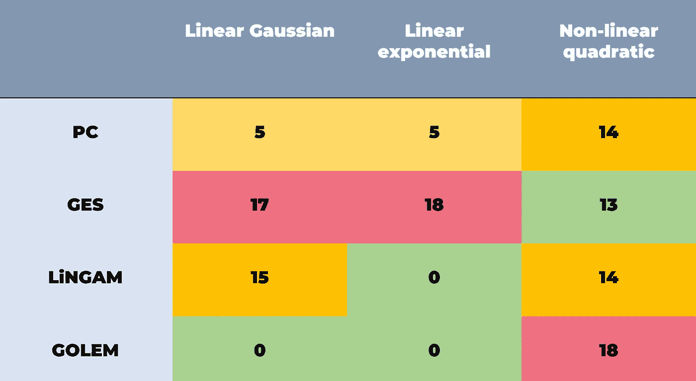

# 因果 Python-提升您在 Python 中的因果发现技能(2023)

> 原文：<https://towardsdatascience.com/beyond-the-basics-level-up-your-causal-discovery-skills-in-python-now-2023-cabe0b938715>

## …并释放 Python 中最佳因果发现包的潜力！

图片由佩克斯(【https://www.pexels.com/photo/purple-leaf-459301/】T2)的[皮克斯拜拍摄](https://www.pexels.com/@pixabay/)

# 介绍

T 最近，人们对 Python 中因果关系相关主题的兴趣激增，这带来了大量资源，让人们决定应该关注哪些挑战。

例如，互联网上的许多资源将流行的 NOTEARS 算法(郑等，2018)描述为*“最先进的结构学习方法”*，然而 NOTEARS 已经多次被证明至少在这方面是有问题的(Kaiser &，，2021；Reisach 等人，2021；Seng 等人，2022 年)。这并不意味着笔记总是无用的，但是不加批判地把它应用到你的问题中可能会给你带来更多的伤害。

在这篇博文中，我们将学习如何在 Python 中执行**因果发现**，讨论所选方法的**主要优势**，并强调与因果发现过程相关的**常见风险**。

这个博客是**系列**的一部分，我在这里分享关于 [**学习**](https://aleksander-molak.medium.com/yes-six-causality-books-that-will-get-you-from-zero-to-advanced-2023-f4d08718a2dd) 因果关系和 [**在 Python 中实现**](/causal-kung-fu-in-python-3-basic-techniques-to-jump-start-your-causal-inference-journey-tonight-ae09181704f7) 因果模型的实用技巧。

> 【链接到**笔记本**和**康达环境**文件**在**下面】

让我们学习如何发现！

图片由[Alexander Ant](https://www.pexels.com/@alexant/)@[Pexels](https://www.pexels.com/photo/abstract-background-of-bright-paints-5603660/)提供

# 什么是因果发现？

C **因果发现**，也称为**因果结构学习**表示一套广泛的方法，旨在从观察或干预数据中检索有关因果机制的信息。换句话说，因果发现算法试图解码**数据生成过程**的**因果结构**，使用该过程生成的数据。

这些算法中的一些允许我们以约束的形式容易地结合先验知识(也称为*专家知识*)。这有助于缩小问题空间**并使算法更容易找到好的解决方案。**

在大多数情况下，我们使用 [**有向无环图**](https://en.wikipedia.org/wiki/Directed_acyclic_graph) ( **DAG** )来描述数据生成过程。

# 因果发现方法的四大家族

**因果发现**算法有**四大类**:

*   **基于约束的**
*   **基于分数的**
*   **功能性**
*   **其他**(包括混合动力、基于梯度等)

请记住，这种类型学在因果文献中是不一致的，类别也不总是相互排斥的。也就是说，每一种都会带来一些独特的味道。

让我们做一些品尝！

# 基于约束的方法

基于约束的方法(也称为*基于独立性的方法*)旨在通过利用三元组变量之间的独立性结构，从数据中解码因果结构。听起来很密集？让我们打开它！

假设我们有一个由三个变量组成的系统: ***A*** ， ***B*** ， ***C*** 。每个变量由图中的一个节点表示，在这样的图中我们只能有两条有向边。而且我们把这些变量保持有序，这样边就只能连接节点 ***A*** 和 ***B*** 和 ***B*** 和 ***C*** 。这给了我们三个可能的图表。我们在**图 1** 中展示了它们。

**图一。**三种基本的图形因果结构。真实的你的形象。

上图中的箭头表示变量之间的因果关系(这里我们遵循 [**珀尔对因果关系的定义**](https://causalpython.io/#define-causality) )。在**图 1** 中呈现的每个图形结构都有一个特定的名称。从上到下依次是:

*   **链条**
*   **叉子**
*   **对撞机**(又称*不道德*(原文如此！)或 *v 型结构*

## 独立结构

事实证明，在某些情况下，我们可以在表示数据生成过程的图形结构和作为该过程结果的变量的统计属性之间进行映射。此外，在某些情况下，从数据到图形的另一个方向的映射也是可能的。

在我们在**图 1** 中展示的三种结构中，**对撞机结构**有一个独特的性质。如果你的数据集中的任何三个变量都是从碰撞器结构的因果过程中产生的，我们可以使用成对统计独立性测试从观察数据中检索这些信息。这意味着我们可以根据观察到的数据本身重建图表。太刺激了！

不幸的是，使用叉子和链条的事情并不顺利。这两种图形结构的统计独立性结构是相同的，我们不能明确地将它们映射回图形。尽管如此，如果我们足够幸运，相邻的碰撞器也可以帮助我们恢复和定向分叉和链结构的边缘。

> 如果你想了解更多关于链条、叉子和碰撞器的属性，可以查看**布雷迪·尼尔关于主题的视频**([1](https://www.youtube.com/watch?v=Q9CAtMpuWCA)、 [2](https://www.youtube.com/watch?v=5xIujBzwi7E) )或 [**这部分**](https://www.youtube.com/watch?v=kyRUDTexwGM&t=2063s) 我在 **PyData 汉堡**的演讲或我的 [**即将出版的关于因果关系的书**](https://causalpython.io) **的第六章。**

## PC 算法

基于约束的算法的一个经典例子是 **PC 算法** (Sprites & Glymour，1991)。它的名字来自于它的创造者的名字:彼得·斯普里茨和克拉克·格里穆尔。PC 算法是维尔马&珀尔(1990)早些时候提出的 **IC 算法**的变体。

**图 2** 展示了 PC 算法的逐步流程。

**图二。**PC 算法的逐步可视化(Glymour 等人，2019 年)

为了找到地面真相(**图 2 A** ) PC 算法从一个全连通无向图开始( **B** )。接下来，它移除无条件独立变量之间的边( **C** )，然后移除有条件独立变量之间的边( **D** )。最后，该算法基于检测到的 ***碰撞器结构*** ( **E** )找到有向边，并在可能的情况下消除碰撞器相邻边的歧义( **F** )。

有时，算法可能无法确定所有边的方向。在这种情况下，返回所谓的**马尔可夫等价类** ( **MEC** )。实际上，MEC 意味着你得到一个图，它的一些边没有确定的方向。

PC 算法的一个重要限制是，如果你的数据中有隐藏的[混淆](https://causalpython.io/#confounding)，结果可能会被任意误导。PC 算法的推广，称为 FCI(快速因果推理； [Sprites 等人，2001](https://amzn.to/3uDx9X8) )解决了这个问题(至少在渐近状态下)。

另一个更普遍的限制是，PC 和 IC 等基于约束的算法依赖于条件独立性测试，这在非参数设置中是一项困难的任务。据我所知，这个问题没有通用的非参数无模型解决方案(Azadkia 等人，2021)。

 [## 是啊！六本因果关系书，让你从零到高级(2023)

### …如果您愿意，您可以完全免费获得其中的 3 个！🤗

aleksander-molak.medium.com](https://aleksander-molak.medium.com/yes-six-causality-books-that-will-get-you-from-zero-to-advanced-2023-f4d08718a2dd) 

图片由[Sebastian Arie Voortman](https://www.pexels.com/@sebastian/)@[Pexels](https://www.pexels.com/photo/two-silver-chess-pieces-on-white-surface-411207/)

# 基于分数的方法

基于分数的方法通过迭代地生成候选图，评估每个候选图对数据的解释程度，并选择最好的一个来工作。基于分数的方法的一个众所周知的例子是戴维·马克斯韦尔·奇克林(奇克林，2003 年)提出的**贪婪等价搜索** ( **GES** )。

## GES

他的算法是一个两阶段的过程。首先，它生成边，然后修剪图形。

**GES** 的第一阶段从一个未连接的图开始。该算法然后迭代地添加边，计算每一步的分数。这种情况一直持续到分数不能再增加为止。在第二阶段，该算法开始*修剪*现有的边，以查看分数是否可以进一步提高。所有这些计算都是以贪婪的方式进行的(因此得名)。

类似于 PC 算法，GES 对隐藏的混淆敏感。它也可能无法确定所有边的方向，从而为您提供一个可能图形的 [**马尔可夫等价类**](https://www.youtube.com/watch?v=nnjKCtdORwY) (因此再次得名)。

根据我的经验，尽管有其理论基础，但在应用于现实世界的数据时，GES 的表现往往不如其他方法。

图片由[Antoni shk raba](https://www.pexels.com/@shkrabaanthony/)@[Pexels](https://www.pexels.com/photo/compass-in-a-case-6969337/)

# 功能方法

在某种意义上，大多数函数式方法都可以被认为是基于分数的方法，因为它们在某种程度上涉及某种拟合优度计算。另一方面，它们的机制不同于后者。经典的泛函方法，如 [**LiNGAM**](https://sites.google.com/view/sshimizu06/lingam) ( **线性非高斯无环模型**；Shimizu 等人，2006 年)利用数据中的分布不对称性，而不是(贪婪的)边搜索，以便从数据中检索因果关系。

## 男性生殖器像

L **iNGAM** (线性非高斯非循环模型)由 Shohei Shimizu 及其同事于 2006 年首次提出。原始方法使用 [**独立分量分析**](https://en.wikipedia.org/wiki/Independent_component_analysis) ( **ICA** )来检索关于数据生成过程的信息。其后来的变体 DirectLiNGAM (Shimizu 等人，2011 年)利用了线性模型和基于内核的独立性度量。

LiNGAM 背后的两个**主要假设**是:

*   **没有隐藏的变乱**
*   **所有(或除一个之外的所有)误差项都是非高斯的**

也就是说，人们对 LiNGAM 提出了各种扩展，允许将该模型应用于具有**隐藏混杂**(霍耶等人，2008 年)或**周期**(拉塞达等人，2008 年)的场景。

LiNGAM 背后的主要思想是**相对简单**。想象一个简单的线性系统，只有两个变量 ***X*** 和 ***Y*** ，其中 ***X*** 导致 ***Y*** 。您可以对该数据进行两个方向的线性回归:在**上回归***Y***X(***X→Y***)或者在***Y***(***Y→X***)上回归 ***X*** 。如果数据中的误差项是高斯型的，那么这些模型不会告诉你任何关于因果方向的信息。两个模型的残差将是完全独立的。**

**然而，如果你的误差项是非高斯的…**

**我们可以打破对称！**

**事实证明，当我们试图对**非因果方向**建模时，非高斯数据将迫使线性回归返回**相关残差**。**

****图 2** 展示了一个简单实验的结果。**

****

****图二。**当回归真实模型 X 的高斯和非高斯数据时的原始数据和残差- > Y .左半部分:在 X 上回归 Y；右半部分:在 y 轴上回归 X 轴。真实的你的图像。**

**请注意，对于高斯误差项(顶行)，当我们回归***Y***on***X***(左)和***X***on***Y***(右)时，残差看起来非常相似。对于非高斯数据(底行)，残差在因果方向上不相关(***Y ~ X***)；左)，但在非因果方向上变得相关(***X ~ Y***；对)。**

# **其他方法**

**这些方法是一个庞大的范畴！我选择了一种方法让我们今天讨论。该算法被称为 **GOLEM** ，由 Ignavier Ng 及其同事在他们的 NeurIPS 2020 论文中介绍(Ng 等人，2020)。 **GOLEM** 可以归类为**基于梯度的方法**(这意味着它使用梯度下降进行优化)，在某种意义上，它也是一种基于分数的方法，因为我们在途中计算数据似然分数。**

**傀儡**有两个变种**:**

*   ****魔像 EV****
*   ****傀儡女****

**Reisach 等人(2021)已经表明 GOLEM EV 在非标准化数据上优于它的 NV 对应物。**

## **不流泪**

**GOLEM 是 **NOTEARS 算法**的继承者(郑等，2018)。NOTEARS 是革命性的，因为它是第一个将**结构学习**框定为纯粹的**连续优化**问题的算法(在某些情况下，它减少了 DAG 搜索空间爆炸的问题，这种爆炸随着节点数量的增加而超指数地增长，但它并不总是这样做；Reisach 等人，2021 年)。**

**尽管开始时很有希望，但 NOTEARS 被反复证明不适合稳定的因果发现(凯泽&希波什，2021；Reisach 等人，2021；Seng 等人，2022 年)。虽然 GOLEM 不能解决 NOTEARS 带来的所有问题，但是根据我的经验，它在实践中的某些情况下效果很好。**

**要了解更多关于傀儡如何工作的信息，请查看 Ng 等人的文章。**

** [## 因果 Python: 3 个简单的技术，今天就开始你的因果推理之旅

### 学习 3 种识别因果关系的技术，并在 Python 中实现它们，而不会损失几个月、几周或几天的时间…

towardsdatascience.com](/causal-kung-fu-in-python-3-basic-techniques-to-jump-start-your-causal-inference-journey-tonight-ae09181704f7)** 

**准备好把手弄脏了吗？**

# **我城堡的国王**

**先介绍一下今天博文的主人公——**g castle**。**

****

****图三。** gCastle 标志。来源:[https://github . com/Huawei-Noah/trustworthyAI/tree/master/g castle](https://github.com/huawei-noah/trustworthyAI/tree/master/gcastle)**

****g** [**城堡**](https://github.com/huawei-noah/trustworthyAI/tree/master/gcastle) 是由[华为诺亚方舟实验室](https://www.noahlab.com.hk/#/home)开发的开源库。该软件包为我们提供了一个令人惊叹的最新的因果结构学习工具包，包括:**

*   ****数据相关工具**(包括模拟和预处理)**
*   **一组广泛的**因果发现算法****
*   ****评估指标****

**当前可用算法的完整列表可在 [**此处**](https://github.com/huawei-noah/trustworthyAI/tree/master/gcastle) **获得。****

**据我所知，这是****最大的**、**最完整的**和**最新的**因果发现算法列表，你可以在**任何开源的因果 Python 包**中找到。****

****你知道什么是最好的吗？这个名单正在**系统地增长**！****

******gCastle** 的一个很大的优势是，它为我们提供了一个统一的、非常直观的、优雅的 API，用于与各种因果模型进行交互。忘记加载五个不同的因果发现包，其中两个移植到 R，每个都有完全不同的 API，以便比较几个经典算法。 **gCastle** 让这一切变得简单多了！****

****但是不要把我的话当成理所当然。你自己看吧。****

# ****我们开始吧！****

****在这一节中，我们将使用 **gCastle** 实现并比较四种因果发现算法:****

*   ******电脑******
*   ******GES******
*   ******ICA-LiNGAM******
*   ******傀儡******

****先说导入和一些基础设置。****

******代码块 1。**导入和基本设置****

****我们导入`os`模块来修改 gCastle 的环境变量，并将库的后端设置为 PyTorch。我们导入`OrederedDict`来很好地组织我们的实验，导入`networkx`来可视化图形。****

****接下来，我们有几个来自`castle`的对象(这就是 **gCastle** 如何出现在 Python 的名称空间中):****

*   ****`GraphDAG`用于绘制邻接矩阵****
*   ****`MetricsDAG`用于自动化指标计算****
*   ****用于生成模拟数据的`DAG`和`IIDSimulation`****
*   ****型号:`PC`、`GES`、`ICALiNGAM`和`GOLEM`****

## ****开始简单****

****我们将从实现图 2 中的例子开始。我们将根据**图 2** 中的图 **A** 生成一些线性高斯数据，并使用 **PC 算法**从数据中恢复该图的结构。我们的数据集将由 1000 个样本组成。****

******代码块 2。**按照图 2A 所示的结构随机生成 1000 个样本。****

****让我们实例化并拟合模型，并打印出学习到的图表。我们之前说过， **gCastle** 为我们提供了一个统一的因果发现模型的训练 API。为了拟合模型，我们使用模型的`.learn()`方法。****

******代码块 3。**实例化并拟合 PC 算法。模型训练完成后，我们打印出学习过的结构。****

****注意，所学习的图形被表示为 [**邻接矩阵**](https://en.wikipedia.org/wiki/Adjacency_matrix) 。****

****让我们绘制学习过的图形，并将其与原始图形进行比较。****

******代码块 4。**绘制学习过的图形。****

****我们使用`networkx`将邻接矩阵投射到一个`nx.DiGraph()`对象上，并绘制它。途中，我们重新标记了节点，以便于解释。****

******图 4** 呈现学习图形(右)和地面实况(左)。****

********

******图 4。**来自图 2A 的原始图形(左)和由 PC 算法学习的图形(右)。来源:Glymour 等人，2019(左)，yours truly(右)。****

****两种表示看起来不同，但是它们表示相同的图(如果有疑问，写下它们中每一个的有向边列表；名单是一样的吗？).****

****这意味着 PC 能够完美地恢复结构！恭喜 PC！🎉****

## ****波涛汹涌的水域****

****在第一个例子中，PC 算法非常有效。这是个好消息！现在是时候看看它在更复杂的情况下表现如何了。****

****我们将探索 PC 算法的能力，看看它与其他三种算法相比如何。****

****让我们从生成一个有 10 个节点和 15 条边的随机 DAG 开始。我们将使用一个[无标度网络](https://en.wikipedia.org/wiki/Scale-free_network)来生成我们的图。然后，我们将使用此 DAG 作为结构模型来生成三个不同的数据集:****

*   ******线性高斯******
*   ******线性指数******
*   ******非线性二次型******

****并将它们存储在 Python 字典中。参见**代码块 5** 实现。****

******代码块 5。**生成一个随机 DAG 和三个不同的数据集。****

****注意，在双 for 循环中，我们为每组条件(线性高斯、线性指数等)创建了一个新的`IIDSimulation`对象实例。您可以通过检查**代码块 5** 底部的打印输出来验证我们的数据集是否属于类别`castle.datasets.simulator.IIDSimulation`。****

****我们现在准备运行我们的比较。我们首先创建一个 Python 字典，用算法的名称作为键，用 **gCastle** 对象表示算法的值。****

****接下来，我们遍历数据集，并在每个数据集上训练每个模型。请注意，为了确定算法的迭代次数，我们实例化 GOLEM 的方式与其他模型不同。检查**代码块 6** 中的执行情况。****

******代码块 6。**在三个数据集上训练所有四个模型，并打印出结果。****

****在每次迭代中，我们绘制真实 DAG、发现的 DAG，并打印出六个评估指标:****

*   ****[**假发现率**](https://en.wikipedia.org/wiki/False_discovery_rate)**(**FDR**)******
*   ****[**召回**](https://en.wikipedia.org/wiki/Precision_and_recall)****
*   ****[**精度**](https://en.wikipedia.org/wiki/Precision_and_recall)****
*   ****[**F1 得分**](https://en.wikipedia.org/wiki/F-score)****
*   ****[**结构海明距离**](https://rdrr.io/cran/pcalg/man/shd.html)**(**SHD**)******
*   ******无向边的数量******

# ****结果****

******图 5** 显示了 SHD 方面的结果。要获得完整的结果，请查看笔记本(下面的链接)。****

********

******图 5。**每个数据集/模型组合的 SHD。真实的你的形象。****

****零 SHD 意味着模型能够完美地恢复**的真实结构**。正如我们所见，GOLEM 平均表现最好，但在非线性二次数据集上表现很差。这个数据集是所有算法中最难的。请注意 LiNGAM 如何在线性指数数据上表现良好，而在其他两个数据集上表现不佳。原因是线性指数数据集是唯一符合模型假设(线性、非高斯、非循环)的数据集。与其他模型相比，GES 的表现严重落后，但在最具挑战性的数据集上却给出了最佳结果。也就是说，我们需要记住，SHD 并没有讲述整个故事。****

****我鼓励您检查笔记本以获得完整的结果，并从其他角度分析数据(例如，错误发现率或精确度)。根据您的用例，可能 FDR 对您来说比总体正确性更重要。****

# ****包装它****

****恭喜你！你坚持到了最后！👏🏼👏🏼👏🏼****

****让我们快速回顾一下！****

****在今天的博文中，我们了解了四类**因果发现方法**。我们讨论了它们的一些主要优缺点，并使用 awesome **gCastle** 库在 Python 中实现了它们。****

****读完这篇博文和附带的代码后，你应该能够将讨论过的技术应用到你自己的数据集和问题中。****

## ****最后的想法(不要错过！)****

****C 因果发现是一个**难题**，在使用因果发现方法时，总是格外谨慎**是有好处的。在进入下一阶段之前，确保检查两次您的结果，并使用任何可用的验证方法(专家知识、 [**反驳测试**](/causal-kung-fu-in-python-3-basic-techniques-to-jump-start-your-causal-inference-journey-tonight-ae09181704f7) ),并记住在**现实世界**中，很难从因果发现方法中获得**任何** **保证**，尤其是如果您无法确定所有相关变量是否都出现在您的数据集中。******

**如果您有机会在感兴趣的系统上执行**最小干预**，来自这种干预的数据可以用来以更可靠的方式验证您的因果图。有一些有趣的方法可以让你在这种情况下选择最佳的干预措施，但那是另一篇文章的内容了。**

**要了解更多关于因果发现和因果推理的知识，请加入我们快速发展的社区，地址:[**【causal python . io**](https://causalpython.io)！**

## **代码和环境**

**笔记本和环境文件在这里:**

** [## 博客-代码/超越基础！提升你在 Python 中的因果发现技能，现在(2023)在 main …

### 此时您不能执行该操作。您已使用另一个标签页或窗口登录。您已在另一个选项卡中注销，或者…

github.com](https://github.com/AlxndrMlk/blogs-code/tree/main/Beyond%20The%20Basics!%20Level%20Up%20Your%20Causal%20Discovery%20Skills%20in%20Python%20Now%C2%A0%282023%29)** 

# **脚注**

**注意，如果使用例如互信息来测试(不)依赖性，这甚至可以用于高度非线性和/或非单调数据。也就是说，为了使其工作，需要满足某些条件(例如，忠实假设)。**

**最初的论文建议贝叶斯信息准则(BIC)作为一个分数，但历史上也使用过许多其他分数。**

**结构汉明距离类似于[汉明距离](https://www.google.com/url?sa=t&rct=j&q=&esrc=s&source=web&cd=&cad=rja&uact=8&ved=2ahUKEwjAy_GopvL7AhUZa6QEHYMbDswQFnoECBAQAQ&url=https%3A%2F%2Fen.wikipedia.org%2Fwiki%2FHamming_distance&usg=AOvVaw0hUr5LPl0FZNyI29MTfrIU)。 **SHD** 通过计算将前者转变为后者所需的边插入、删除和翻转(反转)次数来测量真实图和恢复图之间的距离。**

# **参考**

**Azadkia，m .，Taeb，a .，和 Buhlmann，P. (2021 年)。一种快速的非参数局部因果结构学习方法。**

**奇克林博士(2003 年)。基于贪婪搜索的最优结构识别。 *J .马赫。学习。第 3507-554 号决议。***

**Glymour，c .，Zhang，k .，& Spirtes，P. (2019)。回顾基于图形模型的因果发现方法*。遗传学前沿，10。***

**Hoyer，P.O .，Shimizu，s .，Kerminen，A.J .，& Palviainen，M. (2008)。用带隐变量的线性非高斯因果模型估计因果效应。 *Int。j .大约。原因。，49* ，362–378。**

**凯撒和希波什(2021)。注释不适合因果图发现。 *ArXiv，abs/2104.05441* 。**

**拉塞达、斯皮尔特斯、拉姆齐和霍耶出版公司(2008 年)。通过独立成分分析发现循环因果模型。*人工智能不确定性会议*。**

**吴，张，张(2020)。稀疏性和 DAG 约束在学习线性 DAG 中的作用。 *ArXiv，abs/2006.10201* 。**

**Reisach，A.G .，Seiler，c .，& Weichwald，S. (2021 年)。小心模拟匕首！加性噪声模型中的变量可排序性。ArXiv，abs/2102.13647 。**

**Seng，j .、Zecevic，m .、Dhami，D.S .、k .和 Kersting(2022)。撕开注释:通过方差操作控制图形预测。 *ArXiv，abs/2206.07195* 。**

**Shimizu，s .，Hoyer，p .，Hyvä rinen，a .，和 Kerminen，A. (2006 年)。用于因果发现的线性非高斯无环模型。j .马赫。学习。第 7 号决议，2003 年至 2030 年。**

**Shimizu，t . in azumi，Sogawa，y .，Hyvä rinen，a .，Kawahara，y .，Washio，t .，Hoyer，P.O .，& Bollen，K.A. (2011 年)。DirectLiNGAM:学习线性非高斯结构方程模型的直接方法。 *J .马赫。学习。第 12* 号决议，1225–1248。**

**Spirtes，p .和 Glymour，C. (1991 年)。稀疏因果图的快速恢复算法。*社科计算机评论*， *9* (1)，62–72 页。**

**Spirtes，p .，Glymour，c .和 Scheines，R. (2001 年)。*因果关系、预测和搜索*，第二版。麻省理工出版社。**

**维尔马和珀尔(1990 年)。因果模型的等价与综合。第六届人工智能不确定性会议论文集，220–227。**

**郑，x .，阿拉干，b .，拉维库马尔，p .，&邢，E.P. (2018)。无泪 DAGs:结构学习的持续优化。*神经信息处理系统*。**

> **这篇文章中的一些书籍链接是亚马逊会员链接，通过使用这些链接购买，你将支持作者(或他们的家庭)和我的写作(我将从你的每一笔购买中获得一小笔费用)。谢谢大家！**