# 超越云:用 Python 代替 Word Cloud 的 4 种可视化

> 原文：<https://towardsdatascience.com/beyond-the-cloud-4-visualizations-to-use-instead-of-word-cloud-960dd516f215>

## 使用 Python 创建 4 种可视化效果，可以提供比 Word Cloud 更多的信息


SpaceX 在 [Unsplash](https://unsplash.com?utm_source=medium&utm_medium=referral) 上拍摄的

单词云是一种可视化工具，可以显示从文本或文档中检索到的单词集合。通常，在词云中使用文本大小和文本颜色来显示词的频率。结果第一眼就能引起人们的注意。

说一下词云特征，下面我们来对比两张图。第一个是包含一篇文章前 100 个词的词云。第二个是对比同样 100 个单词量的条形图。可以注意到条形图里的字很难读。另一方面，也可以看出云这个词善于处理很多词。

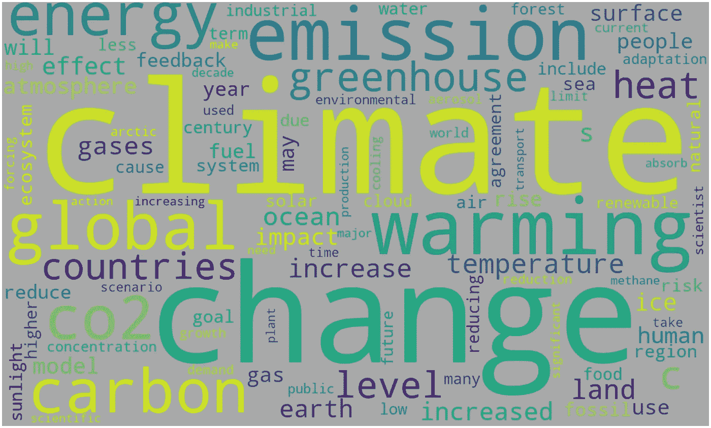

词云显示了出现在维基百科[气候变化](https://en.wikipedia.org/wiki/Climate_change)文章上最多的前 100 个词。图片由作者提供。

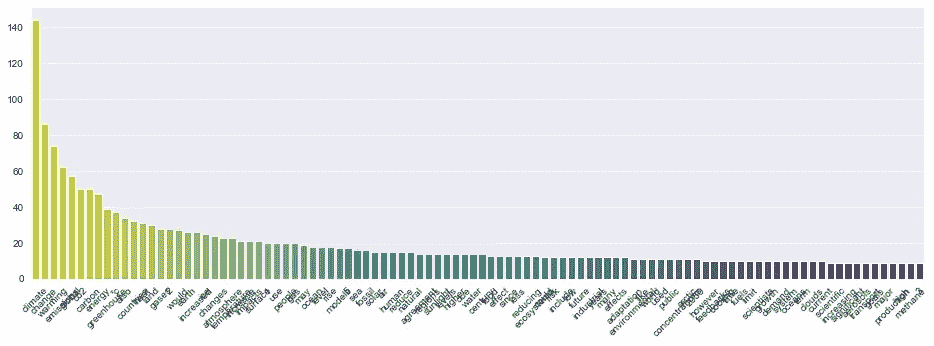

显示 100 个单词出现频率的条形图。图片由作者提供。

> 单词云能够处理许多单词，并有助于粗略比较频率。

然而，云这个词有一些缺点。当处理太多单词时，很难判断哪个单词比其他单词出现得更频繁。此外，文档通常由节组成，如段落或章节。Word Cloud 仅显示整个文档中单词的出现频率。它没有在每一部分提供细节。

本文将展示 4 个 Python 代码的可视化，它们可以处理 Word Cloud 的限制。

让我们开始吧…

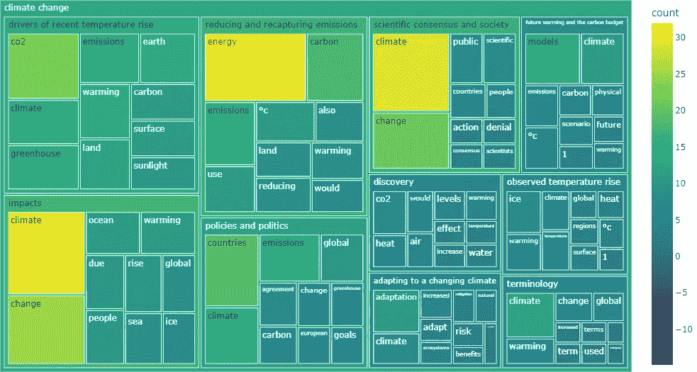

Treemap 是本文推荐的一个可视化示例，可以用来代替 Word Cloud。图片由作者提供。

## **获取数据**

例如，我将使用维基百科上的“[气候变化](https://en.wikipedia.org/wiki/Climate_change)”文章中的文字。环境问题现在是一个全球现象。我想看看我们能从这篇文章中得到什么信息——从导入库开始。

```
import numpy as np
import pandas as pd
import matplotlib.pyplot as plt
import seaborn as sns
import urllib
import re
import wikipediaimport nltk
from nltk.corpus import stopwords%matplotlib inline
```

继续下载并清理文本。

```
wiki = wikipedia.page('Climatechange')
text = wiki.content# Clean text
text_c = re.sub('[^A-Za-z0-9°]+', ' ', text)
text_c = text_c.replace('\n', '').lower()
text_c
```

为了与后面四次可视化的结果进行比较，让我们用获得的数据创建一个单词云。我遵循了这篇见解深刻的文章中有用且实用的步骤:[Python 中的简单单词云](/simple-wordcloud-in-python-2ae54a9f58e5)。


词云显示了出现在维基百科[气候变化](https://en.wikipedia.org/wiki/Climate_change)文章中最多的前 100 个词。图片由作者提供。

## **准备数据**

为了简化这个过程，我们将定义一个函数来创建一个数据帧。由于我们必须处理多个单词，使用颜色将有助于我们区分它们。我们还将定义另一个函数来获取一个颜色字典供以后使用。

对文本应用函数以获得数据帧

```
df_words = get_df(text_c)
df_words.head(10)
```

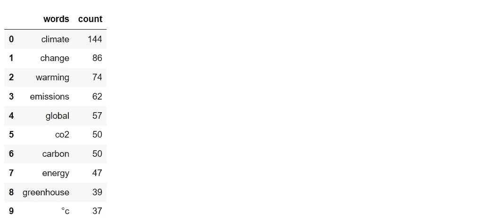

# **可视化**

有趣的部分来了。除了创建图表之外，还会推荐一些方法来改善结果。我们将要使用的四个可视化工具:

*   条形图网格
*   旭日图
*   树形图
*   圆形包装

## **1。将多个条形图转换为条形图网格。**

如前所述，由于文本区域较小，简单的条形图显示文本的能力有限。我们可以通过创建多个条形图并组合它们来重新排列它们，以节省空间。

瞧啊。！

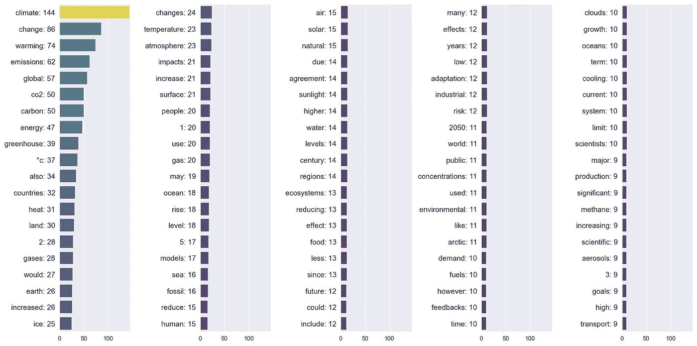

显示前 100 个单词的条形图网格。图片由作者提供。

## 通过比较主题来改进条形图的网格

文档通常由章节组成，如章节或段落。维基百科上的气候变化文章也由术语、观测到的温度上升等许多内容组成。比较这些部分之间的词频将有助于我们看到更多有见地的细节。

首先手动创建一个内容列表，然后使用列表元素分割文本。

接下来，清理文本并应用定义的函数从每个文本中获取 DataFrame。在下面的代码中，我将创建一个数据帧，其中包含每个数据帧中前 10 个最常用的单词。

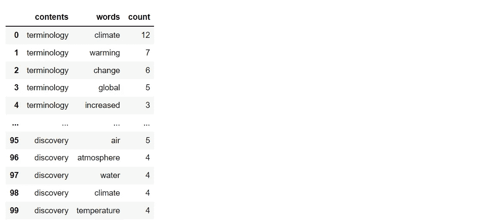

准备一个颜色字典和每个数据帧的列表。

现在一切都准备好了，让我们得到包含气候变化文章中每一个内容的前 10 个最常用词的条形图网格。

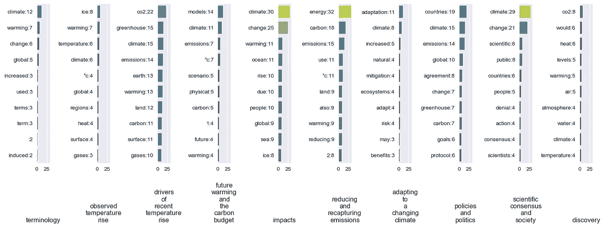

显示每个内容的前 10 个单词的条形图网格。图片由作者提供。

可以看出，纵观整篇文章，‘气候’是出现最多的词。然而，当文章按照内容划分时,“气候”一词并没有出现在减少和回收排放的内容中。原来‘能量’是这个内容中出现次数最多的词。

## 2.从圆环图到**旭日图**的层级增加

第二个可视化是旭日图。我们将从一个具有相同基本概念的环形图开始。下面的代码展示了用 [Plotly](https://plotly.com/python/pie-charts/) 创建圆环图的简单方法。

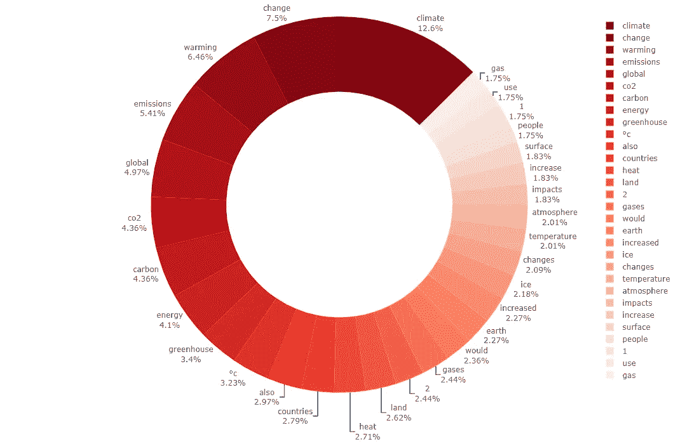

显示前 30 个单词的环形图。图片由作者提供。

结果甜甜圈图几乎满了，只有 30 个字。我们可以通过将图的层次从只有一层增加到两层来改进圆环图。第一层是内容，第二层是每个内容的前 10 个单词。继续准备数据。

接下来，创建一个应用于每个级别的颜色字典。

最后，绘制旭日图。使用 Plotly 的一个好处是获得的图表是交互式的。你可以通过点击内容来玩结果。关于创建旭日图的更多信息:[链接](https://plotly.com/python/sunburst-charts/)。

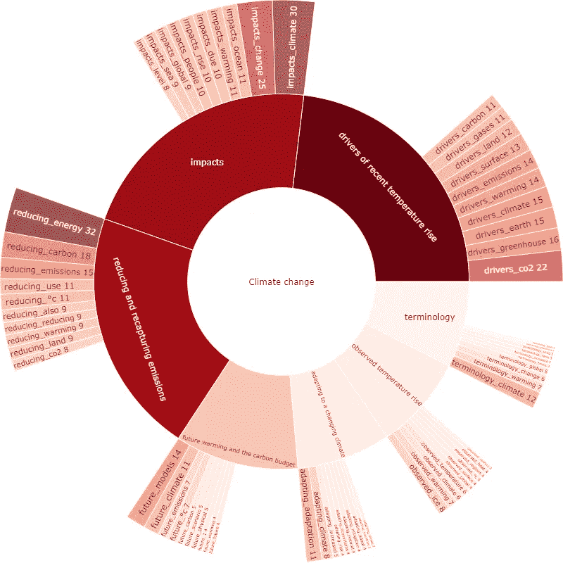

显示每个内容的前 10 个单词的旭日图。图形是交互式的；点击内容即可播放。图片由作者提供。

## 3.使用带有**树形图**的数字

Treemap 是一个很好的图形，它使用图形来可视化分层数据。到目前为止，我们已经有了绘制树状图的数据。我们可以直接使用下面的代码。从一个简单的包含前 100 个单词的树形图开始。

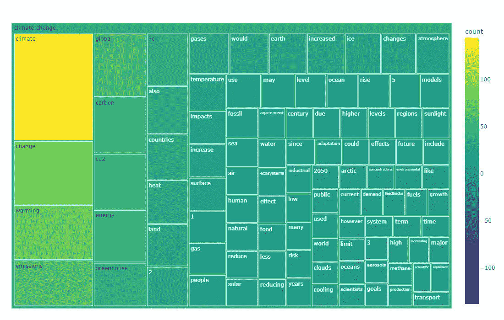

显示前 100 个单词的树形图。图片由作者提供。

## **改进树形图:增加层级**

让我们进一步创建一个带有层次结构的树形图。第一层是内容，第二层是每个内容的前 10 个单词。下面的结果是交互式的。你可以通过点击内容来玩这个图表。关于创建树形图的更多信息:[链接](https://plotly.com/python/treemaps/)。

显示每个内容的前 10 个单词的树形图。图形是交互式的；点击内容即可播放。图片由作者提供。

## 4.用**圆形包装将气泡分组。**

最后一个可视化是圈包装。实际上，这是一个没有重叠区域的气泡图。我们将使用 [circlify](https://pypi.org/project/circlify/) 库来计算气泡的大小和位置。

用文章中出现最多的前 30 个单词画圈包装。

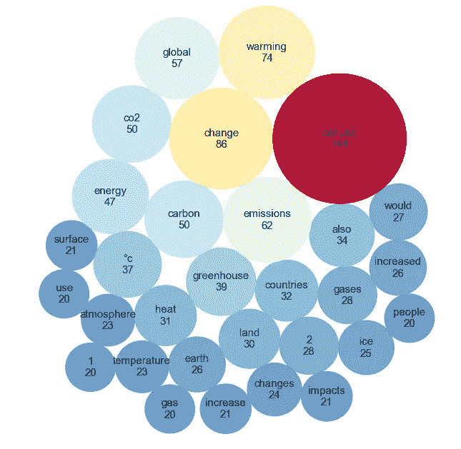

显示前 30 个单词的圆形包装。图片由作者提供。

## **改进圆形包装:聚类**

可以通过聚集每个内容的前 10 个单词来改进循环包装。为此，我们需要改变数据格式。使用 circlify 库进行计算所需的格式:“id”、“datum”和“children”

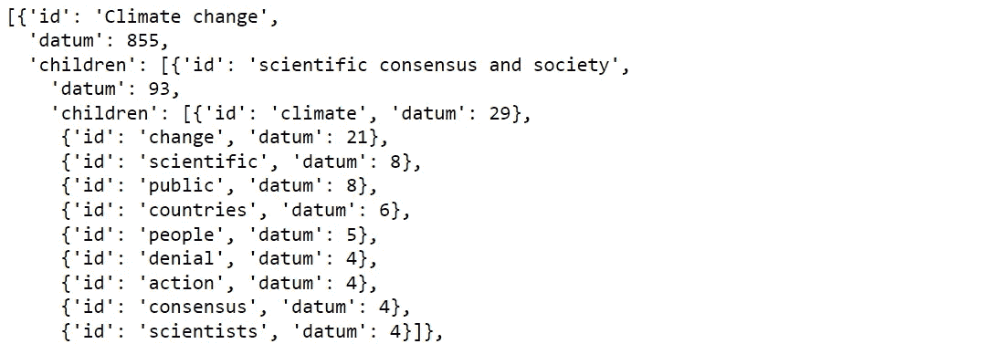

使用 circlify 库计算每个簇的气泡的大小和位置。

最后，绘制圆形包装。关于创建圆形包装的更多信息:[链接](https://www.python-graph-gallery.com/circular-packing-several-levels-of-hierarchy)

哒哒！！

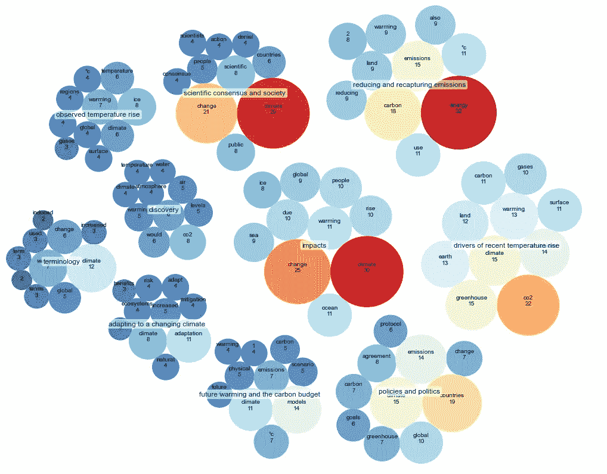

显示每个内容前 10 个单词的圆形包装。图片由作者提供。

## 摘要

单词云是另一种可视化技术，它有优点也有缺点。适合引起注意，可以显示很多字。然而，Word Cloud 似乎不是提供有见地信息的好选择。

本文展示了 4 种可以用来代替单词云的可视化方法。除了具有吸引力和能够处理许多单词之外，它们还能传递更多的信息。除了展示代码，本文还推荐了改进它们的方法。

我相信还有其他这里没有提到的图可以用来代替 Word Cloud。本文只是给出了一些实用的思路。如果您有任何问题或建议，请随时留下评论。

感谢阅读

以下是您可能会感兴趣的关于数据可视化的其他文章:

*   8 用 Python 处理多个时序数据的可视化([链接](/8-visualizations-with-python-to-handle-multiple-time-series-data-19b5b2e66dd0))
*   用 Python 实现的 9 种可视化比条形图更引人注目([链接](/9-visualizations-that-catch-more-attention-than-a-bar-chart-72d3aeb2e091)
*   9 用 Python 可视化显示比例，而不是饼状图([链接](https://medium.com/p/4e8d81617451/))
*   用 Python ( [链接](https://medium.com/p/87e8f1bb5fd2/))最大化聚类散点图

## 参考

*   维基媒体基金会。(2022 年 7 月 12 日)。*气候变化*。维基百科。检索于 2022 年 7 月 16 日，来自[https://en.wikipedia.org/wiki/Climate_change](https://en.wikipedia.org/wiki/Climate_change)
*   Luvsandorj，Z. (2021 年 10 月 10 日)。*Python 中的简单 word cloud*。中等。检索于 2022 年 7 月 16 日，来自[https://towardsdatascience . com/simple-word cloud-in-python-2 AE 54 a 9 f 58 e 5](/simple-wordcloud-in-python-2ae54a9f58e5)