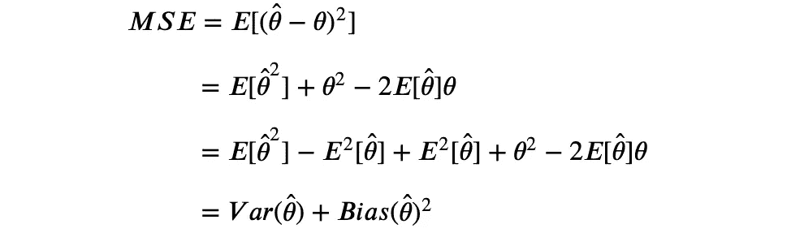
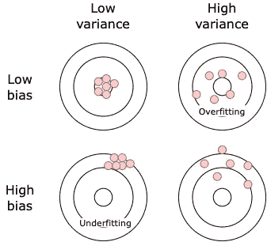
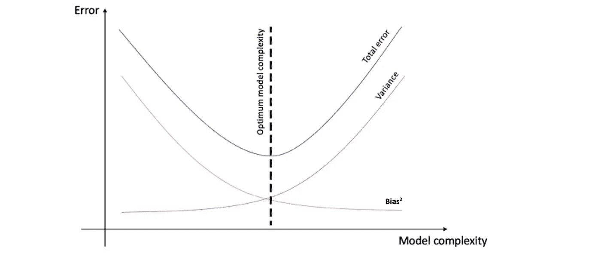
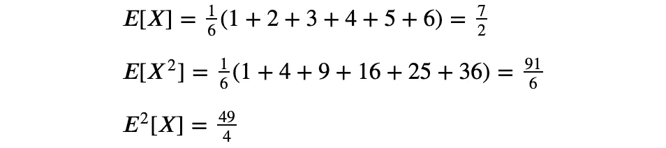
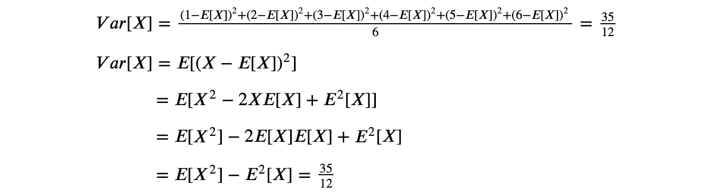

# 模型评估的偏差-方差分解

> 原文：<https://towardsdatascience.com/bias-and-variance-for-model-assessment-a2edb69d097f>

## 机器学习算法的偏差-方差分解及其在 Python 中的实际应用


照片由[卢卡斯](https://www.pexels.com/@goumbik)在[像素](https://www.pexels.com/photo/chart-close-up-data-desk-590022/)上拍摄

*偏差*和*方差*是机器学习模型评估中的两个关键概念，因为它们与模型在未知数据上的性能密切相关。偏差和方差都是预测误差的误差类型。第三种误差是不可约误差，这是数据中固有的误差，无论使用什么算法都无法减少。

数据科学家在实施新模型时面临的主要困难之一是所谓的*偏差-方差困境*或*偏差-方差问题*。这包括在监督学习算法中最小化两个误差源的冲突，可以用*偏差-方差分解*方法进行评估。

在整篇文章中，我们将浏览这些概念，并以本文的主要贡献结束，本文解释了偏差-方差分解，并为任何对实现模型分解感兴趣的人提供了一个 Python 实践示例。

# 偏差和方差

*偏差*被定义为模型预测和实际情况之间的差异。高偏差会导致算法错过特征和目标输出之间的相关关系(欠拟合)。

*方差*定义为对训练集中波动的敏感度。换句话说，就是指当训练数据发生变化时，结果的变化有多大。高方差表明随着训练数据集的变化，目标函数的估计值会有大的变化(过度拟合)。

用数学表示的两个术语都对应于以下公式:


这两项都可以很容易地从均方误差(MSE)公式中导出:



> 如何解释这些公式的例子显示在文章的结尾。

这是一个图表，包含高低偏差和高低方差的四种不同情况。考虑到我们收集的训练数据中的机会可变性，每个命中代表我们模型的一个单独实现[1]。目标的中心意味着模型完美地预测了这些值。



**图一。**偏差-方差。参考:图片由作者提供。

# 偏差-方差权衡

尽管最佳任务是尽可能使偏差和方差最小，但在实践中，两种误差之间存在明显的权衡。在这两个术语之间找到一个平衡点就是所谓的*偏差-方差权衡*。

对于机器学习模型，偏差和方差与模型的复杂性密切相关，然后与模型何时过度拟合或欠拟合训练数据相关联。如图 2 所示，当模型复杂性超过最佳点时，我们的模型会过度拟合训练数据，而如果模型复杂性不足，则模型会对数据拟合不足。



**图二**。偏差和方差随模型复杂性的变化。**参考号**:图片由作者提供。

在实际场景中，没有找到最佳点的分析方法，因此需要测试几个具有不同复杂性的模型，并选择一个使总体误差最小的模型。

# 偏差-方差分解

偏差-方差分解是理解算法性能的一种有用方法。

这种方法背后的主要思想是当用不同的训练集训练相同的模型并在相同的测试集上测试它时，测量偏差和方差。

为了实现这一点，用来对数据进行子采样的方法是*自举*(名字*打包*来源于*自举* + *合计*)。这种方法包括对数据进行随机采样和替换，这意味着训练数据的子集将重叠，因为我们不是分割数据，而是对其进行重采样。

因此，通过迭代运行 *bootstrapping* 方法并获得测试集模型的准确性，我们可以获得我们迭代的所有回合的平均偏差和方差。

下面是回归任务的部分代码，总结了该方法背后的主要逻辑。所有代码都是从 [MLxtend](https://github.com/rasbt/mlxtend) 库中获得的。

```
Input:
- X_train
- y_train
- X_test
- y_test
- num_rounds: Number of iterations
Output:
- avg_expected_loss: Average MSE loss for all the rounds
- avg_bias: Average bias for all the rounds
- avg_var: Average variance for all the rounds
(avg_expected_loss = avg_bias^2 + avg_var)(1) Iterate for *num_rounds*, in each implementing bootstrapping, training the model and getting the predictions
for i in range(num_rounds):
- X_boot, y_boot = _draw_bootstrap_sample(rng, X_train, y_train)
- pred = estimator.fit(X_boot, y_boot).predict(X_test)
- all_pred[i] = pred(2) Obtain the average MSE error
**avg_expected_loss** = np.apply_along_axis(lambda x: ((x — y_test)**2).mean(), axis=1, arr=all_pred).mean()(3) Obtain the average bias and variance
main_predictions = np.mean(all_pred, axis=0)
**avg_bias** = np.sum((main_predictions — y_test)**2) / y_test.size
**avg_var** = np.sum((main_predictions — all_pred)**2) / all_pred.size
```

最后，这里有一个 Python 实践示例，展示了如何实现偏差-方差分解。

作为展示，我们使用了免费提供的波士顿住房数据集[2]，其任务是使用回归变量预测房价。我们首先将数据分为训练集和测试集。

***例 1:决策树***

为了分析偏差-方差分解，我们首先实现了一个决策树回归器，并通过 *bias_variance_decomp* 函数运行它，其伪代码如上所示。

```
Average expected loss: 32.419
Average bias: 14.197
Average variance: 18.222
```

为了将这个输出与另一个模型进行比较，我们还使用决策树回归器运行了一个 bagging 集成方法。

```
Average expected loss: 18.693
Average bias: 15.292
Average variance: 3.402
```

与之前的结果相比，我们可以观察到偏差是如何增加的，这意味着 bagging 回归模型的表现比决策树模型差。然而，方差严重下降，这表明该模型与其预测更加一致。

***例 2:神经网络***

我们还评估了在 Keras 中实现的基于神经网络的模型的性能，因为据我们所知，这个功能不能在 PyTorch 中实现。

```
Average expected loss: 25.470
Average bias: 19.927
Average variance: 5.543
```

与第一个模型相比，我们通过增加每层的神经元数量来增加模型的复杂性。

```
Average expected loss: 23.458
Average bias: 17.608
Average variance: 5.850
```

正如预期的那样，偏差的减少是以增加模型的方差为代价的。

# 管理偏差和差异的方法

这里有一些技巧来管理偏差和方差误差。

首先也是最重要的，不要只关注偏差的最小化，或者换句话说，不要忘记方差。对于一个健壮的模型来说，这两者同样重要。

然后，通过(1)实施*增强*集成方法，或(2)添加更多特征或进行特征工程来增加复杂性，可以减少模型的偏差。

相反，方差可以通过(1)实施 *bagging* 集合方法，或者(2)通过正则化来约束或收缩估计的系数来减小。

有关如何使用集成方法管理偏差和方差的更多详细信息，我建议阅读文章 [*机器学习集成方法简介*](/introduction-to-ensemble-methods-in-machine-learning-e72c6b9ff4bc) 。

## 如何解释偏差和差异的详细说明

如果我们有下面的分布，


期望值和方差的计算如下:

*   期望值



*   差异



***如果你喜欢这篇文章，请考虑*** [***订阅***](https://javiferfer.medium.com/membership) ***。你将获得我所有的内容+所有其他来自牛逼创作者的文章！***

# 参考

[1] Scott Fortmann-Roe，[了解偏差-方差权衡](http://scott.fortmann-roe.com/docs/BiasVariance.html)

[2]Harrison d .和 Rubin feld d . l .，《享乐价格和对清洁空气的需求》，环境杂志。经济学与管理学，第 5 卷，81–102 页，1978 年。

[3]机器学习者，[Entiende de una vez quées El trade off Bias-Variance](https://www.themachinelearners.com/tradeoff-bias-variance/)

[4] GitHub，[函数 bias_variance_decomp.py](https://github.com/rasbt/mlxtend/blob/master/mlxtend/evaluate/bias_variance_decomp.py)

【5】栈交换，[𝐸(𝑋)从字面上是什么意思？](https://math.stackexchange.com/questions/2005675/what-is-ex2-mean-in-literal-terms)

[6]中等，[偏倚-方差权衡解释](https://medium.com/@pardeshi.vishwa25/bias-variance-tradeoff-explained-7f18ebbef020)

[7]机器学习掌握，[机器学习中偏差-方差权衡的温和介绍](https://machinelearningmastery.com/gentle-introduction-to-the-bias-variance-trade-off-in-machine-learning/)

[8] GitHub，[用 python 实现机器学习误差偏差-方差和不可约误差](https://github.com/christianversloot/machine-learning-articles/blob/main/machine-learning-error-bias-variance-and-irreducible-error-with-python.md)

[9] GitHub，[分类和回归损失的偏差-方差分解](http://rasbt.github.io/mlxtend/user_guide/evaluate/bias_variance_decomp/)

[10]天才博客，[什么是偏差-方差权衡？](https://kindsonthegenius.com/blog/bias-variance-trade-off-in-classificationmachine-learning/)