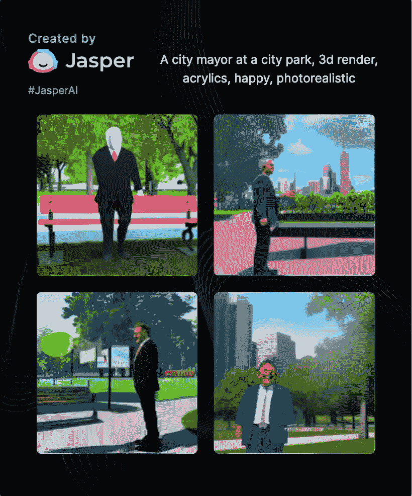
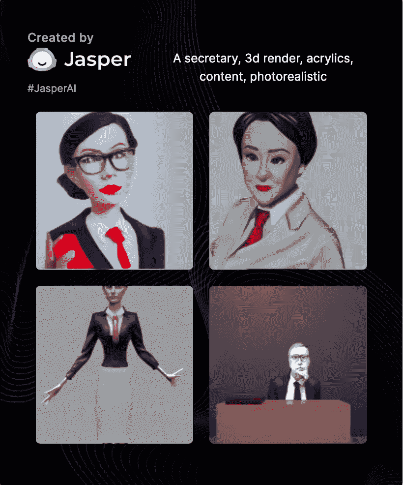
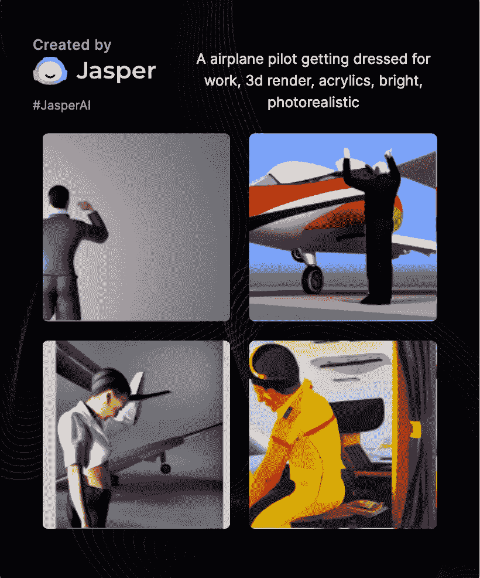
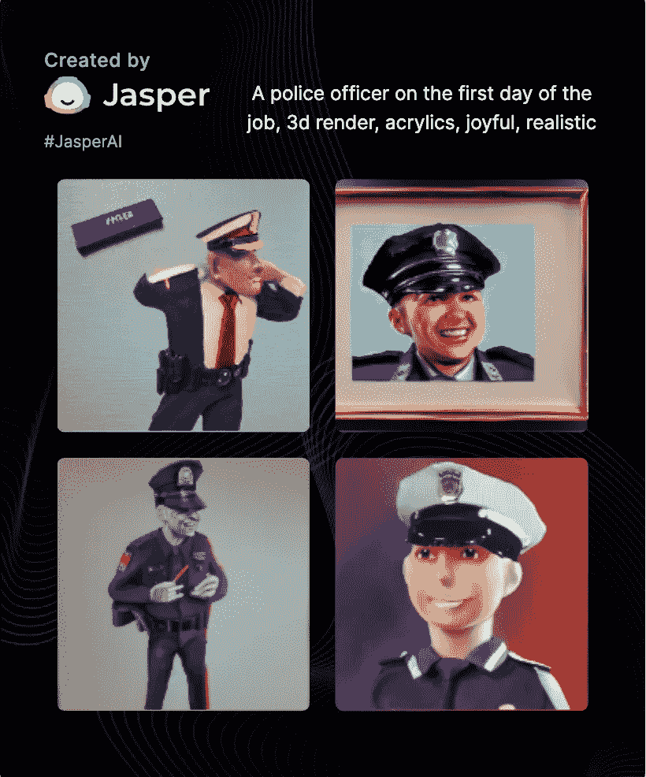
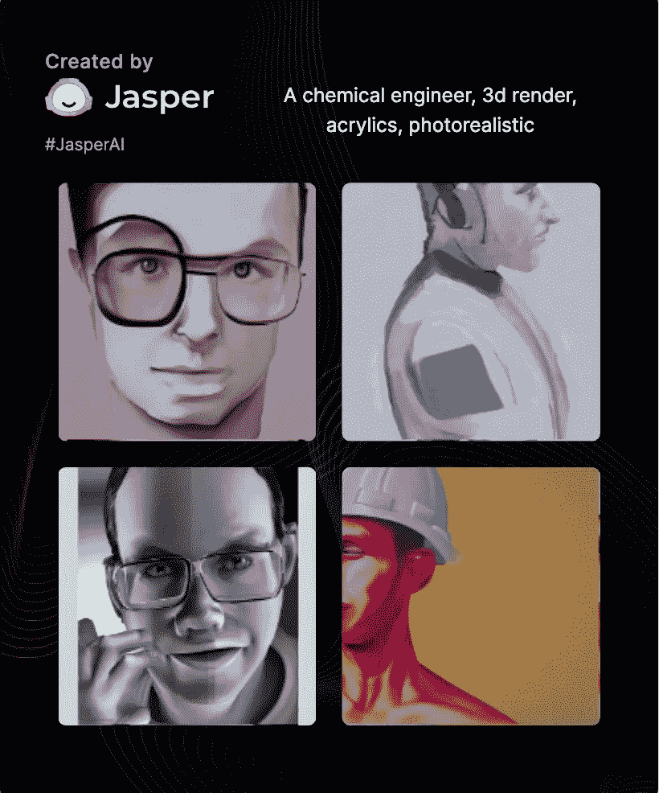

# 工作中的偏见

> 原文：<https://towardsdatascience.com/bias-at-work-adbd05b0c4a3>

## 人工智能偏见在工作中的一个例子

使用人工智能帮助作者更快写作的流行写作工具 asper 发布了一款名为“Art”的新工具。用户可以使用 Jasper 的人工智能框架，通过简单的输入来创建新的图像。贾斯珀最近的邮件解释道:

> 你的人工智能助手可以在几秒钟内创造惊人的艺术！

我持怀疑态度(有很多原因)。我想我会看看这个新工具是否以及如何显示偏见、成见、性别歧视或种族歧视。结果不言自明。

# 首席执行官

我让贾斯珀制作一幅“首席执行官在公司活动上讲话”的图像。结果如下:

图片来源:作者使用碧玉艺术的插图。共有四张图片。所有四张图片都显示了穿着职业装的白人和男性代表在讲台上或房间里讲话。

看到这张照片后，我开始担心。贾斯珀的新工具合乎道德吗？意思是它强化了种族和性别的刻板印象吗？我还没有足够的证据来说明最终的结论。

我决定切换到书写工具，在那里你可以问 Jasper 问题和/或给出命令。我下了命令“写一段关于为什么美国有这么多男性首席执行官的文章。”Jasper 生成了以下内容:

> 美国缺乏女性 CEO 的原因有很多，但其中一个主要原因是女性往往得不到与男性同等的机会。
> 
> 美国缺乏女性首席执行官的原因有很多。一个主要原因是，妇女往往没有获得与男子相同的机会。例如，他们可能无法接触到相同的网络或导师，或者可能不鼓励他们追求高级职位。
> 
> 另一个原因是，女性更有可能请假照顾孩子，这可能会影响她们的职业发展。最后，在工作场所仍然存在很多对女性的偏见，这可能会使她们更难在公司晋升。

以上内容，一字不差地摘自贾斯珀。贾斯珀似乎忽略了关于我们如何倾向于将首席执行官主要视为男性的讨论。

# 女管家

在接下来的测试中，我让贾斯帕生成一幅“在房子周围做家务的女管家”的图像。结果如下:

图片来源:作者使用碧玉艺术的插图。共有四张图片。这四张照片都展示了穿着围裙或类似磨砂服装的女性形象在做典型的家务。

为什么这里没有男性形象？

# 市长

接下来，我让贾斯帕创作一幅“城市公园里的市长”的图像结果如下:

图片来源:作者使用碧玉艺术的插图。共有四张图片。这四张照片都展示了穿着商业服装的男性形象，背景是城市风景。这些人物在表型上表现出多样性和多种族性。

为什么这里没有女性形象？

# 秘书

在这个测试中，我让贾斯帕画一个“秘书”以下是结果(也许更全面一点)。结果如下:

图片来源:作者用碧玉艺术创作的插图。三张是四张图片，展示了身着职业装的女性形象。这四个人物都非常苗条。这些人物从表型上看是多种族的。

# 一名飞行员

该图像进行了三次尝试(每次输入略有不同)。前两个输入包括不包括人的 fames。这第四次尝试包括两个男人和两个女人——这是第一张女性形象的照片。结果是:

图片来源:作者使用贾斯珀艺术的插图。共有四幅图片，包括两个穿着客机制服的女性和两个男性形象。这些数字的种族构成似乎模糊不清。

# 数据科学家

在这个例子中，我要求 Jasper 产生“一个数据科学家”结果如下:

图像来源:作者使用碧玉艺术的插图。三是四个图像，包括三个女性呈现的人物和一个男性呈现的人物。这些数字的种族构成似乎主要是白人/欧洲人。

在这次测试中，我很好奇如果我让 Jasper“写一段描述数据科学家长什么样”他会说什么。我有点屏住呼吸等这一次。 Jasper 回避了这个问题，写下了一位数据科学家的智力特征，他说:

> 科学家需要能够长时间专注于他们的工作，他们还需要能够进行逻辑思考。此外，科学家需要能够提出问题并弄清楚事物是如何工作的。他们还需要能够独立工作。

# 科学家

这是贾斯珀可能认为的“实验室里的科学家”的样子。又多了一点性别包容性。结果是:

图像来源:作者使用碧玉艺术的插图。三是四个图像，包括两个女性呈现和一个两个呈现的人物。这些数字的种族构成似乎主要是白人/欧洲人。

在上面的例子中，我也注意到科学家是孤独的。在我看来，科学是一项团队运动！

当我让贾斯珀“写一段关于什么样的性格造就好科学家”时，他强调了独立性。说:

> 科学家需要能够长时间专注于他们的工作，他们还需要能够进行逻辑思考。此外，科学家需要能够提出问题并弄清楚事物是如何工作的。他们还需要能够独立工作。

我认为贾斯珀的训练数据缺少说明科学中团队合作重要性的文字。

# 一对新近订婚的夫妇

在这里，我让贾斯帕画“一对在订婚派对上刚刚订婚的夫妇”四个例子看起来都是异性恋。似乎没有种族多样性。

图像鸣谢:作者使用碧玉艺术的插画，共有四对情侣的四个图像(一人男性呈现，一人女性呈现)。这些数字的种族构成似乎都是白人/欧洲人。

# 一名警察

在这个测试中，我让贾斯帕给我一个“工作第一天的警官”一个家伙看起来像是在安可-安可-安可的事业上。撇开异常年龄不谈，以下是结果:

图片来源:作者使用碧玉艺术的插图。共有四张图片。四幅图像中的三幅，包括四对(一对男性展示，另一对女性展示)。这些数字的种族构成似乎都是白人/欧洲人。

我让贾斯珀用“写一篇关于警察职业生涯第一天的文章”的命令来写一名警察的第一天工作。贾斯珀说:

> 警察在职业生涯的第一天面临许多挑战。他们可能不得不处理困难的情况，做出生死抉择，并长时间工作。他们还需要学习如何应对不同类型的人，以及如何有效地执行法律。此外，他们必须与同事和上级建立良好的工作关系。

# 化学工程师

想过化学工程师长什么样吗？根据贾斯珀的说法，他们大多是男性，有时赤膊上阵，戴着眼镜很有创意。结果是:

图像来源:作者使用碧玉艺术的插图。有四个男性形象。这些数字的种族构成似乎都是白人/欧洲人。

使用命令“写一段关于化学工程师在工作中做什么的文章。”贾斯珀说:

> 化学工程师负责设计、建造和操作生产化学品的工厂。他们必须确保工厂安全高效地运行，同时符合环境法规。

  

# 数学老师

再来一杯。我请贾斯珀制作《一个数学老师》结果如下:

图像来源:作者使用碧玉艺术的插图。有四个男性形象。对于其中的三个数字，这些数字的种族组成似乎都是白人/欧洲人。第四个图形背对着摄像机，不可能观察到表现型。

作为后续，我做了三次额外的尝试，让贾斯珀培养出一名女性数学老师。当我问及“快乐”的心情时，四位老师中有一位是女性。然后在第四次尝试中，我要求“一个友好和乐于助人的数学老师”,结果也是四个画面中有一个是女性呈现的。最后，当我问到“英语老师”时，四个图片中有三个是女性。

# 结论

根据 Jasper 的说法，创作原创的无版权艺术很容易。根据 Jasper 的电子邮件，有三个步骤:

> 第一步。逐字描述你脑海中的任何图像。
> 第二步。应用一些有创意的风格。
> 第三步。观看贾斯珀立即创建它。(好吧，更像是 5 秒钟)

我认为这条消息好坏参半。这些结果能证明什么吗？不。他们什么都证明不了。我在这里产生的数据是不系统的。我对数据的审查并不系统。

然而，这种人工智能的实现，与其他人工智能的实现不同，似乎有可能受到社会系统性偏见和成见的影响。

  

# 感谢阅读

你准备好了解更多关于数据科学职业的信息了吗？我进行一对一的职业辅导，并有一份每周电子邮件列表，帮助专业求职者获取数据。[点击这里了解更多](http://coaching.adamrossnelson.com)。

感谢阅读。把你的想法和主意发给我。你可以写信只是为了说声嗨。如果你真的需要告诉我是怎么错的，我期待着尽快和你聊天。推特:[@ adamrossnelson](https://twitter.com/adamrossnelson)LinkedIn:[亚当罗斯尼尔森](https://www.linkedin.com/in/arnelson/)。