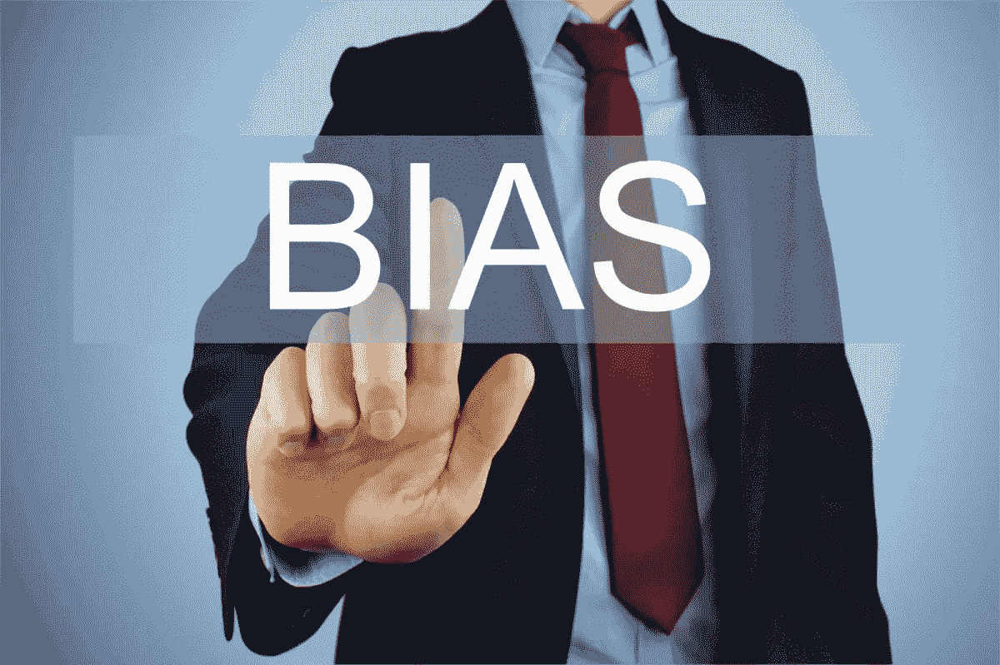
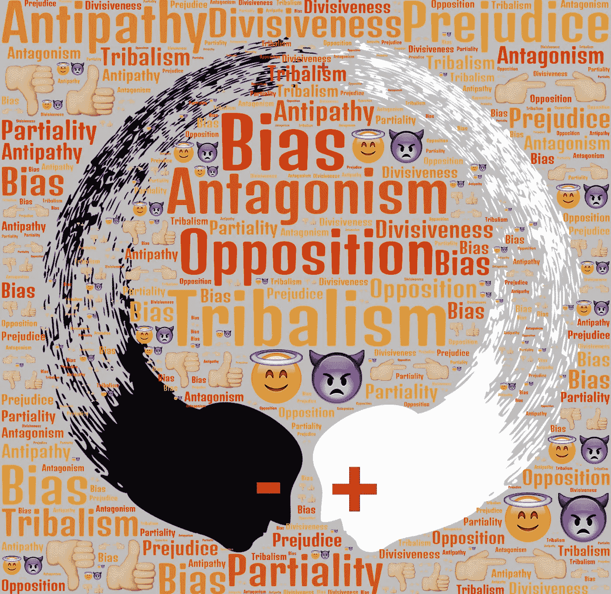
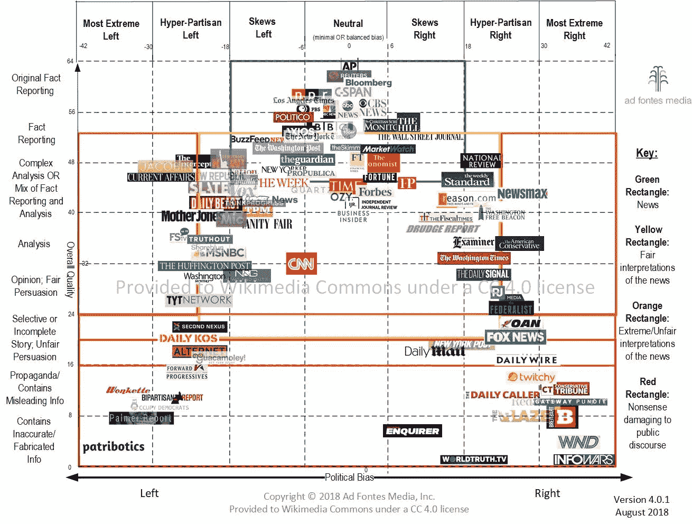

# 偏差——数据分析的致命弱点

> 原文：<https://towardsdatascience.com/bias-the-achilles-heel-of-data-analysis-29fc46e49c06>

## [理解数据背后的东西&人工智能](http://towardsdatascience.com/tagged/twg144)

## 面对数据偏差不可避免的后果

由[尼克·扬森](http://www.nyphotographic.com/)对 [Pix4free](http://pix4free.org/) 的偏见

# 介绍

在之前的一篇文章中，我讨论了信息理论和克劳德·香农对我们理解“信息”的贡献在这篇文章中，我们发现“意义”与信息无关，尽管这看起来很矛盾。这就是香农的天才之处，他假设信息是“噪音”和“惊喜”的确，意义会混淆分析信息的可能性。现在，我们必须解决信息收集、分类和分析中的一个主要缺陷。

# 偏见

数据分析在确定数据中的实际内容方面有着巨大的工作量。然而，对数据纯度的追求并没有就此结束。

处理实际数据中可能存在的偏差至关重要。在分析和人工智能领域，人们必须警惕两种重要的偏见。

# 数据中的偏差

在分析任何系统的数据，特别是人工智能系统的数据时，必须了解所述数据的来源。例如，将来自 90%男性健康统计数据的海量数据湖的医疗信息应用于大多数女性人口，可能会产生有缺陷的结果。类似地，根据中上层阶级个人的反应为政治民意调查创建全国平均值也会产生错误的结果。

> 所有数据集本质上都包含一定的偏差。这种偏差必须在分析和相应的人工智能中加以考虑。

# 评估或创建数据时的偏差

约翰·海因 T15 在[Pix4free](http://pix4free.org/)上的偏置

## 康威定律

数据分析最危险的一个方面可能会导致人工智能的灾难性结果，这就是控制组内部固有的偏见。

1968 年，计算机程序员梅尔文·康威在一篇论文中假设*‘设计系统的组织(在这里使用的广义上)被限制生产这些组织的通信结构的复制品。*

这个简短的陈述就是众所周知的康威定律，它解释了偏见是如何在系统中出现的。它今天仍然适用，因为它定义了人类行为。系统继承了创造者的偏见。他们模仿创造他们的人——如果有人愿意用“克隆”这个词的话。

在其他方面，艾米·韦伯在人工智能方面的研究集中在这种偏见上，因为这是正确人工智能实现的基础。正如她明智地指出的那样:*‘在没有有意义的解释的情况下，我们有什么证据证明偏见没有钻进来呢？在不知道这个问题的答案的情况下，怎么会有人放心地信任人工智能呢？*。

正如韦伯在她对哈佛商学院代码库分析的评估中指出的:

*“他们的一个重要发现是:设计选择源于他们团队的组织方式，在这些团队中，偏见和影响往往会被忽视。因此，一旦他们的工作——无论是梳子、水槽还是算法——被公众使用，团队中的个人组成的小型超级网络就会发挥巨大的力量……*

*因此，康威定律占上风，因为部落的价值观——他们的信仰、态度和行为以及他们隐藏的认知偏见——是如此根深蒂固。'⁴*

## 对照组偏倚

然而，偏见的问题并没有就此结束。偏差可能出现在实际使用的数据集中，因为数据最初是如何定义的。

*'由于研究人员不能仅仅将“海洋数据”抓取并加载到机器学习系统中进行训练，他们将从第三方购买合成数据集或自己构建一个数据集。“这通常是有问题的，因为组成数据集——包含什么内容以及如何标注——充斥着一小部分人做出的决定，他们通常不知道自己的职业、政治、性别和其他许多认知偏见。”⁵*

1956 年，达特茅斯学院举办了第一次专门讨论人工智能的会议。⁶“人工智能”这一术语被认为是约翰·mccarthy,⁷会议的领导者，也是该提案的原始作者之一。不幸的是，最初的小组是有根本缺陷的，充满了偏见。它没有有色人种，47 名杰出的参与者中只有一名女性——尽管有许多有色人种和女性专家。不带偏见地创建团队的答案很明显。

一个真正多元化的团队只有一个共同的主要特征:天赋。不会有任何单一性别、种族或民族的集中。不同的政治和宗教观点将被代表。⁸

然而，要实现无偏倚的数据，必须普遍应用‘天赋’法则，而这并不是一个现实的目标。

> 人性总会产生某种类型的偏见，无论一个人多么自诩自己不偏不倚，政治正确。偏见存在于人们所做的每一件事情中；这是一个人个人主义的表现。

让事情变得复杂的是，对一种文化和社会来说是偏见的东西对另一种文化和社会来说被认为是合理的、客观的和公平的。例如，即使在我们这个被认为是开明的现代世界，一个“同性恋”个人也可能不被允许加入任何代表团体。或者性别偏见可能是某个特定国家占主导地位的社会、文化和宗教的一部分。

举两个简单的例子:

1.  合法饮酒的年龄因地区而异。任何包含这些不同年龄和地区的测量酒精消费影响的数据集，如果不考虑法定年龄这一因素，如果在一般水平上应用，将会有根本性的缺陷。
2.  合法驾驶的年龄因地区而异。同样的问题存在于我们的第一个例子中。任何涉及新的、年轻的、十几岁的或十几岁以后的司机的事故数据集都必须考虑这个因素。

在上面给出的两个简单的例子中，很容易陷入先入为主的观念并产生错误的分析。

> 重要的是我们要记住“偏见”永远不会包含一个“一意孤行”的定义。

检测偏见在任何结构中是否明显取决于特定亚文化如何定义偏见以及该定义如何在系统中实施。偏见永远不会被根除，尽管从任何定义来看，它总是一个消极因素。

> 因此，数据分析必须考虑这种偏见，并建立无数的防御措施来对抗它。如果不这样做，将会导致错误的结果和灾难性的人工智能缺陷。

# 群体思维

凡妮莎·奥特罗 via [维基共享资源](https://creativecommons.org/licenses/by-sa/4.0)

如上所述，康威定律的一个衍生是一种被称为“群体思维”的心理现象

*“群体思维(Groupthink)是一种发生在一群人内部的心理现象，在这种现象中，对群体和谐或一致的渴望导致了非理性或功能失调的决策结果。一个群体中的凝聚力，或对凝聚力的渴望，可能会使其成员产生不惜一切代价达成一致的倾向。这使得团队能够最大限度地减少冲突，在没有批判性评估的情况下达成共识。”⁹*

在 2016 年克林顿-特朗普美国总统选举期间，群体思维抬头。在结果变得明朗之前，很少有人能够想象特朗普会获胜。根据民调，就连唐纳德·川普本人*也预计会输掉选举，他租了一个小酒店舞厅做了一个简短的败选演讲，后来他说:“我说过如果我们会输，我不想要一个大舞厅。”⁰*

然而，尽管充分意识到这种心理现象，它在整个美国和整个世界占主导地位。唐纳德·特朗普永远不会也不可能赢得选举。

在 2016 年美国总统大选前的几周和几个月，新闻媒体和民调机构几乎一致认为希拉里·克林顿极有可能当选。例如，11 月 7 日，选举前一天，《纽约时报》认为克林顿当时“在至少价值 270 张选举人票的州中拥有持续和明显的优势。”《纽约时报》估计克林顿获胜的可能性为 84%。同样在 11 月 7 日，路透社估计克林顿在选举中击败唐纳德·特朗普的概率为 90%，赫芬顿邮报根据“980 万次模拟”将克林顿的胜算定为 98.2%。

*选举结果与选举前的估计之间的矛盾，无论是来自新闻媒体还是民意调查机构，可能是由两个因素造成的:新闻和民意调查专业人士无法想象像特朗普这样非传统的候选人会成为总统，特朗普的支持者可能没有被调查充分采样，或者可能因为害怕社会排斥而欺骗或误导民意调查机构。*

数据出错有成百上千的原因。民意测验专家有偏见。报纸听信了他们的花言巧语。被调查的选民不想回答，因为害怕被嘲笑，或者出于对民意调查的蔑视，他们故意给出错误的答案。然而，偏见从一开始就很明显，没有人愿意面对它。

纵观历史，群体思维已经抬头。决策通常基于错误的数据分析或拒绝面对“真实数据”所描述的情况。在企业界，这往往会导致灾难性的后果，要么是数亿美元的损失，要么是公司被迫关闭。

在战争史上，群体思维的例子比比皆是。基于不准确的数据做出错误的假设，导致生命损失。911 后入侵伊拉克就是一个很好的例子。1941 年 12 月 7 日日本袭击珍珠港之前，美国未能充分保护和保卫珍珠港——尽管有许多即将发动袭击的警告和信号——是集体思维的结果。数据就在那里。军政领导分析了一下。这种偏见蔓延开来，因为人们认为日本人永远没有勇气攻击美国并迫使美国加入世界大战。

许多人认为，美国国家航空航天局“挑战者”号在起飞时爆炸的灾难是群体思维的一个例子。数据是可用的。美国宇航局意识到冰冻温度对航天飞机的不利影响。发出了警告。然而，当美国国家航空航天局的领导们在一起开会时，他们为挑战者号的起飞开了绿灯。

我们可以举出一个又一个康威定律和群体思维的例子。然而，有一点是清楚的。

> 人类的状况将永远包含偏见。偏见是人类的一部分。数据集将反映这种偏向。如果我们不创建正确的算法和对偏差的正确分析，我们将总是以有缺陷的分析而告终。

偏见的确是数据分析的致命弱点。

# 关于作者:

泰德·格罗斯是“假设-假设”的联合创始人兼首席执行官。Ted 担任 R&D 首席技术官兼副总裁多年，擅长数据库技术，专注于 NoSQL 系统、NodeJS、MongoDB、加密、人工智能、颠覆、混沌和复杂性理论以及奇点事件。他在虚拟世界技术领域有超过 15 年的专业经验，在增强现实领域有 6 年的经验。Ted 继续在专业学术期刊和脸书 [If-What-if Group](https://www.facebook.com/groups/ifwhatif/) 、 [Medium](https://medium.com/@tedwgross) 、 [Twitter](https://twitter.com/ifwhatif_tech) 和 [LinkedIn](https://www.linkedin.com/in/tedwgross) 上撰写许多关于技术主题的文章。你也可以在这里或在 [Substack](https://ifwhatif.substack.com/) 上注册[的免费时事通讯。](https://mailchi.mp/110a2d8c8e6a/ifwhatifnews)

# 参考资料:

1.康威，m . e .(1968)‘委员会如何发明？’，*数据化*，第 14 卷，第 5 卷，第 28–31 页。

2.维基百科(未注明)“康威定律”，可在 https://en.wikipedia.org/wiki/Conway's_law 查阅(2021 年 7 月 29 日查阅)。

3.韦伯(2019)[《九大巨头:科技巨头和他们的思维机器如何扭曲人性](https://www.amazon.com/Big-Nine-Thinking-Machines-Humanity-ebook/dp/B07H7RZLFW/ref=sr_1_1?crid=3R6DIRR1XI73E&amp;keywords=the+big+nine+amy+webb&amp;qid=1650257754&amp;s=digital-text&amp;sprefix=amy+webb+the+b%252Cdigital-text%252C215&amp;sr=1-1&_encoding=UTF8&tag=virgeartreale-20&linkCode=ur2&linkId=28220b0d52c00e84b82fc5b1c8df108c&camp=1789&creative=9325)》，纽约公共事务出版社，Kindle 版，位置 1763。

4.*同上*，地点 1666。

5.同上，地点 2763。

6.维基百科(未注明)‘人工智能’，可在:[https://en.wikipedia.org/w/index.php?获得 title =人工智能&oldid = 997705860](https://en.wikipedia.org/w/index.php?title=Artificial_intelligence&oldid=997705860)(2021 年 1 月 13 日访问)。

7.维基百科(未注明)‘约翰·麦卡锡(计算机科学家)’，可在:[https://en . Wikipedia . org/wiki/John _ McCarthy _(计算机科学家)](https://en.wikipedia.org/wiki/John_McCarthy_(computer_scientist))(2021 年 7 月 29 日访问)。

8.韦伯，参考。上面 3 个，位置 893。

9.维基百科(未注明日期)“集体思考”，可在 https://en.wikipedia.org/wiki/Groupthink(2022 年 4 月 18 日访问)获得。

10.维基百科(未注明日期)“2016 年美国总统选举”，可在:[https://en . Wikipedia . org/wiki/2016 _ United States _ presidential _ election](https://en.wikipedia.org/wiki/2016_United_States_presidential_election)(2022 年 4 月 18 日访问)。

11.维基百科(未注明)' Groupthink '，可在:[https://en . Wikipedia . org/wiki/group think # 2016 _ United _ States _ presidential _ election](https://en.wikipedia.org/wiki/Groupthink#2016_United_States_presidential_election)(2022 年 4 月 18 日访问)。

*为了与 Medium 的披露政策保持一致，上面列出的所有亚马逊图书链接都是假设分析的附属链接。