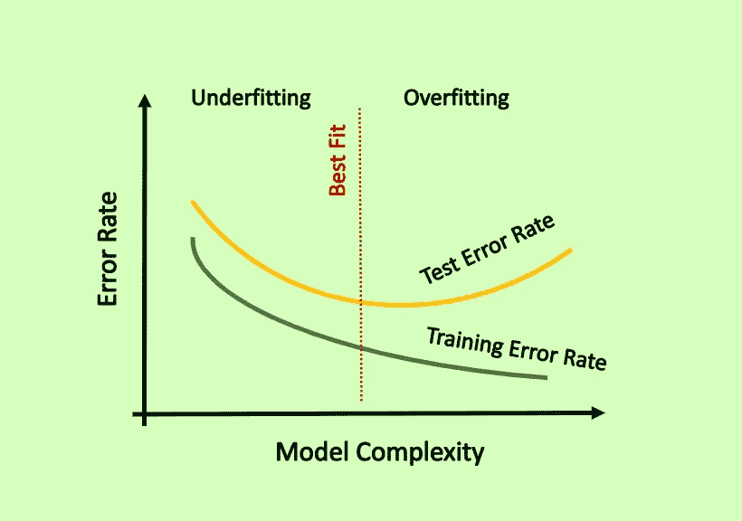
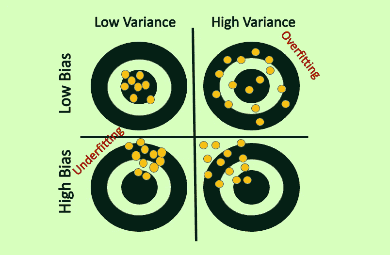
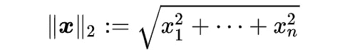
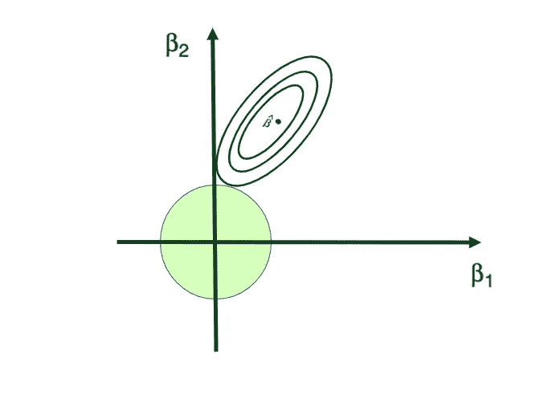
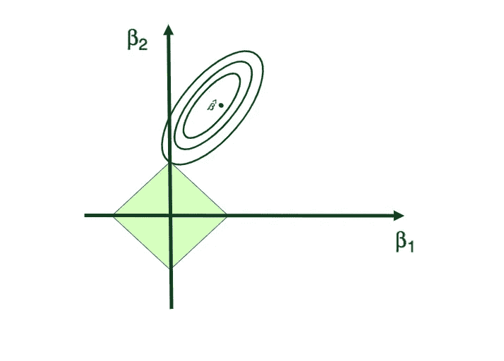
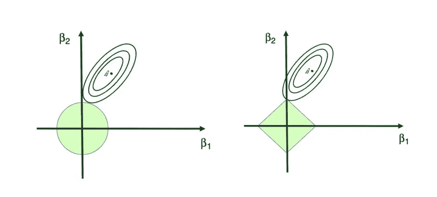

# 机器学习中的偏差-方差权衡、过拟合和正则化

> 原文：<https://towardsdatascience.com/bias-variance-trade-off-overfitting-regularization-in-machine-learning-d79c6d8f20b4>

## 偏差-方差权衡，过度拟合介绍&如何使用正则化解决过度拟合:岭和套索回归


图片来源: [Pixabay](https://www.pexels.com/photo/france-landmark-lights-night-2363/)

> “近似正确总比精确错误好”
> ― **沃伦·巴菲特**

检验是一个重要的问题，是每个数据科学家和机器学习工程师建模清单的重要组成部分。因此，如果你正在使用一个统计学、计量经济学或机器学习模型，无论你的 ML 模型有多简单，你都应该确保你的模型不会过度拟合。否则，你有机会在纸上得到一个好的模型，而实际上这个模型表现很差。在这篇博文中，我将涉及以下主题:

```
**- Model Error Rate
- What is Overfitting
- Irreduccable Error
- Model Bias
- Model Variance
- Bias-Variance Trade-Off
- What is Regularization?
- Ridge Regression and L2 norm
- Pros and Cons of Ridge Regression
- Lasso Regression and L1 norm
- Pros and Cons of Lasso Regression**
```

*如果你之前没有统计学知识，或者你想在跳到本文中的公式和其他统计学和 ML 概念之前刷新你在基本统计学概念方面的知识，你可以查看本文:* [***数据科学家和数据分析师的统计学基础***](/fundamentals-of-statistics-for-data-scientists-and-data-analysts-69d93a05aae7)

*注意，本文是我上一篇介绍偏差-方差权衡的文章的扩展版:* [***机器学习中的偏差-方差权衡***](https://medium.com/@tatev-aslanyan/bias-variance-trade-off-in-machine-learning-7f885355e847)

# 模型误差率

为了评估模型的性能，我们需要看看它产生的误差量。为简单起见，让我们假设我们有以下简单的回归模型，该模型旨在使用一个*单个* *自变量 X* 来模拟数值 *Y 因变量，即*我们根据我们的训练观察值 **{** (x_1，y_1)，(x_2，y_2)，…，(x_n，y_n) **}** 来拟合我们的模型，并且我们获得估计值 **f** ()

然后我们可以计算出 **f** ^(x_1， **f** ^(x_2),…， **f** ^(x_n).如果这些近似等于 y_1，y_2，…，y_n，那么训练错误率(例如 MSE)将会很小。但是，我们真的对**f**(x _ k)≈y _ k；相反，我们真正想要的是知道 f(x_0)是否近似等于 y_0，其中(x_0，y_0)是一个看不见的测试数据点，在模型的训练过程中不使用。我们希望选择一种测试错误率最低的方法，而不是训练错误率最低的方法。在数学上，该示例方法的模型误差率可以表示如下:


使用训练错误率来评估模型性能的基本问题是，不能保证具有最低训练错误率的方法也将具有最低测试错误率。粗略来说，问题是很多 ML 或统计方法专门估计模型系数或参数，以最小化训练错误率。对于这些方法，训练错误率可以相当小，但测试错误率往往大得多。

> 使用训练错误率来评估模型性能的基本问题是，不能保证具有最低训练错误率的方法也将具有最低测试错误率。我们希望选择一种测试错误率最低的方法，而不是训练错误率最低的方法。


图片来源:[伊莎贝拉·巴雷托](https://www.pexels.com/@isabella-barreto-1692353?utm_content=attributionCopyText&utm_medium=referral&utm_source=pexels)

# 什么是过度拟合？

术语过度拟合与模型的不良性能有关。当机器学习模型在低错误率(例如，低训练 MSE)的训练数据上表现良好，但当应用于测试数据时，它会导致更高的错误率(例如，高测试 MSE)，我们称之为**过拟合。**当相反的情况成立时，即 ML 模型未能密切跟踪数据并准确捕捉数据集特征和目标变量之间的关系，我们称之为**欠拟合**。

当机器学习模型过于紧密地跟踪训练数据，并考虑到数据中的噪声时，就会出现这种情况。因此，一旦数据发生变化，例如，使用了测试数据，那么模型就很难找到数据中特征之间的真实关系。



图片来源:作者

要理解过拟合的问题，你需要熟悉机器学习模型的**偏差-方差权衡、**知道什么是**不可约误差**、**偏差**和**方差**。此外，您需要知道模型错误率的构成。最后，您需要知道这些术语与模型灵活性和模型性能的关系。

解决过拟合问题你有两个选择:

*   选择另一个灵活性较低的模型(例如，众所周知灵活性较低的模型偏差较大，但方差较小)
*   调整模型，使其灵活性降低(**规则化**)

> 当机器学习模型过于紧密地跟随训练数据并考虑到数据中的噪声时，就会发生过拟合。


图片来源:[马蒂亚斯 P.R 雷丁](https://www.pexels.com/@matreding?utm_content=attributionCopyText&utm_medium=referral&utm_source=pexels)

# 不可约误差

作为对 y 的预测，yˇ的精度取决于两个量，我们可以称之为**可约误差** *和* **不可约误差**。一般来说，fˇ不会是对 f 的完美估计，这种不精确会引入一些误差。这种误差是可以减少的，因为我们可以通过使用最合适的机器学习模型来估计 f，从而有可能提高 f 的精度。然而，即使有可能找到一种模型来完美地估计 f，从而估计的响应采用 yˇ= f(x)的形式，我们的预测仍然会有一定的误差。这是因为 y 也是误差项ε的函数，根据定义，误差项ε不能用预测因子 x 来预测。


因此，与误差ε相关的可变性也会影响预测的准确性。这被称为*不可约误差*,因为无论我们对 f 的估计有多好，我们都无法减少ε引入的误差。因此，模型中不可约误差是误差项ε的方差，可表示如下:


> 与可约误差不同，不可约误差是一种由于系统中的随机性或自然可变性而产生的误差，我们无法通过选择更好的模型来避免或减少这种误差。


图片来源:[史威茨安娜](https://www.pexels.com/@shvets?utm_content=attributionCopyText&utm_medium=referral&utm_source=pexels)

# 机器学习模型的偏差

模型无法捕捉数据中的真实关系被称为*偏差*。因此，能够检测数据中真实关系的 ML 模型具有低偏差。通常，复杂的模型或更灵活的模型往往比简单的模型有更低的偏差。数学上，模型的偏差可以表示如下:


> 机器学习模型无法捕捉数据中的真实关系称为偏差。


图片来源:[马蒂亚斯 P.R 雷丁](https://www.pexels.com/photo/long-arched-passage-with-stucco-work-4489326/)

# 机器学习模型的方差

模型的方差是将模型应用于不同数据集时模型性能的不稳定性水平。当使用训练数据训练的同一个模型的表现完全不同于对测试数据的表现时，这意味着模型中存在很大的差异。复杂模型或更灵活的模型往往比简单模型具有更高的方差。


> 模型的方差是将模型应用于不同数据集时模型性能的不稳定性水平。


图片来源: [Max Avans](https://www.pexels.com/@maxavans?utm_content=attributionCopyText&utm_medium=referral&utm_source=pexels)

# 偏差-方差权衡

可以从数学上证明，对于给定值 x0，机器学习模型的预期测试错误率可以用模型的方差、模型的偏差和模型的不可约误差来描述。更具体地，监督机器学习模型中的误差等于模型的方差、平方偏差和模型的不可约误差之和。


因此，数学上，监督模型中的误差等于模型中偏差的平方、模型的方差和不可约误差。

因此，为了最小化预期的测试错误率，我们需要选择一种同时实现低方差和低偏差的机器学习方法。然而，模型的方差和偏差之间存在负相关关系。

复杂模型或更灵活的模型往往具有较低的偏差，但同时，这些模型往往比简单模型具有更高的方差。

让我们再次回到之前的图表:


图片来源:作者

一般来说，随着方法灵活性的增加，方差将增加，偏差将减少。这两个量的相对变化率决定了测试误差率会增加还是减少。

> 数学上，监督模型中的误差等于模型中偏差的平方、模型的方差和不可约误差。那就是:

当我们增加一类方法的灵活性时，偏倚最初的下降速度往往比方差的增加速度快。因此，预期的测试错误率下降。然而，在某些时候，增加灵活性对偏差影响很小，但开始显著增加方差。所以，这一切都是为了找到平衡，即最佳契合点，在这个点上，测试错误率将改变方向并向上移动。



图片来源:作者

基于偏差和方差关系，机器学习模型可以有 4 种可能的场景:

1.  **高偏差和高方差**(最坏的情况)
2.  **低偏差和低方差**(最好的情况)
3.  **低偏差高方差**(过拟合)
4.  **高偏置和低方差**(欠拟合)

> 复杂模型或更灵活的模型往往具有较低的偏差，但同时，这些模型往往比简单模型具有更高的方差。


图片来源: [Alex Zhernovyi](https://www.pexels.com/@alex-zhernovyi-2036204?utm_content=attributionCopyText&utm_medium=referral&utm_source=pexels)

# 什么是正规化？

正则化或收缩是解决过拟合问题的常用方法。正则化背后的想法是在机器学习模型中引入一点偏差，同时显著降低方差。之所以称之为收缩，是因为这种方法将一些估计的系数向零收缩，以惩罚它们增加了模型的方差。两种最流行的正则化技术是基于 **L2** 范数的**岭回归**和基于 **L1** 范数的**拉索回归**。

> 正则化背后的想法是在机器学习模型中引入一点偏差，同时显著降低方差。

# 里脊回归

让我们来看看用于因变量 y 建模的 p 个独立变量或预测值的多元线性回归示例。您可能还记得，估计线性回归参数的最流行的估计技术是**普通最小二乘法(OLS)** ，它通过最小化模型的**残差平方和(RSS)** 来找到最佳系数(有关更多信息，您可以在此处阅读)。那就是:


其中β代表不同变量或预测值(X)的系数估计值。

岭回归与 OLS 非常相似，只是系数是通过最小化稍微不同的成本或损失函数来估计的。也就是说，岭回归系数估计βR 值，使其最小化以下损失函数:


其中λ(λ，总是正的，≥ 0)是调谐参数或罚参数，从这个公式可以看出，在脊的情况下，使用 **L2 罚或 L2 范数**。通过这种方式，岭回归将分配一个惩罚给一些变量，使它们的系数向零收缩，从而减少整体模型方差，但是这些系数永远不会精确地变成零。因此，模型参数永远不会精确设置为 0，这意味着模型的所有 p 个预测值仍然保持不变。

## L2 范数(欧几里德距离)

L2 范数是一个来自线性代数的数学术语，它代表欧几里得范数，可以表示如下:



## 调谐参数λ

调整参数λ用于控制惩罚对回归系数估计的相对影响。当λ = 0 时，罚项不起作用，岭回归将产生普通的最小二乘估计。然而，当λ → ∞(变得非常大)时，收缩惩罚的影响增大，并且岭回归系数估计接近 0。



图片来源:作者

## 岭回归为什么有效？

岭回归相对于普通最小二乘法的优势来自于早先引入的偏差-方差权衡现象。随着惩罚参数λ的增加，岭回归拟合的灵活性降低，导致方差减少但偏差增加。

## 赞成的意见

*   解决过度拟合
*   容易理解

**缺点**

*   如果 p 较大，模型可解释性较低

> 岭回归将分配一个惩罚(λ)给一些变量，使它们的系数向零收缩，但它们永远不会精确地变成零。


图片来源:[阿什利·丰塔纳](https://www.pexels.com/@ashleyelena?utm_content=attributionCopyText&utm_medium=referral&utm_source=pexels)

# 套索回归

岭回归的一个最大缺点是它会在最终模型中包含所有的 p 预测值。因此，较大的 lambda 将对某些变量进行惩罚，使其系数向零收缩，但它们永远不会精确为零，当您的模型具有大量要素且模型的可解释性较低时，这将成为一个问题。

套索回归克服了岭回归的这个缺点。也就是说，Lasso 回归系数估计值βˇλL 是使以下各项最小化的值:


与岭回归一样，Lasso 将系数估计值收缩到零。然而，在套索的情况下，使用了 **L1 罚函数或 L1 范数**，其效果是当调谐参数λ非常大时，迫使一些系数估计值恰好等于零。因此，像许多特征选择技术一样，套索回归除了解决过度拟合问题之外，还执行变量选择。



图片来源:作者

## L1 范数(曼哈顿距离)

L1 范数是一个来自线性代数的数学术语，它代表曼哈顿范数，可以表示如下:


## 套索回归为什么行得通？

像岭回归一样，Lasso 回归相对于普通最小二乘法的优势来自于早期引入的偏差-方差权衡。随着λ的增加，岭回归拟合的灵活性降低，导致方差减少但偏差增加。此外，Lasso 还执行特征选择。

## 赞成的意见

*   解决过度拟合
*   容易理解
*   提高模型的可解释性

**缺点**

*   与岭回归相比，减少模型的方差较少

> Lasso 回归将系数估计值向零收缩，甚至在调谐参数λ非常大时迫使这些系数中的一些恰好等于零。因此，像许多特征选择技术一样，套索回归除了解决过度拟合问题之外，还执行变量选择。

当把前面两张图放在一起时，岭回归和套索回归之间的比较就变得很清楚了。



图片来源:作者

# 如果你喜欢这篇文章，这里有一些你可能喜欢的其他文章:

[](/how-to-crack-spotify-data-science-technical-screen-interview-23f0f7205928)  [](/fundamentals-of-statistics-for-data-scientists-and-data-analysts-69d93a05aae7)  [](/simple-and-complet-guide-to-a-b-testing-c34154d0ce5a)  [](/monte-carlo-simulation-and-variants-with-python-43e3e7c59e1f)  [](https://tatev-aslanyan.medium.com/bias-variance-trade-off-in-machine-learning-7f885355e847)  [](https://tatev-aslanyan.medium.com/data-sampling-methods-in-python-a4400628ea1b)  [](https://medium.com/analytics-vidhya/pyspark-cheat-sheet-big-data-analytics-161a8e1f6185)  

***感谢阅读***

*我鼓励你* [***加入 Medium***](https://tatev-aslanyan.medium.com/membership)**以拥有* *完整访问所有跨媒体发布的伟大锁定内容，并在我的 feed 上发布关于各种数据科学、机器学习和人工智能主题的内容。**

**关注我* [***中***](https://medium.com/@tatev-aslanyan)**阅读更多关于各种数据科学和数据分析主题的文章。更多机器学习的动手应用，数学和统计概念查看我的*[***Github***](https://github.com/TatevKaren)**账号。
我欢迎反馈，可以联系*[***LinkedIn***](https://www.linkedin.com/in/tatev-karen-aslanyan/)*。****

*****快乐学习！*****