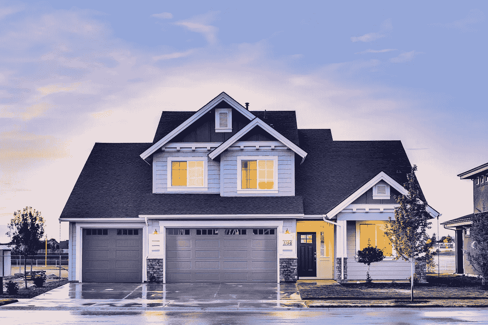
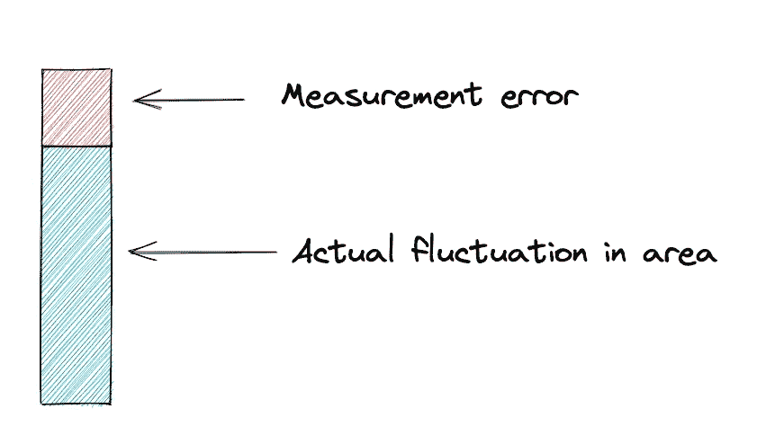
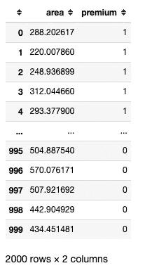
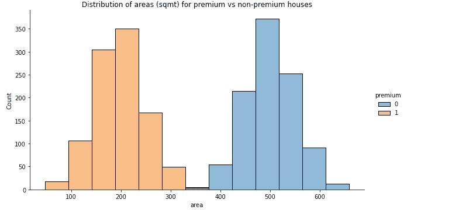
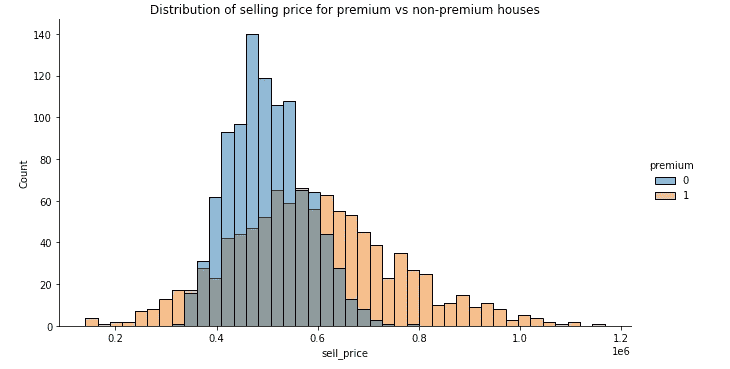
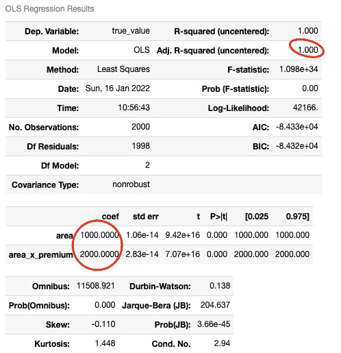
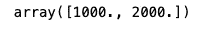
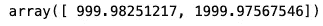
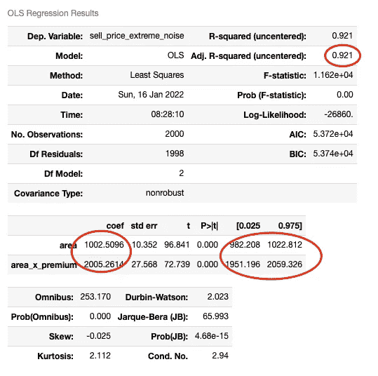
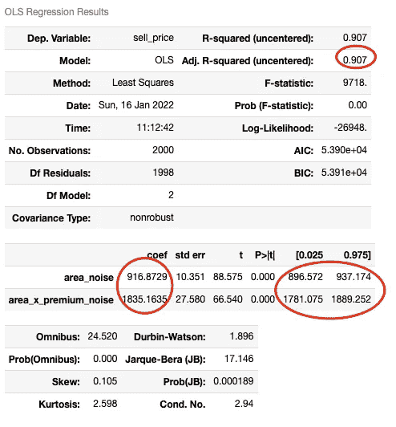

# 有偏模型系数—(第一部分)

> 原文：<https://towardsdatascience.com/biased-model-coefficients-part-1-2722128b9e1c>

## 衰减偏差/回归稀释使您的系数偏向 0


图片由[施旭刚](https://pixabay.com/users/shixugang-640931/)

**TL；DR** —当 X 变量中存在显著噪声或测量误差时，模型系数会低估变量的影响，即如果系数为正(负)，真实影响甚至会更大。

## 关于这个系列

假设您是一名数据科学家，在一家从事房地产业务的公司(代理、开发商等)工作。)有人问你:

> "每增加一平方米，房价会上涨多少？"



图片由[派克斯](https://pixabay.com/users/pexels-2286921/)提供

这个由多个部分组成的系列致力于展示，如果没有对传统统计学的扎实理解，得到错误的答案是多么容易。

## 衰减偏差/回归稀释

衰减偏差，也称为回归稀释，是由独立(X)变量中的测量误差或噪声引起的模型系数偏差。你的模型系数变得偏向 0。

例如，假设您有一个回归模型，显示面积每增加一平方米，价格就会增加 2000 美元。如果您的面积要素有很多测量误差或噪声，面积的真实影响甚至更大…也许价格实际上增加了 2500 美元。

反之亦然。例如，如果你的模型显示负系数为-2000，那么真实的系数会更小，比如说-2500。**系数偏向 0** 。

请注意，如果您的因变量(y)有噪声或测量误差，这种偏差不会发生…它只会受到 X 变量中的噪声或误差的影响。

为什么会出现这种偏差？



作者图片

假设面积每**实际**增加 1 平方米，价格就上涨 2000 美元。

当我们对具有带有测量误差的报告“面积”列的数据运行回归模型时，该“面积”列表示实际面积+噪声。

报告的“面积”栏中的波动部分是由于 a)面积的实际波动和 b)噪音。

a)的系数应为 2000，因为实际面积每增加 1 平方米，价格就会增加 2000 美元，而 b)的系数应为 0，因为噪音或测量误差对房价没有影响。该报告的“面积”栏的系数最终介于 0 和 2000 之间，分别是 a)和 b)的系数。

我们将避免可以在网上找到的详细公式，我们将跳转到 python 中的一个例子…

## 数据准备

> 1-我们住在一个有 2000 栋房子的城镇里。
> 
> 2-镇上有 2 个区，一个高级/昂贵区和另一个非高级/普通区。
> 
> 3-高档区的房屋平均面积较小(平均 200 平方米)。普通区的房屋平均面积为 500 平方米。数据中的房屋面积是从正态分布中提取的。
> 
> 4-房屋的真实价值= 3000 美元 x 面积(平方米),适用于高级住宅区的房屋。真实价值= 1000 美元 x 非优质区面积。
> 
> 5-房子在市场上出售，价格=真实价值+/- 20%。+/- 20%的偏差只是噪音。

让我们基于上述假设创建一个包含 2000 所房屋的数据集…

```
import numpy as np
import scipy.stats as ssnp.random.seed(seed=0)areas_premium = ss.norm(200, 50).rvs(1000)
areas_non_premium = ss.norm(500, 50).rvs(1000)
```

从上面创建一个包含区域和“溢价”列的数据框架…

“溢价”栏是一个虚拟/二元变量，表示房子是否在溢价区。

```
df_premium, df_non_premium = pd.DataFrame(), pd.DataFrame()df_premium['area'] = areas_premium
df_premium['premium'] = 1df_non_premium['area'] = areas_non_premium
df_non_premium['premium'] = 0df = pd.concat([df_premium, df_non_premium])
df
```



作者图片

现在，让我们想象一下区域的分布情况…

```
import matplotlib.pyplot as plt
import seaborn as snssns.displot(df, x='area', hue='premium', height=5, aspect=16/9)plt.title('Distribution of areas (sqmt) for premium vs non-premium houses')plt.show()
```



作者图片

我们可以看到高级住宅通常较小。

现在，由于房子的真实价值= 3000 美元 x 高档房的面积或 1000 美元 x 非高档房的面积，我们可以将真实价值的公式改写如下:

> 真实价值=(1000 美元 x 面积)+(2000 美元 x 面积 x 溢价)
> 
> 其中 premium 是一个二进制数，表示该房屋是否位于高级位置

记住，房子是以真实价值+/- 20%(随机)出售的。

最后，我们将“真实价值”和“销售价格”添加到我们的数据框架中，并可视化销售价格的分布…

```
df['true_value'] = (df['area'] * (1000 + (2000 * df['premium'])))# Add selling price = true value x noise
# Noise is a random value between 80% and 120%
np.random.seed(seed=0)
df['sell_price'] = df['true_value'] * (
    np.random.randint(low=80, high=121, size=2000) / 100)# Visualize distributions of selling price
sns.displot(df, x='sell_price', hue='premium', height=5, aspect=16/9)plt.title('Distribution of selling price for premium vs non-premium houses')plt.show()
```



作者图片

我们可以看到，高级住宅的售价范围更广。

## 检查线性回归的系数

请注意，由于我们的目标是确定面积和销售价格之间的直接关系，就可解释性和影响测量而言，线性回归是最合适的选择。

我们将使用 statsmodel 库，它为线性回归模型生成一个很好的输出，但是结果也可以使用 sklearn 的 linear regression 实现来重现。**衰减偏差影响其他机器学习模型，无论是线性还是非线性**。与 OLS 回归相比，线性模型(如随机梯度下降回归器(SGDRegressor ))将显示几乎相同的效果，而衰减偏差的影响对于非线性和基于树的模型更加微妙，这些模型通常需要其他解释库，如 SHAP 或莱姆。

使用 statsmodel 运行 OLS 线性回归，将“真实值”作为我们的因变量(y ),将“面积 X 溢价”作为我们的自变量(X)。

```
df['area_x_premium'] = df['area'] * df['premium']# Statsmodel implementation
import statsmodel.api as smy = df['true_value']
X = df[['area', 'area_x_premium']]model = sm.OLS(y, X)
results = model.fit().summary()
results
```



作者图片

请注意，这些系数是按照我们的预期(1000 和 2000)正确估计的。R2 是 100%，这意味着使用我们的两个变量“面积”和“面积 x 溢价”可以 100%准确地预测“真实价值”。

我们使用 sklearn 的 LinearRegression 实现得到相同的系数，使用 SGDRegressor 得到几乎相同的系数。

```
model = LinearRegression()
model.fit(X, y)
model.coef_
```



作者图片

```
model = SGDRegressor(alpha=0, random_state=0, eta0=1e-5)
model.fit(X, y)
model.coef_
```



作者图片

现在，让我们检查一下，如果我们将 sell_price 而不是 true_value 设置为 y 变量，回归结果(使用 statsmodel)会是什么样子…

```
y = df['sell_price']model = sm.OLS(y, X)
results = model.fit().summary()
results
```


作者图片

现在，are 模型的准确率下降到 98.6%，因为 sell_price 包含了一些噪声，房屋的售价可能比其真实价值高出或低于 20%。

估计的系数~1000 和~1995 非常接近我们预期的 1000 和 2000。p 值为 0，表示系数的重要性。最后，我们可以看到这些系数(992–1009)和(1973–2016)的预期范围，因此我们的预期系数 1000 和 2000 落在这些范围内。

如果我们的 y 变量(sell_price)中有很多测量误差/噪声，系数应该仍然是无偏的，接近 1000 和 2000，但是额外的噪声会降低我们模型的预测能力，因此 R2 会下降，2 个系数的范围会更宽。

让我们试着这样做…

```
# Increase noise on target variable to +/- 50% of true value
np.random.seed(seed=0)
df['sell_price_extreme_noise'] = df['true_value'] * (
    np.random.randint(low=50, high=151, size=2000) / 100)y = df['sell_price_extreme_noise']model = sm.OLS(y, X)
results = model.fit().summary()
results
```



作者图片

R2 下降到 92.1%，但我们的系数仍然接近 1000 和 2000。正如所料，系数的范围更大。例如，对于第一个自变量(面积)，新的范围是 982–1023，而上次运行的范围是 992–1009。

现在，假设测量误差在我们的独立变量中，这样我们数据集中的面积列与实际面积相差+/- 50%。这就是我们偏见产生的原因…

```
# We'll make area noisy such that it has +/- 50% error
np.random.seed(seed=0)
df['area_noise'] = df['area'] * (
    np.random.randint(low=50, high=151, size=2000) / 100)df['area_x_premium_noise'] = df['area_noise'] * df['premium']y = df['sell_price']
X = df[['area_noise', 'area_x_premium_noise']]model = sm.OLS(y, X)
results = model.fit().summary()
results
```



作者图片

R2 下降到 90.7%，但最重要的是，**我们的系数现在低估了面积的影响！**我们现在看到的系数是~917 和~1835。真实的预期系数(1000 和 2000)也超出了报告的范围(897-937 和 1781-1889)。这就是衰减偏差。

**结束语**

如果我们的目标是预测房价，那么低估面积真实影响的估计系数很可能是**预测建模的最佳系数……你不需要做任何调整**。

由于所报告的面积不准确且有噪声，因此，与我们有真实面积测量值的情况相比，OLS 回归或机器学习模型对这种有噪声的面积测量值给予较小的权重是最佳的。不需要做任何事情来提高模型的预测精度。

**问题在于解释系数**。当我们被问到

> "每增加一平方米，房价会上涨多少？"

如果我们考虑了正确的变量，并且我们知道它们包含高测量误差，那么我们必须记住，我们获得的系数低估了由于面积增加**实际** 1 平方公吨而导致的价格上涨。

您可以使用 [**相关性衰减**](https://en.wikipedia.org/wiki/Regression_dilution#Correlation_correction) 或其他类似技术来估计“真实系数”。