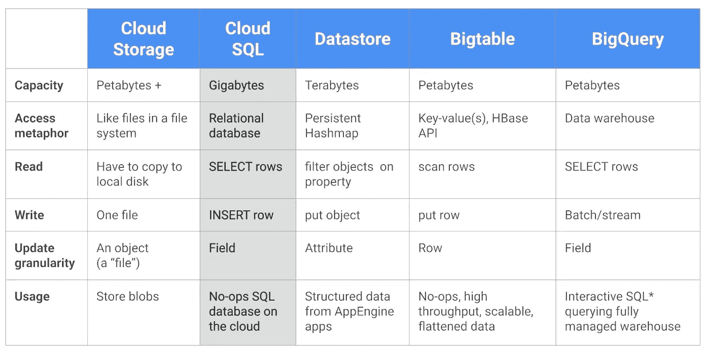
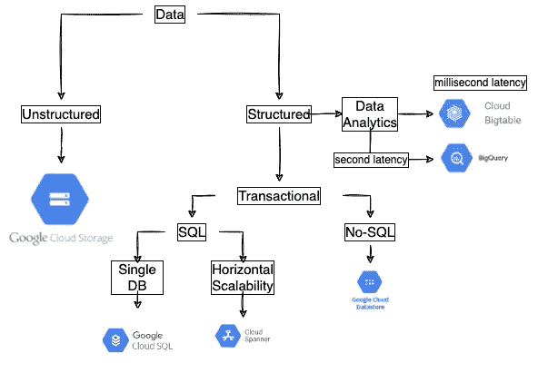

# 谷歌云平台中的大数据基础

> 原文：<https://towardsdatascience.com/big-data-fundamentals-in-google-cloud-platform-3a2bcafa267>

## 云计算|大数据|技术

## 第 2 部分——通往谷歌云专业数据工程师之路

Pawel Czerwinski 在 [Unsplash](https://unsplash.com?utm_source=medium&utm_medium=referral) 上的照片

欢迎来到 GCP 专业数据工程师认证系列的第二部分。在第一部分，我们介绍了谷歌的云平台及其层次结构。您可以在这里找到第 1 部分:

</part-1-road-to-google-cloud-professional-data-engineer-introduction-to-the-google-cloud-7abbd3411f3a>  

在这一部分，我们将讨论大数据技术和机器学习方面的服务和 GCP 的产品。

## 使用云 SQL 和 Spark 的产品推荐

产品推荐可能是现代企业最常见的 ML 应用之一。

这个用例的想法是将现有的推荐系统从内部迁移到云中。

当迁移到云时，我们将从专用存储迁移到集群外云存储。

ML 任务的核心部分是数据、模型和基础设施，用于训练和向用户提供预测。

作为一个用例，让我们选择开发出租房屋推荐系统的任务。

说到基础设施，首先，我们需要决定我们希望多长时间发布一次预测。

**所以第一个决定是，我们的 ML 应用程序应该处理流数据还是批处理？**

在我们的用例中，我们不需要不断地向用户推荐房屋，而是可以每天预加载结果，并在用户在线时提供给他们。因此，在这种情况下，批处理就可以了。

另一方面，根据我们拥有的房屋和用户的数量，我们还需要考虑计算资源。当我们处理大型数据集时，我们需要以容错的方式执行这种处理。这意味着，理想情况下，我们在一组机器上运行我们的过程，而不是在一台机器上。

容错分布式进程框架的一个例子是 Apache Hadoop。该过程将类似于:

*   *每一天，每一个用户，根据他们以前的评分预测每个房子的分数/评分*
*   *存储这些预测评级*
*   *用户登录后，查询前 N 名结果(基于预测分数)并显示给用户*

因此，我们需要一种事务方式来存储预测。它需要是事务性的，这样我们就可以在用户阅读时更新表格。

GCP 提供多种交易解决方案。当然，考虑到不同的需求，我们必须使用不同的服务。下面，我们总结了一些 GCP 服务的属性。

谷歌服务及其访问模式。谷歌云平台

GCP 存储流程图。图片作者。

对于我们的示例用例，云 SQL 是最好的服务。

云 SQL 是一个完全托管的 RDBMS。使用静态 IP，我们还可以从任何地方连接到我们的云 SQL 实例。

我们还需要一个管理数据处理管道的服务。

我们需要一种服务来处理我们的数据批次和数据流，并训练机器学习模型。

这种软件的一个很好的例子是 Apache Spark 和它的机器学习包(Apache SparkML)。查看我的另一个博客，在创纪录的时间内运行 Spark 作业，而不需要任何基础设施开销。

</running-a-spark-job-in-less-than-10-minutes-with-no-infrastructure-fe79f1c41780>  

你喜欢这篇文章吗？如果是，请考虑订阅我的电子邮件列表，以便在我发布新内容时得到通知。

<https://david-farrugia.medium.com/subscribe>  

**此外，考虑成为会员，使用我下面的推荐链接来支持我和你在 Medium 上喜欢的其他作家。每月 5 美元，你就可以无限制地阅读 Medium 上的每一篇文章。**

<https://david-farrugia.medium.com/membership>  

**想给我买杯咖啡吗？**

<https://paypal.me/itsdavidfarrugia?country.x=MT&locale.x=en_US>  

# 想联系吗？

我很想听听你对这个话题的想法，或者其他什么。如果你想联系我，请发邮件到 davidfarrugia53@gmail.com*给我。*

[Linkedin](https://www.linkedin.com/in/david-farrugia/)——[Twitter](https://twitter.com/davidfarrugia53)