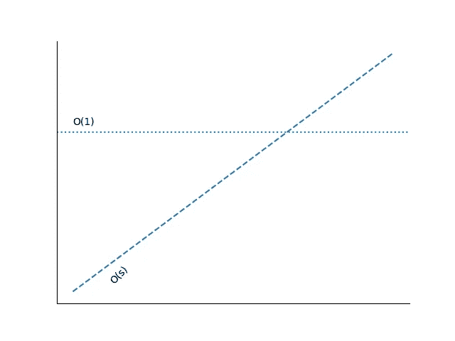

# 大 O 符号

> 原文：<https://towardsdatascience.com/big-o-notation-32fb458e5260>

## 用 Big-O 符号计算算法的时间和空间复杂度


约翰尼斯·格罗尔在 [Unsplash](https://unsplash.com/s/photos/algorithm?utm_source=unsplash&utm_medium=referral&utm_content=creditCopyText) 上的照片

## 介绍

当开发算法时，我们通常关注它的有效性——换句话说，它是否能做它应该做的工作。然而，时间和空间复杂度是必须评估的两个非常重要的因素，以确保该算法可以在实践中实现和使用。

即使一个算法在理论上是可行的，但是如果运行它所花费的时间使它变得无用，会发生什么呢？或者它需要的空间大到电脑可能内存不足怎么办？

在今天的文章中，我们将在渐近算法分析的背景下讨论时间和空间复杂性。我们将探索大 O 符号，这是用来描述算法效率的最常用的度量。

此外，我们还将讨论大 O，大 Theta 和大 Omega 符号之间的区别。最后，我们还将通过几个实际操作的例子来演示如何在实践中计算时间和空间复杂度。

请注意，这些示例将使用 Python——即使您不了解 Python，我也很确定它会比您想象的更容易理解。为了帮助没有 Python 背景的人，我保证会添加尽可能多的评论:)

## 渐近时间复杂性

在数学分析中，**渐近分析**是一种用来描述当输入接近某个其他值时，函数所逼近的值(即极限)的方法。作为一个例子，让我们考虑我们想要研究一个函数 ***f(n)*** 在数 n 变得非常大时的行为。

如果***f(n)=n⁴+4n+10***并且数字 *n* 非常大，那么术语 ***4n*** 与术语*相比将无足轻重，而 ***n*** 对常数 **10** 没有影响。因此，当 *n* 趋于无穷大时，函数 ***f(n)*** 被称为**渐近等价于 *n⁴*** 。*

*现在在算法的上下文中，执行**渐近分析**，以便**根据输入大小**描述或评估算法的性能。换句话说，当输入大小也增加时，我们使用渐近分析来确定时间和空间的增加。*

*作为一个例子，让我们考虑你想要传送一个数据文件给一个朋友，他住在离你当前位置 3 小时路程的城市。现在让我们假设实际上有两种方式发送它；第一种是电子转账，第二种是旅行 3 个小时，用 u 盘(物理)交给她。如果您决定以电子方式发送文件，传输时间将受到文件大小的影响。文件越大，传输给朋友所需的时间就越长。另一方面，如果您决定前往您朋友的位置并将其移交，传输时间将为 3 小时，与文件的大小无关，因此文件大小不会影响传输时间。*

*下图说明了这种行为— *O(s)* 对应于以电子方式传输文件的时间复杂度。随着文件大小 ***s*** 的增加，完成传输所需的时间也增加(在这个例子中，这种增加是线性的)。另一方面， *O(1)* 对应于物理传送文件的情况下的时间复杂度，因此时间复杂度是恒定的。*

**

*时间(和空间)复杂性的渐近分析—来源:作者([源代码复制它](https://gist.github.com/gmyrianthous/27106b51253ccea7985215a7a9252793))*

## *大 O vs 大 Theta vs 大 Omega*

*大 O 符号用于描述算法复杂度的一个**上限**。假设我们有一个 N 个整数的列表(或数组)。如果我们想打印出列表中的每个元素，时间复杂度是 O(N)。虽然从理论上讲，这个用例的时间复杂度也可以描述为 O(N)或 O(N)或任何其他大于 O(N)的值，因为这些是上限。*

*这可能有点令人困惑，所以让我们考虑一个现实生活中的例子。我们来做一个假设，没有一辆车可以超过 400 km/h 的速度，如果我们有一辆车的最大速度是 X，那么我们当然可以说 X ≤ 400。虽然从理论上讲，我们也可以说 X≤1000 或 X≤10000。从技术上讲，这是正确的，因为我们使用上限，即使进一步扩展上限并不十分有用。*

*然而，除了大 O 之外，还有两种替代符号，即大ω(*ω*)和大θ(*θ*)。*

***大ω**用来形容**下界**。回到我们打印所有列表元素的例子，下限将是*ω(N)*，因为我们知道它不会比这个更快。同样，我们也可以说下限是*ω(1)*或*ω(logN)*，因为打印一个包含 N 个元素的列表不会比这些下限更快。*

***大θ**用于描述**紧界**。这意味着如果一个算法同时是 *O(N)* 和*ω(N)*，那么这个算法可以描述为*θ(N)*。我们可以说打印一个有 N 个元素的数组是*θ(N)*。*

*一般来说，我们通常使用大 O 符号来描述算法的时间和空间复杂性，同时总是试图定义尽可能紧密的运行时，给定特定算法和/或用例的细节。*

## *最佳情况对最差情况对预期情况*

*各种算法都包含某种形式的随机性，这可能会影响算法的性能。也有一些算法在排序的数组上运行得更快，但是当数组的元素没有排序时运行得更慢。*

*因此，**实际上有三种不同的方式来描述算法的运行时间**；最好的情况，预期的情况和最坏的情况。当我们评估算法的性能时，应该计算**最坏情况的复杂度**。*

*请注意，这些概念不应与我们之前讨论的大θ和大ω相混淆。下限和上限与最佳、最差和预期情况无关。*

## *空间复杂性*

*除了时间复杂度之外，另一个需要评估的重要方面是空间复杂度，即算法执行所需的内存量。随着计算机能力的不断发展，空间复杂性通常会被程序员忽略。然而，考虑到正在处理的数据也在不断发展，以消耗尽可能少的内存的方式设计和实现算法是非常重要的。*

*进入空间复杂度的实际计算，如果我们要创建一个 N 个整数的一维数组，那么就需要 *O(n)* 空间。同样，一个大小为 *n* x *n* 的二维数组需要 O(n)个空间。这里还必须提到，除了数据结构中元素占用的空间之外，在递归调用中分配给堆栈的空间也应该考虑在内。*

## *用大 O 符号计算空间复杂度*

*作为一个例子，让我们考虑下面的递归函数，它用于计算 0 和`n`之间的数字之和:*

```
*def sum_func(n: int):
    """ 
    Recursive method that returns the sum 
    of the numbers between 0 and input n
    """
    if n > 0:
        return sum_func(n - 1) + n return 0*
```

*尽管函数的输入只是一个整数，但每次递归调用都会在调用堆栈中增加一个级别。举个例子，*

```
*sum_func(5)
    adds call sum_func(4) to stack
        adds call sum_func(3) to stack
            adds call sum_func(2) to stack
                adds call sum_func(1) to stack
                    adds call  sum_func(0) to stack*
```

*实际上，添加到调用堆栈中的每个调用都会消耗实际内存，因此在计算空间复杂度时，应该始终将它们考虑在内。因此，函数`sum_func`将需要 O(n)时间和 O(n)空间。*

*拥有 *n 个*调用，并不一定意味着一个算法需要 *O(n)* 空间。现在让我们修改一下我们之前使用的递归方法，这样 0 和输入数`n`之间的和的计算是以迭代的方式进行的。*

```
*def sum_func(n: int):
    """ 
    Iterative method that returns the sum 
    of the numbers between 0 and input n
    """
    sum = 0
    for i in range(n+1):
        sum = sum_nums(sum, i)
    return sum def sum_nums(a: int, b:int):
    """
    Returns the sum of two numbers
    """
    return a + b*
```

*上述函数将花费 O(n)时间和 O(1)空间。换句话说，执行功能`sum_func`所需的内存是恒定的。*

## *用大 O 符号计算时间复杂度*

*现在回到时间复杂性，重要的是要强调大 O 符号与所讨论算法的实际执行时间并不对应的事实。例如，O(n)的算法实际上可能比 O(1)的算法更快。因此，我们可以说**大 O 用于描述相对于输入大小**的增长率。*

*这就是我们在计算时间复杂度时，并不真正关注常数的主要原因。在最开始，我们讨论了数学背景下的渐近分析。*

> *如果 ***f (n) = n⁴ + 4n + 10*** 并且数字 *n* 非常大，那么术语 ***4n*** 与术语*相比将无足轻重，而 ***n*** 对常数 **10** 没有影响。因此，当 *n* 趋于无穷大时，函数 ***f(n)*** 被称为**渐近等价于 *n⁴*** 。**

**类似地，在算法渐近分析**中，我们丢弃任何常量值以及无关紧要的项**。**

**作为一个例子，让我们考虑一个算法的两个版本，它从一个输入列表中计算最小和最大数字。注意，可能有更好的方法来执行相同的操作，但是这个例子的目的是演示一些与 Big-O 符号相关的概念。**

```
**def get_min_max(lst):
    """
    Returns the minimum and maximum 
    numbers from the input list as a 
    tuple in the form (min, max)
    """
    _min = lst[0]
    _max = lst[0] for n in lst[1:]:
        if n > _max:
            _max = n
        if n < _min:
            _min = n return _min, _max**
```

**因为我们有一个遍历输入列表元素的 for 循环，所以上面函数的时间复杂度可以用 *O(n)* 来描述。**

**现在让我们修改这个方法，使最小和最大数量的计算发生在单独的循环中。**

```
**def get_min_max(lst):
    """
    Returns the minimum and maximum 
    numbers from the input list as a 
    tuple in the form (min, max)
    """
    _min = lst[0]
    _max = lst[0] for n in lst[1:]:
        if n > _max:
            _max = n for n in lst[1:]:
        if n < _min:
            _min = n return _min, _max**
```

**现在我们有两个独立的(虽然不是嵌套的！)for 循环，每个循环的执行时间为 O(n)。有人可能会争辩说，这被翻译成 O(n + n)，因此 O(2n)。回想一下，当用 Big-O 符号描述时间复杂性时，我们必须消除任何常量和/或无关紧要的项。因此，我们的示例算法的第二个版本的复杂度仍然是 O(n ),因为我们只对增长率感兴趣。**

**让我们考虑另一个例子，其中一个函数接受一个输入列表，并打印出原始元素和平方元素(我再次警告您，有更好的方法来实现这一点，所以请不要太关注逻辑)。**

```
**def print_squares(lst):
    for a in lst: 
        print(a) for a in lst:
        for b in lst:
            print(a * b)**
```

**所以我们有一个 for 循环，它简单地遍历输入列表的元素，并打印出每一个元素，然后我们有两个嵌套循环。**

**前一个表达式需要 O(n)时间，后一个表达式由于两个嵌套循环需要 O(n)时间。同样，有人会认为时间复杂度是 O(n + n ),但鉴于我们只对增长率感兴趣，我们必须去掉任何无关紧要的项，因此我们最终的时间复杂度是 O(n)。**

## **增长率**

**下面列出了大多数时候用来描述算法的时间和空间复杂性的标准增长率。**

*   **对数: *O(log n)***
*   **线性: *O(n)***
*   **线性算法: *O(n log n)***
*   **二次: *O(n )***
*   **指数: *O(c^n)* 其中 *c* 是固定值，而 *c > 1***
*   **阶乘: *O(n！)***

## **最后的想法**

**在今天的文章中，我们讨论了在开发算法时评估时间和空间复杂度的重要性。这可以通过渐近分析来实现，这可以帮助我们使用大 O 符号来描述性能。**

**此外，我们讨论了带有大ω和大θ的大 O 符号之间的区别，以及在描述算法复杂性时最好、最坏和预期情况的含义。为了演示如何计算时间和空间复杂度，我们还使用了一些示例算法。最后，我们快速浏览了一下最常用的增长率，当涉及到算法的计算空间和时间复杂度时，这些增长率通常涵盖了大多数情况。**

**算法中的渐近分析是一个基本且非常重要的话题，每个写代码的人都必须知道。通过理解某些决策如何影响时间和空间复杂性，您最终可以提高代码的质量和性能。此外，如果你想搞定你的下一次面试，那么这是一个你必须仔细修改的话题。有可能你会被要求开发一个算法，而时间和空间复杂度是你在开发时需要考虑的概念。即使您无法实现给定问题的最佳解决方案，您至少应该知道您的解决方案如何执行，以及如何修改它以达到最佳的复杂性时间。**

**[**成为会员**](https://gmyrianthous.medium.com/membership) **阅读介质上的每一个故事。你的会员费直接支持我和你看的其他作家。你也可以在媒体上看到所有的故事。****

**[](https://gmyrianthous.medium.com/membership) [## 通过我的推荐链接加入 Medium-Giorgos Myrianthous

### 作为一个媒体会员，你的会员费的一部分会给你阅读的作家，你可以完全接触到每一个故事…

gmyrianthous.medium.com](https://gmyrianthous.medium.com/membership)** 

****相关文章你可能也喜欢****

**[](/python-linked-lists-c3622205da81) [## 如何在 Python 中实现链表

### 探索如何使用 Python 从头开始编写链表和节点对象

towardsdatascience.com](/python-linked-lists-c3622205da81)** **[](/multithreading-multiprocessing-python-180d0975ab29) [## Python 中的多线程和多处理

### 深入探讨 Python 中的多线程和多处理，以及它们与并发性和

towardsdatascience.com](/multithreading-multiprocessing-python-180d0975ab29)** **[](/augmented-assignments-python-caa4990811a0) [## Python 中的扩充赋值

### 了解增强赋值表达式在 Python 中的工作方式，以及为什么在使用它们时要小心…

towardsdatascience.com](/augmented-assignments-python-caa4990811a0)**