# 通过使用数组和结构在 BigQuery 中节省时间和金钱

> 原文：<https://towardsdatascience.com/bigquery-efficiency-how-i-reduced-my-table-size-by-35-5-and-rows-by-93-1-dc8b9b7276ff>

## 学会接受和理解嵌套模式。


在 [Unsplash](https://unsplash.com?utm_source=medium&utm_medium=referral) 上由[Towfiqu barb huya](https://unsplash.com/@towfiqu999999?utm_source=medium&utm_medium=referral)拍摄的照片

尽管数组和结构会增加查询的复杂性，但是一旦理解了它们的工作原理，就可以获得嵌套数据结构的好处。

为了让你了解这种改变有多大的好处，下面展示了我通过将一个 Google Clouds 公共数据集从典型的非规范化格式转换为嵌套格式而获得的节省。

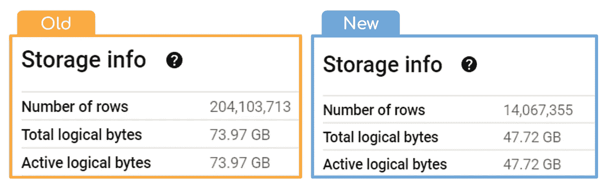

我已经能够将行数减少 93.1%，将表的大小减少 35.5%

# 以下是我们将在本文中涉及的内容:

*   什么是**结构**，它是如何工作的？
*   什么是**数组**，它是如何工作的？
*   **如何结合使用数组和结构数据类型**来降低查询和表存储成本？
*   最后，**我们将通过几个测试练习来演示如何查询嵌套数据**，同时深入了解与原始非规范化表相比的性能差异


Maksym Kaharlytskyi 在 [Unsplash](https://unsplash.com?utm_source=medium&utm_medium=referral) 上拍摄的照片

# 结构体

**STRUCT** 是**结构**的简称，在 BigQuery 中可以使用 STRUCT 数据类型将多个字段放在一个名称下。帮助我理解这个概念的是想象你正在给一组列分配一个类别。

让我们看一个例子。假设我们有一个包含学生数据的表。

```
SELECT 
193348009 as Student_ID,
"Toby Lerone" AS Student_Name,
"Year 11" as Year_Group,
"Group 5A" as Class_Group,
"Mr Brightside" as Year_Teacher,
"Maths" AS Subject,
73 AS Grade,
DATE("2022-11-01") AS Exam_Date
```

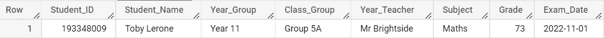

要创建一个结构，我们首先需要决定每个结构中应该包含哪些字段。让我们在这个例子中尝试两个结构；细节和结果。

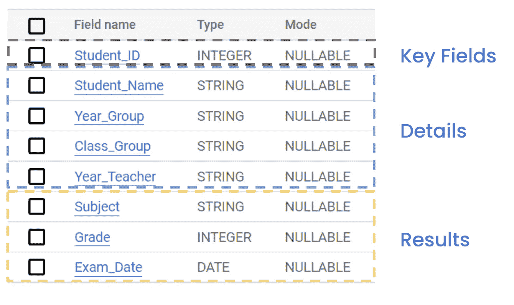

创建这个结构很简单。简单地列出你想要在结构中包含的字段，把它们添加到括号*(每个字段必须用逗号分开)*。

```
STRUCT(FIELD1, FIELD2, FIELD3) AS NEW_STRUCT
```

让我们创建两个新的结构，一个用于细节，另一个用于结果。

```
SELECT
193348009 as Student_ID,

STRUCT
  (
    "Toby Lerone" AS Student_Name,
    "Year 11" as Year_Group,
    "Group 5A" as Class_Group,
    "Mr Brightside" as Year_Teacher
  ) AS Details,

STRUCT
  (
    "Maths" AS Subject,
    73 AS Grade,
    DATE("2022-11-01") AS Exam_Date
  ) AS Results
```

> 我在上面缩进了我的结构，但这不是语法要求，我这样做只是为了可读性。如果你愿意，你可以把整个结构放在一行中。

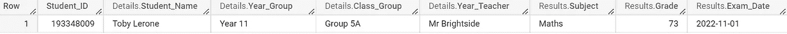

结果与我们之前看到的没有太大的不同，只是我们现在为每个字段头添加了一个前缀。

这告诉我们,**学生姓名，年组，班级组**和**年教师**在**细节结构中。**而**科目、成绩**和**考试日期**字段包含在**成绩结构中。**

如果我们将这些结果保存为一个表，我们的模式将如下所示。请注意，我们有了一个新的数据类型“RECORD ”,它现在出现在我们前面定义的两个结构中。

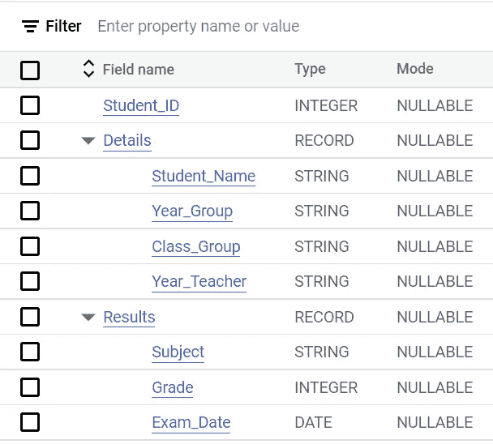

查询结构就像创建结构一样简单。与您通常选择字段的方式相比，您只需要做一处更改—您必须为字段名称添加前缀。

```
SELECT 
Student_ID,
Details.Year_Teacher,
Results.Subject,
Results.Grade,
Results.Exam_Date
FROM Student_Data
```

> 关于结构数据类型的官方文档可以在[这里](https://cloud.google.com/bigquery/docs/reference/standard-sql/data-types#struct_type)找到。


照片由[凯利·麦克林托克](https://unsplash.com/@kelli_mcclintock?utm_source=medium&utm_medium=referral)在 [Unsplash](https://unsplash.com?utm_source=medium&utm_medium=referral) 上拍摄

# 排列

数组是存在于相同单元格中的值的列表，这些值也是相同的数据类型。这是结构和数组之间的一个重要区别。结构可以包含各种数据类型，而数组只能包含一种数据类型。

有几种方法可以在 BigQuery 中创建数组，我将在本文中介绍其中的两种方法*(有帮助的文档* [*如果你想进一步探索的话，这里有*](https://cloud.google.com/bigquery/docs/reference/standard-sql/arrays)*)*。

## 创建带方括号的数组

创建数组就像创建结构一样简单。您必须将值放在方括号内，并且每个值必须用逗号分隔。

```
SELECT ["Chris Packet","Liz Anya","Hugh Dunnit"] as Attendees
```


正如您在上面看到的，我们的数组中有三个参与者，但是需要注意的是这三个值都包含在一行中。

这是导致本文开头提到的存储和查询成本节省的关键部分，因为即使在这个简单的例子中，我们也已经将表的大小从 3 行减少到 1 行。

## 使用 ARRAY_AGG()创建数组

函数将一组值放在一起，并将它们连接成一个数组。我们将在我们之前创建的结构字段上使用这个函数，这将为我们提供一个嵌套表*(一个结构数组)*。

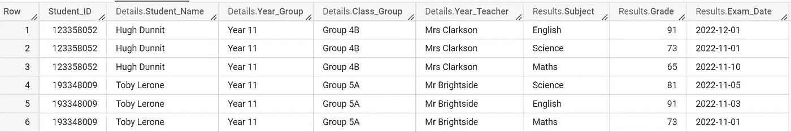

我已经扩展了前面的学生数据，增加了几行。请注意，我们之前定义的结构仍然存在，现在我们的数据集中有两个学生，每个学生有 3 个科目。

```
SELECT
Student_ID,
ARRAY_AGG(Details) as Details,
ARRAY_AGG(Results) as Results
FROM STUDENT_DATA
GROUP BY Student_ID
```

顾名思义，ARRAY_AGG 是一个聚合函数，所以我们必须在这里包含 group by 子句，它将根据 Student_ID 字段对我们的结构进行分组。

在 ARRAY_AGG 函数中，我们只需要指定结构的名称。我们不需要单独列出每个字段，因为它们已经包含在我们的结构中了。

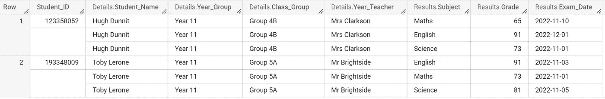

运行这个查询向我们展示了熟悉的结果。请注意，尽管显示了 6 行数据，我们只有 2 行数据。这要归功于 array_agg 函数，该函数将结构中的字段提取到一个数组中，用于每个唯一的 Student_ID。

将结果导出到电子表格中会让您对 BigQuery 如何在幕后存储这些数据有所了解。

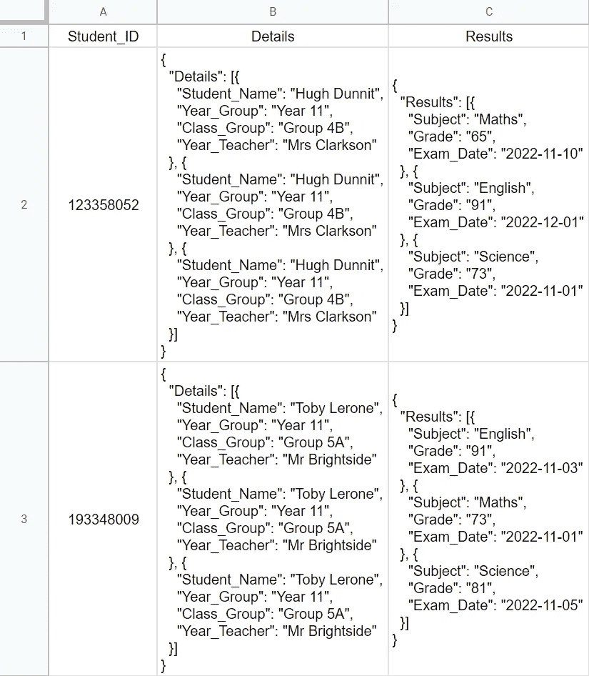

在 [Unsplash](https://unsplash.com?utm_source=medium&utm_medium=referral) 上由 [Waldemar Brandt](https://unsplash.com/@waldemarbrandt67w?utm_source=medium&utm_medium=referral) 拍照

# 大规模应用这些技术

在介绍了结构和数组的理论和实践之后，让我们回到本文的主题。如何使用这两种方法来节省存储和查询成本呢？

首先，让我们看看原始数据集。我在这个例子中使用的是 BigQuery 中一个名为 Chicago taxi trips 的公共数据集。

```
FROM `bigquery-public-data.chicago_taxi_trips.taxi_trips`
```

下面是该模式的屏幕截图。它包含 23 列，2 . 03 亿行，占用了 74GB 的 Google Clouds 存储空间。


前面我们介绍了**结构**以及如何将你的字段分成不同的类别。让我们再次做同样的事情，这次将数据集分成 3 个结构:Details、Payment 和 Geographic。

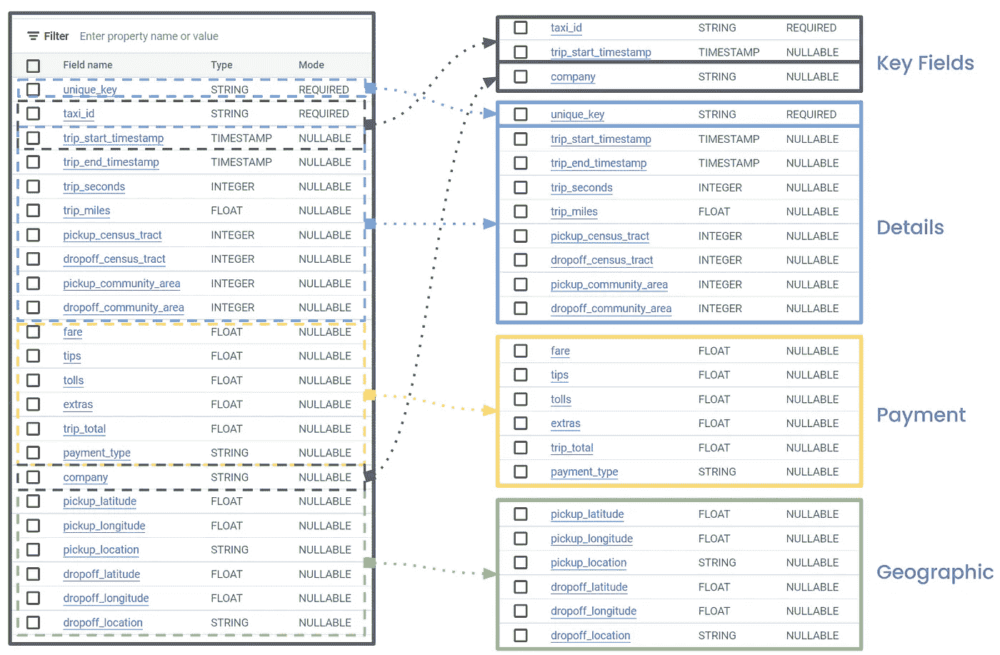

当你有一个超过 15 个字段的表格时，如果你需要来回滑动来检查你需要使用的字段，那么使用它会变得很累*(并且容易出错)*。在表中有明确定义的结构有助于为字段添加上下文，如果任何字段碰巧有相似的名称，这尤其有用。

BigQuery 有一个方便的辅助特性，它在处理结构时非常有用，允许您查看结构中存在的所有字段，而无需检查表模式本身。

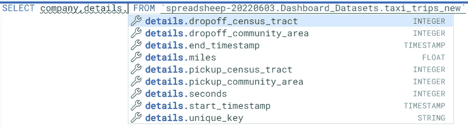

让我们使用数组和结构的组合将原始表转换成嵌套版本。

> 由于数据是公开的，下面的查询也适用于您。只需修改查询顶部的表路径，但要确保您的数据集位置设置为 US，以匹配原始数据集

```
create or replace table 
`spreadsheep-20220603.Dashboard_Datasets.taxi_trips_new` 
as (
SELECT 
company, 
taxi_id,
extract(date from trip_start_timestamp) as pickup_date,
#####STRUCT ONE#####
array_agg
(
  struct
  (
    unique_key,
    trip_start_timestamp as start_timestamp,
    trip_end_timestamp as end_timestamp,
    trip_seconds as seconds,
    trip_miles as miles,
    pickup_census_tract, 
    dropoff_census_tract, 
    pickup_community_area, 
    dropoff_community_area
  )
) as details,
#####STRUCT TWO#####
array_agg
(
  struct
  (
    fare,
    tips,
    tolls,
    extras,
    trip_total,
    payment_type
  )
) as payment,
#####STRUCT THREE#####
array_agg
(
  struct
  (
pickup_latitude, 
pickup_longitude, 
pickup_location, 
dropoff_latitude, 
dropoff_longitude,
dropoff_location
  )
) as geographic

FROM `bigquery-public-data.chicago_taxi_trips.taxi_trips` group by 1,2,3)
```

正如您在上面看到的，我们创建了三个结构，如前面的图表所示，每个结构都包含在 ARRAY_AGG 函数中。

下面是新的模式。我们之前在名称和数据类型方面有相同的字段，但现在它们只是在记录类型字段*(这些是我们定义的结构)*下有一点不同。

还要注意记录字段的模式显示为重复。这告诉我们这个结构存在于一个数组中。

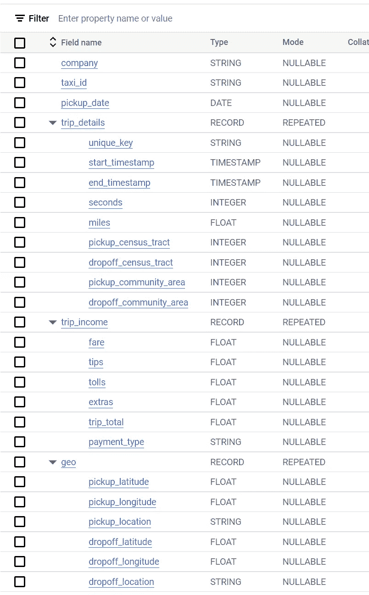

# 结果

这将我们带回到了本文开头显示的摘要截屏。我们将表中的行数减少了 93.1%，表的大小减少了 35.5%！


# 测试

好的，我们可以看到这种方法节省了存储成本，但是查询性能呢？让我们运行几个查询来回答这三个问题:

1.  【2022 年 5 月，多少%的出租车司机给了小费(按公司和整体，按 desc total trips 排序)
2.  【2022 年年初至今(除去顶部和底部 5%的行)每月的平均旅行时长是多少秒
3.  【2022 年 1 月，每家公司的每英里费用是多少(由 desc total trips 订购)

此外，让我们引入一个新的表来模拟另一个比较点的标准化数据集。第三个表是基于与其他两个表相同的数据，我将该表分为两部分，如下所示。

```
create or replace table 
`spreadsheep-20220603.Dashboard_Datasets.taxi_trips_payment` as 
(
SELECT
unique_key, 
fare, 
tips, 
tolls, 
extras, 
trip_total, 
payment_type
FROM `bigquery-public-data.chicago_taxi_trips.taxi_trips`
);

create or replace table 
`spreadsheep-20220603.Dashboard_Datasets.taxi_trips_main` as 
(
SELECT 
* except 
(
  fare,
  tips, 
  tolls, 
  extras, 
  trip_total, 
  payment_type
)
  FROM `bigquery-public-data.chicago_taxi_trips.taxi_trips`
);
```

## 2022 年 5 月打车出行给小费的比例是多少？

```
/*##################################################################################################*/
--What % of taxi trips in May 2022 gave a tip (by company ordered by total trips by each company total desc)--
/*##################################################################################################*/

--NESTED TABLE--
SELECT
COMPANY,
ROUND(SAFE_DIVIDE(TIPS_MADE,TOTAL_TRIPS_BY_COMPANY)*100,1)||"%" AS PERC_TIPPING,
TIPS_MADE,
TOTAL_TRIPS_BY_COMPANY
FROM
(
  SELECT
  LOWER(COMPANY) as COMPANY,
  COUNT(IF(tips > 0,UNIQUE_KEY,NULL)) as TIPS_MADE,
  COUNT(UNIQUE_KEY) AS TOTAL_TRIPS_BY_COMPANY
  FROM spreadsheep-20220603.Dashboard_Datasets.taxi_trips_new, 
  UNNEST(details) WITH OFFSET pos1, 
  UNNEST(payment) WITH OFFSET pos2
  WHERE DATE_TRUNC(start_timestamp,MONTH) = "2022-05-01" 
  AND pos1 = pos2
  GROUP BY COMPANY
)
ORDER BY TOTAL_TRIPS_BY_COMPANY DESC;

--ORIGINAL TABLE--
SELECT
COMPANY,
ROUND(SAFE_DIVIDE(TIPS_MADE,TOTAL_TRIPS_BY_COMPANY)*100,1)||"%" AS PERC_TIPPING,
TIPS_MADE,
TOTAL_TRIPS_BY_COMPANY
FROM
(
  SELECT
  LOWER(COMPANY) as COMPANY,
  COUNT(IF(tips > 0,UNIQUE_KEY,NULL)) as TIPS_MADE,
  COUNT(UNIQUE_KEY) AS TOTAL_TRIPS_BY_COMPANY
  FROM spreadsheep-20220603.Dashboard_Datasets.taxi_trips_original 
  WHERE DATE_TRUNC(trip_start_timestamp,MONTH) = "2022-05-01"
  GROUP BY COMPANY
)
  ORDER BY TOTAL_TRIPS_BY_COMPANY DESC;

--SPLIT TABLE--
SELECT
COMPANY,
ROUND(SAFE_DIVIDE(TIPS_MADE,TOTAL_TRIPS_BY_COMPANY)*100,1)||"%" AS PERC_TIPPING,
TIPS_MADE,
TOTAL_TRIPS_BY_COMPANY
FROM
(
  SELECT
  LOWER(COMPANY) as COMPANY,
  COUNT(IF(tips > 0,MAIN.UNIQUE_KEY,NULL)) as TIPS_MADE,
  COUNT(MAIN.UNIQUE_KEY) AS TOTAL_TRIPS_BY_COMPANY
  FROM spreadsheep-20220603.Dashboard_Datasets.taxi_trips_main AS MAIN
  INNER JOIN spreadsheep-20220603.Dashboard_Datasets.taxi_trips_payment AS PAYMENT
  ON MAIN.UNIQUE_KEY = PAYMENT.UNIQUE_KEY
  WHERE DATE_TRUNC(trip_start_timestamp,MONTH) = "2022-05-01"
  GROUP BY COMPANY
)
  ORDER BY TOTAL_TRIPS_BY_COMPANY DESC;
```

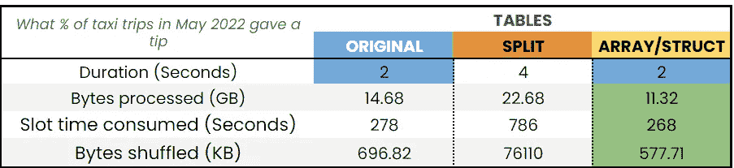

在这个练习中，我们的嵌套表是最重要的。查询持续时间与原始表相当，但使用的计算能力和处理的数据更少。

对于那些不熟悉数组的人，请密切注意我在这个例子中是如何取消嵌套多个数组的。如果去掉带有偏移的部分，那么由于双重不嵌套，最终会得到重复的结果。为了防止这种情况发生，我在 WHERE 子句中设置了一个条件，即两个数组的数组偏移量必须相等。

> 关于带偏移的[的更多细节可以在这里找到，或者在本文中提出你的问题，我会尽快回复你。](https://cloud.google.com/bigquery/docs/reference/standard-sql/arrays)

## 2022 年年初至今每月的平均旅行时长是多少秒？

```
/*##################################################################################################*/
--What is the average trip duration in seconds by month for 2022 YTD--
/*##################################################################################################*/

--NESTED TABLE--
SELECT
date_trunc(CAST(start_timestamp AS DATE),month) as month,
AVG(SECONDS) as avg_seconds
FROM
(
  SELECT
  start_timestamp,
  seconds
  FROM spreadsheep-20220603.Dashboard_Datasets.taxi_trips_new, UNNEST(details)
  WHERE EXTRACT(YEAR FROM start_timestamp) = 2022
  QUALIFY 
  seconds BETWEEN 
    PERCENTILE_CONT(seconds,0.05) over () 
    AND 
    PERCENTILE_CONT(seconds,0.95) over ()
)
GROUP BY MONTH
ORDER BY MONTH DESC;

--ORIGINAL TABLE--
SELECT
date_trunc(CAST(trip_start_timestamp AS DATE),month) as month,
AVG(trip_seconds) as avg_seconds
FROM
(
SELECT
trip_start_timestamp,
trip_seconds
FROM spreadsheep-20220603.Dashboard_Datasets.taxi_trips_original
WHERE EXTRACT(YEAR FROM trip_start_timestamp) = 2022
  QUALIFY 
  trip_seconds BETWEEN 
    PERCENTILE_CONT(trip_seconds,0.05) over () 
    AND 
    PERCENTILE_CONT(trip_seconds,0.95) over ()
)
GROUP BY MONTH
ORDER BY MONTH DESC;

--SPLIT TABLE--
SELECT
date_trunc(CAST(trip_start_timestamp AS DATE),month) as month,
AVG(trip_seconds) as avg_seconds
FROM
(
SELECT
trip_start_timestamp,
trip_seconds
FROM spreadsheep-20220603.Dashboard_Datasets.taxi_trips_main AS MAIN
INNER JOIN spreadsheep-20220603.Dashboard_Datasets.taxi_trips_payment as PAYMENT
ON MAIN.UNIQUE_KEY = PAYMENT.UNIQUE_KEY
WHERE EXTRACT(YEAR FROM trip_start_timestamp) = 2022
  QUALIFY 
  trip_seconds BETWEEN 
    PERCENTILE_CONT(trip_seconds,0.05) over () 
    AND 
    PERCENTILE_CONT(trip_seconds,0.95) over ()
)
GROUP BY MONTH
ORDER BY MONTH DESC;
```

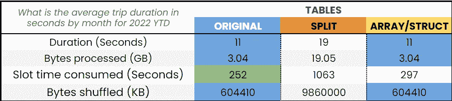

我在这些查询中添加了两个 window 语句，看看它们是否在这些表之间造成了任何明显的差异。window 语句删除底部和顶部 5%的行。

令人惊讶的是，原始表和嵌套表表现出几乎相同的性能，尽管嵌套表花费的计算时间稍多一些。

## 2022 年 1 月，每家公司的每英里费用是多少？

```
/*##################################################################################################*/
--What was the £ per mile for each company in January 2022 (ordered by total trips desc)--
/*##################################################################################################*/

--NESTED TABLE--
SELECT
COMPANY,
COUNT(unique_key) AS TOTAL_TRIPS,
SUM(TRIP_TOTAL)/SUM(MILES) AS DOLLAR_PER_MILE
FROM spreadsheep-20220603.Dashboard_Datasets.taxi_trips_new, 
UNNEST(details) WITH OFFSET pos1, 
UNNEST(payment) WITH OFFSET pos2
WHERE DATE_TRUNC(start_timestamp,MONTH) = "2022-01-01" 
AND POS1 = POS2
GROUP BY COMPANY
ORDER BY TOTAL_TRIPS DESC;

--ORIGINAL TABLE--
SELECT
COMPANY,
COUNT(unique_key) AS TOTAL_TRIPS,
SUM(TRIP_TOTAL)/SUM(TRIP_MILES) AS DOLLAR_PER_MILE
FROM spreadsheep-20220603.Dashboard_Datasets.taxi_trips_original
WHERE DATE_TRUNC(trip_start_timestamp,MONTH) = "2022-01-01"
GROUP BY COMPANY
ORDER BY TOTAL_TRIPS DESC;

--SPLIT TABLE--
SELECT
COMPANY,
COUNT(MAIN.unique_key) AS TOTAL_TRIPS,
SUM(TRIP_TOTAL)/SUM(TRIP_MILES) AS DOLLAR_PER_MILE
FROM spreadsheep-20220603.Dashboard_Datasets.taxi_trips_main AS MAIN
INNER JOIN spreadsheep-20220603.Dashboard_Datasets.taxi_trips_payment AS PAYMENT
on MAIN.UNIQUE_KEY = PAYMENT.UNIQUE_KEY
WHERE DATE_TRUNC(trip_start_timestamp,MONTH) = "2022-01-01"
GROUP BY COMPANY
ORDER BY TOTAL_TRIPS DESC;
```

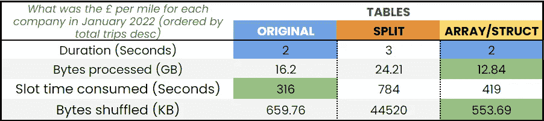

原始表和嵌套表的性能相似，但是嵌套表确实名列前茅，因为处理的数据量较少。


在 [Unsplash](https://unsplash.com?utm_source=medium&utm_medium=referral) 上由 [Aron 视觉](https://unsplash.com/@aronvisuals?utm_source=medium&utm_medium=referral)拍摄的照片

# 关键要点

*   您是否使用基于事件的大型表，其中包含每个唯一用户/id 的大量事件？那么嵌套版本的表可以很容易地为您节省未来的时间和金钱
*   如果您打算像我在本文中所做的那样，从非规范化模式切换到嵌套模式，请注意，您的任何预定或保存的查询都需要更新，以处理新的嵌套模式
*   当您取消嵌套多个数组时，确保您为每个 unnest 使用 WITH OFFSET，并在 WHERE 子句中设置标准以防止重复行*(参见第一和第三个测试的示例)*
*   尽管由于需要取消嵌套数组，您在嵌套表上的查询可能会更复杂，但与非规范化表相比，您可以期待更便宜(有时更快)的查询
*   如果您使用标准化的数据*(即在查询中将多个表连接在一起)*并定期查询相同的表*(例如每周报告)*，那么我强烈建议您花时间创建所使用的表的嵌套版本

如果您的表比较小，比如说小于 10GB，那么嵌套表的好处就变得不那么显著，增加的复杂性也不值得权衡。

这篇文章到此结束。如果有什么建议或推荐，欢迎随时留言评论。我很乐意看到它。

我经常为 BigQuery 和/或 Data Studio 撰写文章。如果你感兴趣，可以考虑在 medium 上关注我。

> 除非另有说明，所有图片均为作者所有。

***留在上等的乡亲们！
汤姆*汤姆**