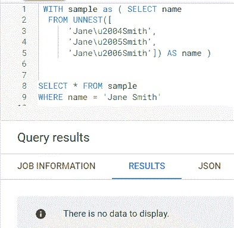
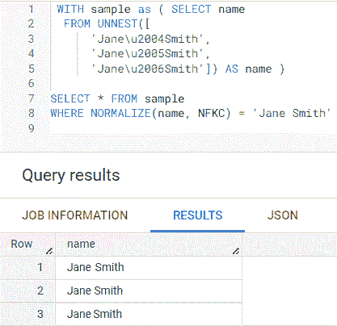
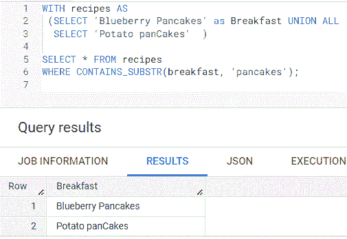
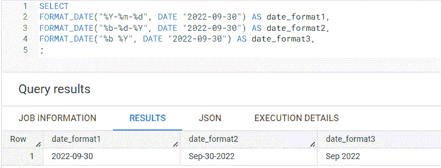
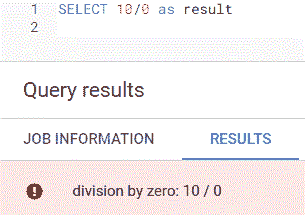
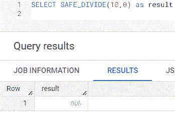

# 用于数据清理的 BigQuery SQL 函数

> 原文：<https://towardsdatascience.com/bigquery-functions-for-data-cleaning-4b96181fbc3>

## 要应用的用例及功能

图片来自[Rosy——世界值成千上万张图片](https://pixabay.com/users/roszie-6000120/?utm_source=link-attribution&utm_medium=referral&utm_campaign=image&utm_content=7459066)来自 [Pixabay](https://pixabay.com//?utm_source=link-attribution&utm_medium=referral&utm_campaign=image&utm_content=7459066)

无论您是数据工程师、数据科学家还是数据分析师，数据清理都是任何数据相关职位的重要组成部分。今天，我想分享几个用于数据清理的 BigQuery SQL 函数，以及我会使用它们的一个用例。

## 字符串值中不可见的特殊字符

字符串值可以包含不显示在屏幕上但存储在数据库中的特殊字符。当我在一个字符串字段上应用 where 子句导致找到 0 条记录时，我经历了惨痛的教训。这非常令人沮丧，在应用 where 子句返回我知道存在的记录之前，我必须找到函数来公开 [unicode](https://unicode.org/standard/WhatIsUnicode.html) 值，以便将它们从字符串中移除。

BigQuery 有一个 [**NORMALIZE**](https://cloud.google.com/bigquery/docs/reference/standard-sql/string_functions#normalize) 函数来处理这个场景。下面是 Jane 和 Smith 之间 unicode 值的 3 条记录，它们在查询结果中不可见。

作者创建的屏幕截图示例

如果我对 ***、简·史密斯*** 使用 where 子句，则不会返回任何记录。

作者创建的屏幕截图示例

但是，如果我对 name 字段使用 **NORMALIZE** 函数，unicode 值将被删除，查询结果中将返回三个简·史密斯记录。

使用作者创建的规格化函数的屏幕截图示例

***特别提示*** :如果您希望字符串比较不区分大小写，即在查询结果中返回包含简·史密斯或简·史密斯的记录，BigQuery 还有一个 [NORMALIZE_AND_CASEFOLD](https://cloud.google.com/bigquery/docs/reference/standard-sql/string_functions#normalize_and_casefold) 函数。

## 模式匹配

我一直使用 [LIKE](https://www.w3schools.com/sql/sql_like.asp) 操作符在字符串字段中进行模式匹配。最近，我不得不将网站访问者的[引用 URL](https://support.google.com/google-ads/answer/2382957?hl=en)进行分类，以匹配[谷歌分析频道报告](https://www.jellyfish.com/en-us/training/blog/google-analytics-channels-explained)。因为我不知道 URL 是大写还是小写，所以在检查模式匹配之前，我必须使用 LOWER 函数将字段全部转换为小写。

BigQuery 有一个针对这种情况的 [CONTAINS_SUBSTR](https://cloud.google.com/bigquery/docs/reference/standard-sql/string_functions#contains_substr) 函数。CONTAINS_SUBSTR 不仅执行不区分大小写的模式检查，还可以检查数字字段、时间戳和数组中的模式值。

在下面的例子中，我检查了 ***早餐*** 字段是否包含全部小写的字符串 ***煎饼*** 。尽管每条记录在 ***煎饼*** 中有一个大写字母，但在查询结果中会返回这两行。

使用作者创建的 CONTAINS_SUBSTR 函数的屏幕截图示例

***特别提到*** : BigQuery 还有一个 [ENDS_WITH](https://cloud.google.com/bigquery/docs/reference/standard-sql/string_functions#ends_with) 函数，用来检查一个字符串是否以模式结尾。我可以使用它的一个常见用例是检查电子邮件是否以。edu 确认用户是学生。

## 日期格式

过去，我总是将 SQL 中的查询结果下载到 Excel 中，以便为报告目的设置日期格式，因为我无法使用 SQL 以我需要的方式设置日期格式。当我有大量数据要格式化时，这非常耗时。

BigQuery 有一个 [FORMAT_DATE](https://cloud.google.com/bigquery/docs/reference/standard-sql/date_functions#format_date) 函数来处理日期格式化。在下面的示例中，2022 年 9 月 30 日基于[格式字符串](https://cloud.google.com/bigquery/docs/reference/standard-sql/format-elements#format_elements_date_time)以三种不同的方式进行格式化。

使用作者创建的 FORMAT_DATE 函数的屏幕截图示例

***特别说明*** :除了 FORMAT_DATE，还可以使用 [FORMAT_DATETIME](https://cloud.google.com/bigquery/docs/reference/standard-sql/functions-and-operators#format_datetime) 来格式化日期时间值。还有一个 [FORMAT](https://cloud.google.com/bigquery/docs/reference/standard-sql/string_functions#format_string) 函数将字段格式化为字符串值。这个函数的一个用例是用逗号分隔符格式化大数。您可以使用 FORMAT 函数在查询结果中显示 1，000，000，而不是 1000000。

## 除以一个零分母

我经常不得不计算分母可能为 0 的百分比，这将在除以 0 时返回 SQL 错误。一种选择是使用 CASE 语句在除法之前检查分母是否为 0，以避免错误，但是大多数数据库都有处理这种情况的函数。

在 BigQuery 的例子中，这个函数被称为 [SAFE_DIVIDE](https://cloud.google.com/bigquery/docs/reference/standard-sql/mathematical_functions#safe_divide) 。在下面的例子中，我将 10 除以 0，得到一个 ***除以零*** 的错误。

作者创建的使用除法错误示例的屏幕截图示例

在我使用 SAFE_DIVIDE 之后，结果是一个空值，而不是一个错误。

作者创建的使用 SAFE_DIVIDE 示例的屏幕截图示例

***特别提示*** : BigQuery 还有 SAFE_ADD、SAFE_SUBTRACT、SAFE_MULTIPLY、SAFE_NEGATE 函数，如果发生溢出，这些函数将返回空值。

## ***最后的想法***

虽然我们永远无法摆脱数据清理，但 SQL 函数可以提供帮助。我希望你学到了一两个将来有用的新功能。虽然我提到的函数在 BigQuery 中，但它们也可能在您的数据库中可用。

*注意:以上所有的查询都是在* [*BigQuery 沙箱*](https://cloud.google.com/bigquery/docs/sandbox) *上运行的，这对任何拥有谷歌账户的人来说都是免费的。*

## 你可能也会喜欢…

 [## 每个用户都应该知道的 6 个大查询 SQL 函数

### 检查您的数据库是否也有它们

towardsdatascience.com](/6-bigquery-sql-functions-every-user-should-know-9ed97b1cf72e)  [## 4 个可以简化查询的 BigQuery SQL 快捷方式

### 检查您的数据库是否也有它们

towardsdatascience.com](/4-bigquery-sql-shortcuts-that-can-simplify-your-queries-30f94666a046)  [## 数据科学家如何通过数据集市减少数据争论的时间

### 什么是数据集市，为什么数据科学家应该使用数据集市

towardsdatascience.com](/how-data-scientists-can-reduce-data-wrangling-time-with-a-data-mart-809eefbe0bc2)