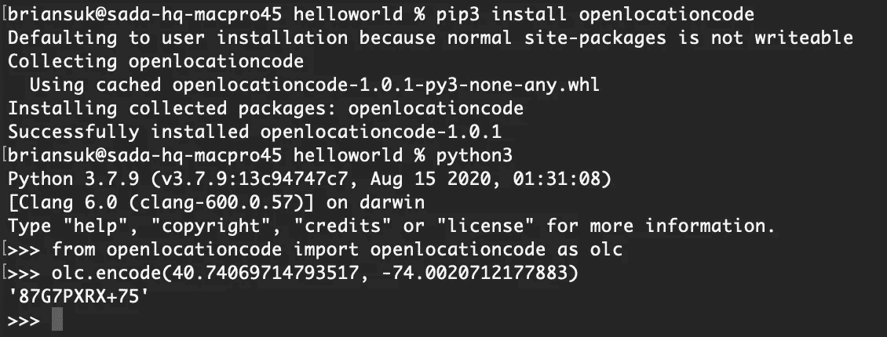
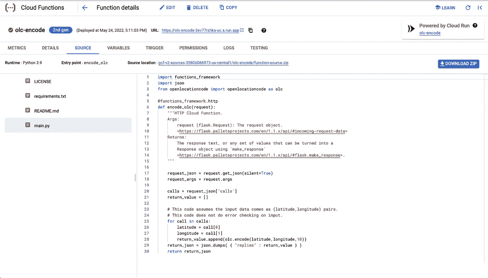
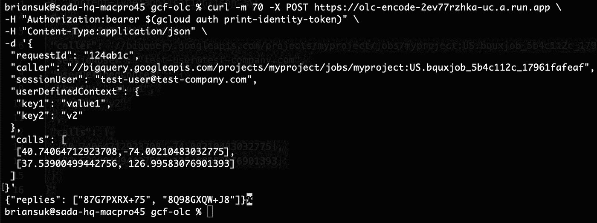
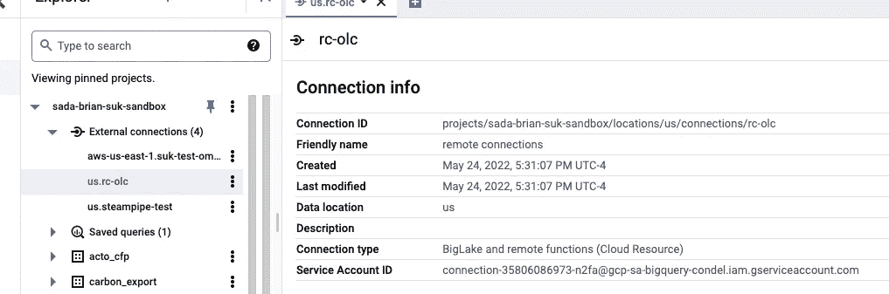
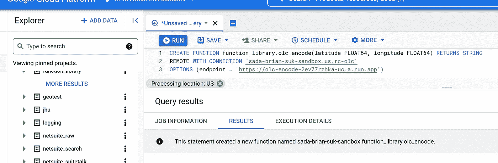
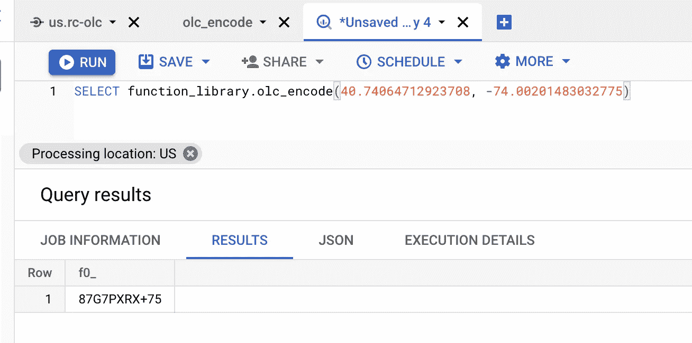
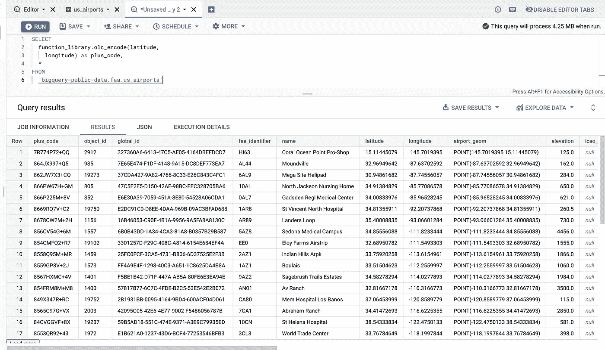

# 重访 BigQuery 远程函数、云函数 2.0 和 Plus 代码

> 原文：<https://towardsdatascience.com/bigquery-remote-functions-cloud-functions-2-0-and-plus-codes-revisited-7b6308b2bc03>


图片来源:[安妮·尼加德，Unsplash](https://unsplash.com/photos/RaUUoAnVgcA)

几年前，我参加了一个由谷歌主办的会议，发现了[加号代码](https://maps.google.com/pluscodes/)。简而言之，这是一个寻址系统，它生成一个字母数字代码来表示世界上的位置。在许多方面，它比标准地址更准确、更容易访问，而且比精确的坐标位置更容易记忆。许多博客和文章都写了这个话题，[，包括我自己写的一篇](/plus-codes-open-location-code-and-scripting-in-google-bigquery-30b7278f3495)。如果你不熟悉加号代码和开放位置代码(OLC，生成加号代码的算法),我建议你看一看它是如何工作和如何使用的。从工程角度来看，这很酷，但对于服务水平低下的社区来说，这也非常有影响力。

在那篇文章中，我决定实现 OLC 来学习如何使用 BigQuery 脚本。这是一个如何在 BigQuery 中使用过程化代码的例子，它成功了！从那时起，数据平台，以及总体上的谷歌云，随着许多新特性和功能的加入，已经发生了相当大的变化。引起我注意的两个是 [BigQuery 远程函数](https://cloud.google.com/blog/products/data-analytics/extending-bigquery-functions)和[云函数第二代](https://cloud.google.com/blog/products/serverless/introducing-the-next-generation-of-cloud-functions)。我想亲自动手看看这是如何工作的，有多简单，所以我想为什么不再次使用加号代码来尝试一下呢！

请记住，在撰写本文时，云功能 Gen2 和 BigQuery 远程功能都处于公开预览阶段，这意味着它们包含在[预发布条款和条件](https://cloud.google.com/terms/service-terms#1)中。在投入生产之前，情况可能会有所变化。

# 熟悉 GCF Gen2

使用其他编程语言的好处是 Google 致力于开发并开源了库，为其中的一些库生成了附加代码！在这篇文章中，我们将使用 [Python 库](https://github.com/google/open-location-code/tree/main/python)。

## 尝试一下

让我们首先在我们的机器上进行本地测试。事实证明，你可以使用 `[pip](https://github.com/google/open-location-code/tree/main/python)`非常简单地[安装它。使用它只是简单地在一个坐标对上调用`encode()`函数。](https://github.com/google/open-location-code/tree/main/python)



在本地安装 OLC 库，并在交互式终端中运行它。相当简单！

## 构建功能

我们现在要构建一个 BigQuery 可以调用的函数。从关于远程函数的[文档](https://cloud.google.com/bigquery/docs/reference/standard-sql/remote-functions)中，这是 BigQuery 将发送的请求的[输入格式](https://cloud.google.com/bigquery/docs/reference/standard-sql/remote-functions#input_format):

```
{
 "requestId": "124ab1c",
 "caller": "//bigquery.googleapis.com/projects/myproject/jobs/myproject:US.bquxjob_5b4c112c_17961fafeaf",
 "sessionUser": "[test-user@test-company.com](mailto:test-user@test-company.com)",
 "userDefinedContext": {
  "key1": "value1",
  "key2": "v2"
 },
 "calls": [
  [null, 1, "", "abc"],
  ["abc", "9007199254740993", null, null]
 ]
}
```

BigQuery 将在查询中接受一个函数调用，并将成批的输入数据发送到`calls`数组，并将成批的请求发送到云函数。有很多有用的元数据，但我们将重点放在`calls`上。我们只需要创建一个`for`循环，遍历输入列表中的每个元素，对它们进行编码以获得 OLC，将它们添加到返回列表中，然后返回该列表。返回值必须是包含所有相应结果数据的 JSON 响应。结果代码如下:

在`requirements.txt`文件中，您只需要添加`openlocationcode`到其中，这样库就可以在运行时安装。该文件的一个例子是这里的[和](https://github.com/slagathorr/gcf-olc/blob/main/requirements.txt)。

在这里，您可以按照云控制台中的向导来安装这个功能，或者您可以[克隆这个 Github 存储库](https://github.com/slagathorr/gcf-olc)，我已经为您编写了代码，只需运行以下命令:

```
gcloud beta functions deploy olc-encode \
--gen2 \
--runtime python39 \
--trigger-http \
--entry-point encode_olc \
--source . \
--region us-central1
```

它将在整个部署过程中运行，并询问您是否希望允许对该函数进行未经身份验证的调用。我建议选择“否”,因为通常默认情况下不会将其公开。如果你去控制台，你应该看到你闪亮的新功能！



云控制台关于云功能的详细信息页面。

请注意，左上角将显示“第二代”,右上角有一个链接，可将您带到支持此部署的云运行服务的详细信息页面。

翻到 testing 选项卡，它会在页面的右半部分给出一个测试命令的例子。复制并替换数据参数，如下所示:

```
curl -m 70 -X POST [https://](https://olc-encode-2ev77rzhka-uc.a.run.app)your-cloud-function-endpoint.run.app \
-H "Authorization:bearer $(gcloud auth print-identity-token)" \
-H "Content-Type:application/json" \
-d '{
 "requestId": "124ab1c",
 "caller": "//bigquery.googleapis.com/projects/myproject/jobs/myproject:US.bquxjob_5b4c112c_17961fafeaf",
 "sessionUser": "[test-user@test-company.com](mailto:test-user@test-company.com)",
 "userDefinedContext": {
  "key1": "value1",
  "key2": "v2"
 },
 "calls": [
  [40.74064712923708,-74.00210483032775],
  [37.53900499442756, 126.99583076901393]
 ]
}'
```

这是为了测试该函数是否能够处理 BigQuery 将要发送的请求格式。在终端中运行它，它应该返回以下加号代码:



向服务发送测试调用。您可以在响应中看到两个加号代码。

仅供参考，这些是纽约市[谷歌办公室](https://www.google.com/maps/place/87G7PXRX%2B75/@40.7406915,-74.0042512,17z/data=!3m1!4b1!4m5!3m4!1s0x0:0x77be3c437a6ccc69!8m2!3d40.7406875!4d-74.0020625)和首尔[君悦酒店](https://www.google.com/maps/place/8Q98GXQW%2BJ8/@37.5390667,126.9936238,17z/data=!3m1!4b1!4m5!3m4!1s0x0:0xb4bb914ceb9b7fd8!8m2!3d37.5390625!4d126.9958125)的坐标。我们现在看到函数本身是有效的。

# 在 BigQuery 中使用函数

从这里开始，只需再走两步就能成功。创建一个外部连接，并创建使用该连接的远程函数。

我们要做的第一件事是创建一个存储函数的数据集。通常，如果您有跨数据集使用的函数，以便在一个地方管理它们，这是一个好的做法。在 BigQuery 控制台中运行:

```
CREATE SCHEMA
  function_library;
```

然后运行以下命令创建远程连接:

```
bq mk \
--connection \
--display_name='remote connections' \
--connection_type=CLOUD_RESOURCE \
--project_id=$(gcloud config get-value project) \
--location=US rc-olc
```

如果刷新 BigQuery UI，现在应该可以看到连接。



新建立的远程连接的详细信息。

这个连接将附带一个服务帐户，BigQuery 将使用这个帐户来发布对云函数的调用。为此，您需要向该帐户授予`[roles/cloudfunctions.invoker](https://cloud.google.com/functions/docs/reference/iam/roles)`角色。

如果您在命令行中运行以下命令，您将获得包含服务帐户地址的输出。

```
bq show --location=US --connection rc-olc
```

您可以在云控制台中手动授予该角色，或者您可以发出以下命令来动态生成授予该角色所需的信息。

在 BigQuery 中，通过发出以下 SQL 语句，使用该连接创建一个远程函数:

```
CREATE FUNCTION
  function_library.olc_encode(latitude FLOAT64, longitude FLOAT64) RETURNS STRING
REMOTE WITH CONNECTION `[PROJECT ID].us.rc-olc`
OPTIONS (endpoint = '[https://ENDPOINT-URL'](https://ENDPOINT-URL'))
```

用您的项目 ID 和端点 URL 替换它。您可以在云控制台详细信息页面上获取该函数的 URI，也可以运行以下命令:

```
gcloud beta functions describe olc-encode --gen2 --region=us-central1 --format=json | jq -r '.serviceConfig.uri'
```



在 BigQuery 控制台中创建远程函数。

从这里开始，尝试运行`SELECT function_library.olc_encode(40.74064712923708, -74.00201483032775)`来验证连接正在工作。



对新功能进行快速测试。

*注意:我注意到有时候在这个时候，你可能会碰到一个 403 错误。我不确定为什么会发生这种情况，但我发现手动进入控制台中的 IAM 页面，删除并重新创建* `*cloudrun.invoker*` *的 IAM 绑定似乎可以做到这一点。它说传播延迟可能需要 60 秒，但我不得不等待大约 10 分钟才能工作。你的经历可能有所不同，但我把这归功于 GA 前的小精灵。*

让我们试着使用一个表，并给它输入更多的值。我们将使用 [FAA BigQuery 机场公共数据集](https://console.cloud.google.com/bigquery?p=bigquery-public-data&d=faa&t=us_airports&page=table)进行尝试。运行以下查询:

```
SELECT
  function_library.olc_encode(latitude,
    longitude) as plus_code,
  *
FROM
  `bigquery-public-data.faa.us_airports`
```



所有的加号代码！

这就是在 Cloud Functions 2.0 中使用 Python 作为 BigQuery 的远程函数调用的快速示例，同时使 Plus 代码更容易批量编码！希望这有所帮助，查询愉快！