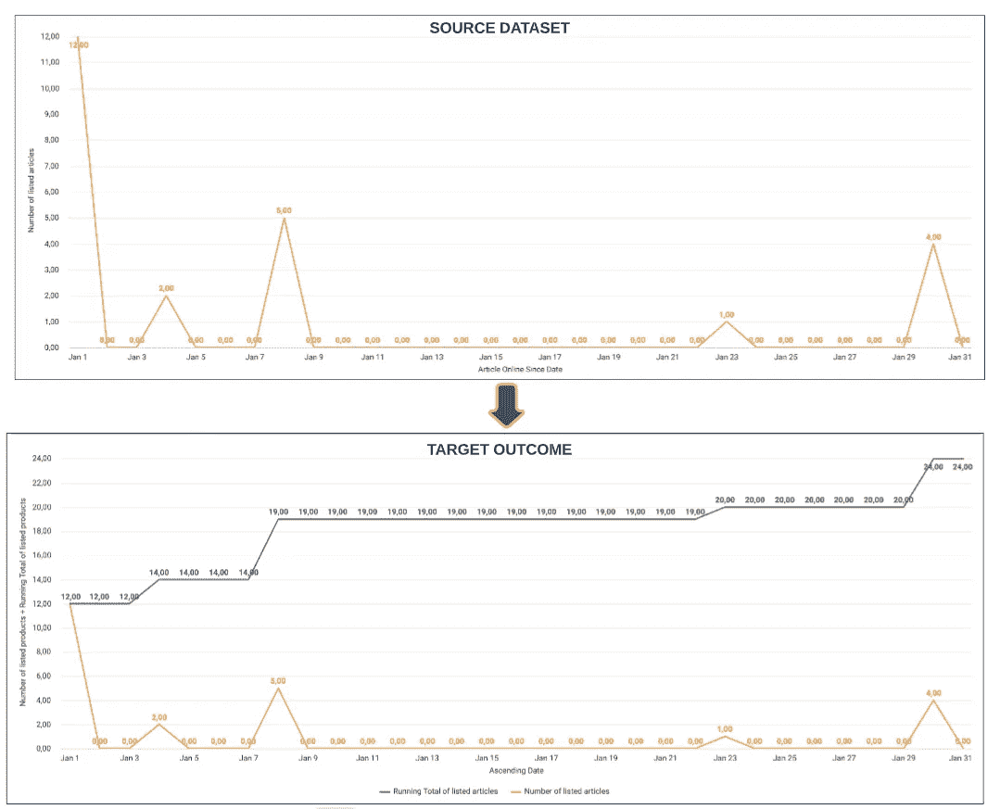
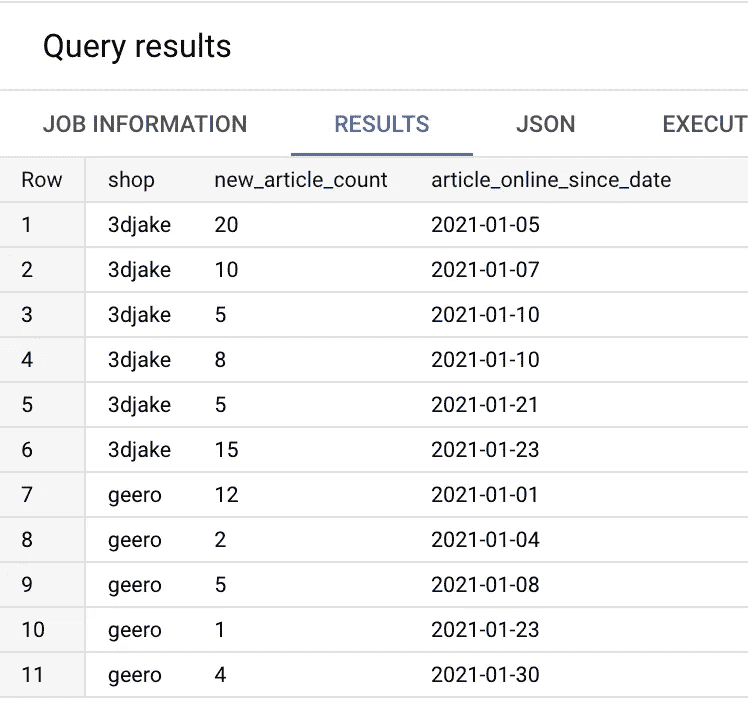
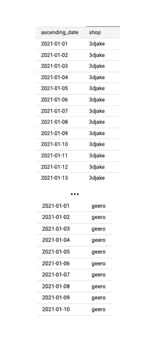
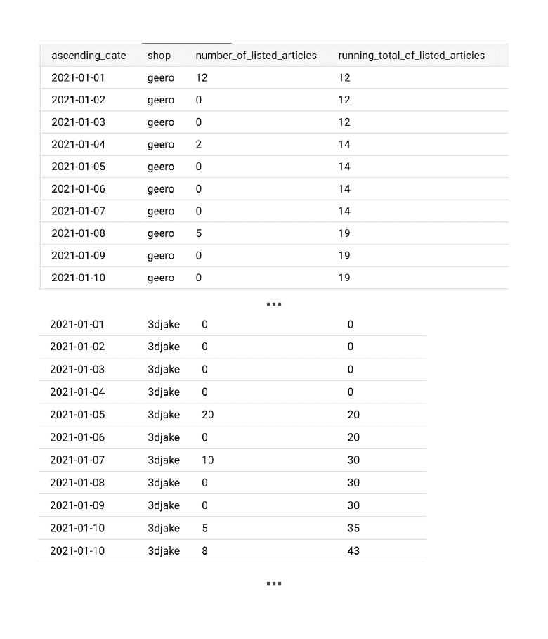

# BigQuery SQL:带有缺失日期的数据集上运行总数的演变

> 原文：<https://towardsdatascience.com/bigquery-sql-evolution-of-the-running-total-on-a-dataset-with-missing-dates-44b6d22f7d20>

## 用 BigQuery SQL 处理缺失值、窗口函数和嵌套查询

托德·迪默在 [Unsplash](https://unsplash.com?utm_source=medium&utm_medium=referral) 上拍摄的照片

我们的数据和分析团队最近收到了一个问题:**“今年迄今为止，每家商店列出的商品数量是多少，这个数字是如何演变的？”**

找到今年迄今为止列出的文章总数并不是一项复杂的分析任务。然而，当我们想展示这个数字是如何随着时间的推移而增加时，问题就出现了。

原因是源数据集中的**缺少值**。换句话说，在保存每个特定商店新列出的商品条目的数据集中，我们没有每个日期 **的**记录。****

这是挑战开始的地方。

首先，我们需要弄清楚**如何为每个商店填充缺失的日期**。在此步骤之后，**需要对每个日期和商店组合的缺失值**进行正向填充。最后，作为最后一步，必须计算**运行总数**。

在花了一些时间研究和挖掘 BigQuery SQL 教程之后，我们找到了一个简单的解决方案。

现在，我们将与您分享我们的实施方法。

如果您使用 **BigQuery** ，解决方案是几个步骤，或者更好地说是几个嵌套查询**。:)**

# **问题解释:从源到目标**

让我们以**视觉形式呈现问题，即源数据看起来如何，预期结果是什么**。

对于图形表示，我们使用 [Looker](https://www.looker.com/) 在时序图上显示源记录和目标结果的样本。

源数据集中记录的时间序列表示和预期结果[图片由作者提供]

从上图的第一部分(**源数据集**)可以看出，在所选的日期范围内，我们遗漏了每个商店级别的日期和相应的数值。

因此，我们将我们的解决方案分为三个步骤来实现**目标结果**，并计算在`article_online_since_date`日期和每个分区`shop`的度量`new_article_count`的运行总数。

# 自下而上的实现方法

首先，通过以下查询，我们能够创建虚拟输入数据集:

查询的结果是:

有了输入表`ListedArticlesPerShop`，我们就可以开始研究自下而上的解决方案来**计算每个商店一段时间内的运行总数。**

**步骤#1:填写每个分区(车间)缺少的日期范围**

BigQuery SQL 提供了一个简洁的[数组函数](https://cloud.google.com/bigquery/docs/reference/standard-sql/array_functions#generate_date_array) `GENERATE_DATE_ARAY`，您可以在其中指定以下输入[1]:

*   `start_date` —必须是日期
*   `end_date` —必须是日期
*   `INT64_expr` —确定用于生成日期的增量的参数；该参数的默认值是一天
*   `date_part` —必须是日、周、月、季或年。

通过`GENERATE_ARRAY`功能，我们能够创建一个包含每个商店完整日期范围的表格:

查询的结果如下:

成功完成步骤#1 后，我们现在可以将新创建的查询连接到输入表`ListedArticlesPerShop`。

**步骤#2:将填充了日期范围的表连接到缺少日期范围的输入表**

**这一步很简单，因为任务是:**

*   **使用`**LEFT JOIN**`类型连接两个表，和**
*   **从每个表中选择相应的属性；`**table_a**`中的`ascending_date`和`shop`，以及`**table_b**`中的`new_article_count`(现在别名为`number_of_listed_articles`)。**

**成功完成这部分任务后，我们现在可以计算运行总数了。**

****第 3 步:计算每个分区(车间)的总运行时间****

**运行总数是使用顶部查询中的[窗口函数](https://cloud.google.com/bigquery/docs/reference/standard-sql/window-function-calls#compute_a_grand_total)计算的:**

**`SUM (number_of_listed_articles) OVER (PARTITION BY shop) ORDER BY (ascending_date ROWS BETWEEN UNBOUNDED PRECEDING AND CURRENT ROW)`**

**现在，让我们一起来呈现**热门查询**:**

**最终的查询结果如下:**

****

**随着这最后一步，我们成功地结束了我们的任务。:)**

# **摘要**

**在本文中，我们展示了如何仅使用 BigQuery SQL 来填充缺失值，并计算特定指标随时间和每个特定分区的演变模式。**

**我们还介绍了如何组合不同的 **BigQuery 函数** : [窗口](https://cloud.google.com/bigquery/docs/reference/standard-sql/array_functions)和[数组函数](https://cloud.google.com/bigquery/docs/reference/standard-sql/array_functions)，以解决复杂的分析任务并提供所需的数据洞察。**

**最后，我们希望你会喜欢我们的教程，并在你的用例中找到它的用法。:)**

****参考文献:****

**[1] BigQuery SQL 文档，访问时间:2022 年 6 月 3 日，[https://cloud . Google . com/big query/docs/reference/standard-SQL/array _ functions # generate _ date _ array](https://cloud.google.com/bigquery/docs/reference/standard-sql/array_functions#generate_date_array)**