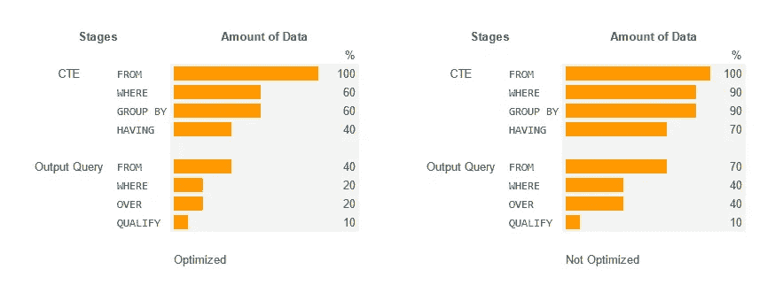
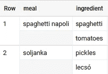

# BigQuery SQL 优化 1:尽早过滤

> 原文：<https://towardsdatascience.com/bigquery-sql-optimization-1-filter-as-early-as-possible-60dfd65593ff>

有时，我会看到一些查询在早期准备了一个列，但却在后期使用该列进行筛选。或者用*过滤掉本来可以用*过滤掉的有*的东西。这降低了查询速度，增加了处理成本。让我们看看对此我们能做些什么！*

下面是一个示例场景，其中创建了相同的输出，但有一次查询通过之前的过滤进行了优化:



从公用表表达式(CTE)到最终输出查询(作者图片)的数据处理量

我们处理的数据越少，查询速度就越快。所以我们越早过滤掉数据越好。如果同样的事情可以在几秒钟内完成，没有人愿意等几分钟。但是有时会很难，尤其是在处理*嵌套数据时——稍后会有更多介绍……*

# 尽早过滤

查询`SELECT movie, sum(tickets_sold) FROM movie_sales GROUP BY movie`在以下阶段执行:

*阶段 1* : **取出所有条目** `FROM`表`movie_sales`

*阶段 2* : **根据您在`movie`列中找到的所有值对条目**进行分组，并通过求和`tickets_sold`在组内进行聚合

*阶段 3* : **输出**在`SELECT`中定义的结果(这可能是反直觉的，因为`SELECT`在查询中先*后*执行，但最后*执行，因为它“仅”定义了输出。在其他语言中，它会被称为`print()`或`echo`*

如果我们只对某些电影的销量感兴趣，可以选择两种不同的过滤方式:`WHERE movie='xyz'`或者`HAVING movie='xyz'`。但是想象一下*在每个场景中，查询引擎要将*从一个阶段拖到另一个阶段需要多少数据:

*   使用`HAVING`,它将整个表拖到阶段 2，并且只在聚合后过滤
*   使用`WHERE`,在获取数据时，它会扔掉所有不需要的东西，这样它只会将很少的数据传递到下一阶段

在查询级别，我们有 3 种过滤方式:

1.  `WHERE`与`FROM`一起工作
2.  `HAVING`与`GROUP BY`一起工作
3.  `QUALIFY`与`OVER`一起工作(窗口功能)

我们可以向`WHERE`或者甚至更早的查询/cte 移动的过滤器越多越好。或者换句话说:你应该在信息可用的最早时间点进行过滤。例如，如果过滤器需要*聚合*，那么我们不能将其移动到`WHERE`，因为只有`GROUP BY`聚合—不要过滤*聚合*在后面的`WHERE`，使用前面的`HAVING`。

例如:`SELECT movie, sum(tickets_sold) FROM movie_sales GROUP BY movie HAVING avg(rating)>2.5`在这里，我们可以使用`WITH`将查询放到一个公共表表达式中，并在后面的查询中进行过滤:

```
WITH prep as (
  SELECT movie, sum(tickets_sold), avg(rating) as avg_rating
  FROM movie_sales 
  GROUP BY movie 
)SELECT upper(movie) as movie, tickets_sold
FROM prep
WHERE avg_rating > 2.5
```

有时将过滤器移至`WHERE`可能会更复杂，但这通常是值得的，因为它显著提高了性能——尤其是当它在高峰时间运行时(即周一早上，当周/月报告的所有数据都被处理时)。

让我们看一些更具挑战性的案例…

# 使用数组上的子查询进行过滤

当处理嵌套数据时，将过滤器延迟到后面阶段的模式非常诱人，因为当我们不习惯所有这些子查询时，我们只想给子查询一个别名并使用那个名称。有时查询引擎可以弥补，但并不总是那么理想。

一开始，使用数组可能会令人困惑…我已经介绍了 [**BigQuery:嵌套数据上的 SQL**](/https-medium-com-martin-weitzmann-bigquery-sql-on-nested-data-cf9589c105f4)，并在 [**BigQuery:使用 SQL**](/bigquery-creating-nested-data-with-sql-727b761f1755) 创建嵌套数据中解释了更多的数据准备概念。对于这一部分，你应该有点熟悉那里解释的想法。

但是在这里同样适用——如果我们可以将过滤器上移一两个阶段，那么我们将节省处理时间，因为查询引擎不需要将如此多的数据从一个阶段拖到另一个阶段。

让我们看一些简单的数组数据示例:



两行嵌套结果

我们可以对*成分*数组进行一些聚合:

子查询中包含数组聚合的未筛选查询

但是如果我们只想吃不含泡菜的饭菜呢？我们可以将`SELECT ... FROM t1`包装到另一个`WITH t2 AS`语句中，并检查字符串`listIngr`是否包含子字符串`"pickles"`。但之后我们会把所有泡菜餐拖到这个额外的阶段`t2`。相反，我们应该将`WHERE`与子查询结合使用！

使用子查询过滤的一个好方法是使用***exist****s(<子查询> )* 和**在子查询中设置条件**。

*   因此，如果我们不想在一顿饭中有任何泡菜，子查询不应该返回任何东西！
*   如果我们想确保饭菜中有西红柿，那么*子查询应该返回一些东西*

```
SELECT
  ...
FROM t1
WHERE
  NOT EXISTS(select 1 from unnest(ingredient) as i where i="pickles")
```

这里，我们为每个`where i="pickles"`返回 1，并且 *exists()* 检查子查询是否返回了任何内容。如果是， *exists()* 将返回 *true* 和 *NOT* 将其转换为 *false* 并发送给*，在那里*过滤出泡菜。

如果我们希望两个条件都为真(没有泡菜，但是有西红柿),我们将使用两个子查询，每个子查询创建自己的过滤器布尔:

```
SELECT
  ...
FROM t1
WHERE
  -- only meals without pickles!
  NOT EXISTS(select 1 from unnest(ingredient) as i where i="pickles")
  AND
  -- only meals with tomatoes!
  EXISTS(select 1 from unnest(ingredient) as i where i="tomatoes")
```

添加可读的注释，与类似`AND`的布尔操作符一起使用，有助于理解查询。我们将在下一节看到一个更实际的例子。

# 证明优化是可行的

如前所述，策略相当简单:多次运行优化和非优化的查询，并查看消耗的槽时间。插槽的性能并不一致——因此，运行查询 3 到 5 次，记录其性能并取平均值，会给你一个思路。

有一些东西可以帮助我们:

*   [禁用缓存](https://cloud.google.com/bigquery/docs/cached-results#disabling_retrieval_of_cached_results)以始终获得完整的性能结果
*   [表样](https://cloud.google.com/bigquery/docs/table-sampling)不过度扩展可用插槽，降低成本。与`LIMIT`相比，它实际上减少了处理，但不适合*随机*采样，如`WHERE rand()<0.1`

# GA4 示例

这个例子采用了基本的 Google Analytics 4 数据——产品分析的一个常见用例:

现在我们优化了没有嵌套的数据——但是如果我们想过滤某些页面标题呢？让我们来看看:

WHERE 子句中的子查询看起来并不漂亮，但通常是有效的

现在我们可以开始采样了——比较 v3 和 v4。禁用缓存并在大表上添加`TABLESAMPLE SYSTEM (10 PERCENT)`或从您的 *_TABLE_SUFFIX* 中删除日期。记录并比较平均槽时间(不是总运行时间)。

在这个简单的例子中，差异实际上是可以忽略的，因为查询引擎可以优化我们的低效率，因为我们不改变值。但是查询通常没有这个简单。相反，它们会更改值，涉及其他表、聚合、窗口函数、多个 cte 等，达到查询引擎无法补偿的程度。即使您的用例现在如此简单，它也可能在以后演变成更复杂的东西。

因此，通过将过滤器提升到早期阶段来调整您的查询将使您在周一的第一份报告更新竞赛中获得优势。通过尽早过滤数据来减轻查询引擎的负担。

重构快乐！