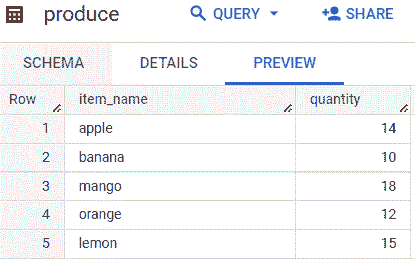
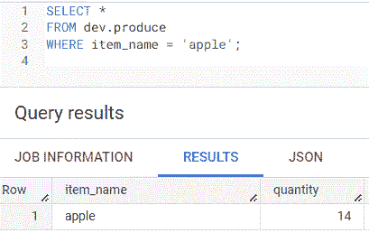
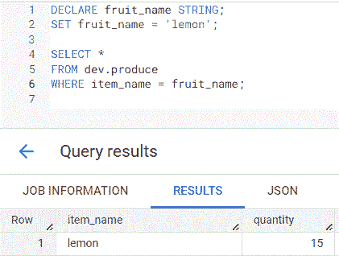
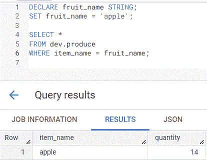
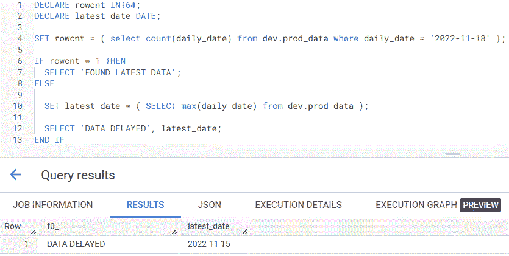
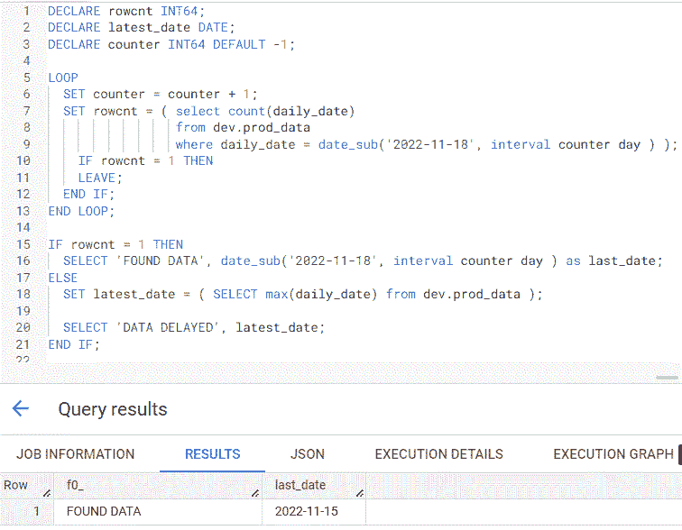

# 简化数据工程的 BigQuery SQL 过程语言

> 原文：<https://towardsdatascience.com/bigquery-sql-procedural-language-to-simplify-data-engineering-66ecfc47f3ac>

## 介绍

安妮·斯普拉特在 [Unsplash](https://unsplash.com?utm_source=medium&utm_medium=referral) 上的照片

作为一名长期的 SQL 用户，我经常不得不一遍又一遍地运行相同的代码，只在 where 语句中稍作修改。在 Python 这样的编程语言中，这种复制和替换是不必要的，因为我可以创建一个函数来传入不同的参数值以重新运行相同的代码。今天我想分享如何使用 BigQuery 的[过程语言](https://cloud.google.com/bigquery/docs/reference/standard-sql/procedural-language)来设置变量和条件逻辑以运行 SQL 语句。

## 声明并设置

[声明](https://cloud.google.com/bigquery/docs/reference/standard-sql/procedural-language#declare)语句初始化变量，而[设置](https://cloud.google.com/bigquery/docs/reference/standard-sql/procedural-language#set)语句将设置变量的值。如果您需要运行除了几个值之外基本相同的 SQL 代码，这将非常有用。在下面的例子中，我们有一个名为 ***product*** 的表，它有两个字段: ***item_name*** 和 ***quantity*** 。

为了得到苹果的数量，我们将使用 where 语句来查找 ***item_name*** 等于 ***apple*** (第 3 行)。

现在，假设我们想要从这个表中查询不同的水果，但是我们不想多次复制整个 SQL 语句来更改 where 语句中的水果名称。在这种情况下，我们可以使用 DECLARE 初始化一个名为 ***fruit_name*** (第 1 行)的变量，并将值设置为 ***lemon*** (第 2 行) ***。*** 现在，当查询被运行时，where 语句查询 ***item_name*** 等于 ***fruit_name*** 变量即被设置为 ***lemon*** (第 6 行)。

要再次查询苹果，我们只需将 ***水果名称*** 变量从 ***柠檬*** 变回 ***苹果(*** 第 2 行)。

这是一个简单的声明和设置的例子，但是它们可以用在比我上面展示的更多的地方。重复的 SQL 语句也可以放在[表函数](https://cloud.google.com/bigquery/docs/reference/standard-sql/table-functions)中，这样用户就不需要用不同的 where 值多次编写相同的 SQL 代码。

## 如果-那么

如果满足条件，您可以使用 [IF-THEN](https://cloud.google.com/bigquery/docs/reference/standard-sql/procedural-language#if) 条件语句来执行 SQL 语句。我遇到的一个典型场景是在为一个报告运行剩余的 SQL 之前检查一个表是否有最新的数据。从数据工程的角度来看，如果数据没有准备好，能够跳过代码会使事情变得容易得多。

在下面的例子中，我初始化了两个变量 ***rowcnt*** (第 1 行)和 ***latest_date*** (第 2 行)。我检查了 ***prod_data*** 表的行数，其中 ***daily_date*** 字段等于***2022–11–18***，并将该值设置为 ***rowcnt*** 变量(第 4 行)。

现在使用 IF-THEN 条件语句，我检查 rowcnt 是否等于 1(第 6 行)，这意味着如果找到 2022–11–18 的数据，那么将显示字符串 ***找到最新数据*** 。否则， ***latest_date*** 被设置为 ***prod_data*** 表中最大日期的值(第 10 行)，并且 ***数据延迟*** 与 ***latest_date*** 的值一起显示(第 12 行)。在这种情况下，没有找到数据，并且 ***latest_date*** 字段显示***2022–11–15***。

这也是一个简单的例子，但是您可以看到如果数据不可用，条件语句如何阻止 SQL 代码运行。

## 循环并离开

您可以结合使用 [LOOP](https://cloud.google.com/bigquery/docs/reference/standard-sql/procedural-language#loop) 和 [LEAVE](https://cloud.google.com/bigquery/docs/reference/standard-sql/procedural-language#leave) 来循环，直到在运行您的 SQL 语句之前满足一个条件。使用上面的例子，我添加了一个 ***计数器*** 变量，并将值默认为-1(第 3 行)。我通过 ***计数器*** 变量(第 9 行)使用 ***date_sub*** 函数继续从 2022–11–18 减去天数，直到 ***rowcnt*** 变量等于 1。

一旦 ***rowcnt*** 等于 1，使用 ***LEAVE*** 语句(第 11 行)循环结束。

***last_date*** 字段显示循环在 ***prod_data*** 表中找到数据时停止(第 16 行)。

***特别提及*** :除循环和离开外，WHILE、CONTINUE 和 FOR..IN 也可用于控制[循环](https://cloud.google.com/bigquery/docs/reference/standard-sql/procedural-language#loops)。

## 最后的想法

我仅仅触及了 BigQuery 过程语言的表面，但是我希望您看到简化数据工程任务的潜力。我强烈推荐阅读文档并尝试一下过程语言。

*注意:以上所有查询都是在* [*BigQuery 沙箱*](https://cloud.google.com/bigquery/docs/sandbox) *上运行的，这对任何拥有谷歌账户的人都是免费的。*

## 你可能也会喜欢…

</4-bigquery-sql-shortcuts-that-can-simplify-your-queries-30f94666a046>  </6-bigquery-sql-functions-every-user-should-know-9ed97b1cf72e>  </how-data-scientists-can-reduce-data-wrangling-time-with-a-data-mart-809eefbe0bc2> 