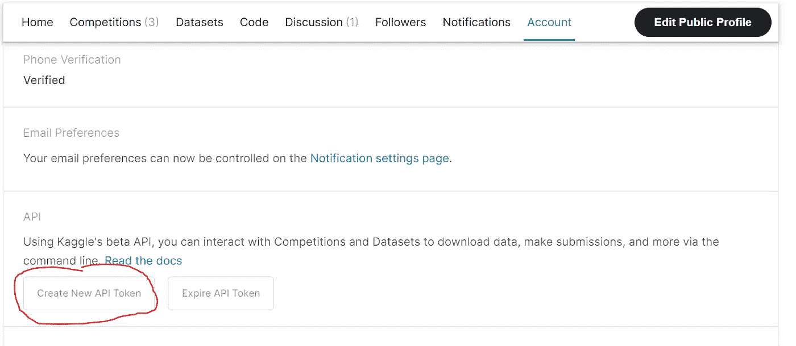
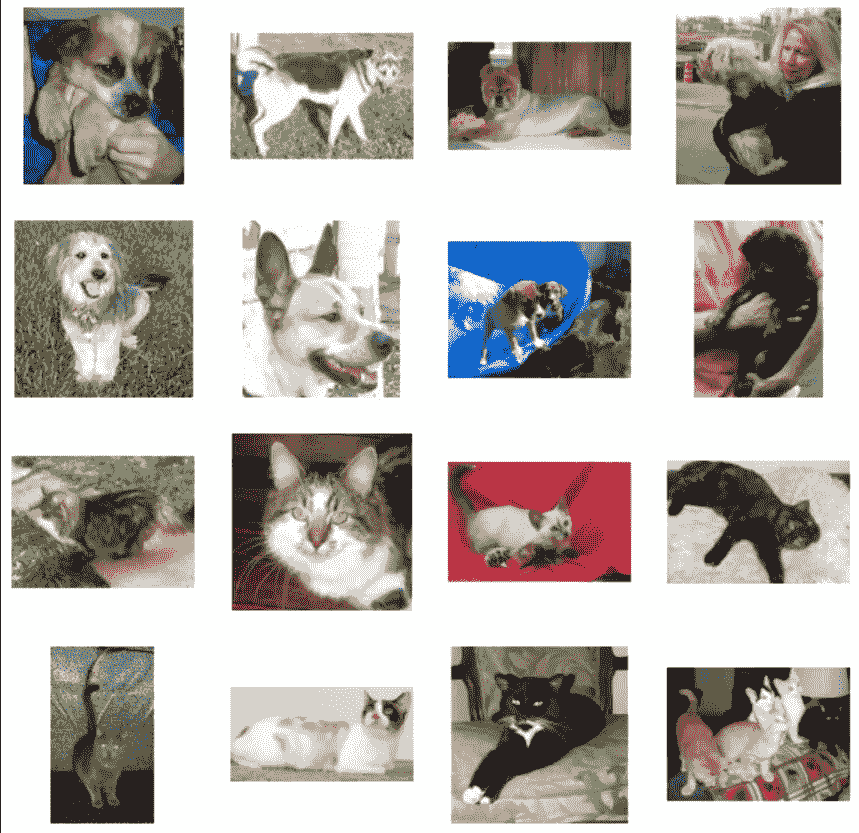
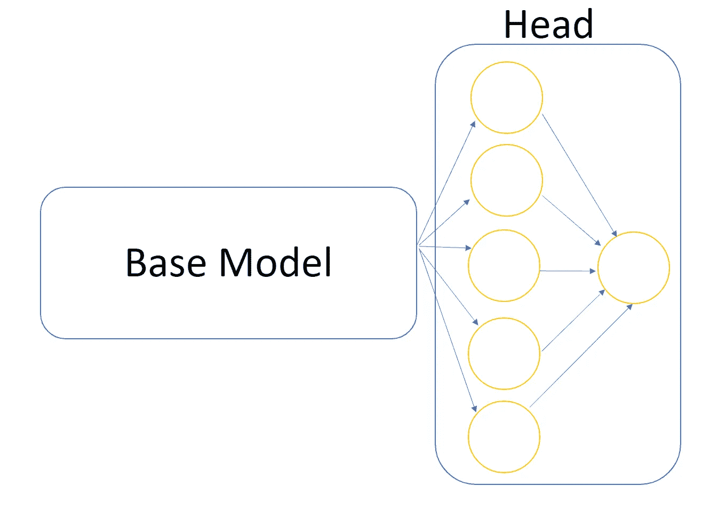

# PyTorch 中的二值图像分类

> 原文：<https://towardsdatascience.com/binary-image-classification-in-pytorch-5adf64f8c781>

照片由 [Unsplash](https://unsplash.com?utm_source=medium&utm_medium=referral) 上的 [Clément Hélardot](https://unsplash.com/@clemhlrdt?utm_source=medium&utm_medium=referral) 拍摄

## 采用迁移学习方法训练卷积神经网络

我个人使用 TensorFlow 来接近深度学习，我立即发现它非常容易和直观。很多书也用这个框架作为参考，比如 [*用 Scikit-Learn、Keras、Tensorflow*](https://www.amazon.it/Hands-Machine-Learning-Scikit-learn-Tensorflow/dp/1492032646/ref=asc_df_1492032646/?tag=googshopit-21&linkCode=df0&hvadid=386576436233&hvpos=&hvnetw=g&hvrand=9196245492590438572&hvpone=&hvptwo=&hvqmt=&hvdev=c&hvdvcmdl=&hvlocint=&hvlocphy=1008736&hvtargid=pla-523968811896&psc=1&tag=&ref=&adgrpid=78616235706&hvpone=&hvptwo=&hvadid=386576436233&hvpos=&hvnetw=g&hvrand=9196245492590438572&hvqmt=&hvdev=c&hvdvcmdl=&hvlocint=&hvlocphy=1008736&hvtargid=pla-523968811896) 动手机器学习。然后我注意到 PyTorch 经常被用于学术界和工业界的研究。所以我开始使用 PyTorch 实现我已经在 TensorFlow 中开发的简单项目，以便对这两者有一个基本的了解。由于我相信最好的学习方法是向别人解释，所以我决定写这篇动手教程，用 PyTorch 开发一个用于二值图像分类的卷积神经网络。

## 资料组

我们将使用*狗 vs 猫*数据集(有免费许可证)，你可以在以下链接找到:[*https://www.kaggle.com/datasets/biaiscience/dogs-vs-cats*](https://www.kaggle.com/datasets/biaiscience/dogs-vs-cats)。数据集是免费开放使用的。我将向您展示如何创建一个模型来解决这个二元分类任务，以及如何使用它对新图像进行推理。

为了下载这个数据集，首先要做的是使用您的凭证访问 [Kaggle](https://www.kaggle.com/) ，然后下载 *kaggle.json* 文件，您可以通过单击*创建新的 API 令牌*按钮获得该文件。

作者图片

首先，我们需要编写允许我们上传个人 Kaggle 令牌和下载数据集的代码。

从 Kaggle 下载数据

现在我们需要将下载的文件夹解压到一个新文件夹，我们将命名为*数据*。接下来，我们还将分别解压缩两个子文件夹*测试*和*训练*。

解压缩数据

## 构造并填充子文件夹

为了便于管理数据集，我们创建了一个易于管理的文件夹结构。
目标是有一个名为 *training* 的文件夹，其中包含子文件夹 *dog* 和 *cat* ，它们显然包含各自宠物的所有图像。
对*验证*文件夹应该做同样的事情。

创建子文件夹结构

现在我们只需要重组数据并填充这些新创建的子文件夹。

填充子文件夹

我们来绘制一些图像示例。

绘图示例

作者图片

## 创建数据加载器

现在我们要做 3 件事:

1.  让我们使用 *compose* 方法对数据进行预处理，这是一种简单的方法，可以对数据集应用多种预处理功能，比如标准化和数据扩充。
2.  让我们使用 *ImageFolder* 创建一个 pytorch 数据集。如果子目录结构定义良好，PyTorch 会自动推断出类(就像我们的例子一样)。
3.  使用*数据加载器*批量分割我们的数据。

创建数据加载器

## 训练阶跃函数

训练步骤总是由三个东西定义:*模型、优化器*和*损失函数*。因此，让我们编写一个函数，返回在输入这 3 个实体时给出的训练步骤函数。这样我们就不用一遍又一遍的重写同样的代码了！

训练阶跃函数

## 建立模型

在解决大多数 Kaggle 任务时，你不会从头开始编写一个网络，而是使用一个名为 *base_model* 的预训练模型，并使其适应手头的任务。把 *base_model* 想象成一个已经学会识别图像中重要特征的模型。我们要做的是通过增加一个由其他致密层组成的*头*来进行适配。在我们的例子中，最后的密集层将由单个神经元组成，该神经元将使用 *sigmoid* 激活函数，以便我们将具有为 0 或 1(猫或狗)的输出概率。

作者图片

我们必须小心不要训练之前已经训练过的基础模型。

让我们**下载一个预训练模型(resnet)并冻结所有参数**。然后我们将**改变最后一个线性层**以定制模型成为二进制分类器。**记住型号和数据必须在同一个设备(GPU)上**。

冻结预训练模型的参数

我们现在需要定义*损失*、*优化器*和*训练 _ 步骤*。

定义损失、优化程序和培训步骤。

## 训练模型

让我们写一下我们的培训和评估阶段。我们还将实现**提前停止**并在每个时期保存最佳模型。

训练和模型评估

由于我们从一个预先训练的模型开始，并且我们的二元分类任务非常简单，因此您应该很快就有一个能够非常准确地对数据集中的图像进行分类的模型。

## 推理

您现在可以使用该模型来预测新图像的标签！

对新图像的推断

## 结论

我们已经成功地建立了一个图像分类器来识别图像中的猫和狗。我必须说，在本文 的 [*中，我也用 Tensorflow 开发了相同的分类器，我发现 tensorflow 在这个简单的项目中使用起来更快。但是从我的角度来看，PyTorch 的优点是对从数据预处理到模型训练的各个步骤的更细粒度的控制。让我知道你的想法！*](https://medium.com/towards-data-science/transfer-learning-data-augmentation-for-robust-image-classification-643ca88b3175)

## 结束了

*马赛洛·波利蒂*

[Linkedin](https://www.linkedin.com/in/marcello-politi/) ， [Twitter](https://twitter.com/_March08_) ， [CV](https://march-08.github.io/digital-cv/)