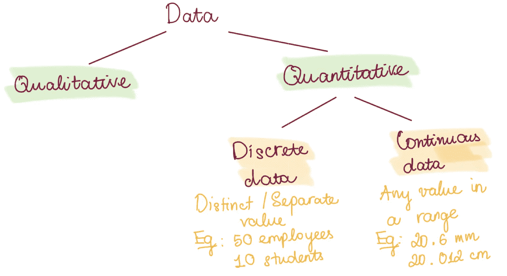
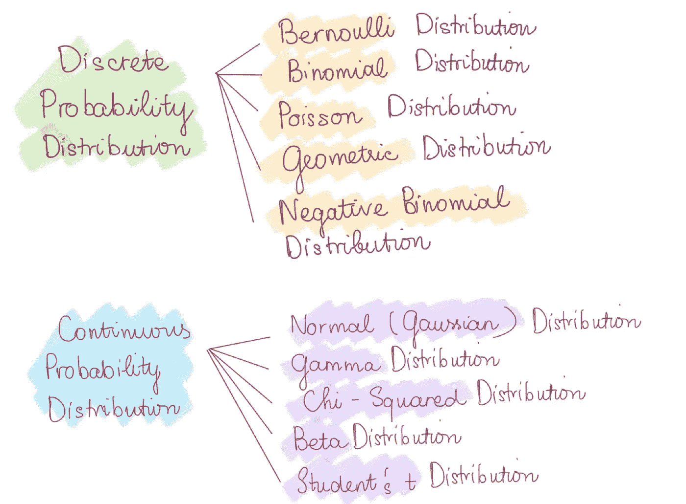
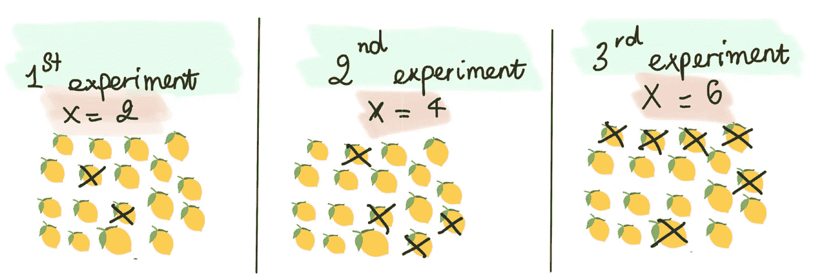
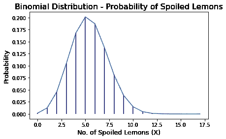
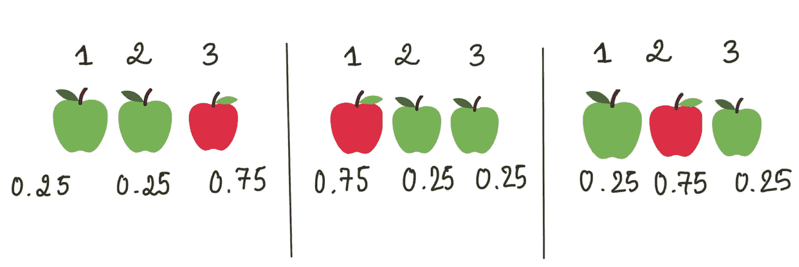
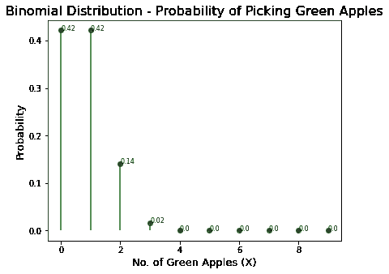
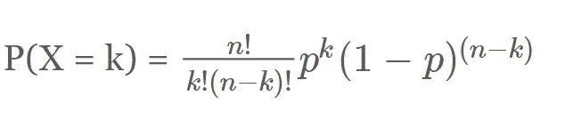
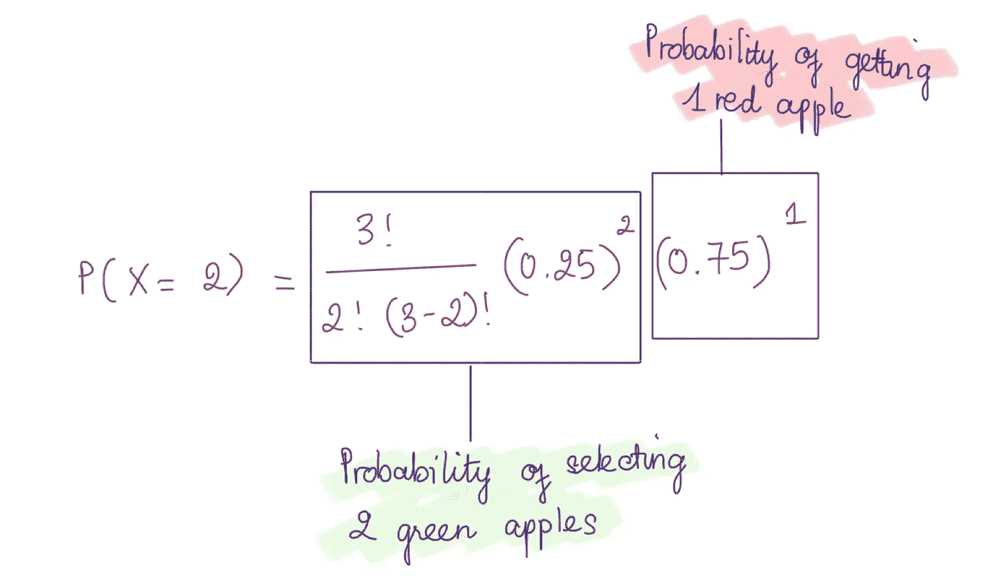

# 简单统计:二项式分布的解释

> 原文：<https://towardsdatascience.com/binominal-distribution-what-analysts-should-have-known-95e6a0b56129>

## 简要、集中的解释，并附有基本统计分布的图解。我们将从最基本的一个开始，二项分布。

迪米特里·亚基穆克在 [Unsplash](https://unsplash.com?utm_source=medium&utm_medium=referral) 上拍摄的照片

# 介绍

如前所述，统计学涉及到很多知识和定义。然而，当我回顾数据分析师的面试问题时，我想与您分享一些基本概念，我认为任何数据分析师在参加任何面试之前都应该完全了解这些概念。在接下来的几篇文章中，我将集中讨论的一个主题是演示和解释一些最常见的 ***、*** 数据分布，包括离散和连续数据。

正如我之前的帖子 [***简单解释基本统计学概念***](/simple-explanations-of-basic-statistics-concepts-part-1-bba66a1761d7) 一样，我通过举例说明的方式，简单解释了一些最基本的统计学。在这篇文章中，为了更容易想象，我将使用同样的方法。

# **离散与连续数据**

有两种类型的数值数据，离散数据和连续数据。

作者图片

**离散数据**被理解为不同的或独立的值。它是可数、有限、数字和非负整数。通常，数据在时间和空间上是离散分布的。一些离散值的例子包括一个公司的雇员人数，一所房子里的猫的数量，或者一个小时内买咖啡的人数。不可能有 10.25 个员工，2.5 只猫，或者 100.8 个人买咖啡。离散数据也可以是包含有限数量数据值的分类数据，如一年中的季节。

同时，**连续数据**可以是区间内的任意值。比如，我们来考虑一下女性头发的长度。它可以在高度精确的尺度上测量，例如 30.12 厘米、30.1 厘米、30.0001 厘米或 30.012 厘米。正如我们所见，十进制数和分数代表连续数据。

每种类型的数据都有不同的分布。我们将从离散分布开始，到连续分布，从最基本的分布开始:**二项分布。**

作者图片

# **随机变量**

随机变量是实验中可以取随机值的变量。假设随机变量代表随机选择的 18 个柠檬中发现的变质柠檬的数量。在这种情况下，18 个柠檬表示 18 次试验。我们可以进行不止一次实验，随机抽取 18 个柠檬，并计算有缺陷的柠檬数量。

作者图片

正如我们可以看到的，在我们的第一个实验中，有两个水果变质了。在我们的第二个实验中，有 4 个柠檬没有达到标准。在最后一个实验中，6 个柠檬变质了。这里的随机变量是 2，4 和 6。在之前的实验中发现的不合格产品的数量可以被称为一个随机变量。通常用字母 X 表示。这里，随机变量 X 取值为 2，4 和 6

# 二项式随机变量&二项式实验

二项式实验描述了 N 次独立试验的结果，随机变量 X 代表“N”次成功的次数。在这种情况下，x 被认为是一个二项随机变量。有两种截然不同的、互补的结果，一个“成功”和一个“失败”，每个试验都被假定会产生其中之一。因此，假设在一个测试 18 个柠檬的 18 次试验中，成功的次数(找到变质的柠檬)是一个样本空间为{0，1，2，3…18}的二项式随机变量。

此外，一个实验可以有 1 次试验、3 次试验或更多次试验。然而，如果该实验只有一次试验产生两种结果:成功或失败，则该试验被称为**伯努利试验。**

一个**随机实验**是一个**二项式实验**如果它满足以下要求:

*   有一定数量的试验
*   这些试验相互独立
*   每次试验的结果必须属于两种可能的结果之一:“成功”(期望的结果)或“失败”。
*   对于每次试验，都有一个恒定的成功概率 **p** 和失败概率 **(1 — p)** 。

# **二项式分布**

我将继续上面的柠檬例子。众所周知，在一个挑选 18 个独立且随机的柠檬的实验中，我们挑选的变质水果的数量(成功试验)或二项式随机变量可以是 0-18 之间的任何数字。二项式概率分布是一种概率分布，显示随机变量的概率为 0-18。

作者图片

假设我们在每次试验中挑选一个柠檬，我们想看看在 18 次试验中挑选 X = {0，1，2，…18}个变质柠檬的概率。在每次试验中，挑选一个腐烂柠檬的机会是 0.3 (p=0.3)。上面的二项分布表明了这个实验的结果。

那么，公式怎么会产生这个结果呢？让我们通过一个小例子来找出在 3 次试验中有 2 个青苹果被采摘的概率，给定总共 3 个青苹果和红苹果，并且在所有试验中 p = 0.25 一致。

作者图片

将会有三种情况发生。我们可以在前两次试验中，后两次试验中，或者前两次和最后一次试验中摘两个青苹果。摘两个青苹果的概率:

***P(X = 2)=(0.25)(0.25)(0.75)+(0.75)(0.25)+(0.25)(0.75)(0.25)= 0.14***

作者图片

根据这个原理，我们得到了二项分布问题的一般公式，其中 k 代表 n 次试验中的成功试验，p 是成功的概率。

作者图片

将该公式应用到我们的示例中，我们可以得到类似的结果。

作者图片

# 二项分布的实例

我们可以在很多现实生活中看到二项分布的例子。

*   在银行工作时，我们可以使用二项分布来确定一些信用卡交易欺诈的概率。假设某家银行的所有信用卡交易中有 0.75%是欺诈性的，通过使用二项分布，我们可以估计特定日期发生一定数量欺诈的概率。
*   同样，我们可以使用二项式分布计算器来估计某一天收件箱中垃圾邮件的数量。
*   等等

以上是我对如何定义二项分布的简短解释。我希望这篇文章能在某种程度上让你受益。在我的下一篇文章中再见！

# 参考

[https://vital flux . com/binomial-distribution-defined-with-10-examples/](https://vitalflux.com/binomial-distribution-defined-with-10-examples/)