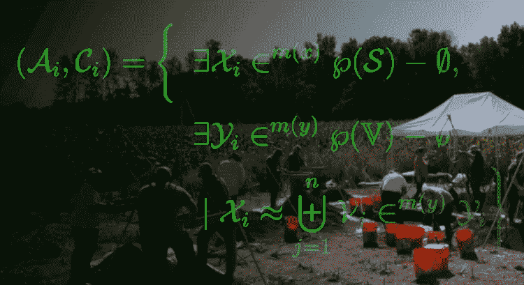
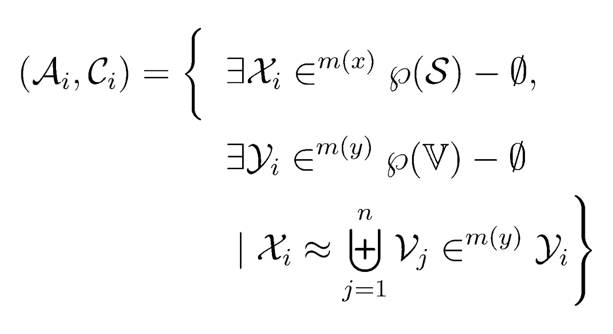
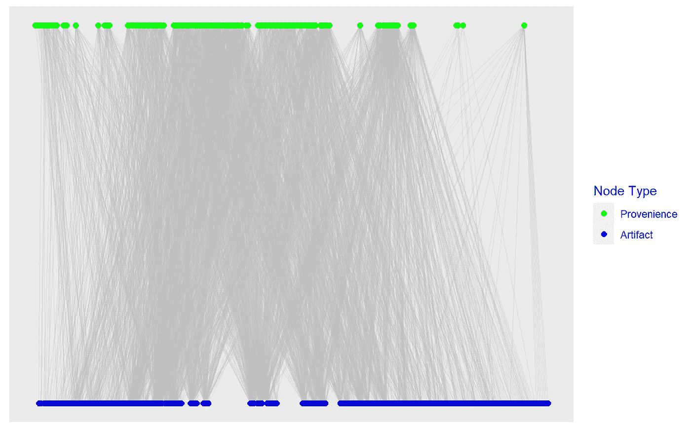
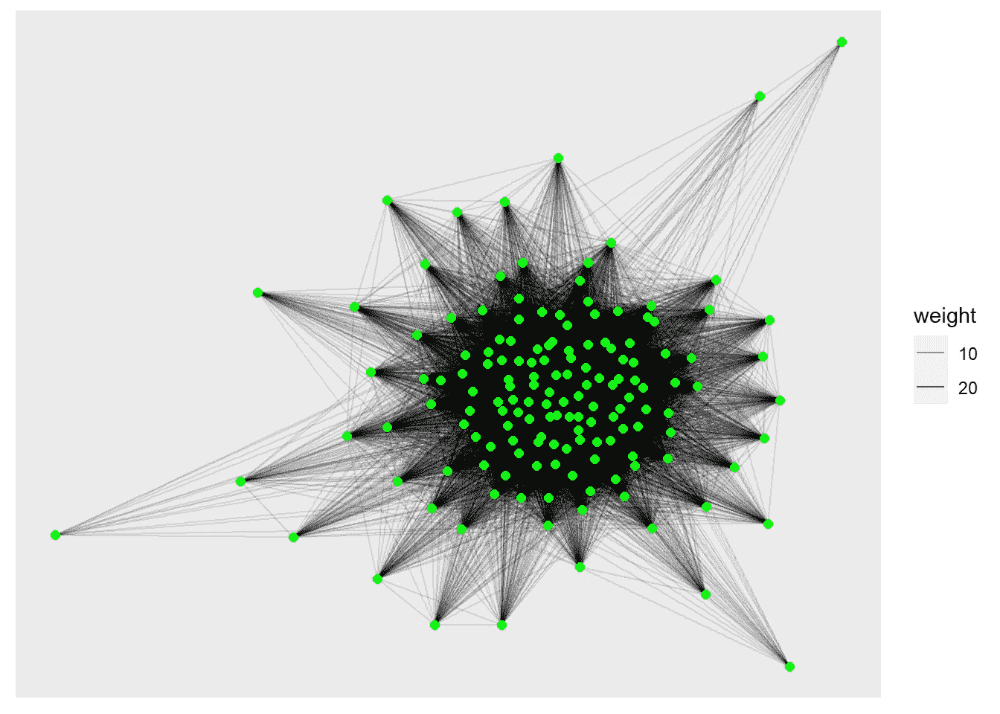
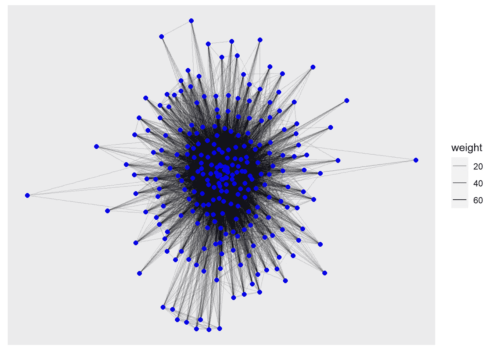
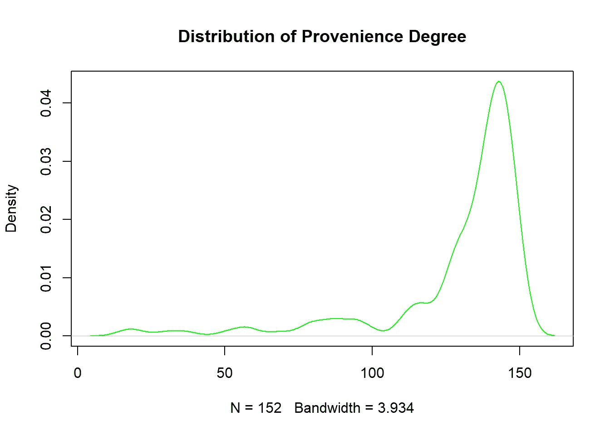
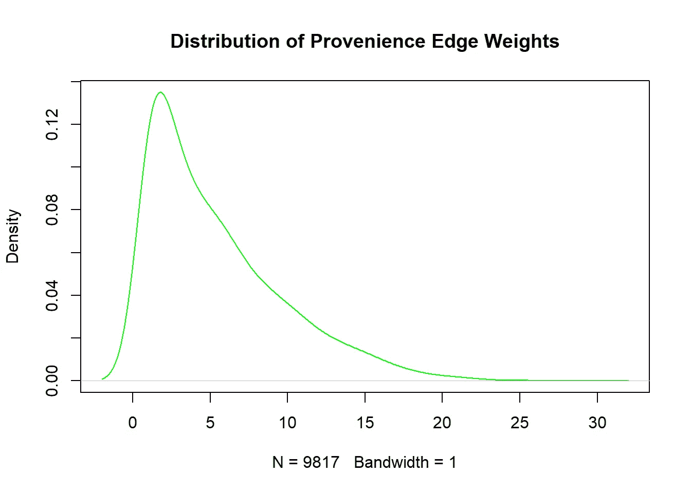
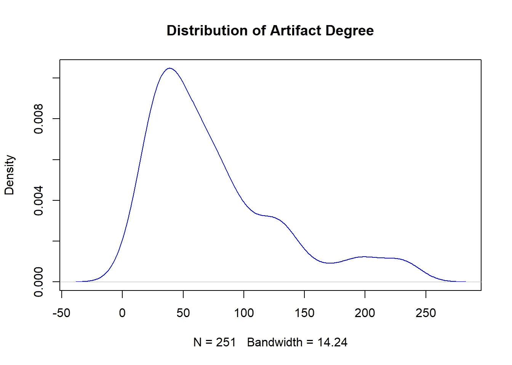
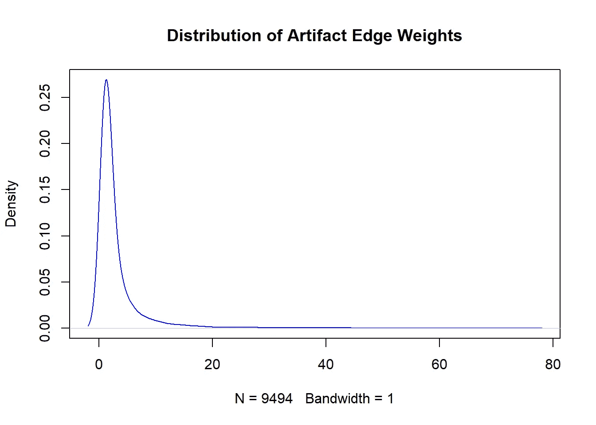

# 考古集合网络的二部图

> 原文：<https://towardsdatascience.com/bipartite-graphs-for-archaeological-assemblage-networks-part-i-648a2f20d389>

## 考古学中的数据科学，第一部分

数据考古学(图片由作者提供)。

我偶尔会被问到，尤其是在我决定“全力以赴”去获得另一个研究生学位之后，数据科学与考古学有什么关系。这将是一个简短系列文章的第一篇，展示我如何使用数据、统计等来深入了解这个令人惊讶的错综复杂的研究领域。基本上，当许多数据科学家试图对现在或未来做出推论时，我一直在寻找将这些方法应用于理解过去的方法。

虽然我用的是一个考古学的例子，但是这里介绍的方法可以用于其他领域的许多研究问题。二分图用于生物信息学(例如，基因表达关联)、密码学(代码解码匹配)、化学工程、推荐引擎(例如，客户-产品匹配)——即，其中实体之间的关系取决于某种中介关系的任何分析。

在这篇文章和接下来的文章中，我将介绍一些基础知识:

*   第一部分——创建和探索二分图和单模图
*   [第二部分](https://medium.com/towards-data-science/similarity-measures-and-graph-adjacency-with-sets-a33d16e527e1) —集合和图邻接的相似性度量，
*   第三部分—图结构和社区检测方法，
*   第四部分——地理空间网络

我将使用 R 进行[编码](https://github.com/archaeojsc/assemblage_network)，但是所有这些都可以用 Python 轻松完成。

# 介绍

从本质上讲，一个考古遗址是由相互关联的人工堆积物和特征组成的一个离散的空间区域。

不太正式的说法是*旧东西*散落在一个*地方*在那里*某人*做了*某事*。从很多方面来说，这是一个大拼图。想象你有一张照片(实物照片，而不是那些新奇的数码照片)。你不知道照片里的人是谁，也不知道他们在做什么。

现在想象一下，有人把那张照片撕成了成百上千个不规则的碎片…

*   *然后扔掉了至少一半……*
*   *然后将剩余的碎片撒在一块暴露在自然环境中的空地上……*
*   *然后被各种牲畜、人和动物践踏了几个世纪……*
*   后来有人来了，在他们上面建了新房子、道路或停车场！

所有这些留下来的东西很可能就是我们这些可怜的考古学家为了理解这幅画而留下来的数据。

考古学家的工作是在这些数据中寻找模式，以解释该地点随着时间的推移发生了什么。我们想知道他们在做什么事情，这通常能告诉我们过去的那些 T2 人是谁。我们通过在一个遗址区域进行非常精确控制的样本挖掘来做到这一点，然后尝试从这些样本中推断出不同种类文物的整体空间分布。

## 考古数据的结构

作为一名考古学家和数据科学家(排名不分先后)，我的工作是从那些挖掘出的样本中获取数据，看看我能否找到——并量化——这些模式。

所以，尝试做所有这些的第一部分是，看看哪些*的东西*被发现在一起，哪些*的地方*包含最相似的*的东西*是否有一个模式。

更正式地说，我们试图在由一组位置和一组工件组成的集合系统中找到子集。我几年前写过一篇文章([枢机 2019](http://doi.org/10.5334/jcaa.16) )，很详细的讲了那个*地方* - *东西*套系统的本质。这一切都可以归结为这样一件事:

集合符号将工件集合和 provenience context 系统定义为多个集合的和。

我承认，不太方便用户。相信我，看了我的文章(最终)就说得通了？

在图术语中，我们寻找的是同时跨越两个图的离散子图或社区(即，诱导子图或“集团”)，一个是地点，一个是工件类型。换句话说，一个双模式(或“二分”)图。

对于那些不熟悉的人来说，双模图是这样一种图，其中有两种互斥的*类型*的顶点(即节点),不同类型的顶点之间只能*存在边*。在这种情况下，我们有*地点*和*事情*。

目前，我们只想知道哪些*事物*最常出现在同一个*地点*，哪些*地点*包含类似的*事物*。工件之间的*可观察的*关系由它们的同位置(即存在于相同的产地)来表示。然而，从更广泛的意义上来说，我们的目标是研究*为什么*这些文物会一起出现——它们是否来自同一时期，它们是否反映了特定类型的活动，它们是来自一个还是多个家庭，等等。这些问题的答案是不可观测的，但是人造物品的位置和协同位置是可观测的。

以下示例中使用的数据来自一个*实际的*考古遗址(一个家庭结构的集合，大约在 18 世纪中期到 20 世纪被占用)，而不是一个玩具示例或模拟数据。因此，它就像真实世界的数据一样混乱——文物和产地的分组并没有清晰地分类，而是(剧透警告！)在空间组织和集合中确实存在集群。我们将走过我用来寻找和评估这些类型的模式的过程的一部分。

# 在 R 中制作二部图

我们可以用包`igraph`很容易地创建一个二分图，尽管它没有太多直接分析双模图的方法。出于我们的目的，这不是什么大问题，因为我们主要感兴趣的是使用它作为一种方式来获得每个单模图(即，*分别放置*和*事物*)。

我们将使用的包是`igraph`(创建、操作和分析图表)、`tidyverse`用于数据框管理，以及`ggraph`用于可视化。当然，还有其他的软件包也可以工作。这些只是我已经习惯使用的。

首先，我们将从文本文件导入数据，这是工件目录的数据库。其中列出了在每个位置发现的每个工件类型的详细信息(称为“provenience”)。我们现在并不真正需要关于每个工件类型的细节，因为我们只是在寻找关联，所以我们只真正需要两个字段——provenience(`LEVEL_ID`)和工件类型代码(`CODE`)。

接下来，我们使用数据帧`dat`中*唯一的*对`LEVEL_ID`和`CODE`来创建带有`graph_from_data_frame`的双模无向图(`assemblages_bpg`)。

这是一个*无向*图，因为顶点的排序或层次没有任何实际意义。这种关系是双向的——一个*位置*包含*事物*，而*事物*在那个*位置*中是等价的。为了简单起见，我们将创建一个 *un-* 加权二分图，它忽略了多重性(也就是说，每种工件类型的*数量*是如何在每个地方被发现的)。现在，我们只考虑类型的共存或同处。

然后，我们使用方法`bipartite_mapping`根据节点来自两列中的哪一列来给顶点分配类型。

人工制品-产地联系的二分图。

现在我们有了工件类型和位置之间的连接图，并且我们已经可以在每个顶点类型中看到一些粗略的分组(一个类型在图的顶部，一个在底部)。这个图是密集连接的，有许多节点和边。

让我们快速看一下二分`igraph`对象本身:

顶部的文本`IGRAPH 2ea26e5 UN-B 403 2533 --`告诉我们它是无向的(`U`)，节点有一个`name`属性(`N`)，是无权重的(`-`)，并且是一个有 403 个顶点和 2533 条边的二分图(`B`)。在列出的边预览中，您将看到数字和文本对(例如，`1726--UDB`)，它们是数字来源(`LEVEL_ID`)和文本工件类型代码(`CODE`)的组合。

我们可以很容易地用(shock！)方法`as_incidence_matrix`并查看前几行和前几列…

它只是一个二元的双模式权变表或双模式邻接表，显示了在每个位置工件类型的存在(`1`)或不存在(`0`)。

## 投射每种模式进行分析

直接分析二分图度量有点复杂，因为图的最常见度量(例如，中心性度量等。)由于包含这两种类型的顶点以及它们之间的依赖关系而被扭曲。更容易做的是投影每个模式的*加权*图，然后分析它们。

同样，`igraph`使这变得容易。我们使用方法`bipartite_projection`和设置`multiplicity = TRUE`，以便为每个模式创建加权图形投影。因为我们的目标是将具有*最多*工件类型共性的产地和最经常一起出现的类型联系起来，所以我们需要这些多样性。

您将看到我们现在有两个单模图，分别是用于 proveniences 的`$proj1`和用于 artifact 类型的`$proj2`。剩下的就是将这些投影分配给它们自己的单模态图。

让我们来看看由此产生的图形投影。

普罗旺斯投影图。

工件类型的投影图。

这两个图显然都非常密集，在这一点上，很难判断其中是否有任何模式或社区。我们需要对它们进行一些探索，找出所有这些联系在告诉我们什么。

> 现在我们已经有了两个单模图，你可能想知道— *为什么要大费周章地制作一个二分图呢*？有几个原因。
> 
> 第一，我们正在寻找的关系和关联是两个实体之间的互动*。从概念上讲，这应该有一定的意义。考古上可观察到的不同类型的艺术品之间的联系主要是通过共处一地来实现的。类似地，proveniences 是相关的，因为它们包含相似的工件类型。这些关联本身本质上是二分的，所以通过用*初始化我们的图表*，这种关系就是解决它们的正确方法。*
> 
> 其次，这只是一种优雅的方式。当然，我们可以通过构建数据透视表和列联表，然后将它们转换成邻接矩阵和图，从源数据表构建各个图。然而，通过这种方式构建，我们减少了一大堆步骤，并且用几行非常简单的代码构建了我们的两个图！作为一个额外的好处，我们可以很容易地拉出那些单独的列联表，就像我们在开始时对关联矩阵所做的那样。为什么要做额外的工作？

# 分析投影图

如果你注意到上面，我们的两个单模图都非常密集。例如，普罗旺斯图`G_assemblage_prov`有 9817 条边，但只有 152 个顶点？无向图中可能的最大边数是 1/2 × |V| × (|V|-1)，因此对于 152 个顶点，最大边数是 11，476，我们的图的密度约为 86%。

我们将从查看顶点的*度*的密度分布开始，或者每个顶点连接了多少个其他顶点。

我们从分布的左偏看到，大多数顶点实际上都与大多数其他顶点相连。如果这是真的，那么就不会有任何不同的产地(即没有群落结构)，86%的密度只是表明一个相对同质的网站。

现在，让我们看看这些边的权重分布。

这里我们看到了相反的情况——分布是右偏的，这意味着我们的绝大多数边缘都是由*弱*相似性形成的(即，只有少量的共同伪像)。

所以现在我们知道*为什么*我们的产地图如此密集——如果只需要一个或多个共同点来连接两个地点，并且大多数产地至少有一个共同点，那么一切都联系得很好。

也许某些藏物类型只是在很多地方出现？我们需要找到一种方法来细化图表，这样只有真正有意义的 T2 连接才能形成边。

接下来让我们看看我们的工件图`G_assemblage_artifact`。它没有*像*那么密集(251 个顶点，可能的 31，375 条边中的 9，494 条，所以大约 30%)，但是我们将再次查看顶点度数和边权重密度。

这里我们看到*有点*向右倾斜的程度密度分布，但是大多数是相当强连接的(~50+连接)，并且注意到向右尾部的“凸起”——似乎至少我们的一些工件类型*确实*出现在大多数其他工件旁边。

伪影边缘权重严重向右倾斜，请注意右尾延伸的距离。这告诉我们的是，一些，但不是很多，藏物类型出现在很多地方。然而，大多数人工制品类型只共存于相当少的几个(大约 3-4 个)产地。

# 度和边权重的解释

我们现在大致了解了在我们的系统中发生了什么*地方* - *事情*集合:

*   这两个独立的投影图都是密集的，但大多数连接都很弱。
*   似乎很可能是每组中相对较少数量的项目产生了这些弱连接。某些工件出现在大量的 provenience 中，并且一些 provenience 包含大量不同的工件类型。
*   这些微弱但密集的连接可能掩盖或淹没了图表中的潜在结构。

我们接下来需要做的是找到一种方法来区分*信息*连接和*虚假*连接。

# 接下来的步骤…

有人可能会认为，显而易见的下一步将是简单地开始删除最薄弱的边缘，在某些情况下，这将是要走的路。请记住，我们的目标实际上是分析工件和位置之间的*关系*(即连接边)。单个顶点的强度不是目标，而是我们想要识别从它们的关系中得到的顶点的*社区*。[3]

发生的事情是，我们用来设计单模态图的方法只是简单地列出了个体产地和人工制品类型重合的次数。问题是一个共享的工件可以连接位置，一个共享的位置连接工件。这不是我们想要的。我们想要链接具有最相似的同现*集合*或*轮廓*的顶点。换句话说，我们需要查看集合*和*的交集，它们的不同之处是为了确定相似之处。

为此，我们需要一种不同的投影方法。在下一部分中，我们将研究一些基于集合的相似性度量，并看看当我们以这种方式投影单模图时会发生什么。

## 参考

红衣主教 j .斯科特。2019."集合、图形和我们能看见的东西:用于经验站点内分析的形式组合本体论."计算机在考古学中的应用杂志 2(1):56–78。https://doi.org/10.5334/jcaa.16[。](https://doi.org/10.5334/jcaa.16)

## 笔记

1.  佐治亚理工学院计算学院、谢勒商学院和工程学院的分析理学硕士。我强烈推荐这个节目！
2.  我的考古同事有时也会反过来问我——考古学与*数据科学*有什么关系。定量和计算(或“数字”)考古学已经存在了很长一段时间，但我们仍然是少数。不过，这是另一篇文章的主题。
3.  精通图论的读者可能已经注意到，我们的最终目标是边介数和中心性度量。