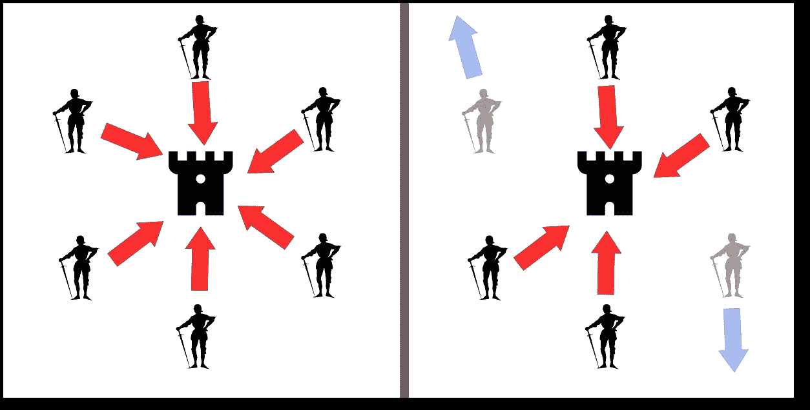
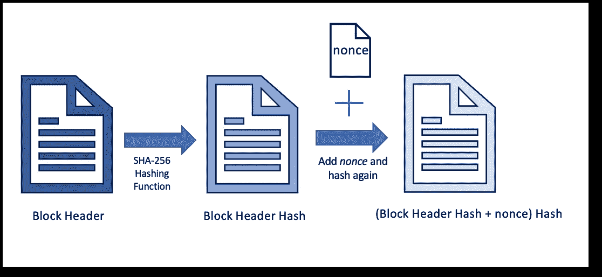
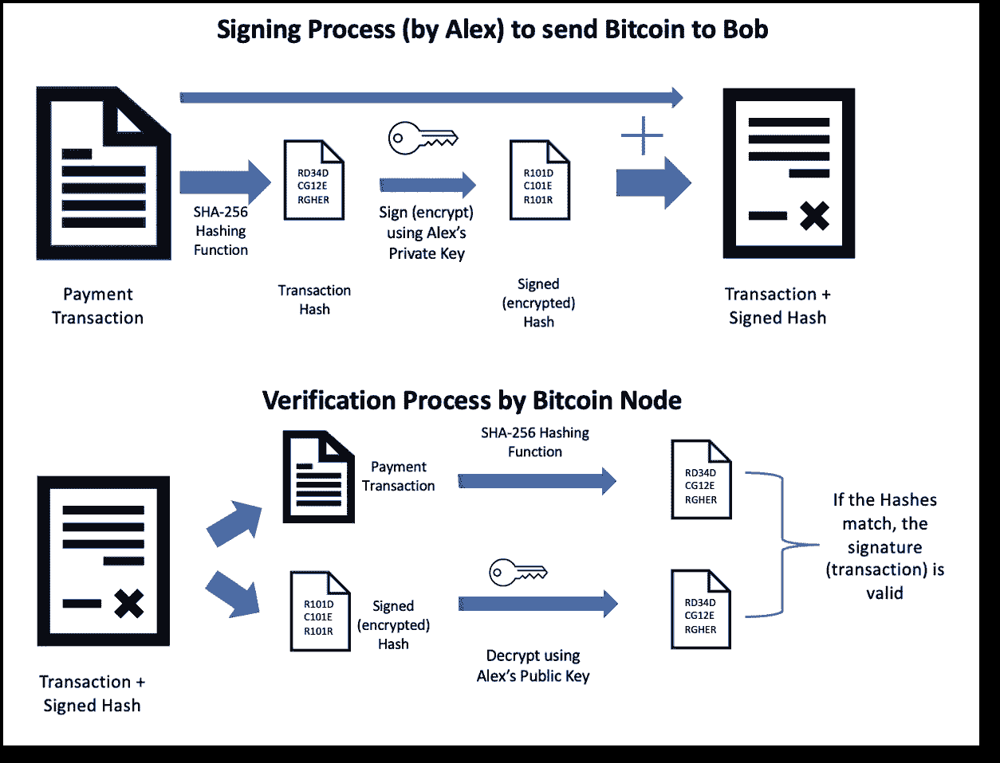
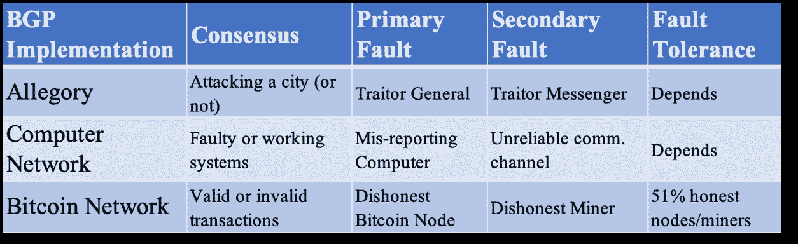

# 比特币的技术贡献:解决拜占庭将军问题

> 原文：<https://towardsdatascience.com/bitcoins-technical-contribution-solving-byzantine-general-s-problem-f0449973437c>

## 2008 年比特币白皮书如何解决经典的计算机科学共识问题

图 1:贝尔伯里勋爵对拜占庭将军问题的阐释，CC BY-SA 4.0 / [来源](https://commons.wikimedia.org/wiki/File:Byzantine_Generals.png)

## **问题陈述**

拜占庭将军问题(BGP)是根据一个寓言而命名的，在这个寓言中，许多将军需要合作并同意同时一起攻击一个城市，以赢得战斗(图 1-左)。如果任何一个将军在最后一刻撤退，战斗就失败了(图 1-右)。因此，确保信使共享准确的信息以及没有流氓将军是至关重要的。在缺乏可信的中央权威的情况下，这是很难实现的。

Leslie Lamport、Robert Shostak 和 Marshall Please 在他们 1982 年的论文[中把这个问题命名为*拜占庭将军问题*，以一种用户友好的方式表示分布式计算机系统问题。](https://www.microsoft.com/en-us/research/uploads/prod/2016/12/The-Byzantine-Generals-Problem.pdf)

实际问题是关于计算机系统的分布式网络中的一致性。维护一个正常运行的系统网络变得很困难，因为要就哪些系统正在工作(并留在网络中)和哪些系统没有工作(即需要从网络中移除)达成共识。系统之间不可靠的通信渠道和误报系统加剧了这一挑战。

解决 BGP 还可以指导我们构建没有单点故障或不需要可信中央实体的机器学习解决方案。例如，在模型训练期间，单个服务器托管模型的参数，而多个工人训练模型。这篇[论文](https://dl.acm.org/doi/10.1145/3382734.3405695)，描述了一种构建容错*分布式拜占庭机器学习*解决方案的方法。

比特币的技术创新在于，它找到了一种方法，让分布式节点网络就哪些交易应该进入分布式账本(区块链)达成共识，而不需要可信的中央实体。这样，它解决了 BGP 的实现问题。*比特币的笔名作者中本聪*创造性地结合了已有的密码学和共识机制来解决问题。

## 放弃

这篇文章并不意味着任何形式的财务建议。这是一篇关于解决计算机科学问题的有趣方法的综述。

## **比特币**

比特币白皮书的第一行写道:

> “电子现金的纯点对点版本将允许在线支付直接从一方发送到另一方，而无需通过金融机构。”
> 来源:[https://www . ussc . gov/sites/default/files/pdf/training/annual-national-training-seminar/2018/Emerging _ Tech _ bit coin _ crypto . pdf](https://www.ussc.gov/sites/default/files/pdf/training/annual-national-training-seminar/2018/Emerging_Tech_Bitcoin_Crypto.pdf)

让我来解开比特币的主要组成部分:

1.  *比特币软件*(开源&版本)，执行节点、矿工和比特币令牌的操作规则。
2.  *比特币令牌*，可以通过挖掘生成的原生令牌单位(最多 2100 万)，在比特币区块链的钱包地址之间进行交换。
3.  *分布式分类账*，自 2009 年 1 月第一笔交易以来所有交易(以区块组织)的数据库(区块链)的相同副本。
4.  *分布式网络的* *节点(计算机)*运行比特币软件和一份分布式账本。它们验证和接受有效的事务，并将它们传播到其他对等节点。
5.  *工作证明(PoW)* ，一种加密证据(以有效哈希摘要的形式)，表明矿工已经花费了一定量的计算处理(挖掘工作)来解决加密问题，以获得向比特币区块链添加新交易块的权利。比特币有一个内置的难度调整功能，可以改变有效哈希要求(nonce*的长度*)，这样平均每 10 分钟就会产生新的区块。PoW 是一种能量密集型活动，因为它必须不断随机生成新的散列，直到它满足需求。
6.  *挖掘者，*执行持续计算处理以解决重复出现的密码问题的竞争方。为区块解决问题的第一个矿工(或池)收取交易费和一些新创建(开采)的比特币作为奖励。挖掘能力以哈希速率的形式来衡量，即每秒生成多少个哈希。

比特币最重要和最新颖的特点是结合了加密技术、分散的节点网络和工作证明共识机制。

## 比特币中使用的加密技术

比特币在其实现中使用以下已知的加密技术。

1.  散列法
2.  基于非对称加密的数字签名

**散列法(SHA-256)**

图 2:块头的 Hash + *nonce* 上的 SHA-256 哈希运算

哈希是唯一明文数据到唯一摘要的单向转换。将不可能逆转该操作，即从摘要生成明文。比特币矿工使用 SHA-256 哈希算法不断生成新的哈希，目标是获得有效的哈希以获得区块奖励。

哈希从当前块头生成，然后与一个名为 *nonce* 的变量值结合生成一个新的哈希。挖掘过程需要不断改变*随机数*并重新散列以尝试得到满足要求的散列。

块头本身由前面块的散列和一个称为 Merkle root 的特殊散列组成，Merkle root 包含块中所有事务的散列。因此，我们得到了一个块链，一直链接到第一个块，散列层不断增加。哈希算法确保了比特币区块链中新交易的安全性和整个交易的不变性。随着在任何事务的块之后挖掘更多(例如，6 个)块，在该块和先前块中伪造甚至很小的条目变得越来越不可能。

**基于非对称加密的数字签名**

图 3:使用非对称加密和散列操作的事务签名和验证过程

在非对称加密(也称为公钥加密)中，每个交易方都有一个密钥对，即私钥和公钥。私钥不应该与任何人共享，而公钥(即由此生成的钱包地址)可以与交易方共享。来自同一个密钥对的这两个密钥在数学上以这样一种方式联系在一起，即公钥可以从私钥中导出，但反之则不行。消息(例如，比特币支付记录)只能由拥有私钥的所有者(发送者)签名，但是它可以由任何节点或任何能够访问公钥的人(即，在区块链中可见的人)来验证。例如，如果 Alex 想要向 Bob 发送比特币，则 Alex 将向节点发布地址为 Bob 的钱包的期望数量的比特币的数字签名交易。只要 Alex 是唯一拥有私钥的人，只有 Alex 可以授权该金额。因为 Alex 的公钥在区块链上可用，所以任何人都可以验证该交易。

# 解决办法

现在，让我们将比特币实现映射到 BGP 问题。BGP 的*将军*类似于运行比特币软件的*节点*。*共识*、将军*和*试图达成的共识，就像比特币节点决定将哪块交易纳入区块链一样。所有*节点*运行的比特币软件版本可以:

1.验证交易(即验证数字签名)

2.只接受和传播来自能够第一个获得有效散列并证明它做了必要工作的挖掘器的新块。除了通过使用以下输入连续生成新的散列之外，没有办法猜测有效散列:固定/当前块头和称为 *nonce* 的变量的新值。

因此，共识由 PoW 机制和分布式节点网络来解决，该分布式节点网络接受来自解决不可伪造的密码问题的挖掘者的块。

但是，如果有:

1.  不诚实的节点
2.  不诚实的矿工

如果由于流氓节点，不同节点组接受的块集合存在差异，比特币具有接受最长链的功能。因此，对于进入区块链的无效交易，流氓节点在接受/形成更长的链方面将不得不多于诚实节点。截至目前(2022 年 11 月)，将接管 7000 个([来源](https://bitnodes.io/))协同流氓节点劫持比特币网络。

类似地，不诚实的矿工也可以发起攻击，并试图用伪造的交易(例如，双重消费、撤销、审查交易等)潜入区块。)入链。这也需要超过 50%(即 *51%的攻击*)的挖掘者(总计算能力)来猜测散列并对网络发起攻击。目前挖掘哈希率超过 2 亿([来源](https://www.blockchain.com/explorer/charts/hash-rate))。矿工被激励去合作(通过奖励和交易费),而不是发起攻击。然而，量子计算机在未来可能会带来风险。

在这里看我关于量子计算的相关帖子。

</what-is-a-quantum-computer-f1c44e87a379>  

最终，节点比挖掘者具有更大的影响力，因为节点可以验证交易，并且如果挖掘者向它们提供欺诈性块，则拒绝它们。因此，只要诚实的节点占大多数，网络就能保持安全。

## 摘要

表 1 显示了拜占庭将军问题的三种实现之间的比较。

表 1:拜占庭将军问题实现的比较

比特币白皮书及其实现解决了没有任何中央治理实体的分布式系统所经历的共识问题。这样，它解决了难以捉摸的拜占庭将军的问题。

## 资源

1.  [https://en.wikipedia.org/wiki/Byzantine_fault](https://en.wikipedia.org/wiki/Byzantine_fault)
2.  比特币核心软件源代码—[https://github.com/bitcoin/bitcoin](https://github.com/bitcoin/bitcoin)
3.  比特币白皮书—[https://bitcoin.org/bitcoin.pdf](https://bitcoin.org/bitcoin.pdf)
4.  https://en.wikipedia.org/wiki/Bitcoin
5.  [https://www . Microsoft . com/en-us/research/publication/拜占庭将军问题/](https://www.microsoft.com/en-us/research/publication/byzantine-generals-problem/)
6.  [https://www . Microsoft . com/en-us/research/uploads/prod/2016/12/The-Byzantine-Generals-problem . pdf](https://www.microsoft.com/en-us/research/uploads/prod/2016/12/The-Byzantine-Generals-Problem.pdf)
7.  [https://en.wikipedia.org/wiki/Hash_function](https://en.wikipedia.org/wiki/Hash_function)
8.  [https://en.wikipedia.org/wiki/Merkle_tree](https://en.wikipedia.org/wiki/Merkle_tree)
9.  [https://en.wikipedia.org/wiki/SHA-2](https://en.wikipedia.org/wiki/SHA-2)
10.  [https://en.wikipedia.org/wiki/Public-key_cryptography](https://en.wikipedia.org/wiki/Public-key_cryptography)
11.  [https://en.wikipedia.org/wiki/Digital_signature](https://en.wikipedia.org/wiki/Digital_signature)
12.  [https://en.wikipedia.org/wiki/Proof_of_work](https://en.wikipedia.org/wiki/Proof_of_work)
13.  [https://en.wikipedia.org/wiki/Quantum_cryptography](https://en.wikipedia.org/wiki/Quantum_cryptography)
14.  [https://dci.mit.edu/bitcoin-security-initiative](https://dci.mit.edu/bitcoin-security-initiative)
15.  [https://dci.mit.edu/51-attacks](https://dci.mit.edu/51-attacks)
16.  *真正分布式拜占庭机器学习* ***，****El-Mahdi El-Mhamdi 等人，2020。纽约州纽约市 ACM，*[*https://doi.org/10.1145/3382734.3405695*](https://doi.org/10.1145/3382734.3405695)