# Python 中的黑盒超参数优化

> 原文：<https://towardsdatascience.com/black-box-hyperparameter-tuning-in-python-478c10adc959>

## Python 中暴力和黑盒优化方法的比较


图片由 [PhotoMIX 公司](https://www.pexels.com/@wdnet/)在[像素](https://www.pexels.com/photo/documents-on-wooden-surface-95916/)上拍摄

在机器学习中，超参数是用于控制机器学习模型的学习过程的值。这不同于从数据中学习的内部机器学习模型参数。超参数是机器学习训练数据之外的值，其确定机器学习模型性能的最优性。每个唯一的超参数集对应于一个唯一的机器学习模型。对于大多数现有技术的机器学习模型，所有可能的超参数组合的集合可能变得相当大。幸运的是，大多数机器学习模型包都带有默认的超参数值，可以实现不错的基线性能。这意味着数据科学家或机器学习工程师可以使用开箱即用的模型，而不必一开始就担心超参数选择。这些默认模型通常优于数据科学家或工程师能够手动测试和选择的模型。

相反，为了优化性能，数据科学家或机器学习工程师必须测试不同于默认值的超参数的各种值。手动执行会变得非常麻烦和低效。由于这个原因，已经设计了许多算法和库来自动化超参数选择的过程。超参数选择是优化中的一个练习，其中目标函数由模型表现的有多差来表示。优化任务是找到一组最佳参数，使机器学习模型的性能下降到最低程度。如果你找到性能最差的机器学习模型，那就对应着性能最好的模型。

文献跨越、蛮力技术和黑盒非凸优化为优化提供了丰富的空间。强力优化是彻底搜索所有可能的超参数组合的最佳参数集的任务。如果有可能彻底搜索超参数空间，它将给出给出全局最优解的超参数集。不幸的是，就计算资源和时间而言，穷举搜索超参数空间通常是不可行的。这是因为超参数调整机器学习模型属于非凸优化的范畴。这是一种优化类型，其中找到全局最优是不可行的，因为它可能陷入几个次优“陷阱”中的一个，也称为局部最小值，这使得算法难以搜索超参数的整个空间。

强力优化的替代方法是黑盒非凸优化技术。黑盒非凸优化算法寻找次优的解决方案，局部最小值(或最大值)，这是基于一些预定义的度量足够优化。

Python 有暴力优化和黑盒优化的工具。模型选择模块中的 [GridSearchcv](https://scikit-learn.org/stable/modules/generated/sklearn.model_selection.GridSearchCV.html) 支持强力优化。 [RBFopt](https://rbfopt.readthedocs.io/en/latest/rbfopt_algorithm.html) python 包是 IBM 开发的黑盒优化库。它通过使用径向基函数来构建和优化被优化函数的代理模型。它很有用，因为它没有对被优化函数的形状或行为做任何假设。它已被用于优化复杂的模型，如深度神经网络。

构建、测试和比较模型超参数和机器学习算法的任务本质上通常是协作性的。考虑到这一点，我将与 [DeepNote](https://deepnote.com/home) 合作，这是一个协作数据科学笔记本，使数据科学家可以轻松地在机器学习和数据分析任务上合作。在这里，我们将介绍如何应用这些优化工具来调整分类模型的超参数。我们将考虑预测客户是否不会重复购买的监督机器学习任务，这被称为搅动。我们将使用 Kaggle 上公开的虚构的[电信公司流失](https://www.kaggle.com/datasets/blastchar/telco-customer-churn)数据集。数据集在 [Apache 2.0 许可](https://www.apache.org/licenses/LICENSE-2.0)下可以自由使用、修改和共享。

**读入电信客户流失数据**

首先，让我们导入 python pandas 库，将我们的数据读入 pandas 数据框，并显示前五行数据:

进口熊猫作为 pd

```
df = pd.read_csv("telco_churn.csv")
```

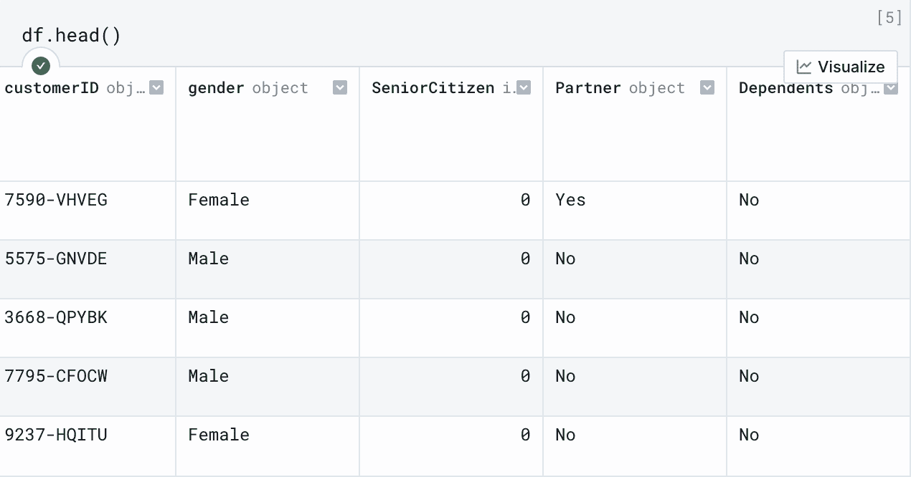

作者截图

我们看到该数据包含诸如客户 ID、性别、老年公民身份等字段。如果我们将光标悬停在左侧的单元格输出上，我们将看到以下内容:

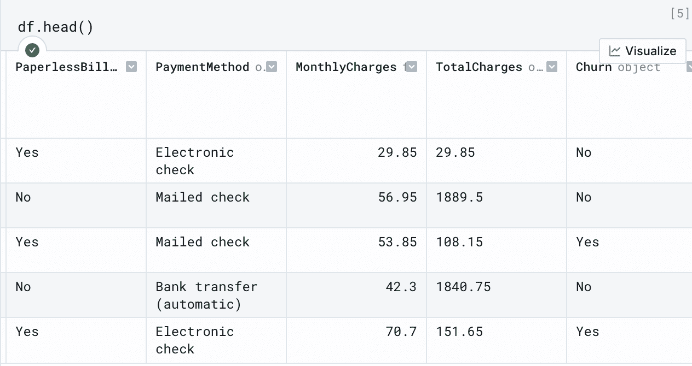

作者截图

我们看到我们有“客户流失”字段，它对应于客户是否重复购买。值“否”表示客户重复购买，值“是”表示客户停止购买。

我们将建立一个简单的分类模型，将性别、老年人、互联网服务、设备保护、每月费用和总费用作为输入，并预测客户是否会流失。为此，我们需要将我们的分类列转换为机器可读的值，这些值可以作为输入传递给我们的机器学习模型。让我们为性别、老年人、互联网服务和设备保护这样做:

#转换分类列

```
#convert categorical columns
df['gender'] = df['gender'].astype('category')
df['gender_cat'] = df['gender'].cat.codes
df['SeniorCitizen'] = df['SeniorCitizen'].astype('category')
df['SeniorCitizen_cat'] = df['SeniorCitizen'].cat.codes
df['InternetService'] = df['InternetService'].astype('category')
df['InternetService_cat'] = df['InternetService'].cat.codes
df['DeviceProtection'] = df['DeviceProtection'].astype('category')
df['DeviceProtection_cat'] = df['DeviceProtection'].cat.codes
```

让我们显示结果列:

```
df[['gender_cat', 'SeniorCitizen_cat', 'InternetService_cat', 'DeviceProtection_cat']].head()
```

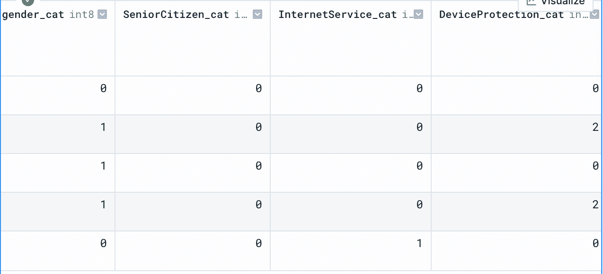

作者截图

我们还必须对客户流失列做一些类似的事情:

```
df['Churn'] = df['Churn'].astype('category')
df['Churn_cat'] = df['Churn'].cat.codes
```

接下来我们需要做的是清理 TotalCharges 列，用 NaN 替换无效值，并用 TotalCharges 的平均值输入 NaNs

```
df['TotalCharges'] = pd.to_numeric(df['TotalCharges'], 'coerce')
df['TotalCharges'].fillna(df['TotalCharges'].mean(), inplace=True)
```

现在让我们准备输入和输出。我们将定义一个变量 X，它将是一个包含列 gender、SeniorCitizen、InternetService、DeviceProtection、MonthlyCharges 和 TotalCharges 的序列。我们的输出将是一个名为 Y 的变量，它将包含客户流失值:

```
#define input and output
X = df[['TotalCharges', 'MonthlyCharges', 'gender_cat', 'SeniorCitizen_cat', 'InternetService_cat', 'DeviceProtection_cat']]
y = df['Churn_cat']
```

接下来，让我们拆分数据进行训练和测试。我们将使用 scikit-learn 中模型选择模块的训练测试分割方法:

```
from sklearn.model_selection import train_test_split
X_train, X_test, y_train, y_test = train_test_split(X, y, random_state=42)
```

**用默认参数建模**

首先，我们将构建一个随机森林分类模型。随机森林算法是一种基于树的集成模型算法，它使用决策树的组合来防止过度拟合。让我们从 scikit-learn 中的 ensemble 模块导入随机森林类:

```
from sklearn.ensemble import RandomForestClassifier
```

接下来，让我们定义我们的随机森林分类器模型对象，并使我们的模型适合我们的训练数据。通过将 RandomForestClassifier 的参数留空，我们定义了一个具有预定义默认参数的模型:

```
model = RandomForestClassifier()
model.fit(X_train, y_train)
```

让我们打印模型的默认参数值。为此，我们只需在模型对象上调用 get_params()方法:

```
model.get_params()
```

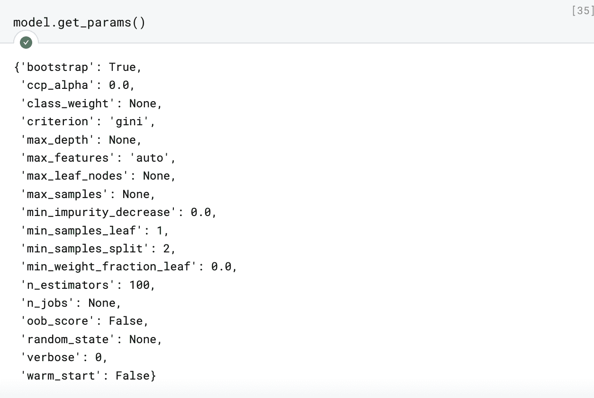

作者截图

我们将使用精度来评估我们的分类模型。对于不平衡分类问题，如流失预测，这是一个很好的选择。让我们来评估一组目标的精确度:

```
from sklearn.metrics import precision_scorey_pred_default = model.predict(X_test)precision = precision_score(y_test, y_pred_default)precision
```

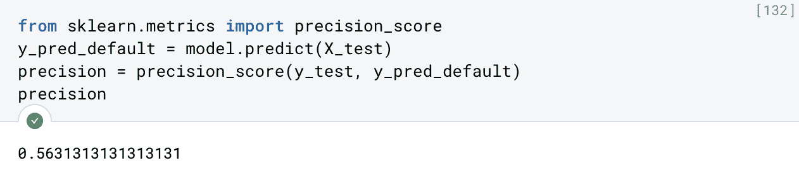

现在让我们看看如何应用强力网格搜索来找到最佳随机森林分类模型。

**使用 GridSearchCV 进行强力优化**

诸如 GridSearchCv 之类的强力搜索方法通过在整个搜索空间中穷举搜索最佳超参数集来工作。首先，让我们从 scikit-learn 中的模型选择模块导入 GridSearchCV 方法:

```
from sklearn.model_selection import GridSearchCV
```

让我们也定义一个字典，我们将使用它来指定我们的参数网格。让我们定义一个估计值范围(决策树从 10 到 100)，决策树的最大深度从 5 到 20，最大特征等于 sqrt，标准等于基尼指数(这是用于在决策树中划分组的度量标准:

```
params = {'n_estimators': [10, 100],
'max_features': ['sqrt'],
'max_depth' : [5, 20],
'criterion' :['gini']}
```

接下来，让我们用参数字典定义网格搜索对象:

```
grid_search_rf = GridSearchCV(estimator=model, param_grid=params, cv= 20, scoring='precision')
```

并使对象符合我们的训练数据:

```
grid_search_rf.fit(x_train, y_train)
```

从那里我们可以显示最佳参数:

```
gscv_params = grid_search_rf.best_params_gscv_params
```

用最佳参数重新定义我们的随机森林模型:

```
gscv_params = grid_search_rf.best_params_model_rf_gscv = RandomForestClassifier(**gscv_params)model_rf_gscv.fit(X_train, y_train)
```

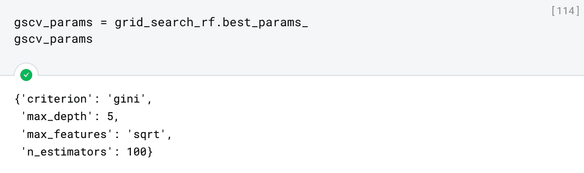

作者截图

让我们来评估一组目标的精确度:

```
y_pred_gscv = model_rf_gscv.predict(X_test)precision_gscv = precision_score(y_test, y_pred_gscv)precision_gscv
```

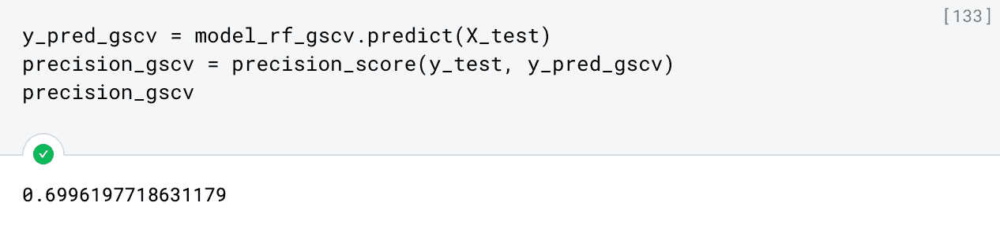

作者截图

我们看到我们的精度实际上优于默认值。虽然这很好，但对于大范围的参数值和较大的数据集，这种方法可能会变得难以处理。黑盒优化和贝叶斯优化等替代方法是超参数调优的更好选择。

**使用 RBFopt 进行黑盒优化**

现在让我们考虑使用 RBFopt 的黑盒超参数优化。RBFopt 的工作原理是使用径向基函数来构建和优化被优化函数的代理模型。这通常用于没有封闭形式表达式且有许多山峰和山谷的函数。这与众所周知的具有封闭形式表达式的简单函数形成对比，例如二次函数或指数函数。

首先让我们安装 RBFopt:

```
%pip install -U rbfopt
```

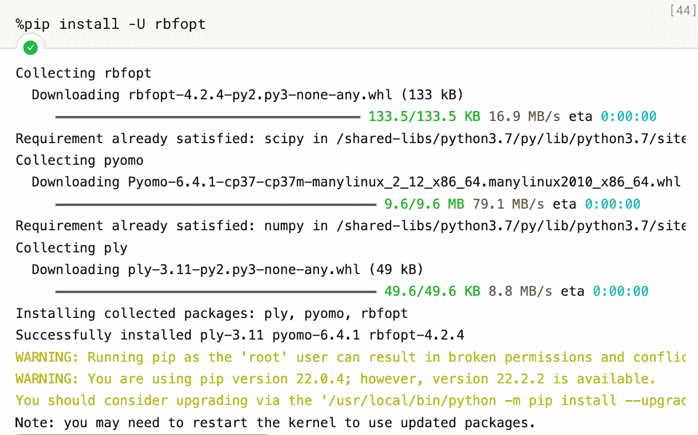

作者截图

接下来，我们需要为我们的模型参数定义一个上限和下限列表。下限列表将包含估计器数量的 10 和最大深度的 5。上限列表将包含 100 个估计数和 20 个最大深度:

```
lbounds = [10, 5]ubounds = [100, 20]
```

接下来让我们导入 RBFopt 和交叉验证方法:

```
import rbfoptfrom sklearn.model_selection import cross_val_score
```

接下来我们需要定义我们的目标函数。它将接受 n_estimators 和 max_depth 的输入，并为每组参数建立多个模型。对于每个模型，我们将计算并返回精度。我们试图找到使精度最大化的 n 估计量和 max_depth 的一组值。由于 RBFopt 找到最小值，为了找到使精度最大化的参数集，我们将返回精度的负值:

```
def precision_objective(X):
    n_estimators, max_depth = X
    n_estimators = int(n_estimators)
    max_depth = int(max_depth)
    params = {'n_estimators':n_estimators, 'max_depth': max_depth}
    model_rbfopt = RandomForestClassifier(criterion='gini', max_features='sqrt', **params)
    model_rbfopt.fit(X_train, y_train)
    precision = cross_val_score(model_rbfopt, X_train, y_train, cv=20, scoring='precision')
    return -np.mean(precision)
```

接下来，我们指定运行、函数调用和维度的数量:

```
num_runs = 1max_fun_calls = 8ndim = 2
```

这里我们只运行 8 个函数调用。如果你希望运行 10 个以上的函数调用，你必须安装 [bonmin](https://github.com/coin-or/Bonmin) 和 [ipopt](https://github.com/coin-or/Ipopt) 软件包。安装说明可以在各自链接的 GitHub 页面上找到。

现在，让我们指定我们的目标函数并运行 RBFopt:

```
obj_fun = precision_objectivebb = rbfopt.RbfoptUserBlackBox(dimension=ndim, var_lower=np.array(lbounds, dtype=np.float), var_upper=np.array(ubounds, dtype=np.float), var_type=['R'] * ndim, obj_funct=obj_fun)settings = rbfopt.RbfoptSettings(max_evaluations=max_fun_calls)alg = rbfopt.RbfoptAlgorithm(settings, bb)
```

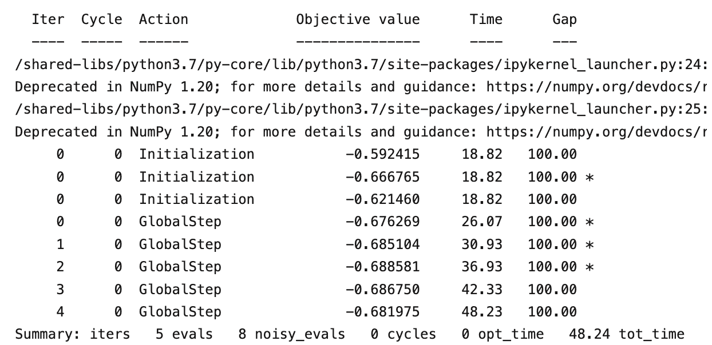

作者截图

并将目标值和解决方案存储在它们各自的变量中:

```
fval, sol, iter_count, eval_count, fast_eval_count = alg.optimize()obj_vals = fval
```

然后，我们将整数值解存储在字典中:

```
sol_int = [int(x) for x in sol]
params_rbfopt = {'n_estimators': sol_int[0], 'max_depth': sol_int[1]}
params_rbfopt
```

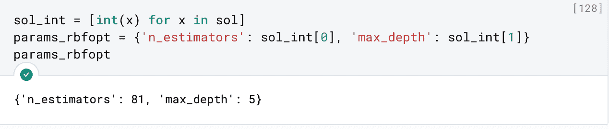

作者截图

我们看到，RBFopt 分别为 n_estimators 和 max_depth 找到了最佳值 81 和 5。

然后将这些最佳参数传递到我们的新模型中，并拟合我们的训练数据:

```
model_rbfopt = RandomForestClassifier(criterion=’gini’, max_features=’sqrt’, **params_rbfopt)model_rbfopt.fit(X_train, y_train)
```

并评估精度:

```
y_pred_rbfopt = model_rbfopt.predict(X_test)precision_rbfopt = precision_score(y_test, y_pred_rbfopt)precision_rbfopt
```

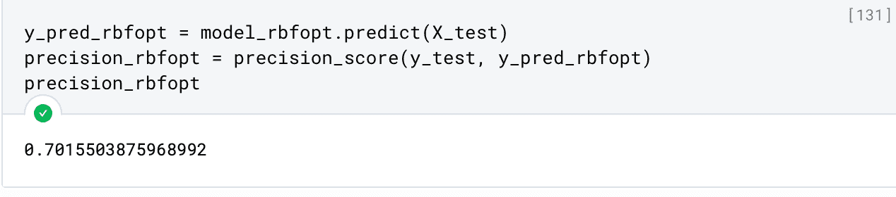

作者截图

我们看到，通过更快的优化算法，我们在精度上有了轻微的提高。当您有大的超参数搜索空间时，这尤其有用。

这篇文章中使用的代码可以在 [GitHub](https://github.com/spierre91/deepnote/blob/main/hyperparameter_tuning_tutorial.ipynb) 上获得。

**结论**

对于每个数据科学家来说，很好地理解超参数调整机器学习模型的可用工具是必不可少的。虽然大多数机器学习算法的默认超参数提供了良好的基线性能，但超参数调整通常是必要的，以看到基线性能的改善。强力优化技术是有用的，因为它们彻底地搜索超参数空间，这将保证从默认参数改善基线性能。不幸的是，蛮力优化在时间和计算方面是资源密集型的。出于这些原因，更有效的黑盒优化方法，如 RBFopt，是强力优化的有用替代方法。RBFopt 是一种非常有用的黑盒技术，应该成为每个超参数优化数据科学工具包的一部分。