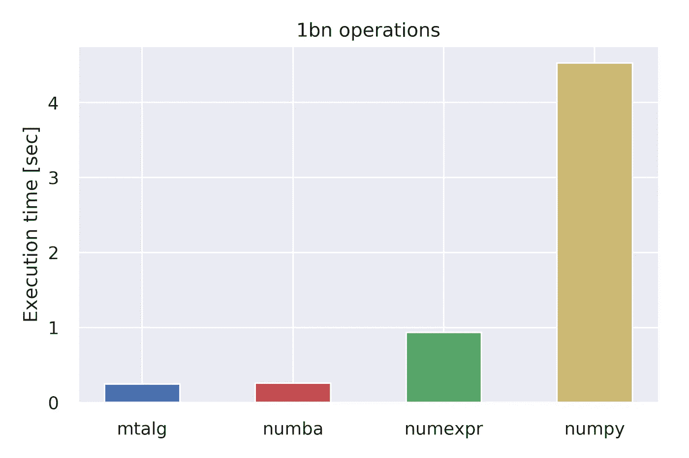
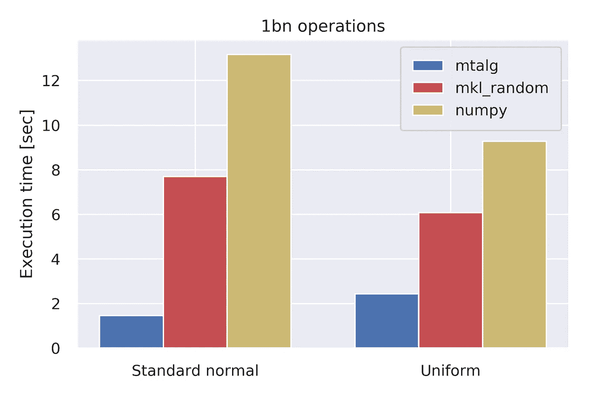
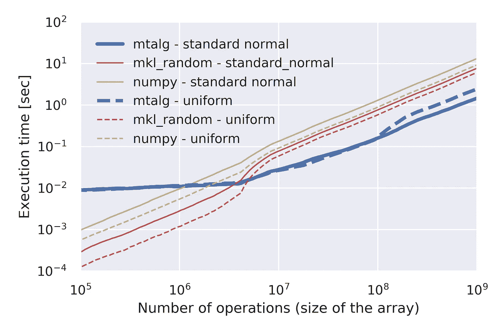

# 使用 mtalg 在 Python 中实现极快的代数和随机数

> 原文：<https://towardsdatascience.com/blazing-fast-algebra-and-random-numbers-in-python-with-mtalg-aa50ac8ffd3>

## 用于多线程代数和伪随机数生成的 python 工具

来自 [mtalg](https://github.com/WWakker/mtalg) 的图像

数据科学家和研究人员经常需要执行快速有效的数值计算。因此，处理大型数据结构需要能够通过多重处理或多线程来利用所有可用的计算资源(参见这篇[伟大的文章](https://medium.com/@bfortuner/python-multithreading-vs-multiprocessing-73072ce5600b)来复习)。这非常重要，以至于像`numpy`这样的数值库自动支持线性代数运算上的多线程。

然而，有点令人惊讶的是，`numpy`没有为元素操作和(伪)随机数生成提供现成的多线程功能。这些通常是主要的瓶颈，例如当执行大规模蒙特卡罗模拟时，用于通过 MCMC 的贝叶斯参数估计等。

Python 库`[mtalg](https://github.com/WWakker/mtalg)` [1]提供了多线程的基于元素的函数和多线程的随机数生成，击败了大多数其他库，包括`numexpr`和使用`numba`的即时编译(参见下面的基准)。

# 多线程代数

安装了带有`pip install mtalg`的库后，我们可以导入`mtalg`并使用它的内置函数:

请注意，默认情况下，操作在第一个参数中就地执行。因此，`mtalg.add(a,b)`相当于`a = a + b`(只是方式更快！).这种行为可以通过可选参数`direction`来覆盖:例如`mtalg.sub(a, b, direction='right')`将等同于`b = a - b`(注意这与`mtalg.sub(b, a)`不同，后者将等同于`b = b — a`)。

默认情况下,`mtalg`将线程数量设置为可用 CPU 内核的数量，但是该参数可以作为`mtalg.set_num_threads(6)`被覆盖。同样，我们可以将当前设定值检查为`mtalg.get_num_threads()`。

# 随机数生成

随机数生成可以按如下方式执行:

`mtalg.random`提供了一系列不同的发行版来进行采样，所有发行版都保持了类似 numpy 的语法。

`mtalg`目前支持从以下分布中采样:*、二项式、卡方、指数、f、伽马、几何、gumbel、超几何、整数、拉普拉斯、逻辑、对数正态、对数序列、负二项式、非中心卡方、非中心 f、正态、帕累托、泊松、幂、随机、瑞利、标准柯西、标准指数、标准伽马、标准正态、标准 t、三角形、均匀、冯米斯、瓦尔德、威布尔、zipf* 。

# 基准

针对 numpy 和一些最快的可用库的基准测试证明了`mtalg`的速度。

**图 1** — Elementwise 代数:十亿次运算的加法函数基准[2]。其他基本功能的执行方式类似。【来源:作者图片】

**图 2** —元素代数:加法函数的基准[2]。其他基本功能的执行方式类似。【来源:作者图片】

通常，多线程会带来开销，因此多线程的好处只有在处理大量操作时才会显现出来(按照 10⁷ / 10⁸或更大的数量级——图 2)。

还可以观察到随机数生成的速度大幅提高，这是执行大规模蒙特卡罗模拟或通过 MCMC 进行贝叶斯参数估计时的一项关键任务。

**图 3** —随机数生成:均匀和标准正态分布随机变量的基准[2](十亿)。从其他分布中取样的表现类似。【来源:作者图片】

**图 4** —随机数生成:均匀和标准正态分布随机变量的基准[2]。从其他分布中取样的表现类似。【来源:作者图片】

# 结论

在本文中，我们介绍了`mtalg`，这是一个直观的 Python 库，用于快速的元素操作和随机数生成。

欢迎在下面的专门部分留下评论、编辑建议或提问！

另外，如果你想为图书馆做贡献，请随时联系我们！

# 参考

GitHub 上的[1][*mtalg*](https://github.com/WWakker/mtalg)
【2】性能指标评测是使用英特尔至强黄金 6142M CPU @ 2.60GHz 和 24 个线程进行的
【3】*免责声明:作者是此处提供的库的维护者和合著者。*