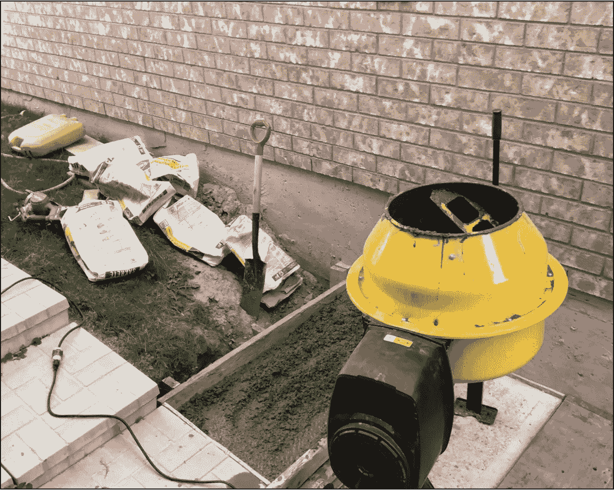
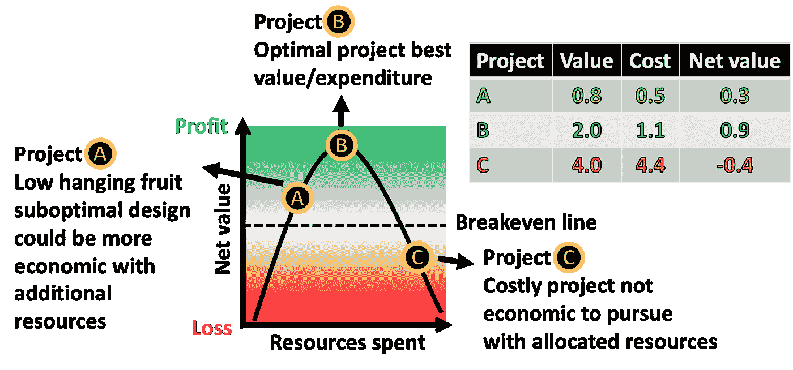
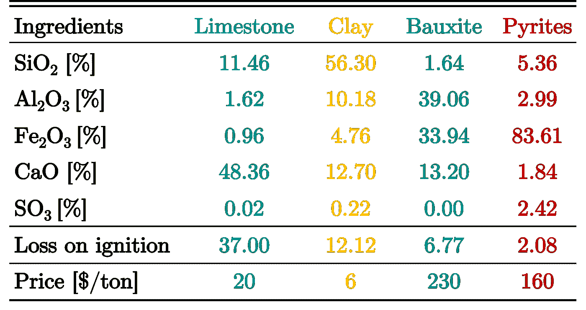
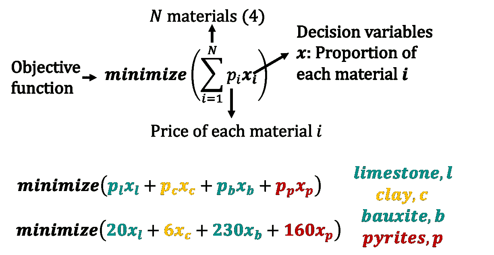
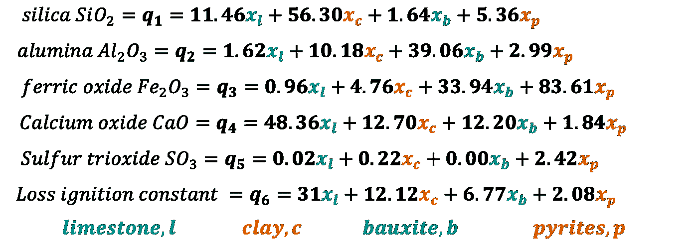
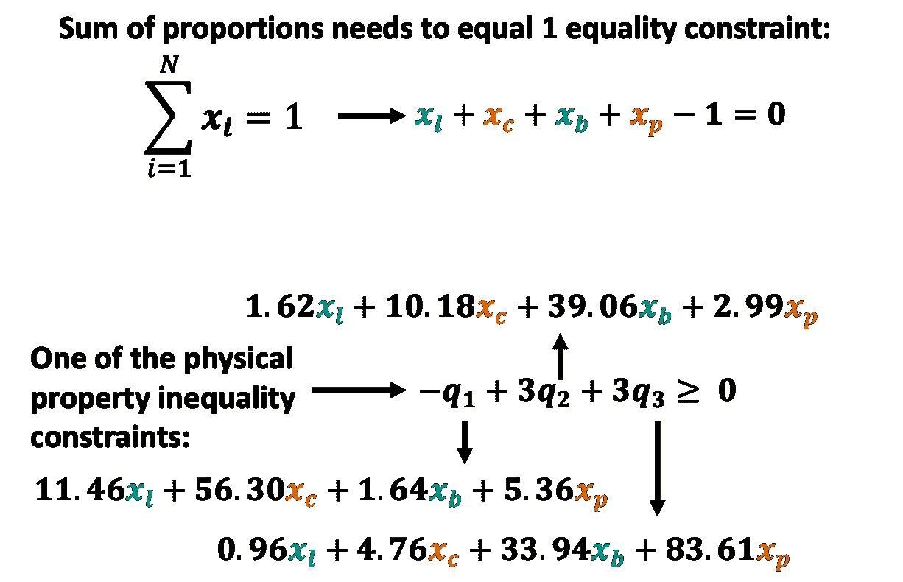
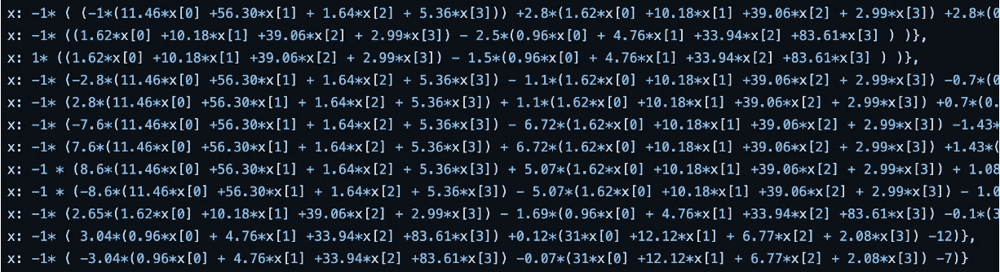
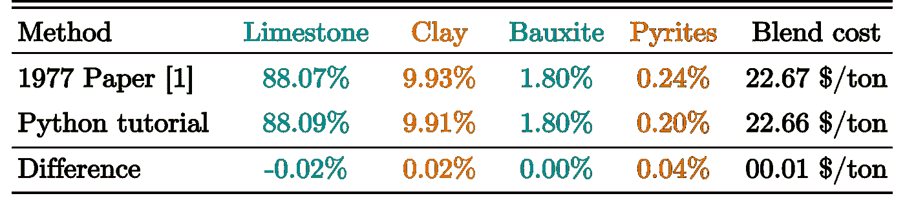

# 将优化教程与 Python 中的线性编程相结合

> 原文：<https://towardsdatascience.com/blending-optimization-tutorial-with-linear-programming-in-python-74bcc443e4e5>

## 应用于实际的水泥配料优化问题

作者图片

# 介绍

在几乎所有行业中，尤其是自然资源行业，通过优化所需资源支出产生的收入，做出最佳决策以最大化每个项目的价值至关重要。运筹学是一门学科，在这门学科中，现实世界的问题被用数学方法描述，并被优化以改进决策。下面的示意图说明了基于分配资源实现的最大净值的最佳项目 B，而 A 和 C 由于较差的设计或资源可用性而不是最佳的。乍一看，最便宜或最有价值的项目似乎是直观的选择，而最佳项目往往受到许多需要优化的不同和相关变量的影响。

比较项目 A、B 和 c 的净值和花费的资源的示意图

有了良好的运筹学，许多公司，尤其是自然资源行业的公司，可以更好地瞄准最有可能产生最大净值的最优项目。不幸的是，通常依赖昂贵的软件或外部顾问来概念化和解决这些优化问题。在本文中，我们将展示在 Python 等开源软件中实现这一点是多么简单。本例中使用的所有代码都存储在 [GitHub](https://github.com/13ff6/CementOptFF/blob/main/CementBlendOpt_FF.py) 上。

## 水泥配料优化问题

本教程将关注 1977 年水泥和混凝土研究论文[1]中的一个实际水泥混合优化问题。在这种应用中，石灰石、粘土、铝土矿和烧过的黄铁矿以最经济的方式混合，同时保持所需的物理性质。

这四种原料中的每一种都有不同的成本，从 6 美元/吨到 230 美元/吨不等，并且由不同的成分比例组成。主要成分包括二氧化硅(SiO2)、氧化铝(Al2O3)、氧化铁(Fe2O3)、氧化钙(CaO)和三氧化硫(SO3)，每种成分都需要在一定的比例范围内，以确保水泥满足所需的物理性能。下表总结了使用来自[1]和[2]的真实水泥数据的所有相关值。

原材料、它们各自的成分百分比和价格。来自[1]和[2]的真实水泥数据。作者图片

# 优化术语和方法

在我们进行任何优化之前，我们需要理解相关术语，以便从数学上定义手头的问题，一些关键术语包括:

*   **目标函数**:在一系列可能的值中，*最小化*或*最大化*的有值函数
*   **决策变量**:优化问题中的未知量
*   **约束**:通常以等式或不等式的形式必须满足的逻辑条件

在我们的混合示例中，**目标函数**就是每种材料的价格之和乘以该材料在四种材料中的比例。**决策变量**是每种材料的比例，比如使用 50%石灰石和 20%铝矾土。我们可以从根据我们的**决策变量**定义成分开始，并设置**目标函数**以*最小化*，如下所示。

**目标函数**最小化价格乘以每种材料的比例之和。作者图片

如果我们像上面显示的那样单独运行优化，我们只会得到所有的材料比例等于零，给我们一个很好的零成本，但我们知道这不是一个真正的解决方案。**约束**最终推动优化，因为在遵守物理特性要求的同时，混合成本必须最小化。**约束**在【1】和【2】中被定义为成分的函数，因此我们将引入一些变量(q1 至 q6 ),类似于论文【1 】,如下所示。注意，在使用 scipy minimize 的 Python 中，它们必须用**决策变量**来明确表达。

驱动**约束**的六个变量被定义为**决策变量**每种原材料比例的函数。作者图片

在这个例子中，**约束**是基于每种成分必须落入的特定范围、几个不同的模数以及燃烧产品的某些元素，这些都是成分比例的函数。对于本文的线性编程部分，有 14 个**约束**，我们将在下面的 Python 改编中分解其中两个。

前两个**约束**的分解显示了每个方程如何以 scipy 优化格式转换成 Python 代码。作者图片

现在只需要对所有 14 个**约束**重复上述过程。下面是剩余的 12 个**约束**，显示在 [GitHub](https://github.com/13ff6/CementOptFF/blob/main/CementBlendOpt_FF.py) 上的 Python 代码片段中。将所有的约束转换成代码似乎很难，但是一次只考虑一个等式是很重要的。在引入每个新的**约束**之后，一次运行一行代码可能有助于确保没有明显的输入错误，这些错误在以后会变得很麻烦。

水泥混合优化问题[1，2]中剩余的 12 个**约束条件 T10，以及显示每个线性不等式 T11 约束条件 T12 的裁剪代码的屏幕截图。**

# 使用 Scipy 运行优化

我们终于准备好用我们的**约束**来运行优化，以确定**决策变量**，其*最小化*目标函数。就我们的例子而言，我们将得到每种材料的比例，从而得到满足所需物理性质的最经济的混合物。

我们将使用`from scipy.optimize import minimize`和序列最小二乘编程(SLSQP)方法，该方法可以处理等式和不等式**约束**【3】，如 [GitHub](https://github.com/13ff6/CementOptFF/blob/main/CementBlendOpt_FF.py) 上的代码所示。下表显示了 1977 年论文[1]中的材料比例与 Python 教程中的材料比例有多么相似。细微的差异可能是由于舍入或不同的优化方法。

单纯形论文[1]和 scipy python 教程的最终结果使用 SLSQP 最小化。

# 结论

运筹学为更好的决策提供了强有力的工具。虽然有运行线性程序的昂贵软件，但也可以使用开源软件轻松设置，如 Python 中的 scipy optimize。独立地对优化问题进行编码还允许进行一些改变，这些改变在商业软件中可能是不可用的，因为商业软件抽象了许多更好的细节。

解决这些优化问题可以让公司做出更好的决策或改进复杂操作的程序。在本教程中，用不到 30 行代码解决了一个实际的水泥混合优化问题。虽然解决方案是针对可用的特定材料和作为示例的一部分出现的**约束**，但是相同的方法适用于任何种类的类似混合问题。

本文考虑了一个线性问题，但是也存在优化更复杂的非线性程序的选择。虽然线性问题更容易计算，但它们通常带有假设，导致不可避免的次优解决方案。本教程中使用的论文通过比较线性规划近似和更精确的非线性规划[1]对此进行了更详细的讨论。非线性程序改善事物的程度很可能取决于手头问题的线性有效性。

# 旁白—水泥的典型使用案例

有时候，退一步看看我们所做的所有数据工作在现实世界中的应用是很好的。水泥是混凝土的主要成分，而混凝土是建筑中使用最广泛的材料。下面是一个我和我的叔叔们一起搅拌和浇筑混凝土台阶的整洁视频。

将水泥与骨料和水混合以浇筑混凝土步骤的时间间隔。作者提供的视频

# 参考

[1] Xirokostas，D. A .，& Zoppas，C. E. (1977 年)。水泥配料优化问题的数学规划方法。水泥和混凝土研究，7(5)，503–514。

[2] Labahn O. (1971 年)，《水泥工程师手册》第 60 页。Bauverlag Cmbh，威斯巴登。

[3]克拉夫特博士(1988 年)。序列二次规划软件包。技术。众议员 DFVLR-fb88-28，德国航空航天中心德国飞行力学研究所，科隆，德国。