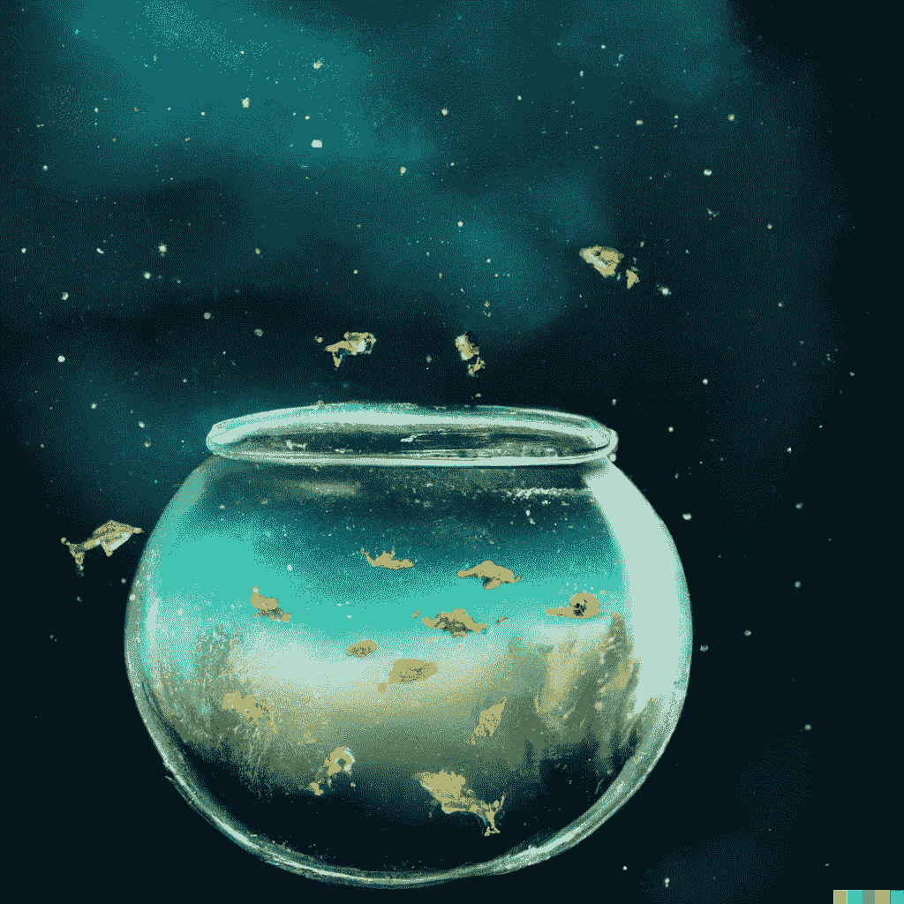
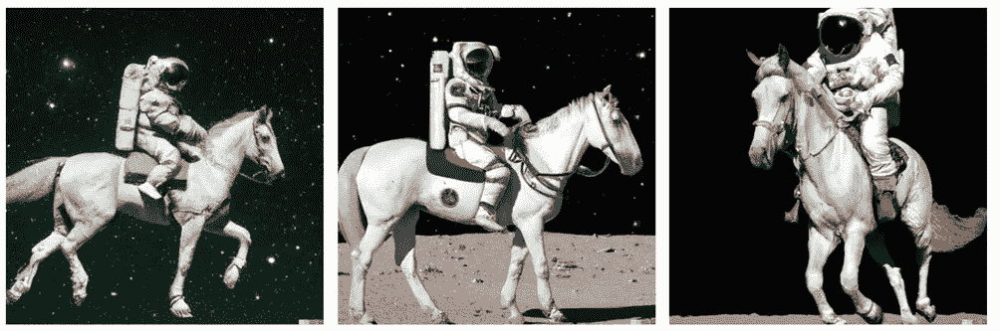
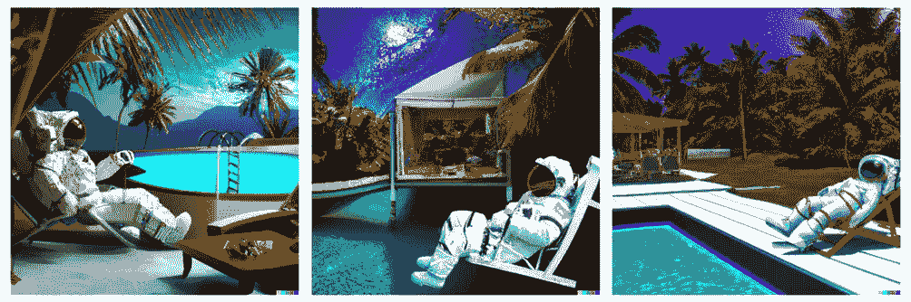
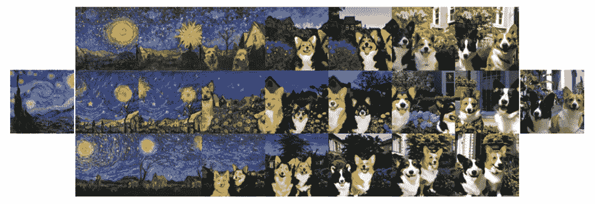
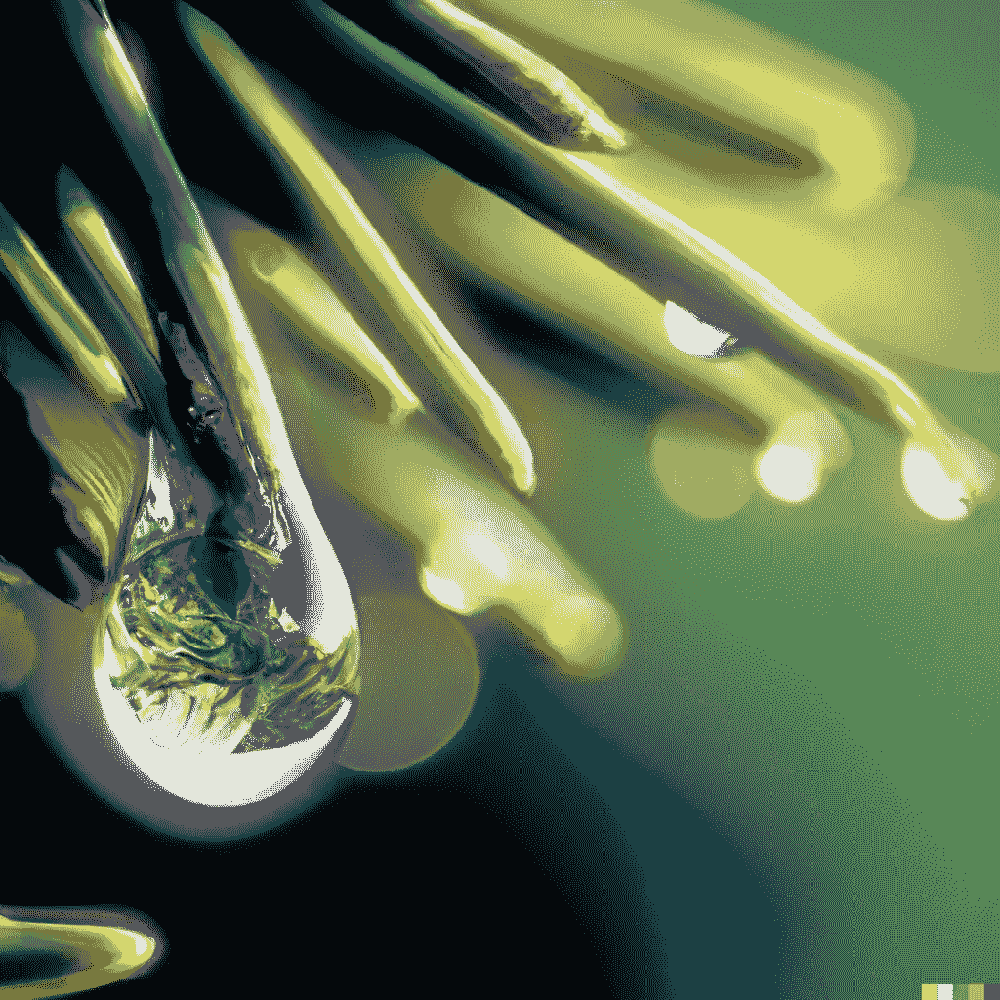
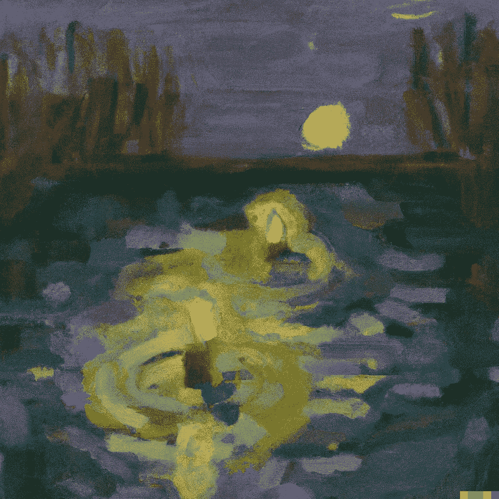
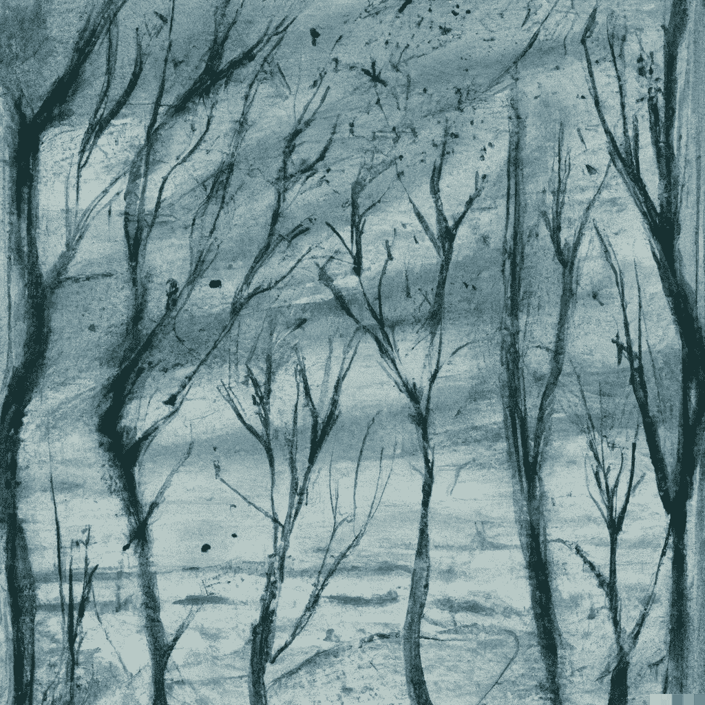
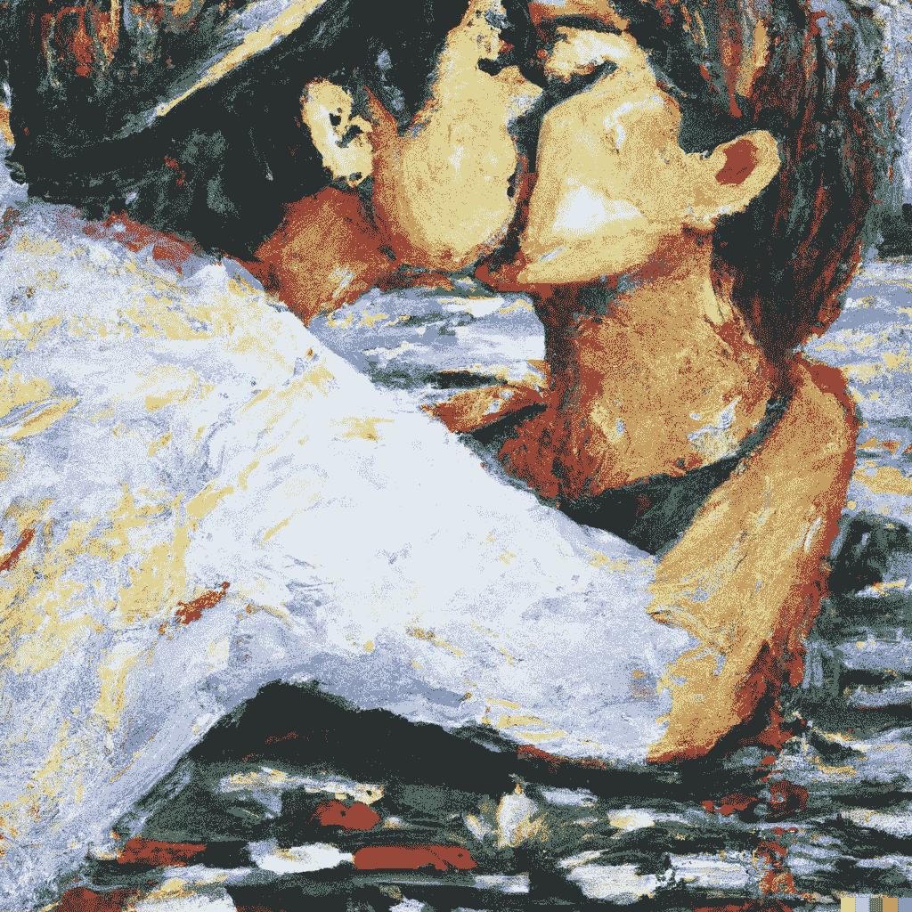
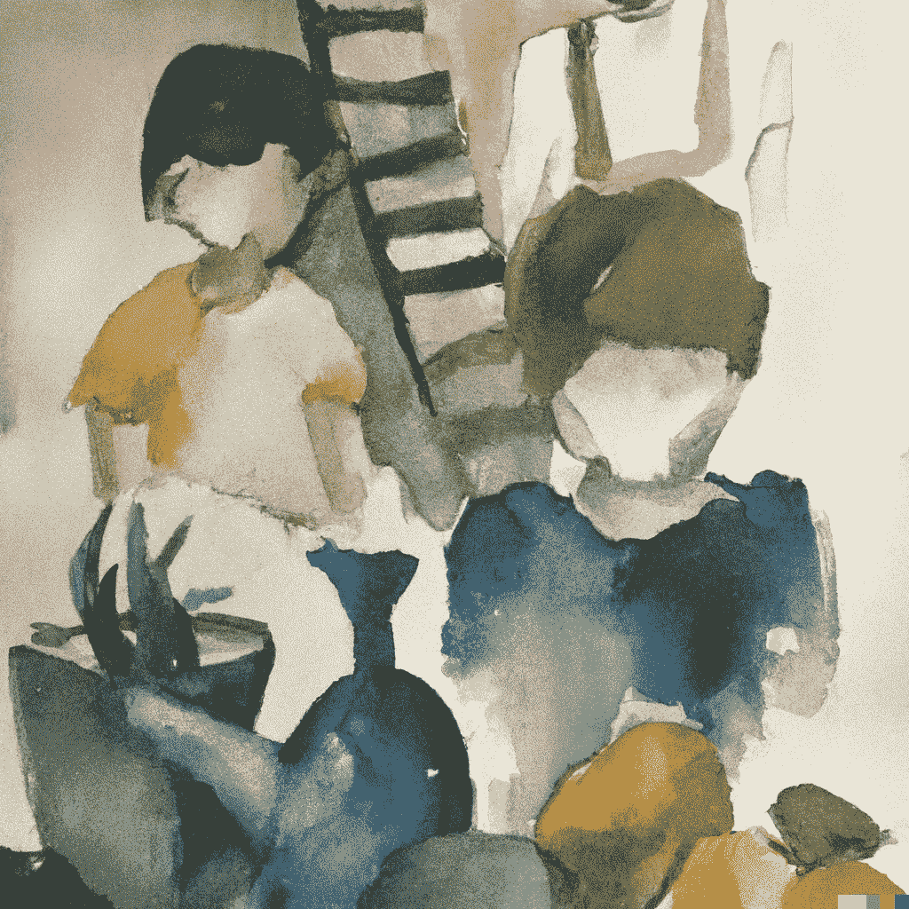

# 融合人工智能的力量和诗歌的细腻

> 原文：<https://towardsdatascience.com/blending-the-power-of-ai-with-the-delicacy-of-poetry-3671f82d2e1>

## 人工智能模型现在能够从文本中生成图像，如果我们给它们提供伟大诗人的话语会怎么样？诗与人工智能的梦幻之旅。

图片由作者用 DALL-E 创作。灵感来自平克·弗洛伊德的《希望你在这里》

**简介**

诗歌只不过是巧妙选择的词语的并置。一系列的字符，但能够激发情感。一种很难解释和整理的艺术。
在听或读一首诗时，我们几乎能感觉到情绪、寒战，或者通过闭上眼睛我们能看到图像。事实上，许多最引人入胜的诗歌往往充满了隐喻和类比，描绘了生动和不寻常的形象。

毕竟，文字往往伴随着图像，无论是书中的插图还是广告中的强化信息。出于热情或商业目的，插画师经常被要求将他人写的文字转换成图像，试图捕捉文本的信息，同时找到最佳的表达方式，而不背叛作者的思想。

**达尔-E，巫师**

[OpenaAI](https://openai.com/) 今年发布了 [DALL-E 2](https://arxiv.org/pdf/2204.06125.pdf) ，这是一种新的生成语言模型，能够将句子作为输入，并创建相应的原始图像。该模型是先例模型 [DALL-E](https://openai.com/blog/dall-e/) 的新版本，即使尺寸更小(只有 35 亿个参数，而不是 120 亿个参数)，也能够生成分辨率提高 4 倍的图像。在不涉及技术细节的情况下，DALL-E 2 由不同的组件组成(称为先前型号，[夹子](https://openai.com/blog/clip/)，以及松开)。它已经在一个惊人的 6.5 亿张图像和相关字幕的数据集上进行了训练，以学习合并图像中存在的连贯元素的能力。

简而言之，我们可以说，当你给 DALL-E 2 一个句子时，先验模型正在生成一种图像的“心理意象”(一种图像主要元素的合成图，或者称为嵌入)。“解开”模块将此图像转换为绘图，而“剪辑”模块则对图像中句子的特征(元素和样式)进行编码。

DALL-E 你可以输入一个句子“一个宇航员以照片般逼真的方式骑马”，它能够生成一个编码句子中描述的元素的图像。

从 [DALL-E 2](https://arxiv.org/pdf/2204.06125.pdf) 生成的图像

改变句子，它能够处理句法语义的变化，比如:“一个宇航员在太空的热带度假胜地以照片般的真实风格闲荡”。

从 [DALL-E 2](https://arxiv.org/pdf/2204.06125.pdf) 生成的图像

正如 Twitter 上不同用户所注意到的那样，DALL-E 2 可以更好地处理复杂和费解的句子，因为短句可能缺乏特异性(导致有趣的结果)。请注意，如何也相应地调整阴影(和水反射，如果有的话)，这实际上是令人印象深刻的。DALL-E 还可以插入图像，改变图像的风格，编辑图像等等。

从 [DALL-E 2](https://arxiv.org/pdf/2204.06125.pdf) 生成的图像

但是，当您要求生成带有文本的图像时，不同的用户会注意到一些错误(尤其是在照片级的图像中)或拼写错误。这是因为即使是非常先进的模型，DALL-E 也不会推理。

**俳句的微妙艺术**

有什么比俳句更能让你开始的呢？毕竟，俳句是包含在三行空间里的激动人心的诗。作为 17 世纪日本的一种诗歌形式，它通常由三行和 17 个音节(5-7-5)组成。尽管它很简短，但它通过提取精华成功地浓缩了生动的情感。一种艺术形式，以极简的风格优雅地将引人注目的意象封装起来。

俳句从其直接性和明显的简单性中汲取力量，消除虚饰，从自然、季节和人类精神状态的暗示中汲取灵感。这篇文章需要思想和意象的综合，然后让读者去想象这首短诗之外还有什么。俳句的精妙之处还在于这种意象的并置，然后往往在最后一行得到解决，从而产生一种封闭感。

它们包含对比鲜明的图像和明显的逻辑跳跃，因此似乎是这个小实验的完美场所。

> *露水的世界，*
> 
> *在每一颗露珠里*
> 
> *奋斗的世界*
> 
> **《露水的世界》小林伊萨**

由作者用 DALL-E 创建的图像。上面的俳句被用作生成图像的测试

在某种程度上，这个形象似乎是恰当的，露珠包含了它自己的世界。如果我能画得那么好的话，这已经足够接近我会画的了。

> *蜡烛的光*
> 
> *被转移到另一根蜡烛上—*
> 
> *春光乍泄*
> 
> 约萨·布森的《点燃一支蜡烛》

由作者用 DALL-E 创建的图像。上面的俳句被用作生成图像的测试

在这里，我想尝试一种不同的风格，用灯光做一点点改变，在我看来，这首诗让我想起了一幅氛围类似于梵高画作的图像。从某些方面来说，结果还不错，虽然不完全是我想象的那样。

> *冬日里*
> 
> *森林，狂风怒号*
> 
> *无叶可吹。*
> 
> **《寒冬腊月》夏目漱石**

由作者用 DALL-E 创建的图像。上面的俳句被用作生成图像的测试

在这里，我想象了一些风格化的，多节的树在冰冷的寒风中扭动。事实上，这张图片似乎传达了一种刺痒的寒冷感觉。

因为它的简单和直接，俳句甚至在日本之外也很流行和成功。几位西方作家已经尝试过了；我决定在这个实验中包括我最喜欢的。

> *我们之间的爱是*
> 
> *言语和气息。爱你是*
> 
> *长河奔流。*
> 
> 索尼娅·桑切斯的《为你而写的俳句》

由作者用 DALL-E 创建的图像。上面的俳句被用作生成图像的测试

这是我最难理解的诗歌之一。我不得不尝试不同的风格，但我在生成合适的图像时遇到了困难。有时 DALL-E 用无意义的措辞填充图像(一些描绘的文本有点像“爱”，另一些模糊地相似)。我试了几次才得到一个可以接受的答案

> *生活的点滴，我们的头*
> 
> *悲伤。赎回和浪费粘土*
> 
> *这个机会。有用。*
> 
> **《头骨上的线条》作者拉威·香卡**

由作者用 DALL-E 创建的图像。上面的俳句被用作生成图像的测试

再一次，选择一张图片并不容易，我尝试了一些风格，最终选择了这张。DALL-E 每次尝试提供给你六张图片，然而，几乎没有一张能说服我。最终我选择了这个，因为这是最坏的选择。

**结论**

DALL-E 是一个非常强大的工具，但仍然需要正确的词语来充分利用它。有时需要多次尝试才能找到正确的图像。细看，有些细节可能看起来有点奇怪，有点粗略。并非所有的图像都是合适的，如果文字描述不准确，DALL-E 将很难处理。有时，它会在图像中填充与文本模糊相似的无意义的措辞。然而，总的来说，结果是惊人的；它很灵活，可以从文本中生成非常不同的图像。即使使用诗歌文本，它也能产生非常令人回味的图像。我认为已经通过了(但是还有改进的空间)，你同意吗？

**附加资源**

*   原文：<https://arxiv.org/pdf/2204.06125.pdf>、[官网](https://openai.com/dall-e-2/)和[open ai 呈现 DALL-E 2 的视频](https://www.youtube.com/watch?v=K0TW-zcbEuY)。
*   关于 DALL-E 2 的文章:[这里](https://medium.com/towards-data-science/dall-e-2-explained-the-promise-and-limitations-of-a-revolutionary-ai-3faf691be220)、[这里](https://medium.com/mlearning-ai/openais-new-dall-e-2-can-paint-anything-you-want-4b8d3309f5cb)、[这里](https://medium.com/mlearning-ai/the-dall-e-2-multimodal-learning-in-image-generation-45d8ebbb1dc0)和[这里](/dall-e-2-0-explained-7b928f3adce7)
*   关于 AI 文字转图片:[此处](https://deepai.org/machine-learning-model/text2img)，[此处](https://www.makeuseof.com/ai-text-to-art-generators/)，[此处](https://en.wikipedia.org/wiki/DALL-E)
*   Google imagen(另一种文本到图像的扩散模型):[这里](https://imagen.research.google/)
*   DALL-E mini ( [这里是](https://huggingface.co/spaces/dalle-mini/dalle-mini))如果你想尝试，这是一个替代选择

# 如果你觉得有趣:

你可以寻找我的其他文章，你也可以 [**订阅**](https://salvatore-raieli.medium.com/subscribe) 在我发表文章时得到通知，你也可以在**[**LinkedIn**](https://www.linkedin.com/in/salvatore-raieli/)**上连接或联系我。**感谢大家的支持！**

**这里是我的 Github 资源库的链接，我计划在那里收集代码，以及许多与机器学习、人工智能等相关的资源。**

** **