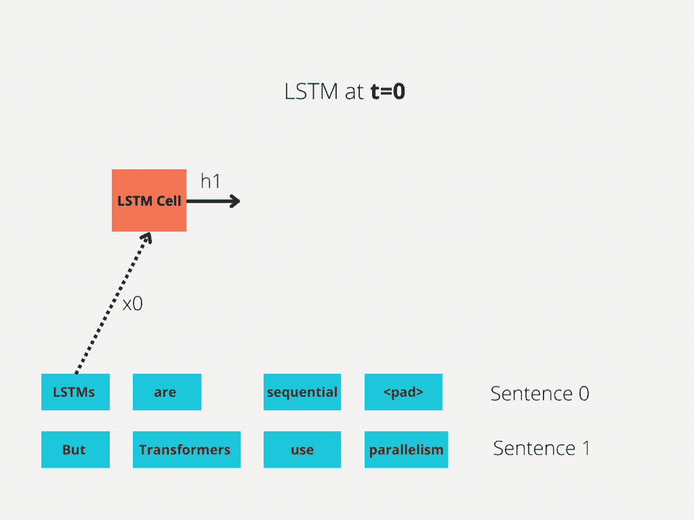
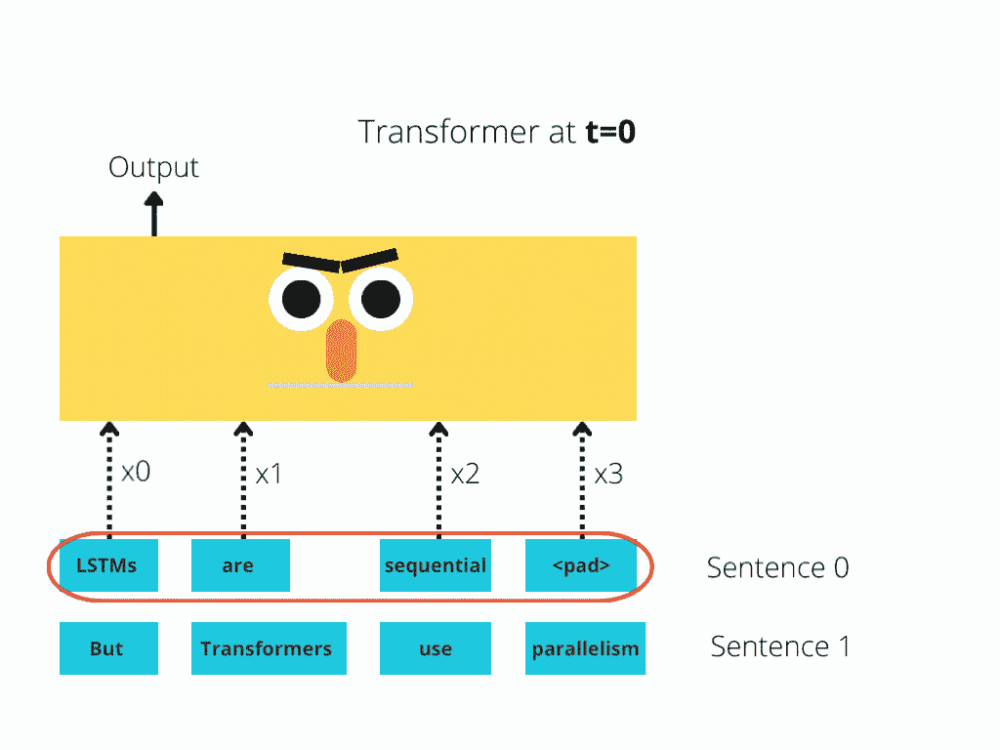
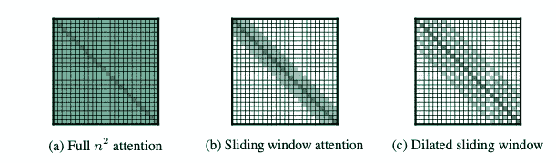
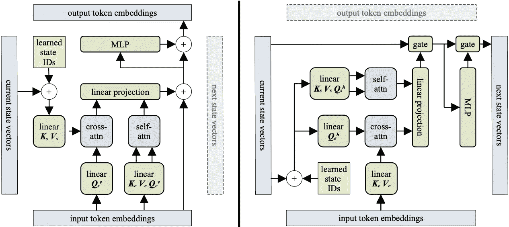
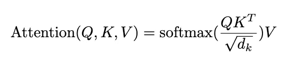
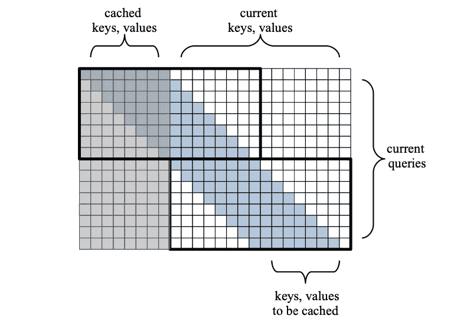

# 块循环变压器:LSTM 和变压器相结合

> 原文：<https://towardsdatascience.com/block-recurrent-transformer-lstm-and-transformer-combined-ec3e64af971a>

## 一个结合了两者优点的强大模型

桑德罗·卡塔琳娜在 [Unsplash](https://unsplash.com?utm_source=medium&utm_medium=referral) 上的照片

**普通的*变压器*不再是处理深度学习中任何情况的全能模型。**

在[之前的一篇文章](/deep-learning-no-lstms-are-not-dead-20217553b87a)中，我们证明了对于时间序列预测任务来说，*变形金刚*举步维艰。这就是为什么谷歌创建了一个 [**混合变压器-LSTM**](/temporal-fusion-transformer-googles-model-for-interpretable-time-series-forecasting-5aa17beb621) 模型，在时间序列预测任务中实现 SOTA 结果。

炒作结束后，研究人员开始关注*变形金刚*的缺点。新的研究旨在利用其他型号的功能(*CNN*、*rnn*、 *RL 型号*)来增强*变形金刚*。一个典型的例子是新一代的**视觉变形金刚【1】**，他们借鉴了 CNN 的创意。

2022 年 3 月，一个**谷歌研究团队**和**瑞士人工智能实验室 IDSIA** 提出了一种新的架构，称为**Block-Recurrent Transformer[2]。**

那么，**块轮回变压器是什么？**它是一种新颖的 *Transformer* 模型，利用 *LSTMs* 的递归机制，在长范围序列的语言建模任务中实现显著的困惑改进。

但首先，让我们简单讨论一下*变形金刚*相比 *LSTMS* 的优缺点。这将帮助你理解是什么激发了研究人员提出**块循环变压器。**

# **变压器 vs 循环网络**

*变压器*最显著的优点总结如下:

## 平行

*RNNs* 实现**顺序**处理:对输入(比如说句子)进行逐字处理。

*变形金刚*使用**非顺序**处理:句子是作为一个整体来处理的，而不是逐字逐句。

在图 1**和图 2**中更好地说明了这种比较。

**图 1:** 序列长度=4 的 LSTM 单元。(作者制作)

**图 2:** Bert 架构(简化-作者制作)

*LSTM* 需要 8 个时间步来处理句子，而 ***伯特【3】***只需要 2 个！

因此， *BERT* 能够更好地利用现代 GPU 加速所提供的并行性。

请注意，两个图都是简化的:我们假设*的批量*为 1。此外，我们也没有为 *BERT 的*特殊记号而烦恼，事实上它需要两个句子，等等。

## 长期记忆

*rnn*在移动到未来令牌之前，被迫将它们学习到的输入序列的表示压缩到单个状态向量中。

此外，虽然*lstm*解决了普通*rnn*遭受的**消失渐变**问题，但它们仍然容易出现**爆炸渐变**。因此，他们正在努力解决更长的依赖关系。

*另一方面，*变压器的带宽要高得多。例如，在**编码器-解码器变换器【4】**模型中，*解码器*可以直接处理输入序列中的每个令牌，包括已经解码的令牌。这在**图 3 中描述:**

**图 3:** 普通变压器中的编码和解码([来源](https://ai.googleblog.com/2017/08/transformer-novel-neural-network.html))

## 更好的注意力机制

**注意力【4】**的概念对变形金刚来说并不陌生。早在 2016 年**谷歌神经引擎【5】**(编码器-解码器拓扑中的堆叠 Bi-lstm)已经在使用*注意力*。

回想一下*变形金刚*使用了一个叫做 ***的特例自我关注:*** 这个机制允许输入中的每个单词引用输入中的每一个其他单词。

*变形金刚*可以使用大*注意*窗口(如`512`、`1048`)。因此，它们在长范围内捕获序列数据中的上下文信息时非常有效。

接下来，我们来看看*变压器*的缺点:

## **自我关注的 O(n)成本**

*变形金刚*最大的一期。

有两个主要原因:

*   最初的*伯特*模型有一个`512`令牌的限制。解决这个问题的简单方法是截断输入的句子。
*   或者，我们可以创建超过该限制的*变形金刚*模型，使其达到`4096`代币。然而，*自我关注*的成本相对于句子长度是二次的。

因此，可伸缩性变得非常具有挑战性。已经提出了许多想法来重组最初的*自我关注*机制:

**图 4:** 不同类型自我关注的成本矩阵([来源](http://Long))

这些想法大多是由新一代型号引入的，如***【6】***和***Transformer XL【7】***。这些模型针对长格式文本进行了优化，并实现了显著的改进。

然而，挑战依然存在:我们能否在不牺牲效率的情况下进一步降低计算成本？

## 时间序列具有挑战性

虽然*变形金刚*已经统治了 **NLP 领域**，但是它们在时态数据方面的成功有限。但是为什么呢？时间序列不也是顺序数据吗？

*   *变压器*可以更好的从长期历史计算出一个时间步长的输出，而不是当前的输入和隐藏状态。这对于局部时间依赖性来说效率较低。
*   因此，短期记忆对于时间序列的长期记忆同样重要。
*   这就是为什么谷歌研究人员推出了一个用于时间序列预测的**混合深度学习模型【1】**:该模型使用*注意力*，但也包括一个 *LSTM 编码器-解码器堆栈*，它在捕捉本地时间依赖性方面发挥着重要作用。
*   最后，时间序列可以是**多元**，有 s **静态数据，**等等。它们通常需要更特殊的处理。

在本文中，我们不会关注时间序列方面。有关时间序列深度学习模型的更多信息，请随时查看这篇[文章](/the-best-deep-learning-models-for-time-series-forecasting-690767bc63f0)。

# 输入块-循环变压器

什么是 ***块轮回变压器？******分块递归变压器*** 是一种革新 NLP 领域的新型模型。

这个模型的主要突破是**循环单元:**一个以循环方式工作的修改的*变压器*层。

让我们快速概述一下主要特征，然后我们将更深入地研究模型的架构。

*   **块级并行:***递归单元*处理**块**中的令牌，一个块内的所有令牌并行处理。
*   **大关注窗口:**由于模型将输入分解成块，因此它可以使用大关注窗口(测试了多达`4096`个标记)。因此，*闭塞循环变压器*属于远程变压器家族(类似于*长变压器*)。
*   **线性复杂度:**由于*递归单元*分块分解输入，模型在***【O(n)***时间内使用 ***滑动自关注*** *逐块计算自关注。*
*   **更稳定的训练:**分块处理序列可用于长距离传播信息和梯度，而不会在训练期间导致灾难性的遗忘问题。
*   **信息扩散:***块递归变换器*对状态向量块而不是单个向量进行操作(像 *RNNs* do)。因此，模型可以充分利用 r *ecurrence* 并更好地捕捉过去的信息。
*   **互操作性:***递归单元*可与常规变压器层连接。
*   **模块化:***循环单元*可以水平或垂直堆叠，因为*循环单元*可以在两种模式下操作:**水平**(用于循环)和**垂直**(用于堆叠层)。这将在下一节中变得清楚。
*   **运营成本:**增加*递归*就像多加了一层*变压器*。没有引入额外的参数。
*   **效率:**与其他*远程变压器*相比，该型号表现出显著的改进。

下面两节将详细描述*块-递归变压器的两个主要组成部分:****递归单元*** 架构和 **带递归的滑动自注意。**

# **递归细胞架构**

*块循环变压器*的支柱是*循环单元*。

> 注意:不要被它的“细胞”特征所迷惑。这是一个完全成熟的变压器层，旨在以循环方式运行。

*循环单元*接收以下类型的输入:

*   一组`W` **令牌嵌入**，其中`W`为*块大小*。
*   一组“**当前状态”**向量，称为`S`。

输出是:

*   一组`W`输出令牌嵌入。
*   一组“**下一状态**”向量。

**图 5:** 复发细胞**。左:**垂直模式(堆叠)，**右:**水平模式(重复)

**图 5** 展示了*轮回单元*架构**。这个架构非常简单，并且重用了大部分现有的 *Transformer* 代码库！**

我将逐步解释图 5 中显示的每个组件:

## 自我注意和交叉注意

*块循环变压器*支持两种操作:**自关注**和**交叉关注。**更确切地说:

*   **自关注**是对同一嵌入生成的*键*、*值、*和*查询*(分别为`K`、 `V`和`Q`矩阵)进行的。
*   **对一次嵌入产生的*查询*和另一次嵌入产生的*键值*和*值*进行交叉关注**。

如果你还记得最初的*变压器编码器-解码器*模型【4】，那么*编码器*正在执行 s *自我关注*，而*解码器*中的“**编码器-解码器关注**层正在执行 c *罗斯关注*。那是因为*查询*来自前面的*解码器*层，而*键*和*值*来自*编码器*输出。*循环单元*在同一层执行两种操作。换句话说:

> *轮回细胞*并行做自我注意(编码)和交叉注意(解码)！

## 水平与垂直模式

接下来，我们将重点介绍**所示的* ***图 5。*** 像我前面说的，*轮回细胞*以两种模式运行:*

*   ***垂直(堆叠):**在这种模式下，模型对输入嵌入执行*自我关注*，对递归状态执行 c *交叉关注*。*
*   ***水平(递归):**这正好相反:模型对递归状态进行*自关注*，对输入嵌入进行*交叉关注*。*

## *位置偏差*

*您还会注意到图 5 中的**方框，称为*学习状态 id*。让我们解释一下这是什么，为什么我们需要它。***

*至此，很明显*递归细胞*之间传递的递归状态不是单个向量(像 *RNNs* ，而是大量的**状态向量**。*

*因为相同的 *MLP* 层被应用于每个状态向量(标准实践)，实验分析表明*状态向量*不能区分。经过几次训练后，它们趋于一致。*

*为了防止这个问题，作者向状态向量添加了一组额外的可学习的“**状态 id**”。作者称这种功能为位置偏差。这类似于**位置编码**，普通*转换器*应用于输入嵌入。*块递归转换器*的作者将这种技术应用于递归状态向量，这就是为什么他们使用不同的名称来避免混淆。*

## *位置编码*

**块递归转换器*没有将传统的*位置编码*应用于输入标记，因为它们对长序列不太适用。相反，作者使用了在 **T5 架构【8】**中引入的一个著名技巧:他们将*位置相对偏差向量*添加到*自我关注*矩阵，该矩阵源自**垂直模式**中的输入嵌入。偏差向量是*键*和*查询*之间相对距离的学习函数。*

## ***闸门配置***

**块循环变压器*与其他*变压器*型号的另一个区别是*剩余连接*的使用。*

**块循环变压器*的作者尝试了以下配置:*

1.  *用*闸门*更换*剩余连接*。(该配置如图**图 5** 所示)。*
2.  *在**固定浇口**和**T71**LSTM 浇口之间选择。*****

*作者做了几个实验来寻找最佳配置。更多细节，查看原文。*

# *递归滑动自我注意*

**块循环变压器*的*自关注*是一项革命性的功能，结合了以下概念:*

1.  *矩阵乘积`QK^TV`变为“线性化”。*
2.  *将 **O(n )** *全注意力*替换为 **O(n)** *滑动注意力*。*
3.  *添加 ***重现*** 。*

*前两个概念已在相关工作[6]、[9]中提出。多亏了他们，*注意力*实现了线性成本**但在很长的文档中失去了潜力**。*块递归变压器*结合了前两个概念和递归，这是从 *RNNs* 借用的概念。*

> *递归机制优雅地集成在 Transformer 层中，并在很长的句子中提供显著改善的结果。*

*我们将分别分析每个概念，以便更好地理解*块循环变压器*如何使用*注意力*。*

## *线性矩阵乘积*

*在变压器生态系统中，*注意力*围绕着 3 个矩阵:查询*`Q`、按键*`K`和*值* `V`。***

**提醒一下，普通*注意事项*由以下人员给出:**

****

**注意在香草变压器的一个头**

***块循环变压器计算*注意*分数*稍有不同:首先，移除 *softmax* 操作。根据[9]，剩余的项重新排列为`Q(K^TV)`(如图**图 5** 所示)，并以线性化的方式进行计算。**

## **滑动自我注意**

**给定一长串`N`记号，一个**滑动窗口**应用一个因果掩码，使得每个记号只关注它自己和前面的`W`记号。(记住`W`是块大小)。**

**让我们想象一下注意力矩阵:**

****

****图 6:** 单个训练步骤的块递归变压器的优化注意矩阵。不是计算整个矩阵，而是只计算 2 个黑色方块内的分数。([来源](https://arxiv.org/pdf/2203.07852.pdf))**

**在图 6 的**中，**我们有一个窗口大小`W` =8，序列长度`N` =16。在前一个训练步骤中，计算并缓存了第一个`W`阴影标记。剩余的`N`无阴影标记来自当前输入。**

**输入序列中的每个记号以滑动的方式连续关注前面的`W` =8 个记号。因此，在每一行中，我们有`W`个计算。矩阵的高度是`N`(我们句子中的记号数)。因此，总成本是 **O(N*W)** 而不是全成本矩阵 **O(N*(W+N))** 。换句话说，相对于序列`N`的成本是线性的，而不是二次的！**

**因此，在我们的示例中，我们关注了两个大小为`Wx2W`的图块。让我们来分析一下这一连串的事件:**

1.  **在第一关注步骤中，输入句子的第一个`W`标记将关注来自前一个句子的最后缓存的`W` `keys`和`values`。**
2.  **在第二个注意步骤中，我们输入句子的最后一个`W`标记将注意我们输入句子的第一个`W`标记。**
3.  **这结束了我们的训练步骤，输入句子的最后`W` `keys`和`values`被缓存以用于下一个训练步骤。**
4.  **到目前为止，您应该已经注意到了滑动模式。这就是为什么我们称这种机制为**滑动自我注意。****

****注:**当我说`token X`照顾 `token Y`时，我们不是指代币本身:我是指那些代币各自的`keys`、`values`、`query`分数！**

## **复发有什么帮助**

**正如我之前所说的，*滑动自我关注*(非循环版本)已经被早期的模型使用[6][7]，尽管有一些不同:**

*   **在最初的版本中，输入的句子没有被分成块。使用简单的*滑动自关注* n 的模型一次接收所有输入。这限制了他们有效处理的信息量。**
*   **在之前的训练步骤中使用的缓存的*键*和*值*是**不可微的**——这意味着它们在反向传播期间不会更新。然而，在递归版本中，滑动窗口具有额外的优势，因为它可以在多个块上反向传播梯度。**
*   **原*滑动自关注*模型在其最顶层有一个理论感受野`W*L`，其中`L`代表模型层数。在循环版本中，感受野实际上是无限的！这就是为什么*块递归变压器*擅长远程内容。**

# **实验结果**

**最后，对*块循环变压器*进行测试。**

## **实验过程**

**任务是**自动回归语言建模**，目标是预测给定句子的下一个单词。**

**该模型在 3 个数据集上进行测试: **PG19** 、 **arXiv、**和 **Github** 。它们都包含很长的句子。**

**作者测试了*块循环变压器*，并使用*变压器 XL* 作为基线。*块循环变压器*配置为两种模式:**

1.  ****单循环模式:**作者使用了 12 层*变压器*，仅在第 10 层循环。**
2.  ****反馈模式:**使用相同的模型，除了这一次第 10 层不仅仅将输出循环到自身:当处理下一个块时，第 10 层的输出被广播到所有其它层。因此，第 1-9 层可以交叉处理该输入，使模型更强大，但计算成本更高。**

## **估价**

**使用*——语言模型的一种常见度量标准，对模型进行评估。***

***对于那些不知道的人，困惑被定义为`P=2^L`，其中`L`是常规熵。***

***直观地说，在语言建模的背景下，你可以这样来思考困惑:如果困惑的值是`30`，那么预测句子中的下一个单词就像正确猜测 30 面骰子的结果一样不确定。困惑度越低越好。***

## ***结果***

***总的来说，*方块重现变形金刚*在困惑和速度方面明显优于*变形金刚 XL* 。***

**另外，关于*块循环变压器，**反馈模式* *比*单循环模式要好。然而，作者得出结论，额外的性能并不能补偿额外的复杂性。****

*论文作者尝试了各种配置，例如增加或跳过门。欲了解更多信息，请查阅原始论文[2]。*

# *结束语*

*本文讨论了*块递归转换器，这是一篇突破性的论文，它利用传统的 *RNN* 递归来增加长文档中*转换器*的潜力。**

*我强烈建议你阅读原文[2]，将这篇文章作为辅助指南来帮助你理解。*

*由于论文非常新，作者没有发布任何源代码，尽管 Github 上有一些非官方的实现。*

# *感谢您的阅读！*

*   *订阅我的[简讯](/subscribe/@nikoskafritsas)！*
*   *在 Linkedin 上关注我！*

# *参考*

1.  *Dosovitskiy 等人， [*一幅图像抵得上 16x16 个字:用于图像识别的变形金刚*](https://arxiv.org/abs/2010.11929) *(2020)**
2.  *德莱斯里·哈钦斯等人 [*阻止轮回变形金刚*](https://arxiv.org/pdf/2203.07852.pdf)*(2022 年 3 月)**
3.  *Jacob Devlin 等人 [BERT:用于语言理解的深度双向变压器预训练](https://arxiv.org/pdf/1810.04805v2.pdf)*(2019 年 5 月)**
4.  *A.瓦斯瓦尼等人[关注是你所需要的全部](https://arxiv.org/abs/1706.03762)(2017 年 6 月)*
5.  *Kyunghyun 等人[关于神经机器翻译的性质:编码器-解码器方法](https://arxiv.org/abs/1409.1259)*
6.  *Iz Beltagy 等人[*Long former:The Long-Document Transformer*](https://arxiv.org/pdf/2004.05150.pdf)*，*艾伦人工智能研究所(2020)*
7.  *戴子航等 [Transformer-XL:固定长度语境之外的注意力语言模型](https://arxiv.org/pdf/1901.02860.pdf) (2019)*
8.  *Colin Raffel 等人[利用统一的文本到文本转换器探索迁移学习的限制](https://arxiv.org/pdf/1910.10683.pdf) (2019)*
9.  *[Angelos Katharopoulos](https://arxiv.org/search/cs?searchtype=author&query=Katharopoulos%2C+A) 等[变压器是 RNNs:具有线性关注的快速自回归变压器](https://arxiv.org/pdf/2006.16236.pdf) (2020)*