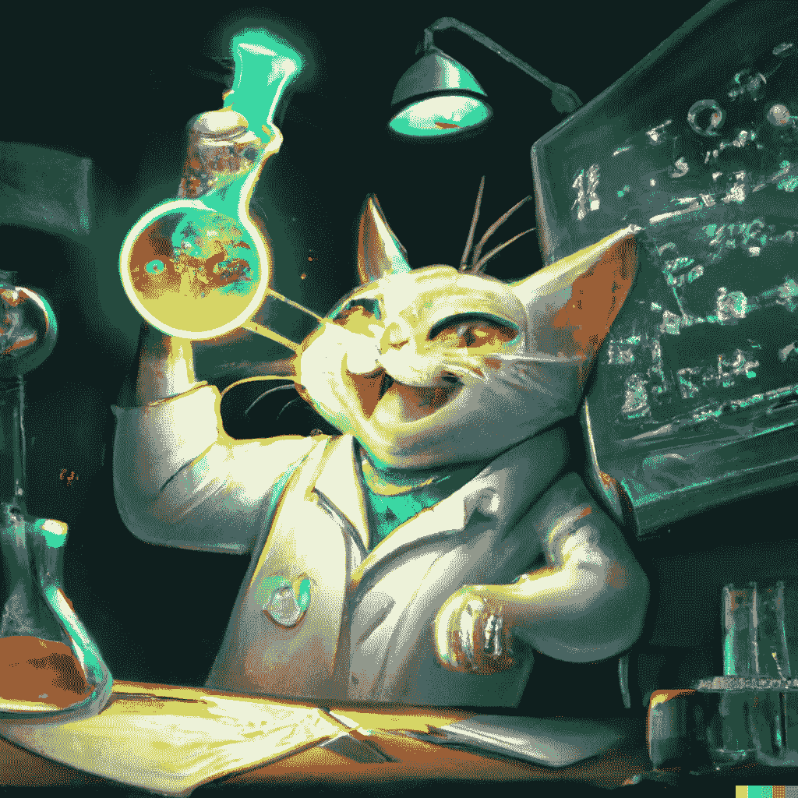
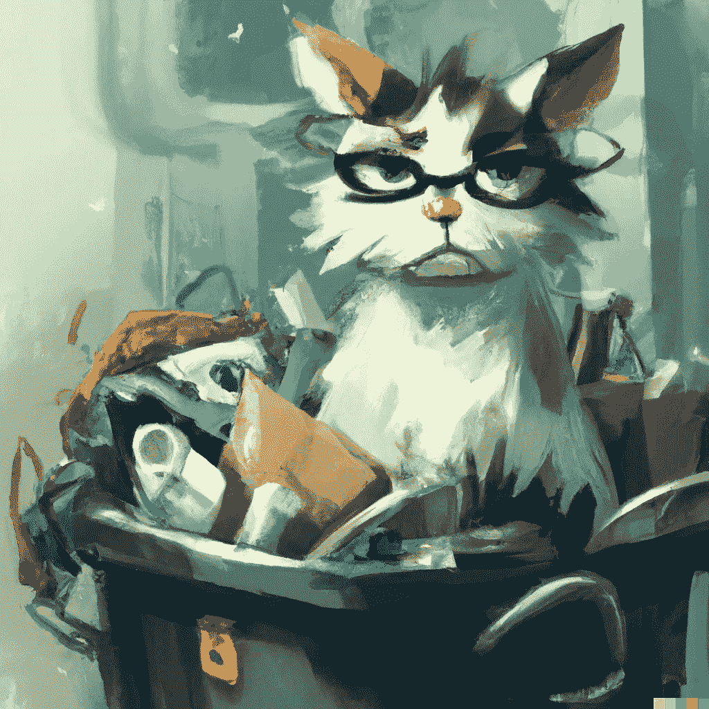
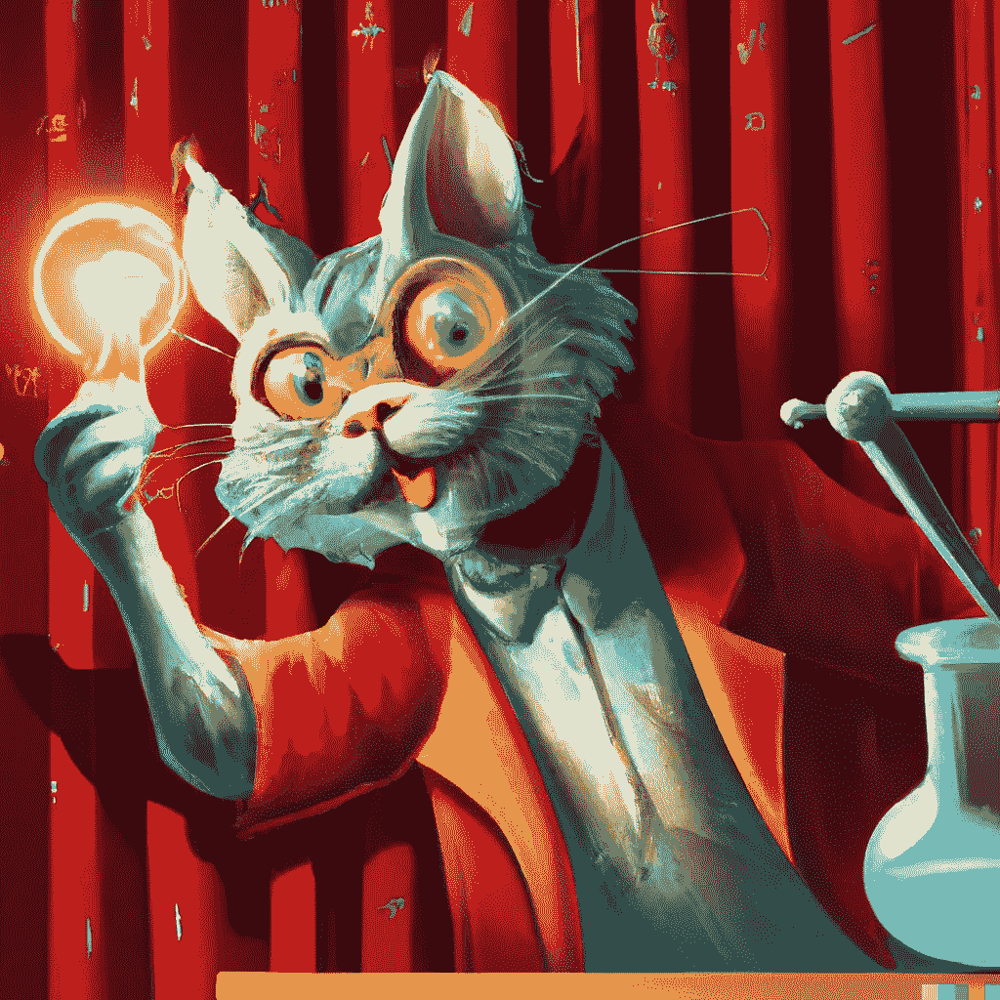

# 失误和重大胜利:建立一个成功的人工智能奖学金指南

> 原文：<https://towardsdatascience.com/blunders-and-big-wins-a-guide-to-building-a-successful-ai-fellowship-add82be7fc44>

## 如何吸引、培养和留住稀缺的机器学习人才

找到成功的公式。图片作者。使用[生成 AI*Dall-E*](https://openai.com/dall-e-2/)

人工智能的世界正以令人难以置信的速度前进。每年都有大量人工智能初创公司涌现，发表的研究数量也在逐年增加。虽然这对那些建立人工智能公司的人来说是一个好消息，但也有一些问题随之而来。

首先，AI 人才稀缺。你需要成为一个有吸引力的雇主，这可以通过补偿或次级福利来解决。其次，你的 AI 天赋可以很快落后。两年前最先进的东西现在可能已经过时了。如果你想保持企业的竞争力和吸引力，跟上最新的趋势是至关重要的。

在你公司内部投资人工智能 R&D 可以解决这两个问题。根据我们在 [Slimmer AI](https://www.slimmer.ai/) 的经验，从事机器学习(ML)工程师、ML 研究员或数据科学家工作的人通常都有学术背景，并且更喜欢在他们的工作中有研究成分。他们有学习的动力，应该给他们学习的机会。当人才发展受到重视时，它将提高工作满意度和你的内部知识。双赢！

那么，这个人工智能 R&D 程序应该是什么样的呢？

在更苗条的人工智能中，我们已经多次尝试解决这种对更多人工智能 R&D 的需求，并了解了什么可行，什么不可行(艰难的方式)。经过几次迭代，我们现在有了一个成功的公式，我们称之为我们的人工智能伙伴关系，我们的工程师很喜欢它！在这篇博文中，我将分享我们学到的经验，向你介绍我们的人工智能奖学金以及如何在你自己的组织中建立它。

如果你有兴趣了解更多关于我们的人工智能伙伴计划，请看看[这篇文章](https://medium.com/slimmerai/the-ai-fellowship-mastering-machine-learning-on-the-job-8811c4a4d943)，它分享了关于具体实施的更多细节。

# 我们失败的尝试(这样你就可以避免它们)

作为一个应用人工智能 B2B 创业工作室，我们正在不断寻找新的机会。知道人工智能什么是可能的，什么是不可能的，使我们能够专注于令人兴奋的新领域的机会，远离其他人。

然而，仅仅跟随高层趋势是不够的。通过了解当前最先进的技术和如何实际实现它，风险是什么，等等。，我们正在收集必要的经验，以提供最优质的人工智能产品。

以下部分概述了我们在过去几年中为满足这一需求所做的尝试，并展示了哪些措施没有奏效以及原因。

*作者图片。AI 生成使用* [*Dall-E*](https://openai.com/dall-e-2/)

## 尝试 1:分裂我们会堕落

ML 工程师最有可能同时从事至多一个或两个项目。这种专注在短期内可能是好的，但从长期来看会限制他们的视野。我们有几个团队从事不同的项目，使用不同的数据和人工智能技术。为了减少孤立，我们引入了每周一次的人工智能脱口秀，在那里我们讨论进展和我们面临的问题。这听起来像是一个分享知识和一起排除故障的好方法。

然而，几个月后，我们注意到几乎没有互动。每当有人遇到路障并寻求帮助时，没有人能够做到。由于我们都专注于自己的项目，我们只是没有知识或经验来帮助稍微不同的领域。很明显我们需要别的东西。

## 尝试 2:失焦

为了解决这个问题，我们认为分享关于我们在项目中应用的人工智能的更深入的知识会有所帮助。这将使每个人在需要时更好地理解其他人面临的问题。ML 的工程师们准备了半个小时的深潜技术演示，并在最后留有讨论的空间。我们分享了令人兴奋的新论文和应用新模型或技术时获得的经验。

虽然这些会议很棒，也很有帮助，但很难让它们与当前的工作保持一致。这是因为这些技术深度挖掘并没有聚焦于我们的核心业务。此外，人们发现很难找到时间来准备这些会议，因为要满足项目的最后期限。

尽管这些会议没有达到我们的预期目标，但我们重新调整了它们的用途，让我们公司的每个人都能分享知识，并就不同的主题教育他人。机器学习内容的频率和深度都下去了，但是我们公司内部的交流增加了很多。这是与所有不同部门保持联系的好方法，尤其是当我们很多人都在远程工作的时候。

## 尝试 3:谁在开这辆车？

在这一点上，我们仍然缺乏增长知识的方法，也许更重要的是，缺乏实践经验。下一个计划旨在解决这两个问题。

这个想法是围绕选择一些感兴趣的主题，并组成小组进行一些研究和开发。然而，开发部分不是很强，我们缺少一个人来推动和监督这个项目。同样，在几个月的时间内，人们开始优先考虑其他工作，项目停止了。

## 尝试 4:忘记现实世界

我们试图通过为每个主题指定明确的领导者，并告诉每个人他们都有专门的时间来完成 R&D 的工作，来修补之前的计划。这很有帮助。有了明确的领导，工作就能保持在正轨上，人们也能更积极地参与进来。

然而，并不是每一个被任命的领导者都和这个角色有着相同的亲和力。团队在固定的日子里聚在一起做 R&D 工作，这增加了每个人的动力。然而，没过多久，日常工作和截止日期的压力就悄悄逼近我们，慢慢瓦解了团队。

R&D 的主题大多围绕工程师的兴趣，起初很有趣，但如果没有与公司的近期战略重点明确联系，这项工作很快就开始变得无关紧要。

基于这些过去的尝试，我们开始创造一些新的和持久的东西。人们感到兴奋，觉得他们可以花时间去做的事情，以及真正有助于增加我们的知识和实践经验的事情。

# 进入:人工智能协会

更苗条的艾艾联谊项目是我们文化结构的一部分；我们的 ML 工程师一直认为这个项目非常或非常有价值。这个项目不仅让工程师们感到兴奋，也让公司的每个人感到兴奋。我们的工程师动力十足，知识更加渊博，这意味着我们能提供更高质量的产品。更好的产品造就快乐的顾客。

人工智能奖学金与来自 [Spotify 模式](https://kanbanize.com/blog/spotify-model/)的*章节*有许多相似之处，后者代表了一群具有相似能力领域的人。除了分享这个领域的知识和想法，我们还加入了一个专门的研发项目。

该计划围绕四个主要目标:

1 **加速创新**我们致力于与更苗条的人工智能的近期需求一致的主题，以便我们保持领先地位。

2 **吸引、培养和留住人才**我们的工作主题与员工专业技能的差距和兴趣一致。

3

4 **加强风险关系**作为一家风险工作室，我们不仅关心更苗条的人工智能团队，也关心我们投资公司的 ML 能力。我们将风险投资员工纳入我们的团队，并帮助他们建立自己的项目。

# R&D 计划

那么，我们联谊背后的成功是什么呢？基于我们失败的模式，有几个关键的方面可以造就一个伟大的人工智能团队:

*   具有清晰的结构
*   强制性参与和管理承诺
*   每周专门的时间和良好的计划
*   符合业务目标和员工兴趣的主题
*   让某人推动创新

关于我们 R&D 项目的具体实施细节，请参见[本帖](https://medium.com/slimmerai/the-ai-fellowship-mastering-machine-learning-on-the-job-8811c4a4d943)。现在，我将简要强调你需要知道的，并分享一些有用的提示&技巧。

## 清晰的结构

在 Slimmer AI，我们每年有四次 R&D 循环。一个 R&D 周期由 3 个月组成，包括 7 周的研究和 2 周的开发阶段。剩余的时间被用作缓冲，或者在博客文章、研究论文或开源软件中发布有趣的发现。如果你对我们过去的工作感兴趣，可以看看我们的[媒体](https://medium.com/slimmerai/innovation/home)页面和 [GitHub](https://github.com/Slimmer-AI) 。

## 强制参与和专用时间

该计划最重要的一个方面是专用时间。这只有通过贵组织最高层的支持才有可能实现。人工智能奖学金的持续成功是每个 ML 工程师的角色卡的一部分，他们在评估期间根据他们对推进我们的 R&D 的参与情况进行评估。领导层的这一承诺，加上研究阶段每周半天的专用时间和开发阶段 6 整天的专用时间，确保我们的工程师有信心将他们的时间花在我们未来的这一重要投资上。

## 重要的话题

在一个 R&D 周期中，两个或三个人工智能主题被并行处理。这些主题是根据我们的短期业务需求以及我们员工的专业知识差距和兴趣选择的。

## 推动创新

最后，我们让推动人工智能协会和它的 R&D 项目成为了某人的工作。理想情况下，每个人都是自我组织，积极主动，规划自己的发展道路。但遗憾的是，这并不是现实。尤其是在许多人远程工作的时代，即使是在 Zoom 通话中进行讨论也是一个挑战。

因此，让某个人或一群人来推动这个项目是至关重要的。职责包括:决定与产品经理合作解决哪些话题，领导每周的站立会议，促进富有成效的讨论，并确保我们设定的目标得以实现。不要听天由命。

# 提示和技巧

在 2021 年初推出之后，人工智能奖学金已经根据我们的 ML 工程师的反馈进行了几次迭代改进。我将分享我们学到的东西和我们随着时间的推移所做的改变，这样你就不必重新发明轮子了。

以下是我们关于计划、主题和一般设置的提示和偏好。

图片作者。使用[生成 AI*Dall-E*](https://openai.com/dall-e-2/)

**策划**

*   最好每周与小组分享一次更新。
*   一周的开发阶段不够长。最少两周。
*   开发阶段可能感觉很短，因此在研究阶段的最后几周为此阶段做准备是至关重要的(例如，准备数据集和加载数据集的必要代码)。
*   不要强迫 7 周和 2 周的 R&D 时间表，而是给人们在阶段之间交替的自由。有时候，在周期的中途有一个发展周会更方便。
*   让人们计划自己的 R&D 时间。有些人喜欢每周半天，有些人喜欢每两周一天。两种选择都绝对没问题。
*   考虑组织焦点日，让人们聚在一起做 R&D 的工作。这对于那些纠结于上下文切换或者通常容易分心的人来说尤其有用。

## 主题

*   主题应该附有清晰的用例或示例研究问题。或者，可以在周期的后期分配时间对一个研究问题进行头脑风暴，以提供一些焦点。
*   让工程师们自由选择工作主题让人感觉很自由。此外，我们还为人们提供提交提案的机会。
*   理想情况下，每个主题都有大约相同数量的人负责。这是为了保持讨论的平衡，而不是制造孤立。
*   增加在后续 R&D 周期中继续某个主题的可能性。这允许更雄心勃勃的目标。

## 一般设置

*   团队工作比单独工作更有趣，更有动力。不要把群体搞得太大，以至于无法保持强烈的个人主人翁意识。每组两三个人就够了。
*   让每个人都写下他们的研究，可以让其他人以后再读。我们的工程师更喜欢按时间顺序排列，而不是按主题组织。这是因为如果他们错过了一场单口相声，他们可以很容易地赶上来。
*   对于 R&D 的大型合作项目，有人担任项目负责人是至关重要的。这也为学习项目管理的人提供了一个很好的机会。
*   偶尔打乱一下 R&D 循环对士气很有好处。例如，看看[这篇关于我们主办的内部人工智能竞赛的博文](/how-an-internal-competition-boosted-our-machine-learning-skills-9fa40efc402e)。
*   实习生并不积极参与 R&D 项目，但被邀请参加我们每周一次的人工智能脱口秀，在那里他们可以学习并参与讨论。
*   这种人工智能伙伴关系模式非常适合 5-20 人左右的中小型团队。如果你的团队超过这个数目，考虑为每个特定的重点领域建立一个伙伴关系——比如 NLP、计算机视觉等。

# 最后

人工智能是一个快速发展的领域，作为一家应用人工智能公司，你需要跟上最新的发展。不仅要保持领先地位，还要吸引和留住稀缺人才。

在这篇博文中，我介绍了人工智能奖学金:一个面向一群人工智能工程师的 R&D 项目。它是在几次失败尝试的基础上创建的，可以在任何开发和应用人工智能的公司实施。我们的工程师很喜欢它，它已经成为我们独特的卖点之一。

奖学金成功的关键特征是:清晰的结构、强制性参与、专用时间、相关主题，以及有人推动与公司战略目标相关的创新。

如果您计划在您的组织中实施 R&D 计划，我很想听听您的意见并分享想法。另一方面，如果你已经有在你的公司建立这样一个项目的经验，请在评论区分享你的想法和智慧。

如果你想了解更多关于我们在 Slimmer AI 的工作，请随时联系我们或访问我们的网站。