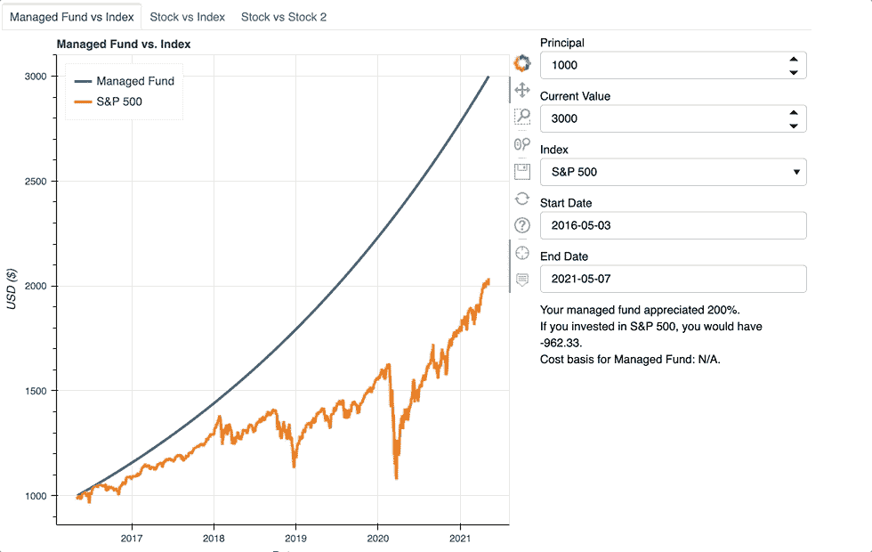

# 散景互动图:第三部分

> 原文：<https://towardsdatascience.com/bokeh-interactive-plots-part-3-683153f5f5ce>

## 如何构建自定义交互式散景应用程序

康斯坦丁·叶夫多基莫夫在 [Unsplash](https://unsplash.com?utm_source=medium&utm_medium=referral) 上的照片

## 概观

这是散景互动图系列的第三篇也是最后一篇文章。第 3 部分建立在第 1 部分和第 2 部分的基础上。在继续之前，我建议阅读第 1 部分和第 2 部分。

    

第 1 部分创建了应用程序的基础，并将管理基金与指数进行了比较。第 2 部分通过将可交易资产与指数进行比较，拓宽了应用的范围。如下所示，第 3 部分添加了一个新的选项卡和图表，让用户可以比较任意两种证券。 ***为清晰起见，本文将顶部“股票代码”小部件中的资产称为主要投资。***“Stock 2 Ticker Symbol”小部件中的资产是相对于主要投资的资产。

图片作者。

第 3 部分还在小部件下的每个选项卡中添加了一个文本框。文本框显示主要投资升值或贬值的程度、两项投资当前价值之间的差异以及主要投资的成本基础。文本框可以很容易地比较两种不同投资的结果。

第 3 部分试图尽可能多地重用前面的代码。与第 2 部分相比，只有`find_min_date`和`update`发生了变化。第 3 部分为新文本框引入了一个新功能`div_text`。

## 密码

这个项目的 Git 回购在这里链接[。](https://github.com/katyhagerty/index_fund_comparison)

## 小工具

选项卡 3 的小部件与选项卡 2 的小部件非常相似，只是选项卡 3 有两个 TextInput 小部件。TextInput 小部件允许用户输入两个股票代码，并比较任意两个资产。此外，第 3 部分使用了一个新的小部件 Div，它与 HTML `
`元素保持一致。

与第 2 部分一样，字典存储新选项卡的小部件。一个新的字典，`div`，保存文本以填充新的文本框。

## 调用函数

下面显示了如何调用函数来初始化表 3 的数据和绘图。这遵循第 2 部分的格式，除了创建文本框的`line 14`。`div_text`输出格式化文本。通过将`sizing_mode`设置为`‘stretch_width’`，文本框会拉伸以填充所有可用宽度。第 1 部分详细介绍了一个`column`对象如何存储所有的小部件。这个容器还将存储 div 小部件。所以不会占用整个浏览器宽度，只占用`column`的宽度。

## 功能

新函数`div_text`计算主要投资的增长、两项投资之间的差额以及主要投资的成本基础。它有三个输入— `df_source`、`cost_basis`和`investment_type`。`df_source`是一个数据框架，包含特定选项卡上引用的两项投资的数据。由于无法购买指数，如果为选项卡 1 调用`div_text`，则`cost_basis`为“不适用”。对于表 2 和表 3，`cost_basis`是一个`float`，代表在开始日期单个份额的初始投资成本。`investment_type`是描述主要投资的字符串。运行计算后，`div_text`将信息格式化并返回一个字符串，供文本框显示。

`find_min_date`包括用于标签 3 的额外`elif`。现在，当调用 Tab 3 时，该函数使用`yfinance`来检查每项资产何时上市。像以前一样，它返回两个日期中最近的一个，因为该日期表示两个资产的历史重叠的时间。这两种资产需要同样长的时间来升值，以便进行公平的比较。

## 回调函数

回调函数`update`，只有微小的改动。`Line 20`调用`div_text`更新选项卡 1 的文本框，而`line 29`对选项卡 2 和 3 做同样的事情。

## 结论

感谢您阅读散景互动剧情系列的最后一篇文章。这些文章的目标是一步一步地分解如何构建交互式散景图。希望这个应用程序能帮助你更好地理解散景，甚至启发你建立一个散景应用程序。

欢迎所有反馈。我总是渴望学习新的或更好的做事方法。请随时留下您的评论或联系我 katyhagerty19@gmail.com。

 