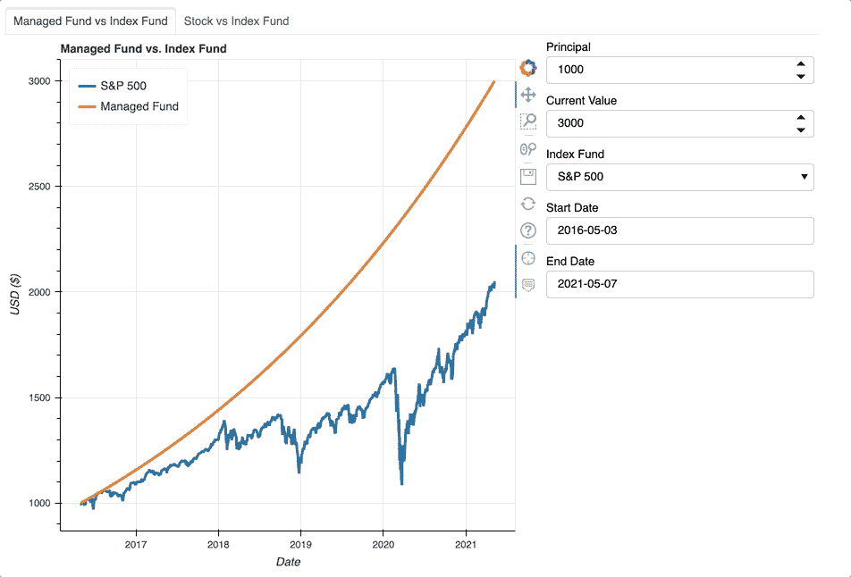
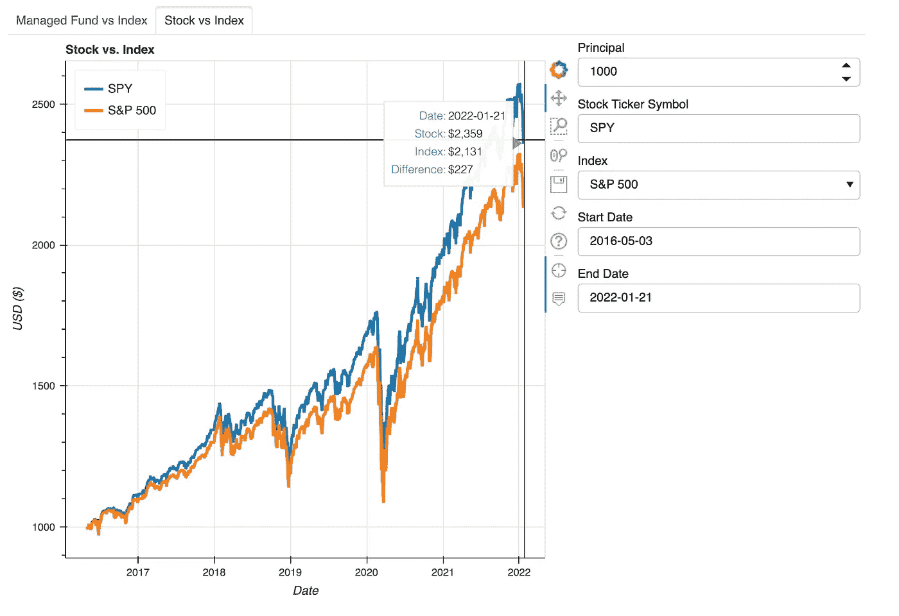
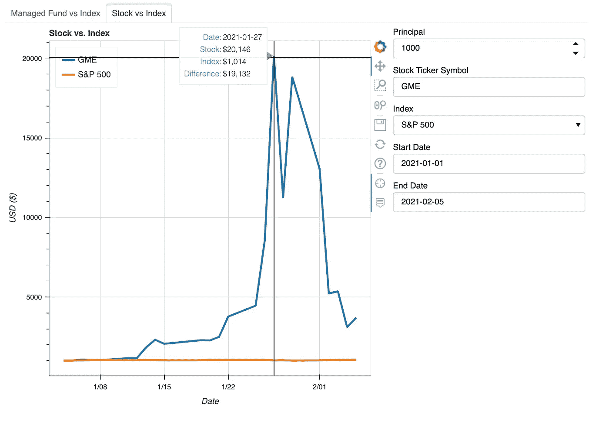

# 散景互动图:第二部分

> 原文：<https://towardsdatascience.com/bokeh-interactive-plotting-part-2-316f8d58f476>

## 如何构建自定义交互式散景应用程序

图片由[视觉故事||米歇尔](https://unsplash.com/@micheile?utm_source=medium&utm_medium=referral)在 [Unsplash](https://unsplash.com?utm_source=medium&utm_medium=referral) 上拍摄

# 概观

这是包含散景交互式可视化的三篇文章系列的第二部分。因为这篇文章是建立在前一篇文章的基础上的，所以我建议先阅读[第 1 部分](https://medium.com/@katyhagerty19/bokeh-stock-comparison-tool-part-1-81afb176a14e)。

<https://medium.com/@katyhagerty19/bokeh-stock-comparison-tool-part-1-81afb176a14e>  

第 1 部分构建了 Bokeh 应用程序框架来比较管理基金和指数。第 2 部分扩展了该框架，增加了将指数与证券交易所中的任何证券进行比较的选项，如 eft、共同基金、股票和指数基金。第 2 部分功能位于应用程序的新选项卡上，如下所示。

图片作者。

第 2 部分旨在尽可能多地重用第 1 部分，但仍然需要对功能进行一些修改。由于选项卡 1 上的管理基金与指数图仍然使用这些功能，任何添加都必须以不破坏现有图的方式扩展功能。

对于选项卡 2 上的股票与指数图，两个数据集都依赖于`yf_fund`,因为雅虎财经同时跟踪指数和股票数据。因此，`create_source`和`make_plot`需要改进，以便在`yf_fund`生成两个数据集的情况下工作。之前，`create_source`和`make_plot`分别从`yf_fund`和`managed_fund`获得一个输入。

# 密码

Git 存储库可以在这里找到[。](https://github.com/katyhagerty/index_fund_comparison)

## 小工具

Tab 2 使用一种新的小部件 TextInput，它允许用户输入证券的股票代码。除此之外，选项卡 2 上的其他部件与选项卡 1 上的部件相匹配。因为现在有两组小部件，所以字典存储的是小部件而不是变量名。不是显式定义每个小部件，而是用一个循环来定义小部件。当编辑`update`以使用选项卡 1 和选项卡 2 时，该方法将被证明是有用的。

字典还存储 Dataframe 和 ColumnDataSource 对象。其他函数将填充这些字典。

## 功能

第 2 部分引入了一个新函数`find_min_date`。它使用`tab_no`并找到选项卡绘图的最小日期。对于选项卡 1，最小日期将取决于索引开始的时间。对于选项卡 2，该函数检查股票(`fund_1`)和指数(`fund_2`)的开始时间。选项卡 2 上股票与指数图的`min_date`将是最近的日期。最近的日期表示两个资产的时间线相交的开始。这是必要的，因为如果一种资产比另一种资产有更多的增长时间，这是不公平的比较。`start_date_picker`和`end_date_picker`小部件使用`min_date`来设置用户可以选择的最小日期。

与第 1 部分一样，`yf_fund`使用 Yahoo Finance 模块来获取股票市场数据。之前，`yf_fund`只读入指标数据。现在，它还可以获取给定股票代码的数据。这可能是股票，共同基金，或交易所交易基金。对`yf_fund`的唯一主要补充是`line 18`，它将股票分割考虑在内。每当一家公司决定将一股现有股票分割成多股时，就会发生股票分割。例如，当亚马逊在 1998 年发行 2 比 1 的股票分割时，现有股东的股票数量翻了一番。

在第 1 部分中，两个不同的函数`managed_fund`和`yf_fund`为`create_source`生成两个输入。然而，要使用零件 2，`create_source`也必须合并`df_fund1`和`df_fund2`，即使`yf_fund` 创建了两者。如果`yf_fund`创建两个输入，则列名重叠。`line 16`中的`rsuffix`参数为`df_fund2`中的列添加后缀，以解决列名重叠的问题。`lines 12`和`line 13` 搜索所有的列名，确定哪些列有投资头寸的数据。然后，`line 16`使用这些列来找出两项投资之间的差异

`Line 6`和`line 7`标识保存图例标签的列的名称。`Line 9`和`line 10`用更通用的名称重命名图例列。这些通用名是`make_plot`所必需的。关于为什么列需要占位符标签的更全面的解释，请参见`make_plot`。

与`create_source`中的变化类似，`make_plot`中的编辑包括添加变量，以便识别正确的列。`make_plot`只被调用两次——一次是在选项卡 1 上绘制共同基金与指数图，另一次是在选项卡 2 上绘制股票与指数图。因此，有时数据位于名为 Managed Position 和 Stock Position 的列中，有时数据位于名为 Stock Position 和 Stock Position_2 的列中。`position1`和`position2`标识哪些列包含相关数据。`label1`和`label2`是`TOOLTIPS`弹出框的标签。

为了保持`TOOLTIPS`的正确格式，必须将`position1`和`position2`添加为 f 字符串。f 字符串允许表达式嵌入到字符串中，只要这些嵌入的表达式在大括号内。`TOOLTIPS`如果列名包含空格，也使用大括号。为了正常工作，每个 f 弦需要三套背带。f 字符串最里面的一对表示嵌入的信息。最外面的两个大括号确保输出字符串包含一组大括号。输出需要一组大括号，因为列名包含一个空格。例如，如果为 Tab 2 图调用了`make_plot`，f 字符串将输出`‘{Stock Position}’`和`‘{Stock Position_2}’`，并且`TOOLTIPS`将搜索这些列名。

`create_source`定义了`legend1`和`legend2`。它们标识了`df_source`中包含股票代码的列。图例使用这些列名作为标签，如`line 21`和`line 23`所示。正如第 1 部分所讨论的，散景以表格格式存储所有可更新的信息。因为每当用户选择新的证券时，图例标签都会改变，所以它们必须存储在列中。

重要的是要记住`make_plot`只在初始化时被调用。不是每次用户更改输入和更新数据集时都调用它。在更新期间，新数据替换了`source`中的旧数据。替换`source`中的数据会改变图形，而不会调用`make_plot`。

## 回调函数

`update`有了新的参数`tab_no`，因为不同的标签需要不同的功能。对于选项卡 1，`update`调用`managed_fund`和`yf_fund`。对于选项卡 2，`update`只调用`yf_fund`。然后，`create_source`从`managed_fund`和/或`yf_fund`获取输出数据，并合并两个数据帧。之后，合并的 Dataframe 被转换成`new_source`，一个 ColumnDataSource 对象。接下来，`new_source`替换`source`中的数据。再次重申，更新`source`是改变显示数据所需要的。

## 用事件触发回调

回调函数`update`需要链接到事件。更改小部件值调用`update`。散景回调函数只接受三个参数，`attr`、`old`和`new`。然而，现在应用程序有多个标签，`update`需要知道刷新哪个标签。`partial`解决了这个困境。`partial`是`functools`模块的一部分，向现有函数添加额外的参数。

# 案例研究:标准普尔 500 对间谍

由于股票与指数图有能力收集任何可交易基金的数据，该应用程序可以比较指数基金如何达到其跟踪的指数。SPY 是跟踪标准普尔 500 指数的 ETF，也是最受欢迎的 ETF 之一。自 1993 年成立以来，SPY 的平均年回报率为 10.5%。如下所示，间谍镜像标准普尔 500 很好，但并不完美。

图片作者。

# 案例研究:标准普尔 500 对 GME

> 市场中的时间胜过市场时机。

去年，GameStop 股票爆炸。简而言之，许多个人投资者集体决定购买 GME 的股票，这推动了需求，提高了股价。他们疯狂的想法给投资者带来了巨大的收益，也给做空股票的华尔街对冲基金带来了巨大的损失。

GME 上涨如此之快，以至于 1000 美元的投资会在不到 4 周的时间里产生超过 20000 美元的收益。然后，股票价格猛跌。尽管 GME 在几天内有不可思议的增长，GME 强调了不要试图把握市场时机的重要性。只要问问那些高价买入的人，他们很快就看到了投资池。

图片作者。

# 后续步骤

第 3 部分添加了一个新的选项卡，其中有一个股票对比图和一个文本框，显示投资的增值、两种投资之间的差异以及成本基础。

[https://medium . com/@ katyhagerty 19/bokeh-interactive-plots-part-3-683153 F5 F5 ce](https://medium.com/@katyhagerty19/bokeh-interactive-plots-part-3-683153f5f5ce)

欢迎所有反馈。我总是渴望学习新的或更好的做事方法。请随时留下您的评论或联系我 katyhagerty19@gmail.com。

<https://medium.com/@katyhagerty19/membership>  

# 参考

[1]尼克拉斯，史蒂文。[间谍:SPDR S & P 500 ETF 信托](https://www.investopedia.com/articles/investing/122215/spy-spdr-sp-500-trust-etf.asp) (2021)，Investopedia