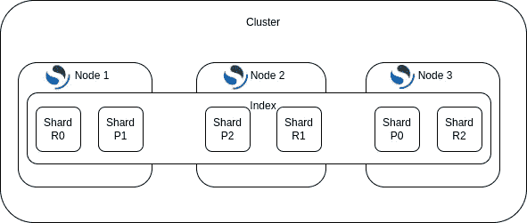

# 通过 5 个简单的步骤提高 OpenSearch 的性能

> 原文：<https://towardsdatascience.com/bolster-opensearch-performance-with-5-simple-steps-ca7d21234f6b>

## 了解如何提高 OpenSearch 集群的性能，最终加速您的工作负载


[约翰·卡梅隆](https://unsplash.com/@john_cameron?utm_source=medium&utm_medium=referral)在 [Unsplash](https://unsplash.com?utm_source=medium&utm_medium=referral) 上拍照

[OpenSearch](https://opensearch.org/) 旨在帮助每个人更快地找到他们需要的东西。但是多快才算“够快”呢？为了回答这个问题，Gmail 的创始人 Paul Buchheit 为所有数字交互引入了“[100 毫秒延迟规则](https://blog.superhuman.com/superhuman-is-built-for-speed/)”。他解释说，100 毫秒是一个“互动感觉即时”的阈值。亚马逊进行的一项研究发现，他们网站上每增加 100 毫秒的延迟就会损失 1%的销售额。因此，企业主优化延迟、准确性和成本至关重要。通过提高 OpenSearch 集群和搜索速度，您可以增强客户的用户体验，从而显著增加您的收入。为了帮助你做到这一点，我将带你通过一些简单和先进的步骤来提高 OpenSearch 的性能。我还将讨论我在 [Searchium.ai](https://www.searchium.ai/) 帮助开发的一个新的搜索加速器插件的好处。

## **步骤 1:为您的用例选择正确的刷新间隔**


照片由[Genessa panain ite](https://unsplash.com/@genessapana?utm_source=medium&utm_medium=referral)在 [Unsplash](https://unsplash.com?utm_source=medium&utm_medium=referral) 上拍摄

OpenSearch 中的索引数据不能立即访问。为了提高效率，文档在被索引到段中之前首先通过内存中的缓冲区。如果有大量繁重的索引进程，那么首先将令牌保存在内存缓冲区中，然后将它们转移到碎片段，这样会更有效；这一过程称为“刷新”。增加和减少刷新间隔有成本和好处。缩短刷新周期会降低内存缓冲区的效率，因为在将令牌索引到段之前，内存缓冲区只能保存一定数量的令牌。通常，增加刷新间隔会提高搜索性能。但是，如果刷新间隔增加太多，刷新过程将需要更长时间才能完成，因为缓冲区中有大量数据，这可能会影响搜索性能。此外，长时间间隔意味着数据在内存缓冲区中的时间更长，因此在刷新缓冲区之前是不可搜索的。在大多数情况下，一秒钟的默认刷新间隔就足够了。但是，请记住，在刷新期间会使用许多资源，刷新间隔应该适合您的使用情形。例如，如果您正在处理前几天的数据，并且不需要接近实时的数据，则可以每天只刷新一次。

您可以简单地使用 [refresh](https://opensearch.org/docs/latest/search-plugins/knn/performance-tuning/#indexing-performance-tuning) API 来更改刷新间隔，如下所示:

```
PUT /<index_name>/_settings{
 “index”: {
 “refresh_interval”: “30s”
  }
}
```

# 步骤 2:优化缓存利用率

有多种缓存可以帮助您提高搜索性能，比如文件系统缓存、[请求缓存、](https://www.elastic.co/guide/en/elasticsearch/reference/current/shard-request-cache.html)和[查询缓存](https://www.elastic.co/guide/en/elasticsearch/reference/current/query-cache.html)。例如，您可以通过增加**节点级查询缓存**的大小来提高性能。OpenSearch 使用节点级查询缓存来存储查询结果，以便在再次搜索索引时可以更快地返回这些结果。默认情况下，缓存最多可以存储 10，000 个查询，并占用堆总空间的 10%。OpenSearch 保留一个查询历史来跟踪查询的出现，并评估一个查询是否有资格进行缓存。缓存使用最近最少使用(LRU)策略—当缓存填满时，它会删除一段时间内未被访问的查询。

如果节点级查询缓存太小，您的 OpenSearch 性能可能会受到影响，因为有些查询可能不会被缓存。要更改大小，您可以更改全局设置参数-*indexes . queries . cache . size*，它接受百分比值(如 5%)或精确值(如 512MB ):

上面提到的缓存是在节点级别维护的，这限制了它们在某些情况下的有用性。比如说。如果您连续运行同一个请求两次(并且有一个或多个副本并使用默认的循环算法)，每个请求都将进入不同的分片副本，从而阻止节点级缓存的帮助。

另一种方法是使用**碎片级请求缓存**来提高搜索速度。当针对一个或多个索引执行搜索查询时，每个相关的碎片在本地进行搜索，并将其本地结果发送给协调节点，协调节点将这些碎片级结果合并成一个“全局”结果集。碎片级请求缓存模块在每个碎片上缓存本地结果。这使得大量频繁使用的搜索请求能够非常快速地返回结果。搜索应用程序的用户经常一个接一个地运行类似的请求，因此最大限度地利用这个缓存可以显著提高搜索速度。

默认情况下，请求缓存设置为 1%。这可以通过编辑 opensearch.yml 文件参数来更改:*indexes . requests . cache . size*

# 步骤 3:优化分片和副本



作者图片

碎片是 OpenSearch 高可用性和高性能的主要驱动因素之一。在 OpenSearch 中，每个查询在每个分片的一个线程上运行。多个分片可以并行执行。如果有多个碎片，那么就有多个线程同时运行。碎片支持并发搜索，提高了搜索效率。然而，拥有太多碎片也有其自身的缺点。查询过程包括合并碎片——碎片越多，花在合并上的时间就越多。除此之外，每个碎片利用资源进行映射、存储集群状态、查询等。碎片数量越多，资源利用率就越高，从而降低性能。没有适合所有场景的单一数量的碎片。一个流行的策略是从一个碎片开始，然后不断增加，直到你得到最好的结果。通常，推荐的碎片大小应该在 30 GB 到 50 GB 之间。

您可以使用 API 更改碎片和副本的数量:

```
PUT <index_name>/_settings{
 “index”: {
 “number_of_shards”: 3,
 “number_of_replicas”: 1
 }
}
```

# **第四步:管理你的指数**


照片由 [Nathália Rosa](https://unsplash.com/@nathaliarosa?utm_source=medium&utm_medium=referral) 在 [Unsplash](https://unsplash.com?utm_source=medium&utm_medium=referral) 上拍摄

## **构建适合您的用例的 OpenSearch 数据和索引:**

**将你的数据分解成更小的索引** — OpenSearch 将数据存储在索引中。要存储数据，可以使用一个或多个索引。您的所有数据不需要保存在一个索引中。例如，您可以选择一个索引来存储一个月、一天或一小时的数据，这取决于您的用例。

**避免嵌套字段** —恰当的文档设计有助于加快请求的处理速度。当存在嵌套字段和父子层次结构时，查询需要更长时间。要加快查询速度，请尽可能使文档平坦。

## **将映射标识符视为关键字**

没有必要将每个数值都映射为数值字段数据类型。整数和长型字段适用于 OpenSearch 范围查询。但是，术语级查询更适合关键字字段。

为了提高检索速度，如果您不打算使用范围查询来搜索字段，请考虑将映射字段作为关键字字段。例如，像 ISBN 或产品 ID 这样的标识符可以作为关键字字段处理，而不会影响有效性。

## **偶尔重新索引您的数据**

OpenSearch 中的数据是不可变的。在 OpenSearch 中更新文档时，会创建一个新文档，而不是更新现有文档。新文档被分配一个版本号，这有助于 OpenSearch 跟踪最新和最相关的文档。但是，由于包含了新文档和旧文档，索引会显著扩展。重新索引解决了这个问题。重新编制索引后，您的索引将只包含最新的信息，从而节省内存并加快后续搜索。

这可以使用 API 来完成，如下所示:

```
POST _reindex{
 “source”: {
 “index”: “my-index”
 },
 “dest”: {
 “index”: “my-new-index”
 }
}
```

# 第五步:使用加速搜索插件


由 [Nicolas Hoizey](https://unsplash.com/@nhoizey?utm_source=medium&utm_medium=referral) 在 [Unsplash](https://unsplash.com?utm_source=medium&utm_medium=referral) 上拍摄的照片

你选择 OpenSearch 可能是因为你需要快速访问大量数据，不想使用传统的数据库。然而，即使有最好的优化和软件修改，如果没有足够的计算能力，性能仍然是不够的。足够的缓存、磁盘空间、CPU 和 RAM(随机存取存储器)对于峰值 OpenSearch 性能至关重要。

一个好的选择是使用具有扩展 RAM 的高级计算机。内存越多，搜索延迟就会越短。RAM 使应用程序能够在短期内存储和访问数据。它存储您的计算机正在使用的信息，以便可以快速访问。这种设备的一个例子是 AWS 的 m5 实例，它由英特尔至强白金 8000 系列处理器组成。这种 CPU 处理器和大 RAM 空间的组合可以显著提高您的搜索性能。

另一个不错的选择是将您的工作负载从基于 CPU 和 RAM 的解决方案转移到非传统的硬件解决方案。升级您的计算资源非常昂贵，而且可能无法减少延迟。有时，需要涉及更高级资源的解决方案来解决延迟问题并提高搜索性能。GSI 科技的 APU 就是这样一种计算资源。

想象一下，能够直接在内存中而不是在 CPU 中进行计算操作，避免内存处理器瓶颈并享受难以置信的快速搜索性能。其实有一个 OpenSearch 插件，在 APU 上实现了强大的[语义向量搜索](https://medium.com/gsi-technology/semantic-vector-search-taking-the-leap-from-keyword-search-18855e96854a)。使用 Searchium 的 OpenSearch k-NN 插件，除了上面提到的 OpenSearch 改进建议之外，还可以通过 SaaS 平台的付费订阅轻松访问，这是进一步加快搜索速度的一种方式，同时还可以提高结果准确性并降低基础设施成本。安装插件很容易。该插件允许向量相似性搜索像任何标准的 OpenSearch 查询一样简单地运行。该插件以标准的 OpenSearch 格式提供相似性搜索结果。查看[更详细的](https://www.youtube.com/channel/UCNFCoZfu3WAEKyCnM7TM-nQ)解释如何安装和使用 Searchium 的 OpenSearch KNN 和 [Searchium](https://www.searchium.ai/) 的网站，在那里你可以获得加速器插件的全部访问权限。甚至有一个免费层，您可以在那里进行测试！

做你的研究，了解你的公司的需求，考虑你需要多少和多频繁地操作、查询和存储数据。这将帮助你了解你需要什么样的计算资源来获得最好的 OpenSearch 体验。

## **结论**:

数据对每个企业都至关重要，尤其是在当今快节奏的环境中。快速、有效地处理复杂数据变得比以前更加重要。OpenSearch 是一个非常棒的搜索引擎，它可以搜索数据并几乎立即得到结果。由于 OpenSearch 的出色性能对于满足业务需求至关重要，我真诚地希望这篇文章能够帮助您消除一些阻碍实现最高性能的障碍。