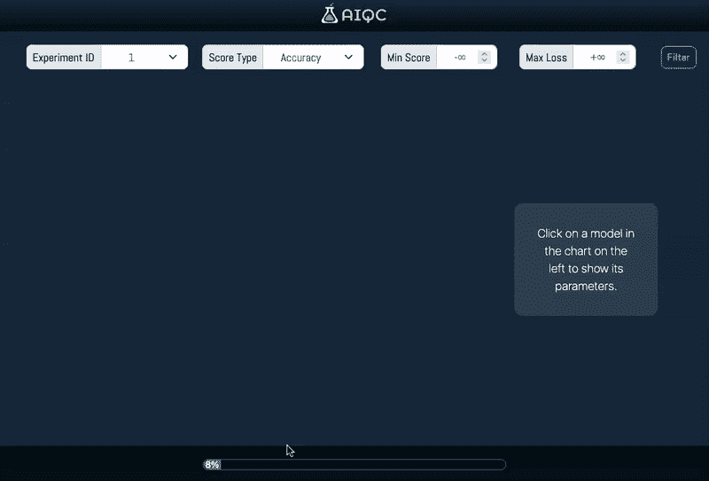
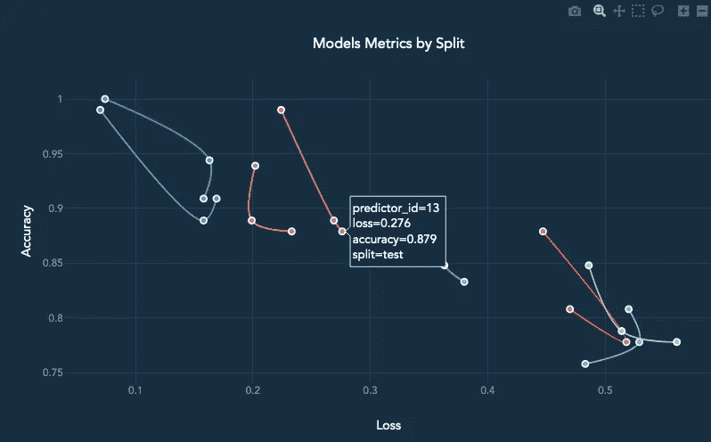

# 回旋镖图

> 原文：<https://towardsdatascience.com/boomerang-plot-9ae4aed419d4>

## *快速发现概化模型的可视化*



作者图片

> `aiqc`回飞棒图可视化了实验中每个模型的每次分割(训练、验证、测试)的各种性能指标。当模型轨迹的点紧密聚集/精确时，这意味着模型已经发现了概括每个群体的模式。

## 🧮如何评价众多调校过的车型

假设您刚刚训练了一大批模型，这些模型看起来都表现得相对较好。根据你关心的指标，你怎么知道哪一个是最好的？为了回答这个问题，你应该这样开始:

*   通过类似`[sklearn.metrics.f1_score](https://scikit-learn.org/stable/modules/generated/sklearn.metrics.f1_score.html)`的函数运行原始预测
*   对每个分割/折叠(训练、验证、测试)都这样做。
*   对每个模型都这样做。
*   对每个指标都这样做。

在这一点上，您可以为每个模型计算*聚合指标*。然而，由于只有 2 或 3 个分割可以学习，聚集指标不是很有用。

例如，如果您有一个模型，它分别以 100%和 95%的准确率过度拟合训练和评估数据，但以 82%的准确率拒绝维持数据，那么大多数聚合指标将会产生误导。你必须引入一个范围或标准偏差度量来理解它，但在这一点上，你不能自己看看 3 个分裂吗？🤷因此，您又回到了从原始数据表开始的地方。

为什么不想象一下呢？如果你已经用 AIQC 训练了一个`[Queue](https://aiqc.readthedocs.io/en/latest/notebooks/api_low_level.html#8.-Queue-of-training-Jobs.)`模型，这很简单:

```
queue.plot_performance(
    score_type:str=None,
    min_score:float=None,
    max_loss:float=None
)
```

*   `score_type`:从以下*分类*(准确性<默认>、f1、roc_auc、精度、召回)或*量化* (R <默认>、MSE、解释方差)的度量中选择。
*   `min`和`max`参数充当阈值，移除任何不符合分割的模型，并调整图形大小以适应符合分割的模型。



作者图片

> 🪃你可能已经猜到了，它被命名为*回旋镖图*，因为它为每个模型制作了曲线。

AIQC 之所以能够做到这一点，是因为当`Queue`在训练时，它会根据`Queue.analysis_type`自动为每个模型的每次拆分/折叠生成**度量**和**绘图**。因此，当需要评估时，从业者可以简单地调用这些信息。

## 🔬**模型性能解读**

可视化的美妙之处在于它使从业者能够进行他们自己的*无人监督的*解释。我们通过查看图表来执行我们自己的*聚类*分析。

快速浏览一下上面的图表，我们会发现:

*   右边的建筑比较差。
*   左侧的高性能模型在训练数据上过度拟合。
*   最概括的是橙色的`Predictor.id==15`。
*   然而，我们还没有完成训练。我们需要调整 orange 模型，看看能否提高它的性能。所以接下来我会看看它的参数和学习曲线，看看有什么可以改进的地方。

```
predictor = aiqc.orm.**Predictor**.get_by_id(15)predictor.get_hyperparameters()
predictor.plot_learning_curve()
```

## ⏩我们能更快获得洞察力吗？

经历过多次这样的循环之后，我决定将整个体验打包到一个实时仪表板中，以解决以下问题:

*   在训练模型时，将模型添加到绘图中。
*   训练队列和绘图的独立过程。
*   更改分数和指标，无需回忆情节
*   获取超参数和其他补充信息，无需手动查询 ORM。

```
from aiqc.lab import **Tracker**
app = Tracker
app.start()“📊 AIQC Tracker [http://127.0.0.1:9991](http://127.0.0.1:9991) 📊”
```

瞧——我们现在在博客文章的开头有了 gif 格式的实时 Dash 应用程序。

> *AIQC 是本帖作者写的开源库* 请考虑在 https://github.com/AIQC/aiqc[**github⭐上给 aiqc 一颗星**](https://github.com/aiqc/aiqc)