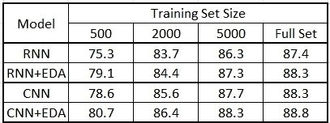

# 通过简单的数据扩充提高文本分类任务的性能

> 原文：<https://towardsdatascience.com/boost-performance-of-text-classification-tasks-with-easy-data-augmentation-1420d45b914a>

## 自然语言处理任务的文本数据扩充

图片由[菲利克斯·利希滕费尔德](https://pixabay.com/users/sik-life-2171488/?utm_source=link-attribution&amp;utm_medium=referral&amp;utm_campaign=image&amp;utm_content=3106982)从[皮克斯拜](https://pixabay.com/?utm_source=link-attribution&amp;utm_medium=referral&amp;utm_campaign=image&amp;utm_content=3106982)拍摄

对小样本数据的训练增加了过度拟合的机会。数据扩充是一种创建现有数据的人工相似样本的技术。数据扩充技术通常用于模型需要大量数据，但我们对数据的访问有限的任务。它甚至可以帮助模型在小样本数据上很好地概括。

数据增强非常成功，经常用于卷积神经网络(CNN)模型，因为它通过进行小的改变，如剪切、翻转、旋转、模糊、缩放等，来创建图像数据的人工样本。但是当涉及到 NLP 任务时，文本数据的数据扩充就不那么容易了。

在本文中，我们将讨论 Jason Wei 和的一篇论文，该论文讨论了如何对文本数据执行数据增强以提高文本分类任务的性能。

# 开始使用:

Jason Wei &邹凯的论文 `**“Easy Data Augmentation Techniques for Boosting Performance on Text Classification Tasks”**`探讨了 4 种简单但强大的文本增强技术，它们是增强文本数据的良好基准:

*   同义词替换
*   随机插入
*   随机交换
*   随机删除

本文还在 5 个基准文本分类任务上执行了上述增强技术，从而提高了卷积和递归神经网络的性能。

我们现在将讨论上述每种文本增强技术是如何在幕后工作的，以及它对文本分类任务的改进。

## 1)同义词替换(SR):

同义词替换技术从句子中随机选取 n 个单词，不包括停用词，并用随机选取的同义词替换这些单词。这种技术执行原地单词替换。

对于下面提到的例句，我们随机选取 n=2 个单词(sad，played)并用它们的同义词替换它们。

> *句子:*大概是我有史以来**最喜欢的**电影，一个无私的故事，**牺牲**，献身崇高事业。
> 
> *更新句子:*大概是我有史以来**最亲爱的**电影，一个无私、**出家**献身崇高事业的故事。

## 2)随机插入(RI):

随机插入是一种类似的同义词替换技术，但在这种情况下，随机选取的 n 个单词的同义词被插入到随机位置，而不删除原始单词。

对于下面提到的示例句子，我们随机选取 n=1 个单词(喜剧)，并在随机位置插入其同义词。

> 大概是我一直以来最喜欢的电影，一个关于无私、牺牲和献身于崇高事业的故事。
> 
> *更新句子:*大概是我有史以来最喜欢的电影，一个无私、牺牲的故事，和**编年史**献身崇高事业的故事。

## 3)随机互换(RS):

随机交换技术从句子中随机选择任意两个单词并交换它们的位置。这种技术可以对 n 对单词执行 n 次。

对于下面提到的示例句子，我们随机选取 n=1 对单词(the，roads)并在随机位置插入其同义词。

> 大概是我有史以来最喜欢的电影，一个关于无私、牺牲和献身于崇高事业的故事。
> 
> *更新句子:*可能是我有史以来最喜欢的电影，一部无私、牺牲和献身于**事业的**高尚的**故事。**

## 4)随机删除(RD):

随机删除技术以概率‘p’随机删除句子中的每个单词。

> 大概是我有史以来最喜欢的电影，一部关于无私、牺牲和献身于崇高事业的故事。
> 
> *更新句子:*可能是我有史以来最喜欢的电影，一部关于无私、牺牲和对崇高事业的奉献的电影。

本文讨论了上述四种文本增强技术。作者没有提到他们为什么选择这些增强规则，以及他们还尝试了哪些没有成功的规则。

# 基准测试:

现在，他们使用增强技术来测试 5 个文本分类任务的性能变化:

*   SST-2:斯坦福情感树库
*   CR:客户评论
*   主题:主观性/客观性数据集
*   TREC:问题类型数据集
*   PC:赞成-反对数据集

(图片由作者提供，[参考文献](https://arxiv.org/pdf/1901.11196.pdf))，在不同的训练集规模上，具有和不具有 EDA 的模型的五个文本分类任务的平均性能(%)

从上述基准测试数据中，我们可以得出结论，完整数据集的平均性能提高了 0.8%，拥有 500 个随机样本的数据集的平均性能提高了 3.0%。

# 结论:

在本文中，我们讨论了 4 种文本数据扩充技术，它们提高了在小样本数据集上执行的文本分类任务的性能。我们观察到，与大数据相比，较小样本量(约 500)的性能提高了约 3%。这很好地描述了数据扩充技术对于小数据集非常有效。

# 参考资料:

[1]Jason Wei 和的论文《提高文本分类任务性能的简单数据扩充技术:[的论文](https://arxiv.org/abs/1901.11196)

> 感谢您的阅读