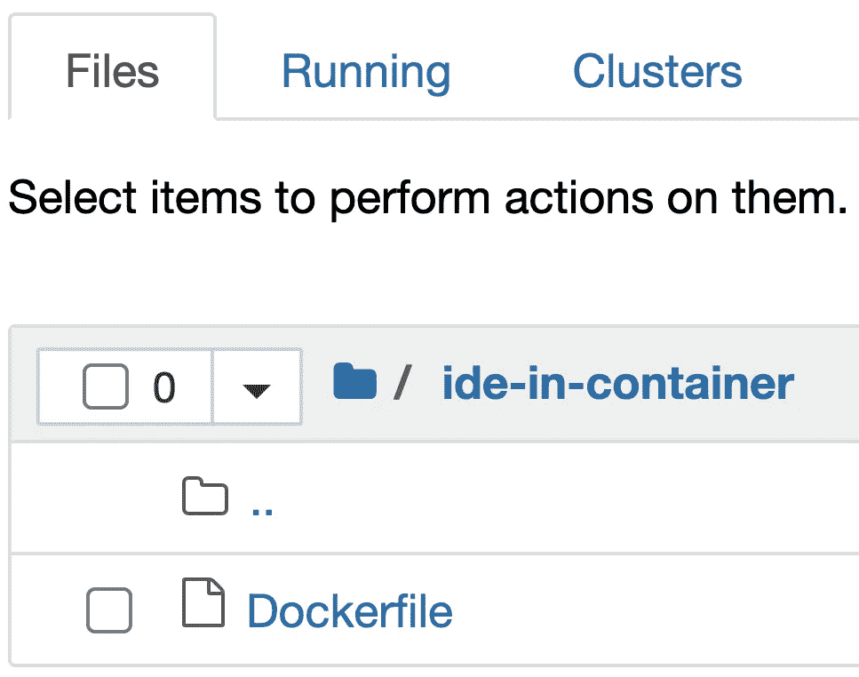
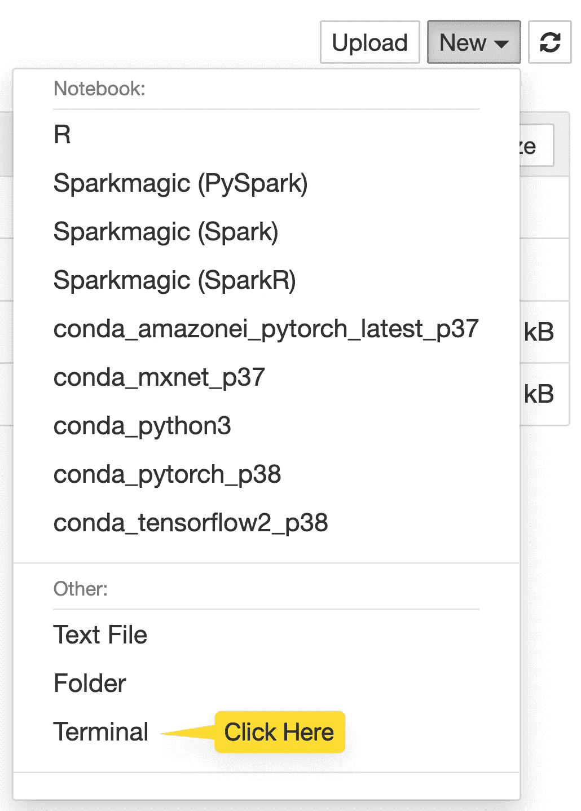
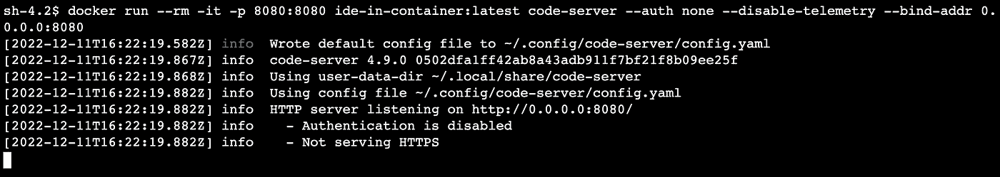
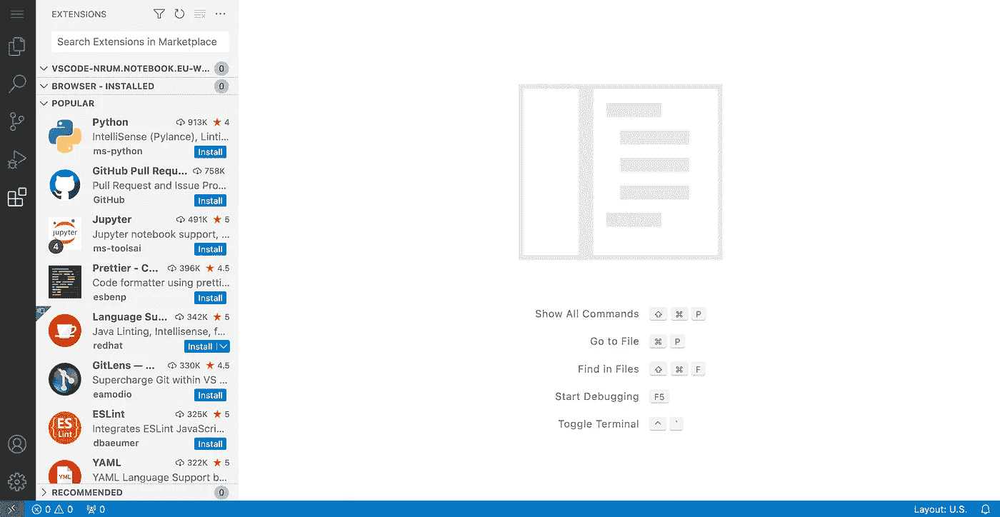

# 借助云中基于容器的开发，提高您的 ML 团队的生产力

> 原文：<https://towardsdatascience.com/boost-your-ml-teams-productivity-with-container-based-development-in-the-cloud-56aa35552776>

## 在 SageMaker 上运行容器中 VS 代码的简单方法

今年早些时候，我在 SageMaker 上发布了两个托管代码服务器的指南([这里](https://medium.com/towards-data-science/hosting-vs-code-in-sagemaker-studio-f211385e25f7)，和[这里](https://aws.amazon.com/blogs/machine-learning/host-code-server-on-amazon-sagemaker/))。它展示了如何在可扩展的云计算上运行 VS 代码，以及从任何地方运行代码，而不用担心本地设置。你所需要的只是一个互联网连接。


由作者创建的图像:使用稳定扩散创建

在这篇文章中，我们将更进一步，展示如何在云中进行基于容器的开发，以加速您的 ML 项目交付。

我们将从 Dockerhub 中提取一个示例 python 3.10 容器映像，并在 SageMaker 上使用 VS 代码进行开发。您将需要访问一个 [SageMaker 笔记本实例](https://www.youtube.com/watch?v=X5CLunIzj3U)来浏览这个例子。一小杯应该够了。

# 为什么云中基于容器的开发有助于简化您的 ML 项目？

使用基于容器的开发，您可以在容器中编写、执行和测试 ML 代码。这意味着您可以像您的团队成员一样使用相同的库和依赖项，通过一致且高度可重复的开发环境使协作变得更加容易。

另一个优势是，您可以在一个与您的生产环境行为完全相同的环境中开发和测试您的代码，这有助于在您的项目中更快地从 0 移动到 1。


照片由 [Desola Lanre-Ologun](https://unsplash.com/@disruptxn?utm_source=unsplash&utm_medium=referral&utm_content=creditCopyText) 在 [Unsplash](https://unsplash.com/?utm_source=unsplash&utm_medium=referral&utm_content=creditCopyText) 上拍摄

在 SageMaker 上托管代码服务器对 VS 代码的本地开发体验做了最小的改动，允许你在任何地方，在可扩展的云计算上编码。

## “但我认为 VS 代码是开源的”

通常对于 VS 代码，你会使用[Dev Containers 扩展](https://code.visualstudio.com/docs/devcontainers/containers)来进行基于容器的开发。但是，您不能将它用于 code-server，也不能用于任何其他开源 VS 代码项目。


照片由[Cookie Pom](https://unsplash.com/@cookiethepom?utm_source=unsplash&utm_medium=referral&utm_content=creditCopyText)在 [Unsplash](https://unsplash.com/s/photos/frustration?utm_source=unsplash&utm_medium=referral&utm_content=creditCopyText) 拍摄

虽然 VS 代码的核心是开源的，但是微软发布的 marketplace 和许多扩展却不是。微软[禁止](https://cdn.vsassets.io/v/M146_20190123.39/_content/Microsoft-Visual-Studio-Marketplace-Terms-of-Use.pdf)使用任何非微软 VS 代码访问他们的市场。更多详情，参见[与 VS 代码](https://github.com/coder/code-server/blob/v3.4.1/doc/FAQ.md#differences-compared-to-vs-code)的差异。

那么我们如何在 SageMaker 上用 VS 代码进行基于容器的开发呢？

# VS 容器中的代码，托管在 SageMaker 上

因此，由于微软扩展许可问题，我们不能将容器带到 IDE 中。但是如果我们把 IDE 放到容器中呢？事实上，code-server 是基于 web 的，可以真正在任何地方运行。设置非常简单，只需 3 个步骤:

## 步骤 1:将代码服务器添加到您现有的 docker 文件中

您可以用一行代码将 code-server 添加到容器中。下面是一个将它添加到 Dockerhub 的 [python 3.10](https://hub.docker.com/_/python) 图像的例子



作者图片:我在我的笔记本实例中使用一个现有的 Dockerfile 文件，使用 python:3.10

加一行就是了！

## 步骤 2:在笔记本实例上构建并启动容器映像

通过笔记本实例的 Jupyter/Jupyterlab 启动终端:



图片作者:如果你用 Jupyter，按钮应该在右上角

现在，您可以导航到 Dockerfile 文件夹，并使用以下命令在本地构建容器映像:

```
# BUILD THE CONTAINER IMAGE LOCALLY
docker build -t ide-in-container:latest .
```

一旦构建了映像，您就可以使用命令运行容器来启动 code-server:

```
# RUN CONTAINER WITH VS CODE IN IT
docker run --rm -it -p 8080:8080 ide-in-container:latest code-server --auth none --disable-telemetry --bind-addr 0.0.0.0:8080
```

我们通过默认端口`8080`向实例公开代码服务器。



Image by author:运行 docker 命令后，您应该会看到以下内容

## 步骤 3:通过笔记本实例 Jupyter 代理访问 VS 代码

现在，您需要做的就是复制您的笔记本实例 URL，对其稍作更改，然后将其粘贴到一个新的选项卡中:


作者图片:左边是我的实例原始 URL。我用`/proxy/8080/`替换了`/tree`，并将其粘贴到一个新的浏览器标签中。

选项卡现在应该打开 VS 代码:



作者图片:您可以安装 VS 代码的 Python 扩展，并开始在您的 ML 项目中工作！

## **注意事项**

**为了进一步简化您的工作**，您可以挂载本地笔记本实例卷，并将 VS 代码指向您现有的配置(扩展、按键绑定、设置)。在示例 [Dockerfile](https://gist.github.com/sofianhamiti/542e9ff6d6dbe72c5178c7bb4c8b1901) 中，我将 VS 代码指向实例中已经有的`/home/SageMaker/vscode-config` config 文件夹。这是使用`XDG_DATA_HOME`环境变量完成的。

下面是将笔记本实例卷装载到容器的方法:

```
# RUN THIS COMMAND IF YOU WANT TO MOUNT THE NOTEBOOK INSTANCE HOME/SAGEMAKER FOLDER
docker run --rm -it -p 8080:8080 -v /home/ec2-user/SageMaker/:/home/SageMaker ide-in-container:latest code-server --auth none --disable-telemetry --bind-addr 0.0.0.0:8080
```

**为了改善您的协作**，您可以在您的项目团队 GitHub repo 上添加这个“环境 Dockerfile”。这样，它将被版本化，每个人都可以在任何时候使用完全相同的依赖项。

# 结论

使用基于云的 ide 在容器内部进行开发可以帮助简化您的 ML 项目和团队协作，因为它使在一致的环境中运行和测试代码变得容易，并且允许您从任何地方访问该开发环境。

在这篇文章中，我和你分享了一个在 Amazon SageMaker 上运行 VS 代码的简单方法。

更进一步，您可以访问[使用 GitHub Actions、MLflow 和 SageMaker Pipelines 的 MLOps 的 5 个简单步骤](https://medium.com/towards-data-science/5-simple-steps-to-mlops-with-github-actions-mlflow-and-sagemaker-pipelines-19abf951a70)，了解您的团队如何使用 GitHub Actions 和 SageMaker 轻松运行端到端 MLOps 项目。