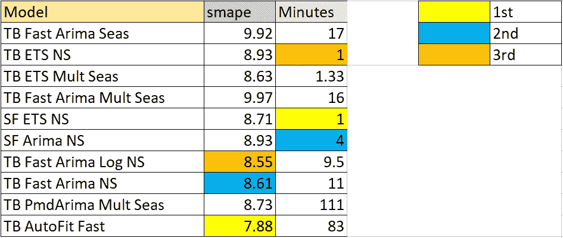

# 借助 Nixtla 的 StatsForecast 提升预测性能

> 原文：<https://towardsdatascience.com/boosting-forecast-performance-with-nixtlas-statsforecast-2282fae91850>

## 提高百里香的效率


Marc-Olivier Jodoin 在 [Unsplash](https://unsplash.com/s/photos/speed?utm_source=unsplash&utm_medium=referral&utm_content=creditCopyText) 上拍摄的照片

百里香增强框架，在其核心，只是一个简单的梯度增强算法包装在标准的时间序列方法。这意味着框架严重依赖*底层方法的效率和速度。正如我们将在本文中看到的，增强和附加逻辑增加了准确性，但也增加了计算量。这种繁重的工作大部分以前是通过 ETS 和 ARIMA 等统计模型实现的，但利用 Nixtla 的统计预测包: [StatsForecast，](https://github.com/Nixtla/statsforecast)可以提高**速度和准确性。使 ThymeBoost 和 StatsForecast 成为时间序列预测的完美结合。***

这篇文章的好 **TLDR** 是:

stats forecast**比 stats models**快，ThymeBoost 带来**精度**增益。

[**Github for 百里香增强**](https://github.com/tblume1992/ThymeBoost)

## 介绍

首先，如果你没有听说过百里香，那么我鼓励你看看我之前的文章给出了一个不错的概述。在最新版本中，我添加了 StatsForecast 作为可选的依赖项。为了运行这些示例，您需要安装它:

```
pip install StatsForecast
```

为了安全起见，请继续更新百里香增强:

```
pip install ThymeBoost --upgrade
```

既然我们已经解决了这个问题，那么本文的主要内容将是在每周 M4 数据集上进行基准测试，以了解所有这些模型在准确性和速度方面的表现。这些数据集都是开源的，并且在 M-competitions [github](https://github.com/Mcompetitions/M4-methods/tree/master/Dataset) 上直播。它被标准训练和测试分割，因此我们将使用训练 csv 进行拟合，而测试 csv 仅用于使用 SMAPE 进行评估。

请随意用其他数据集测试，并让我知道他们的表现如何！

这样做的主要目的是回顾新方法在 boosting 框架中的作用，并最终了解将它们添加到 ThymeBoost 框架中如何提高准确性。

## 对方法进行基准测试

首先，我们将尝试一下 ThymeBoost 中计算量最大的方法:AutoArima。以前是用 PmdArima 完成的，现在我们可以用 StatsForecast 进行测试，只需在与 ThymeBoost 配合时通过`trend_estimator=‘fast_arima’`即可。让我们来看看一些代码，在这些代码中，我们首先构建数据集，然后我们可以运行百里香增强:

```
from tqdm import tqdm
from statsforecast.models import ETS, AutoARIMA
from ThymeBoost import ThymeBoost as tb
tqdm.pandas()
train_df = pd.read_csv(r'm4-weekly-train.csv')
test_df = pd.read_csv(r'm4-weekly-test.csv')
forecast_horizon = len(test_df.columns) - 1
train_df = train_df.rename({'V1': 'ID'}, axis=1)
train_long = pd.wide_to_long(train_df, ['V'], 'ID', 'Date')
test_df = test_df.rename({'V1': 'ID'}, axis=1)
test_df = pd.wide_to_long(test_df, ['V'], 'ID', 'Date')
train_long = train_long.dropna()
train_df = train_long.reset_index()
train_df.index = train_df['ID']
train_df = train_df.drop('ID', axis = 1)
X = train_long
X = X.reset_index()
```

*   *注意:这段代码在数据操作方面可能效率很低，我确信有更好的方法来做这件事，这只是我为基准测试做的一些工作。时间不包括运行这段代码的时间。*

不管怎样，现在我们有了要拟合的训练数据，让我们来看看拟合函数:

```
def grouped_forecast(df):
    y = df['V'].values
    boosted_model = tb.ThymeBoost(verbose=0)
    output = boosted_model.fit(y,
                               seasonal_period=None,
                               trend_estimator=['fast_arima'])
    predicted_output = boosted_model.predict(output,
                                              forecast_horizon,
                                              trend_penalty=True)
    predictions = predicted_output['predictions']
    return predictions
```

在这里，我们只是创建一个函数，当我们执行 groupby 并应用时，该函数将被传递:

```
def counter(df):
    df['counter'] = np.arange(2, len(df) + 2)
    return df
predictions = X.groupby('ID').progress_apply(grouped_forecast)
predictions = predictions.reset_index()
predictions = predictions.groupby('ID').apply(counter)
test_df = test_df.reset_index()
benchmark_df = predictions.merge(test_df, left_on=['ID', 'counter'],
                                 right_on=['ID', 'Date'])def smape(A, F):
    return 100/len(A) * np.sum(2 * np.abs(F - A) / (np.abs(A) + np.abs(F)))
tqdm.pandas()
def grouped_smape(df):
    return smape(df['V'], df['predictions'])
test = benchmark_df.groupby('ID').progress_apply(grouped_smape)
print(np.mean(test))
```

然后我们得到给定输出的平均 SMAPE，这里的一切都应该是好的，但如果有任何错误会混淆基准，请让我知道。

运行这个程序会得到平均 SMAPE 值 **8.61** ，大概需要 10 分钟。

接下来，让我们单独运行 Nixtla 的 Auto Arima，看看它的表现如何。

我们将把 groupby 预测函数改为:

```
def grouped_forecast(df):
    y = df['V'].values
    ar_model = AutoARIMA().fit(y)
    predictions = pd.DataFrame(ar_model.predict(forecast_horizon)['mean'],
                                columns=['predictions'])
    return predictions
```

重新运行上面的 SMAPE 计算块将得到一个 8.93 的 SMAPE 和大约 4 分钟的时间。

好的，很好，我们已经通过提高 Auto-Arima 过程展示了一些精度增益。这应该不足为奇，因为我在一篇文章《深度潜水[梯度提升 Arima](https://medium.com/p/e093f80772f6) 中展示了非常相似的结果。但是我想提醒一下，boosting 并不是万能的，也不总是比 Arima 好，但是它仍然是一个有趣的观察。

下一步应该很明显。我们已经看了“快速”自动 Arimain 百里香增压以及 StatsForecast 的无增压自动 Arimain。接下来，我们应该看看如何使用 PmdArima 的 Auto-Arimain 百里香增强。

如果您一直在运行这段代码，请系好安全带。

下一步需要一些时间…

```
def grouped_forecast(df):
    y = df['V'].values
    boosted_model = tb.ThymeBoost(verbose=0, n_rounds=None)
    output = boosted_model.fit(y,
                               seasonal_period=None,
                               trend_estimator=['arima'],
                               arima_order='auto')
    predicted_output = boosted_model.predict(output,
                                              forecast_horizon,
                                              trend_penalty=True)
    predictions = predicted_output['predictions']
    return predictions
```

结果呢？

一个 SMAPE 的 **8.78** ，但是用了 90 分钟。看起来提升 Pmd Arima 优于 Nixtla 的 StatsForecast 开箱即用，但它需要相当长的时间。

Arima 不是 StatsForecast 中的所有产品，另一个实现是 ETS 方法。有了这些新方法，我们实际上可以在 ThymeBoost 的`autofit`方法中利用这些更快的实现。为此，我们只需要在调用 autofit 时传递`fast=True`。新的预测函数将如下所示:

```
def grouped_forecast(df):
    y = df['V'].values
    boosted_model = tb.ThymeBoost(verbose=0, n_rounds=None)
    output = boosted_model.autofit(y,
                                    seasonal_period=[52],
                                    optimization_type='grid_search',
                                    optimization_strategy='holdout',
                                    lag=26,
                                    optimization_metric='smape',
                                    verbose=False,
                                    fast=False
                                ) predicted_output = boosted_model.predict(output,
                                              forecast_horizon,
                                              trend_penalty=True)
    predictions = predicted_output['predictions']
    return predictions
```

这导致 SMAPE 为 7.88，并且需要大约 80 分钟。绝对是所有测试中最好的即插即用精度，但我们选择型号有点作弊。

需要注意的一点是，将季节长度 52 传递给 StatsForecast 的方法并不是一个好主意。对于 ETS it 错误和 Auto-Arima 来说，时间太长了。这是一个利用百里香实际上如何工作的领域*提高*的速度，因为在 ARIMA 设置中长的季节周期需要明显更长的时间。

我们测试了其他几种方法，您可以在下面查看基准测试结果:



作者图片

就首字母缩略词而言:

1.  结核病:百里香增强
2.  SF:统计预测
3.  NS:非季节性
4.  倍增:倍增的季节性
5.  快速:百里香利用统计预测引擎盖下

在高层次上，性能最好的是来自百里香增强的快速自动拟合方法。出于某些奇怪的原因，用季节性和快速 Arima 拟合百里香增强并没有表现得太好，事实上它比使用 PmdArima 的 Auto-Arima 要差得多。另一个观察结果是，从 StatsForecast 提升普通 ETS 方法可能会损害非提升方法正常拟合的准确性。如果我们改变拟合函数中的`global_cost`参数，这种情况可能会改变，因为默认情况可能并不总是最佳的。

## 结论

最新版本的 ThymeBoost 增加了一些引入 StatsForecast 方法的功能。与之前的实现相比，我们可以看到速度的提高和潜在的准确性。

百里香和一个好蛋糕一样，需要有好的面糊作为底料。StatsForecast 可能是优于 StatsModels。梯度推进只是顶部的点缀。

如果你喜欢这篇文章，你可以看看我写的其他一些与时间序列相关的帖子:

</lazyprophet-time-series-forecasting-with-lightgbm-3745bafe5ce5>  </handling-trends-in-tree-based-time-series-forecasting-fea5e4c066fb>  </online-time-series-forecasting-in-python-12bada43b8bd> 