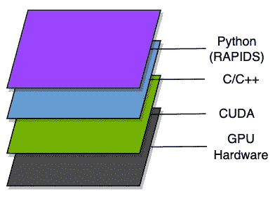
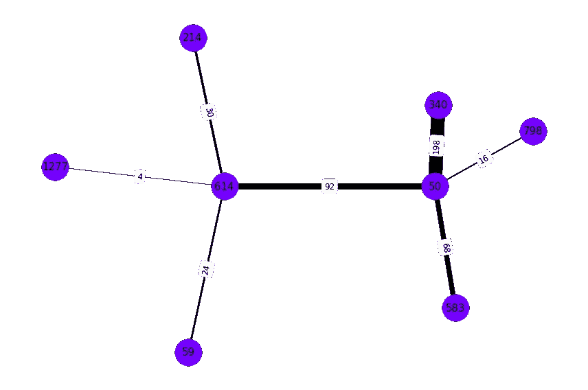
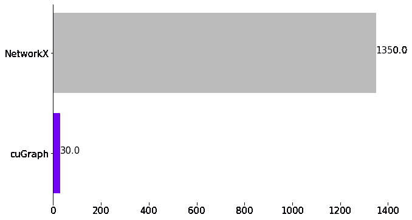

# 借助 GPU 加速库提升机器学习工作流

> 原文：<https://towardsdatascience.com/boosting-machine-learning-workflows-with-gpu-accelerated-libraries-1f95feef68d4>

专题图片(图片来源:[https://unsplash.com/photos/A1blvxJxGU0](https://unsplash.com/photos/A1blvxJxGU0)

# 借助 GPU 加速库提升机器学习工作流

## 在 Pagerank 上测试 RAPIDS 套件以获得推荐

*摘要:在本文中，我们演示了如何使用 RAPIDS 库来改进基于机器学习 CPU 的库，如 pandas、sklearn 和 NetworkX。我们使用一个推荐研究案例，在运行 PageRank 算法时，它在基于 GPU 的库中的执行速度提高了 44 倍，在个性化 PageRank 中的执行速度提高了 39 倍。*

# 急流简介

Scikit-learn 和 Pandas 是大多数数据科学家工具箱的一部分，因为它们友好的 API 和广泛的有用资源——从模型实现到数据转换方法。然而，许多这样的库仍然依赖于 CPU 处理，并且，就[这个线程](https://scikit-learn.org/stable/faq.html#will-you-add-gpu-support)而言，像 Scikit-learn 这样的库并不打算扩展到 GPU 处理或者扩展到集群处理。

编程语言的层次(图片由作者提供)。

为了克服这个缺点， [RAPIDS](https://rapids.ai/) 提供了一套 Python 开源库，采用这些广泛使用的数据科学解决方案，并通过包含 GPU 加速的实现来提升它们，同时仍然提供类似的 API。因此，你可以继续呆在你的 Python 舒适区，使用他们的高级编程接口，而不是一路学习 C/C++或 CUDA 这样的低级语言。

下面是一些属于 RAPIDS 的库和它们基于 CPU 的对应物(可用 API 的完整列表在这里[提供](https://docs.rapids.ai/api)):

*   熊猫
*   cuML (Sklearn)
*   cuGraph(网络 x)
*   客户空间(地理信息系统)

所以这篇文章的目的是让你对一些 RAPIDS 包能做什么有一点了解，并对它们进行测试以检查它们有多快。所以让我们看看他们有什么！

# 为推荐引擎测试 RAPIDS

我们将通过构建一个推荐引擎来展示 RAPIDS 的功能，该引擎可以推荐类似于目标标题的电影——您可能已经在您最喜欢的流媒体服务中的某个地方看到了“*谁观看了…也观看了…* ”类型的推荐。为此，让我们使用 PageRank 算法！

> 简而言之，PageRank 算法通过在其结构中执行随机行走并计算给定节点被访问的次数来估计图中节点的重要性，并且我们使用该重要性分数来对推荐系统中的项目进行排名。

互联网上有很多理解 PageRank 算法的资料，但是对于本文来说，重要的是:其中涉及到大量的数学知识，主要是大量的**矩阵运算**。猜猜什么在解决矩阵运算时会派上用场？没错，pal:**GPU**！

因此我们可以创建一个图表，其中:

*   节点是电影
*   边将电影与普通用户消费(观看电影 A 和 B 的用户)联系起来，其中用户数量可以是边的权重。

下面的图让我们对图表的表示有所了解:

按共有用户数量链接的电影图表。电影“614”和电影“50”共有 92 个用户(图片由作者提供)。

有了概念图的模型，让我们深入一些数据，看看一些行动正在发生！

## cuDF

[cuDF](https://docs.rapids.ai/api/cudf/stable/) 是一种针对熊猫的 GPU 加速方法，它的开发是为了尽可能平滑地进行代码转换。我们可以从 [MovieLens](https://grouplens.org/datasets/movielens/) 数据集加载一些数据，如下例所示:

cuDF 和 pandas 方法读取 csv 文件的比较。

我们加载了两个数据集:一个包含用户-项目交互(使用 cudf 并存储在`df`中)，另一个包含项目的元数据(使用 pandas 并存储在`df_metadata`中)。数据合并和聚合也可以使用熊猫传统的`merge`和`groupby`方法来完成:

代码:使用 cuDF 执行数据合并和聚合

对于那些熟悉 Pandas API 的人来说，你可以检查一下这些接口有多熟悉，这样从基于 CPU 的库到基于 GPU 的库的迁移会快得多！这些转换的结果创建了以下邻接表:

图形邻接表

邻接表指示节点`item_id_from`通过共有`n_users`而连接到节点`item_id_to`。

现在我们已经存储了图形数据，让我们构建一些对象来表示它们！

## cuGraph

就像 cuDF 与熊猫配对一样， [cuGraph](https://docs.rapids.ai/api/cugraph/stable/) 是 NetworkX 的 GPU 加速版本，NetworkX 是一个基于 CPU 的库，具有大量从图形中提取信息的算法。

为了比较它们的实现，让我们为每个库创建一个 graph 对象，如下面的代码所示:

使用 cuGraph 和 NetworkX 创建图形实例的比较。

这里，`G`是我们的 cugraph。图形对象和`Gnx`是我们的 networkx。图形对象。注意，当创建`Gnx`时，我们从包含邻接表的 cuDF 数据帧`df_items`中调用`.to_pandas()`方法(第 9 行)。这是因为 NetworkX 接受 Pandas 的数据帧作为输入，cuDF 为我们提供了一些将数据对象从 GPU 移动到 CPU 内存的转换方法。

现在我们已经创建了图形实例，让我们通过使用它们的`pagerank`方法来比较算法实现！为了公平比较，我们将为这两种方法设置相同的参数:

为每个库实现执行多次 PageRank 算法。电脑设置:Nvidia GeForce GTX 1060 (6GB 内存)，CPU 英特尔 7700 和 32 GB 内存。

通过执行算法 10 次(每次 10 个循环)并取其平均执行时间，我们得到以下性能图:

图:NetworkX 和 cuGraph 的执行时间(毫秒)性能—越低越好。

是啊是啊，我知道！ **cuGraph 的实施平均运行时间为 30 毫秒，而 NetworkX 的运行时间为 1350 毫秒，执行时间提高了 45 倍**…但我们还没有完全实现！标准的 PageRank 算法确实估计了图中一个节点的重要性，但是记住我们正在尝试解决“*谁看了…也看了…* ”类型的推荐？如果我们使用到目前为止获得的 pagerank 分数，我们将对所有推荐列表有相同的分数！因此，我们需要更多地搅动事物，让推荐更加……**个性化**。

## 个性化页面排名的测试平台

还记得我们之前对 PageRank 算法的(超级浓缩的)解释中，我们在图中执行随机行走吗？在随机漫步的开始，我们随机选择一个节点作为起点，让自然去做它的工作——但所有节点都有相等的概率成为起点。如果一些节点有更高的概率成为起点呢？如果我们时不时地回到那个节点，从头再来，又会怎么样呢？

这是个性化 PageRank 算法背后的主要思想，我们可以用它来计算与特定目标节点相关的 pagerank，在我们的例子中，这是一部 pivot 电影。因此，我们总是可以重新启动随机漫步机，并设置 100%的概率从我们选择的节点开始。

因此，我们可以对目录中的每部电影执行 PageRank 算法，但在整个算法执行过程中，将从该电影开始的概率设置为 100%,如下面的代码所示:

代码:个性化 PageRank:我们设定 100%的概率从一个目标 item_id 开始。

这种方法的问题是，我们必须为目录中的每个项目运行该算法，因此 pagerank 执行时间在这种情况下起着关键作用。为了测试这种影响，下面的代码为每个项目调用 pagerank，并多次执行该过程:

代码:使用 cuGraph 和 NetworkX 对每个项目(存储在 df_metadata 中)执行 PageRank。

我们可以看到**对于 cuGraph 实施，循环遍历整个目录平均花费了 1 分钟 5 秒，而 NetworkX 的实施平均花费了 39 分钟 8 秒****——因此我们在执行时间上有了 39 倍的改进。**

除了**用 GPU 扩展**你的工作流程，RAPIDS 还促进了与 **Dask** 到**横向扩展**到多台机器的集成。因此，如果您的数据集不适合您的 GPU 和内存，您可以使用多个 GPU 的能力来扩展您的内存可用性并克服硬件限制。如果你想了解更多，你可以查看这篇文章。

# (次要)缺点

通过对广泛使用的 ML 算法提供 GPU 加速的改进，RAPIDS 似乎是数据科学家工具包的一个有前途的替代方案。但是，有几点值得注意。

如果您在 Google Cloud 或 Amazon Web Services 等平台上运行作业，让 GPU 实例运行您的算法对项目成本起着至关重要的作用——特别是如果您打算在 Dask 中使用多 GPU 进程。因为这个问题，有些人甚至不会想到设置这些实例，但是我想说这里最重要的事情是:分析权衡！也许让您的流程运行速度加快 40 倍会节省一些实例正常运行时间，这样额外的成本就不会那么大了。

另外，请记住，有些算法还没有在 RAPIDS 套件中实现，所以在某些情况下，您仍然需要依赖基于 CPU 的库。然而，我想说，弥合这些差距只是时间问题。事实上，根据他们的[文档](https://docs.rapids.ai/overview)，他们力争每 6 周发布一次更新，所以希望随着时间的推移，我们会有越来越多的解决方案。

# 参考

如果您想了解他们的最新版本或用例，您可以关注 [RAPIDS medium profile](https://medium.com/rapids-ai) 或查看我在下面列出的一些参考资料:

*   [激流勇进](https://youtu.be/T2AU0iVbY5A)
*   雅各布·汤姆林森关于急流和达斯克的[博客文章](https://jacobtomlinson.dev/posts/)和[视频](https://www.youtube.com/watch?v=KHiPWQlppWQ&ab_channel=TechExeter)
*   NVIDIA [Merlin](https://developer.nvidia.com/nvidia-merlin) 框架构建大规模推荐系统