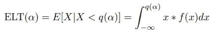
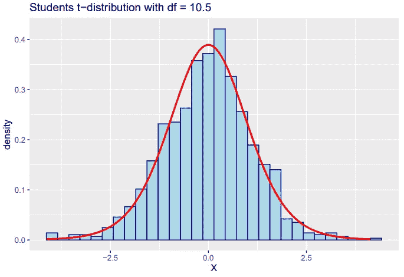
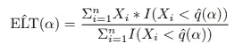
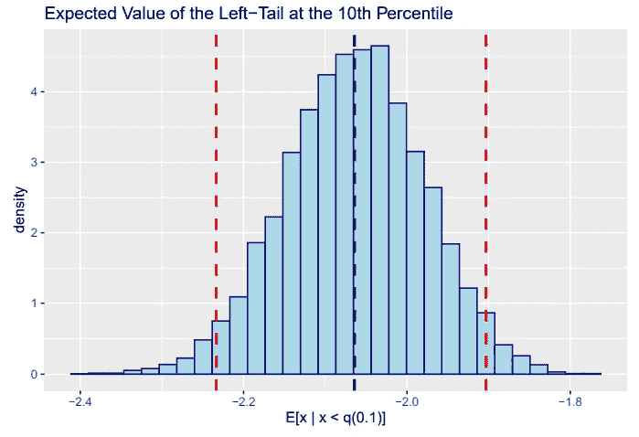

# 引导基础

> 原文：<https://towardsdatascience.com/bootstrapping-basics-254db6635a76>

## 非参数重采样，已解释

## r 库要求

*   并行:用于并行计算
*   ggplot2:用于数据可视化

# 一.导言

当估计感兴趣的统计量时，我们不仅对该统计量的点值感兴趣。我们还想量化我们估计的不确定性。对于感兴趣的标准量，如平均值或标准差，我们有采样分布的分析结果，或者可以很容易地使用大样本近似。很多时候，我们感兴趣的是那些我们不知道抽样分布的量，而且即使有可能，推导抽样分布也很困难。在这些情况下，bootstrap 是量化不确定性的一个有价值的工具。

在进行 bootstrapping 时，我们将样本视为总体。我们用替换样本重复重新采样与原始样本*相同数量的观察值，并计算这些样本的感兴趣的统计量。我们用替换重新取样，因为在没有替换的情况下取样时，样本是不独立的。它们也将与我们的原始样本完全匹配，这将不是很有帮助。这为我们提供了一个模拟的采样分布，我们可以用它进行分析。*

# 二。履行

虽然有像 [bootstrap](https://cran.r-project.org/web/packages/bootstrap/bootstrap.pdf) 这样的库为我们做引导，但我发现编写轻量级函数是一个很好的学习方法，即使我在实践中使用维护良好的库。为了演示自举，我编写了两个助手函数来支持我的主自举函数，该函数利用并行化来加速计算。

处理每个引导样本不依赖于其他样本，因为这些样本彼此独立。这使得自举很容易并行化，这就是 **bootstrap_parallel** 所做的。

```
one_bootstrap <- function(my_vec, my_func){
 ###
 # This function retrieves one bootstrapped sample and returns the   
 # statistic of interest.
 #
 # Args
 # ----
 # my_vec : numeric vector
 #   A vector of numbers of which to compute the statistic of 
 #   interest.
 # my_func : function
 #   Function which computes the statistic of interest.
 #
 # Returns
 # -------
 # double
 #   The statistic of interest computed on the bootstrapped sample.
 ###
 bootstrapped_sample <- sample(my_vec, size=length(my_vec), 
                               replace=TRUE)
 return(my_func(bootstrapped_sample))
}bootstrap_replicate_par <- function(B, my_vec, my_func){
  ###
  # This function is a helper function for the parallized 
  # bootstrapping function. It takes in a vector whose length 
  # determines the number of bootstrap samples to take, a data 
  # vector, and a function. It utilized optimized looping.
  #
  # Args
  # ----
  # B : vector
  #   A vector whose length determines of bootstrapped samples to 
  #   return.
  # my_vec : numeric vector
  #   A vector of numbers of which to compute the statistic of 
  #   interest.
  # my_func : function
  #   Function which computes the statistic of interest.
  #
  # Returns
  # -------
  # estimates : vector
  #   A vector of the estimates.
  ###
  estimates <- replicate(length(B), one_bootstrap(my_vec, my_func))
  return(estimates)
}bootstrap_parallel <- function(my_vec, my_func, B){
  ###
  # This function takes in a data vector, function, and the number 
  # of bootstrap iterations and returns a list holding the mean and 
  # standard deviation of the bootstrap estimates, as well as the 
  # vector of the bootstrap estimates. It utilizes parallel 
  # computing.
  #
  # Args
  # ----
  # my_vec : numeric vector
  #   A vector of numbers of which to compute the statistic of 
  #   interest.
  # my_func : function
  #   Function which computes the statistic of interest.
  # B : int
  #   The number of bootstrapped samples to return.
  #
  # Returns
  # -------
  # output : list
  #   A list of the mean, and standard deviation of the estimates 
  #   and a vector of the estimates.
  ###

  # Count the cores and make a cluster from leaving one core free.
  cores <- detectCores()  
  cluster <- makeCluster(cores - 1) # Create a vector that will be split up and determine the number 
  # of bootstrap samples to get on each core.
  boot_vec <- 1:B

  # Export variables and functions to the cluster.
  clusterExport(
    cluster, 
    list("boot_vec", "one_bootstrap", "bootstrap_replicate_par", 
         "my_vec", "my_func"),
    envir=environment()
    )  estimates <- parSapply(
    cluster,
    boot_vec,
    FUN=bootstrap_replicate_par,
    my_vec=my_vec,
    my_func=my_func
    ) stopCluster(cluster) output <- list(
    'mean' = mean(estimates),
    'se' = sd(estimates),
    'estimates' = estimates
    ) return(output)
}
```

定义好这些函数后，我们就可以开始应用这些函数了。

# 三。具有左尾期望值的示例

作为演示，我们将通过 bootstrap 估计的统计数据是分布左尾的期望值。为了便于参考，我将它称为 **ELT(α)** ，用于表示 **α** 处的预期左尾。这种统计有助于估计的一个例子是[条件风险值](https://www.investopedia.com/terms/c/conditional_value_at_risk.asp)。

假设我们关注的是一个随机变量， **X** ，其分布为某种连续分布。设 **f(x)** 为 **X** 的概率密度函数 **q(α)** 为 **X** 在 100* **α** 百分位的分位数函数。那么我们感兴趣的数量如下所示。



连续分布左尾的期望值

在现实世界的应用中，我们不知道 **X** 的真实底层分布。我们可以找到一个合适的分布，尽管它可能很难或不可能进行解析积分。幸运的是，我们有像 bootstrap 这样的数字工具来帮助我们。

在这个演示中，我抽取了 1000 个 **X** 的样本，其中**X∾T(ν)**和 **ν** 为 10.5。我制作了下面样本的直方图，并覆盖了真实密度函数，以衡量样本与基础数据的吻合程度。



样本相当好地符合真实分布，所以让我们计算 **ELT(α)** 。

我使用非参数方法，使用样本分位数来估计 **ELT(α)** 。 **ELT(α)** 的非参数估计如下式所示。



左尾期望值的非参数样本估计

其中 **Xi** 是随机变量的实现，**qˇ(α)**是 **α** 处的样本分位数， **I** 是一个指示函数，如果为真则为 1，如果为假则为 0。

在继续之前，让我们看看我们对 **ELT(α)** 的样本估计，其中 **α** 为 0.1。是-2.063。

让我们最后使用自举。我将用 10，000 次引导迭代来估计 ELT(α)。

```
et_est <- bootstrap_parallel(rand_sample, expected_tail, B=10000)
```

下面的直方图显示了 **ELT(α)** 的自举估计的分布。



我们的平均估计值是-2.063，与样本估计值几乎完全相同(我四舍五入到小数点后 3 位)。它的标准误差为 0.085。自举 95% CI 为-2.232 至-1.906。我们可以 95%确信 **ELT(0.1)** 在-2.232 到-1.906 之间。

我们已经成功地使用自举来估计一个量，并量化我们对该估计的不确定性！

我希望这已经阐明了什么是自举以及如何应用它。感谢阅读！

注:所有图片均由作者(我)生成