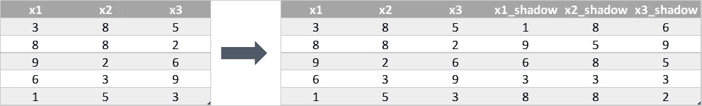
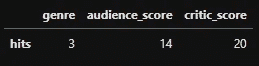
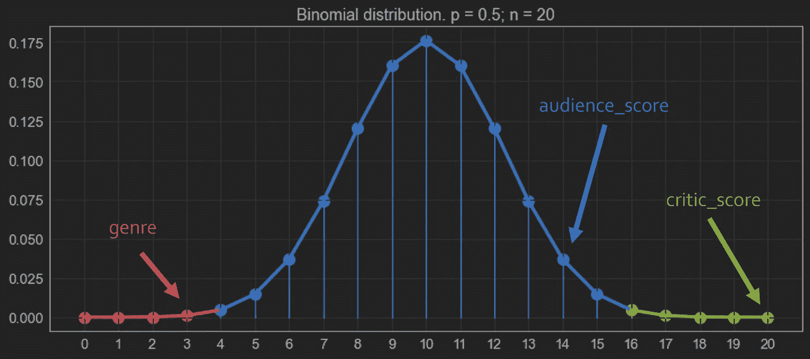

# 博鲁塔·SHAP:每个数据科学家都应该知道的特征选择工具

> 原文：<https://towardsdatascience.com/boruta-shap-an-amazing-tool-for-feature-selection-every-data-scientist-should-know-33a5f01285c0>

# *博鲁塔·SHAP:每个数据科学家都应该知道的特征选择工具*

## 我们如何使用博鲁塔和 SHAP 构建一个惊人的特征选择过程——以 python 为例


原文由[诺亚纳夫](https://unsplash.com/@noahdavis)于 [Unsplash](https://unsplash.com/)

当建立机器学习模型时，我们知道拥有太多的功能会带来一些问题，如[维数灾难](/the-curse-of-dimensionality-50dc6e49aa1e)，此外还需要更多的内存、处理时间和功率。

在我们的特征工程管道中，我们采用特征选择技术来尝试从数据集中移除不太有用的特征。这就提出了一个问题:我们如何确定哪些特性是有用的？

对于这个任务，我们可以使用 Boruta，一个基于统计方法的特征选择算法。它依赖于两个原则:阴影特征和二项式分布。

# 1.阴影特征

Boruta 算法的第一步是评估特征的重要性。这通常是在基于树的算法中完成的，但在 Boruta 上，这些特征之间并不竞争，它们与被称为“阴影特征”的随机版本竞争。

假设我们有一个包含 3 个要素和 100 个观测值的数据集。在这种情况下，我们制作了数据集的副本，并混洗每个要素列。置换的特征然后被称为“阴影特征”(顺便说一下，很酷的名字)，并创建一个新的数据集，Boruta 数据集，连接所有 3 个原始和 3 个新的阴影特征。



作者图片

现在，我们使用任何偏好方法，如随机森林或任何其他方法，来评估所有 6 个特征的特征重要性。Boruta 算法的思想是选择比纯粹的随机性表现更好的特征，这里由阴影特征表示，因此我们将原始特征的重要性与阴影特征的*最高*特征重要性进行比较。每当一个特征的重要性高于这个阈值时，我们就称之为“命中”。

我们现在可以只保留命中的，而丢弃其他的，对吗？但是如果他们中的一些因为运气不好而被丢弃了呢？答案在于迭代，这是下一步。

# 2.二项式分布

所有特征只有两种结果:“命中”或“未命中”，因此我们可以多次执行前面的步骤，并根据特征构建二项式分布。

考虑一个具有三个特征的电影数据集:“流派”、“观众 _ 评分”和“评论家 _ 评分”。经过 20 次迭代，我们可以得到以下结果:



我们可以将这些结果放在二项式分布图上:



作者图片

分布的尾部是最重要的部分。在这个例子中，各占 0.5%的概率。

`genre`变量落在红色区域，即“拒绝”区域。在这里，我们确信这些特性对目标变量没有影响。

绿色区域是“验收”区域。我们也确信这些特征是可预测的，并且应该保留在模型中。在这个例子中，`critic_score`是一个应该保留的好特性。

在蓝色区域，Boruta 不确定该特征是否是预测性的。在这种情况下，我们可以保留这些特征，甚至可以使用其他方法来查看它们是否会对模型预测产生任何影响。上例中，`audience__score`在这个区域上，尽管它靠近绿尾。

> 我们保留在绿色和蓝色区域分类的特征，并丢弃红色区域的特征。

你可以点击查看博鲁塔算法[的精彩解释。](/boruta-explained-the-way-i-wish-someone-explained-it-to-me-4489d70e154a)

# 3.Python 中的 Boruta

示例代码也可以在我的 github 上找到，所以可以跳过这一节。

[](https://github.com/vinyluis/Articles/tree/main/Boruta%20SHAP) [## 文章/博鲁塔 SHAP 在主要乙烯/文章

### 第 1 篇:用 SHAP 价值观解释你的机器学习模型是如何工作的【恩】什么是 SHAP 价值观，它们是如何…

github.com](https://github.com/vinyluis/Articles/tree/main/Boruta%20SHAP) 

要使用 Boruta，我们可以使用 BorutaPy 库[1]:

```
pip install boruta
```

然后我们可以导入糖尿病数据集(可从[sci kit-Learn](https://scikit-learn.org/stable/modules/generated/sklearn.datasets.load_diabetes.html)【2】获得):

```
from sklearn.datasets import load_diabetes
from sklearn.model_selection import train_test_split# Fetches the data
dataset = load_diabetes(as_frame = True)
# Gets the independent variables
X = dataset['data']
# Gets the dependent variable (the target)
y = dataset['target']
# Splits the dataset
X_train, X_test, y_train, y_test = train_test_split(X, y, test_size = 0.2)
```

为了使用 Boruta，我们需要定义一个估计量，它将用于估计特征的重要性。在这种情况下，我选择了 RandomForestRegressor:

```
from sklearn.ensemble import RandomForestRegressor# Defines the estimator used by the Boruta algorithm
estimator = RandomForestRegressor()
```

现在，我们可以创建 BorutaPy 对象，并使用估计器使其适合数据:

```
from boruta import BorutaPy# Creates the BorutaPy object
boruta = BorutaPy(estimator = estimator, n_estimators = 'auto', max_iter = 100)
# Fits Boruta
boruta.fit(np.array(X_train), np.array(y_train))
```

最后，我们可以发现哪些特性是重要的，哪些是不重要的，哪些是不确定的:

```
# Important features
important = list(X.columns[boruta.support_])
print(f"Features confirmed as important: {important}")# Tentative features
tentative = list(X.columns[boruta.support_weak_])
print(f"Unconfirmed features (tentative): {tentative}")# Unimportant features
unimportant = list(X.columns[~(boruta.support_ | boruta.support_weak_)])
print(f"Features confirmed as unimportant: {unimportant}")
```

输出是:

```
Features confirmed as important: ['bmi', 'bp', 's5', 's6']
Unconfirmed features (tentative): []
Features confirmed as unimportant: ['age', 'sex', 's1', 's2', 's3', 's4']
```

# 4.博鲁塔 SHAP 特征选择

Boruta 是一种健壮的特征选择方法，但它强烈依赖于特征重要性的计算，这可能会有偏差或对数据不够好。

这就是 SHAP 加入团队的地方。通过使用 SHAP 值作为特征选择方法，我们得到了博鲁塔 SHAP 特征选择算法。通过这种方法，我们可以得到 SHAP 方法中存在的强可加性特征解释，同时具有博鲁塔算法的鲁棒性，以确保只有重要变量保留在集合中。

如果你不知道 SHAP 是什么，看看我解释它的文章:

[](/using-shap-values-to-explain-how-your-machine-learning-model-works-732b3f40e137) [## 用 SHAP 值来解释你的机器学习模型是如何工作的

### 学习使用工具来显示每个特征如何影响模型的每个预测

towardsdatascience.com](/using-shap-values-to-explain-how-your-machine-learning-model-works-732b3f40e137) 

# 5.蟒蛇皮博鲁塔·SHAP

要使用 Boruta，我们可以使用 BorutaShap 库[4]:

```
pip install BorutaShap
```

首先我们需要创建一个 BorutaShap 对象。因为我们想使用 SHAP 作为特征重要性鉴别器，所以`importance_measure`的默认值是“shap”。当问题是分类问题时，我们可以将`classification`参数更改为 True。

```
from BorutaShap import BorutaShap# Creates a BorutaShap selector for regression
selector = BorutaShap(importance_measure = 'shap', classification = False)
```

然后，我们在数据或数据样本中拟合 BorutaShap 选择器。`n_trials`参数定义了 Boruta 算法的迭代次数，而`sample`布尔值决定了该方法是否会在内部对数据进行采样以加速该过程。

```
# Fits the selector
selector.fit(X = X_train, y = y_train, n_trials = 100, sample = False, verbose = True)
# n_trials -> number of iterations for Boruta algorithm
# sample -> samples the data so it goes faster
```

拟合后，将显示以下结果:

```
4 attributes confirmed important: ['s5', 'bp', 'bmi', 's6']
5 attributes confirmed unimportant: ['s2', 's4', 's3', 'age', 'sex']
1 tentative attributes remains: ['s1']
```

最后，我们可以看到哪些功能将被删除，并将其从我们的数据中删除:

```
# Display features to be removed
features_to_remove = selector.features_to_remove
print(features_to_remove)# Removes them
X_train_boruta_shap = X_train.drop(columns = features_to_remove)
X_test_boruta_shap = X_test.drop(columns = features_to_remove)
```

# 6.结论

与特征选择对我们的 ML 管道同样重要的是，我们需要使用最好的算法来确保最好的结果。

这种方法的缺点是评估时间，对于许多 Boruta 迭代，或者当 SHAP 适合许多观测值时，评估时间可能太长。当心时间！

考虑到这一点，博鲁塔 that 是我们可以用来选择机器学习管道上最重要特征的最佳方法之一。

> 始终使用它，但要记得将结果与其他方法进行比较，以确保更高的可靠性。

# 如果你喜欢这个帖子…

支持我一杯咖啡！

[](https://www.buymeacoffee.com/vinitrevisan)

给我买杯咖啡！

看看这个很棒的帖子

[](/using-shap-values-to-explain-how-your-machine-learning-model-works-732b3f40e137) [## 用 SHAP 值来解释你的机器学习模型是如何工作的

### 学习使用工具来显示每个特征如何影响模型的每个预测

towardsdatascience.com](/using-shap-values-to-explain-how-your-machine-learning-model-works-732b3f40e137) 

# **参考文献**

[1 ]特别套装:[https://github.com/scikit-learn-contrib/boruta_py](https://github.com/scikit-learn-contrib/boruta_py)

[2] Scikit-Learn 糖尿病数据集:[https://sci kit-Learn . org/stable/modules/generated/sk Learn . datasets . load _ Diabetes . html](https://scikit-learn.org/stable/modules/generated/sklearn.datasets.load_diabetes.html)

【3】https://shap.readthedocs.io/en/latest/index.html[SHAP 包](https://shap.readthedocs.io/en/latest/index.html)

[4]博鲁塔沙普包:[https://github.com/Ekeany/Boruta-Shap](https://github.com/Ekeany/Boruta-Shap)

[5][https://medium . com/analytics-vid hya/is-this-the-best-feature-selection-algorithm-borutashap-8bc 238 aa 1677](https://medium.com/analytics-vidhya/is-this-the-best-feature-selection-algorithm-borutashap-8bc238aa1677)

[6][https://towardsdatascience . com/boruta-explained-the-way-I-wish-someone-explained-it-to-me-4489d 70 e 154 a](/boruta-explained-the-way-i-wish-someone-explained-it-to-me-4489d70e154a)