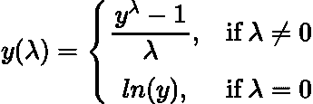
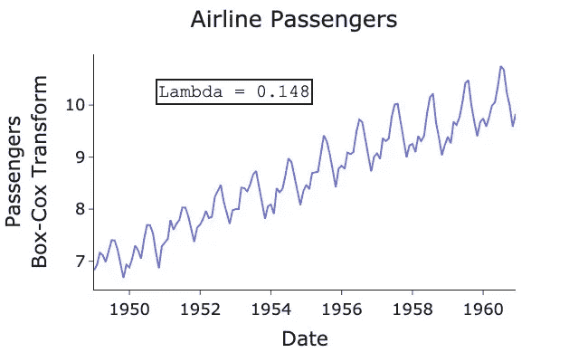

# 时间序列的 Box-Cox 变换

> 原文：<https://towardsdatascience.com/box-cox-transform-for-time-series-cc45f26082c6>

## 如何使用 Box-Cox 变换创建平稳时间序列？

克里斯托夫·比尔在 [Unsplash](https://unsplash.com?utm_source=medium&utm_medium=referral) 上的照片

# 介绍

使时间序列 [**平稳**](https://en.wikipedia.org/wiki/Stationary_process) 是进行任何 [**时间序列**](https://en.wikipedia.org/wiki/Time_series) 分析或预测时必不可少的一部分。平稳性确保我们的数据不会随时间发生统计变化，因此它可以更准确地模拟概率分布，从而更容易建模。

平稳性的一个要求是时间序列需要一个恒定的方差。换句话说，波动应该始终如一地在同一尺度上。实现这一点的一个方法是取序列的自然对数，然而这假设你的原始序列遵循指数趋势。因此，自然对数变换可能并不总是最佳选择。

在这篇文章中，我想介绍一下 [**Box-Cox**](https://en.wikipedia.org/wiki/Power_transform#Box%E2%80%93Cox_transformation) 变换，它是自然对数变换的推广。Box-Cox 允许确定自然对数是否确实是最佳变换，或者某个其他的 [**幂变换**](https://en.wikipedia.org/wiki/Power_transform) 是否更优。

如果您想了解更多关于平稳性的背景和要求，请查阅我以前的文章:

 [## 时间序列平稳性的简单解释

### 时间序列建模中平稳性需求的简单而直观的解释。

towardsdatascience.com](/time-series-stationarity-simply-explained-125269968154) 

# 什么是 Box-Cox 变换？

从根本上说，Box-Cox 将非正态数据转换成更像 [**正态分布**](https://en.wikipedia.org/wiki/Normal_distribution) 的数据。

现在你可能想知道为什么我们需要时间序列数据来模拟正态分布？嗯，在拟合某些模型的时候，比如[**【ARIMA】**](https://en.wikipedia.org/wiki/Autoregressive_integrated_moving_average)，他们用 [**最大似然估计(MLE)**](https://en.wikipedia.org/wiki/Maximum_likelihood_estimation) 来确定他们的参数。根据定义，最大似然估计必须符合某种分布，对于大多数包装来说，这是正态分布。

Box-Cox 变换由 ***λ*** 参数化(从 **-5** 到 **5** ) 将时间序列、 ***y*** *、* 变换为:

作者在 LaTeX 中创建的方程。

我们看到， ***λ=0*** 是自然对数变换，然而还有许多其他依赖于值 ***λ的变换。*** 举个例子，如果 ***λ=0*** 就是平方根变换 ***，λ=1*** 就没有变换 ***λ=3*** 就是三次变换。

值 ***λ*** 通过查看哪个值最接近正态分布的变换数据来选择。幸运的是，在计算软件包中，这对于我们来说很容易做到！

> Box-Cox 是一种 [**幂变换**](https://en.wikipedia.org/wiki/Power_transform) 的类型，因为我们总是将我们的原始系列提升到某个幂，即 **λ *。***

# 应用 Box-Cox 变换

让我们通过一个例子来展示如何在 Python 中使用 Box-Cox 变换。以下是 1948-1960 年间美国航空客运量的典型图表:

> 数据[来自拥有 CC0 许可证的 Kaggle](https://www.kaggle.com/datasets/ashfakyeafi/air-passenger-data-for-time-series-analysis) 。

作者代码要点。

作者用 Python 生成的图。

数据显然不是静态的，因为平均值和方差都随着时间的推移而增加。为了稳定方差，我们可以像上面讨论的那样使用 Box-Cox 变换。Scipy 有一个名为[***boxcox***](https://docs.scipy.org/doc/scipy/reference/generated/scipy.stats.boxcox.html)*的函数，它可以找到 ***λ*** 的最佳值，并使用它相应地转换我们的数据:*

*作者代码要点。*

**

*作者用 Python 生成的图。*

*我们的方差现在是稳定的，波动在一个一致的水平上！最佳 ***λ*** 值为 **0.148** ，接近完美的自然对数变换，但不完全。这表明对数变换并不总是最好的方法，通过 Box-Cox 变换可以使用更彻底的方法。*

*用于生成图和转换的完整代码可以在我的 GitHub 中找到:*

* [## Medium-Articles/box _ Cox _ transform . py at main egorhowell/Medium-Articles

### 此时您不能执行该操作。您已使用另一个标签页或窗口登录。您已在另一个选项卡中注销，或者…

github.com](https://github.com/egorhowell/Medium-Articles/blob/main/Time%20Series/Time%20Series%20Tools/box_cox_transform.py) 

# 结论

稳定的方差是时间序列平稳性的一个要求。平稳性很重要，因为它通常是大多数预测模型所必需的。获得稳定方差的一般方法是对序列应用 Box-Cox 变换，通过 ***λ、*** 进行参数化。Python 中的变换会自动适应最佳值 ***λ*** 并相应地变换您的系列。

# 参考资料和进一步阅读

*   *预测:原理与实践:*https://otexts.com/fpp2/
*   博克斯，乔治 E. P .考克斯博士(1964)。“对转变的分析”。皇家统计学会杂志，B 辑。**26**(2):211–252

# 和我联系！

*   要在媒体上阅读无限的故事，请务必在这里注册！ 💜
*   [*想在我发帖注册时得到更新的邮件通知吗！*T45*😀*](/subscribe/@egorhowell)
*   [*领英*](https://www.linkedin.com/in/egor-howell-092a721b3/) 👔
*   [*碎碎念*](https://twitter.com/EgorHowell) 🖊
*   [*GitHub*](https://github.com/egorhowell) 🖥
*   **🏅**

> **(所有表情符号都是由 [OpenMoji](https://openmoji.org/) 设计的——开源的表情符号和图标项目。许可证: [CC BY-SA 4.0](https://creativecommons.org/licenses/by-sa/4.0/#)***