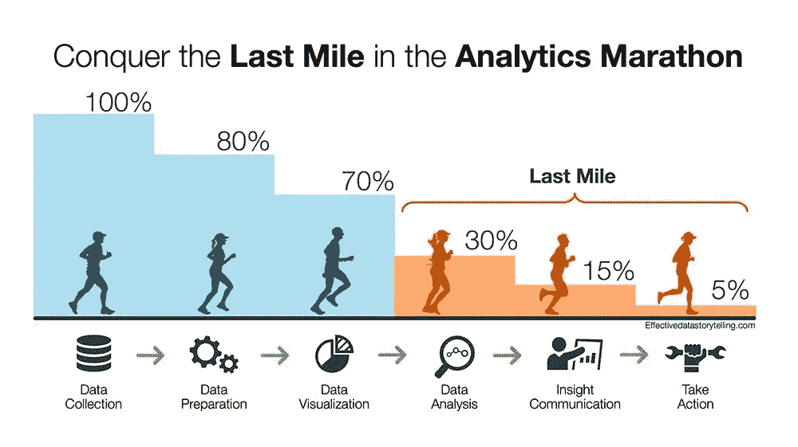
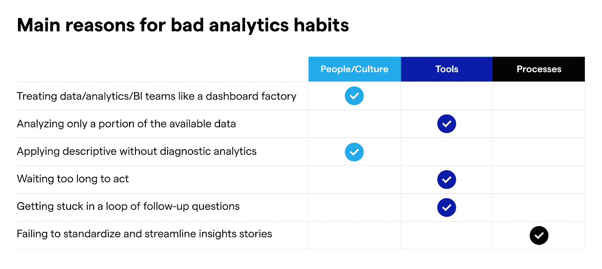

# 打破 6 个分析习惯，释放价值

> 原文：<https://towardsdatascience.com/breaking-6-analytics-habits-to-unlock-value-d33fec9c90ee>

## 团队如何改进他们的数据之旅

对于许多公司来说，数据并没有兑现它的承诺(和 ROI)。因为数据之旅就像一场马拉松，商业价值和影响在最后一英里开始显现。

所谓的分析马拉松的最后一英里包括数据分析、洞察沟通和采取行动。然而，大多数公司在处理最后三个步骤之前就已经退出了竞争，结果是无法达到预期的结果。

分析马拉松—图片来自[布伦特·戴克斯](http://Effectivedatastorytelling.com)

不交付价值可能会很快开始破坏数据文化，并可能导致业务团队忽视在数据马拉松的早期阶段所做的努力。想要创建强大的数据文化并在决策桌上拥有一席之地的数据从业者应该仔细评估这些习惯是否阻碍了他们的团队。

**是什么阻碍了数据团队的发展？**

虽然这个问题没有直接的答案，但我根据与数据和分析领导者和从业者的多次交谈，确定了六个坏的分析习惯。该列表包含导致成本高昂的决策和错失业务影响机会的主题，并与四个关键要素相关:人员、流程、工具和文化，它们是:

**六个主要的坏分析习惯**

1.  像仪表板工厂一样对待数据/分析/BI 团队
2.  仅分析一部分可用数据
3.  全部是描述性的，没有诊断分析
4.  等待太久才行动
5.  陷入后续问题的循环中
6.  未能标准化和简化洞察故事

下图总结了每个坏习惯与四个关键要素中相应的根本原因之间的关系:

不良分析习惯的主要原因—作者图片

1.  **像仪表板工厂一样对待数据/分析/BI 团队**

这些团队没有既定的流程或框架来构建工作流并收集上下文和信息。因此，数据团队会收到许多特别的请求，并被要求在没有适当上下文的情况下创建一个又一个仪表板。通常，他们在没有要求澄清或理解最终目标(即，企业试图实现什么)的情况下就开始分析。数据和业务团队之间的这些沟通差距导致基于假设的工作和数据分析师回答错误的问题。

问“为什么”的文化也经常缺失。

*影响*:关键决策中浪费的时间和延误。

*怎么破:*

*   让数据团队更早地参与流程，并就预期的业务成果和可行的见解达成一致
*   促进数据和业务团队之间的紧密协作
*   开发流程，让人们思考为什么。
*   考虑将您的分析师嵌入到业务团队中。

**2。仅分析部分可用数据**

大多数公司只分析他们收集的一小部分数据。团队通常只关注顶级驱动因素和通常的嫌疑人(即通常的切片和骰子)，这导致测试非常高级的假设。还有一些数据孤岛妨碍了团队利用所有可用的数据(例如，营销团队只查看营销数据，而不将它与订单或产品数据相结合)。

*影响*:错失洞察力和机会。

*怎么破:*

*   超越仪表盘上可用的切片和骰子，开始分析数据中所有可操作的维度
*   通过查看多种因素的组合并利用不同类型的数据(例如，客户、产品和营销数据)进行深入分析

**3。无诊断分析的所有描述**

在仪表板中显示正在发生的事情可以提供信息，但不具有洞察力。只有这些变化背后的“为什么”才能推动建议和行动。然而，团队经常在每周/每月的评审中查看仪表板，并评论指标上升或下降，而没有对根本原因或可操作的见解的明确答案。

*影响*:缺乏行动力，错失商机

*怎么破:*

*   确定您在[诊断分析成熟度](https://www.kausa.ai/blog/diagnostic-analytics-gap)状态中所处的位置，并确定进一步发展的后续步骤

**4。等待太久无法行动**

团队花太多时间分析，以至于不能及时行动。随着业务变化的速度比以往任何时候都快，可操作性洞察的速度变得越来越重要。业务利益相关者需要快速、可行的洞察力，以便在为时已晚之前做出明智的决策。在大多数情况下，团队在同一天就需要洞察，等待几天或几周对于业务采取行动来说太长了。

*影响*:被动团队、错失机会、破坏数据文化

*怎么破:*

*   利用技术来增强当前工作流，并加快获得可操作见解的速度
*   把大部分时间花在独特的人类增值任务上，比如洞察力、沟通和决策

**5。陷入后续问题的循环中**

当使用仪表板执行诊断分析时，跟进是不可避免的。为了理解事物为什么会发生变化以及如何对其采取行动，需要更细致的洞察(例如，结合 2 或 3 个不同的维度)。手动分析可能需要多次迭代，并会产生后续循环，因为最初的答案只是皮毛。然而，如果没有数据团队的支持，企业领导通常很难回答他们的问题。

*影响*:不堪重负的数据团队、没有答案的问题、只触及表面的分析，以及错失的机会。

*怎么破:*

*   投资工具和培训，让商业领袖能够回答他们的问题
*   考虑决策智能平台，使利益相关者能够深入了解原因

**6。未能标准化和简化洞察故事**

报告和分析通常分布在各种平台上，并且缺乏一致的结构:指向仪表板的松散消息、带有即席计算的 Excel 表格、PowerPoint 幻灯片、概念页面、票证等……即使发现了见解，它们也不会被决策者发现，或者它们与业务优先级的关系没有得到很好的解释。

*影响*:难以解释结果并得出可行的见解，错失机会。

*怎么破:*

*   建立通用的报告格式。利用瀑布图等标准方法来总结关键指标的变化。
*   开发和推广数据叙事的最佳实践

# 底线:关注最后一英里

从团队沟通和协作的方式开始，延伸到用于发现见解的工具和分发见解的流程，这些不良的分析习惯正在阻碍团队征服最后一英里的分析，并导致错失机会…

从哪里开始？

*   对你的现状进行一个全面的评估，看看你是否属于这些模式
*   关注最阻碍你的是什么
*   注意是什么在流程的早期破坏了您的价值链，并对接下来的步骤造成了多米诺骨牌效应。

习惯很难打破。花点时间评估、区分优先级并不断引入增量变化。

—

参考资料:

1.  Brent Dykes，[数据分析马拉松:为什么您的组织必须关注终点](https://www.forbes.com/sites/brentdykes/2022/01/12/data-analytics-marathon-why-your-organization-must-focus-on-the-finish/?sh=3defdb53c3b8) (2022)，Forbes.com

—

*想法？伸出手去* [*若昂索萨*](https://www.linkedin.com/in/joaoantoniosousa/)*处长成长处* [*考萨*](http://www.kausa.ai/) *。敬请关注更多关于如何增加分析价值的帖子。*