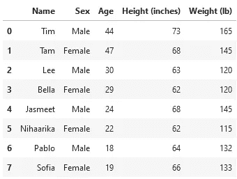
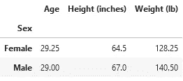
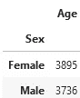
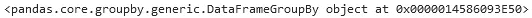
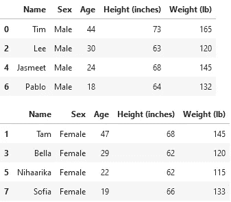

# 破解熊猫 GroupBy 函数背后的强大魔力

> 原文：<https://towardsdatascience.com/breaking-down-the-powerful-magic-behind-the-pandas-groupby-function-b94cc2427eb9>

## 对 groupby 如何工作的详细解释有助于您更好地理解它。


托拜厄斯·菲舍尔在 [Unsplash](https://unsplash.com?utm_source=medium&utm_medium=referral) 拍摄的照片

近年来，一些最受欢迎的数据集和民意调查都与政府选举有关。选举季节已经成为无数图表、地图、民意测验和预测通过大众媒体传播的时候。

我想让你想象你在一个忙碌的早晨醒来，开始翻阅你订阅的《纽约时报》(New York Times)的一些数据(如果你永远不会这么做，就迁就我一下)。你累了，眼睛勉强睁开，心理处理能力还在升温。你只是想要对当下发生的事情有一个快速、容易理解的洞察。

然后， *Times* 给你的是一个， ***巨型*** 数据集，其中每一行都是单个选民，列包含关于年龄、地点、种族、性别等各种数据。等。—最后以选民选择的候选人结束。

那现在没什么意义了，对吧？即使您滚动了几个小时，以这种方式格式化的数据也不太可能为您提供关于底层数据集的任何有意义的信息。简直太分散了。太*生*。

作为数据科学家，我们的主要任务之一是从数据中辨别关键见解，并以简单易懂的方式提供给公众。有多种方法可以完成这项任务——我今天想重点介绍的一种方法是将数据的各种属性组合在一起，努力发现模式。

根据您选择的工具，方法可能会有所不同。在本文中，我将讨论 Python 的 Pandas 模块中分组和聚合数据的一种常用方法:`groupby`函数。

函数本身已经在各种文章中讨论过，但是一个经常被忽略的话题是幕后发生的“魔术”。在本文中，虽然我将简要回顾该函数的上下文，但我将主要深入研究 Pandas 在幕后定义的实际的`GroupBy`对象。通过研究它的结构，我希望你能更好地理解`groupby`实际上是如何工作的，以便在你未来的数据科学任务中更有效地使用它。

让我们开始吧。

## 快速回顾 Groupby

理解`groupby`的最好方法是通过例子。假设我们有下面这个叫做`people`的小数据集，它包含了人们的性别、年龄、身高和体重的信息:



作者图片

`groupby`函数的主要用例是按照特定的列对数据进行分组，并使用一些指定的函数为每个唯一的组聚合其他列的值。例如，如果我们想得到每种性别的平均年龄、身高和体重，我们可以这样做:

```
people.groupby('Sex').mean()
```



作者图片

您会注意到`"Name"`列被自动排除了，原因很简单，计算字符串列表的平均值没有逻辑意义。

还可以 1)一次只关注一列中的值，2)应用自定义聚合函数。例如，可能出于某些奇怪的原因，我们想要按性别划分的年龄的平方和。下面是完成这项任务的代码:

```
def sum_of_squares(arr):
    return sum([item * item for item in arr)])people.groupby('Sex')[['Age']].agg(sum_of_squares)
```



作者图片

以上示例中的一些要点:

*   在我们的用户定义函数`sum_of_squares`中，我们利用了一个[列表理解](/whats-in-a-list-comprehension-c5d36b62f5)【1，2】来迭代地平方所有的项，然后对它们求和。
*   你会注意到这个函数接受一个数组。这是因为当我们按`'Sex'`分组并提取出`'Age'`时，我们有效地将每个组的所有年龄(在本例中为`'Male'`和`'Female'`)存储在一个数组中(或者从技术上讲，是一个[系列对象](https://pandas.pydata.org/docs/reference/api/pandas.Series.html) [3】)。然后，聚合函数接受该数组，并将其值聚合为输出数据帧中显示的每组的单个最终值。我们将在文章的下一部分对此有更深入的了解。
*   使用双括号提取出`'Age'`列是一个语法上的小技巧，它使我们能够以 DataFrame 而不是 Series 的形式返回输出。

至此，我们已经回顾了我们需要的关于`groupby`的一切，以正确理解抽象层下面发生的事情。我们现在准备更深入。

## Groupby 背后的“魔力”

为了简单起见，让我们坚持上面的第一个例子:在通过`'Sex'`变量分组之后，获得所有列的平均值。

**代码** : `people.groupby('Sex').mean()`

**在**之前:


作者图片

**后**:


作者图片

这一切都很好，但有一点不完整。怎么会？如果我们将数据转换分解成几个组成部分，我们会得到三个主要阶段:

1.  原始的、未改变的数据帧(“之前”的图片)。
2.  一种转换后的数据帧，它将感兴趣的列中的所有唯一标签与其他列中的相关值组合在一起。
3.  一个最终的数据帧，它已经聚合了这些值，因此每个组都有一个单独的值(“后”图)。

中间阶段怎么了？为了深入理解`groupby`，这可以说是流程中最重要的部分，所以让我们看看是否有一种方法可以显示这个中间步骤的数据。

第一种尝试可能是在调用`groupby`之后、调用聚合函数(在我们的例子中是`mean`)之前尝试显示数据:

```
people.groupby('Sex')
```



作者图片

嗯，好吧——所以事情没有按计划进行。我们只是得到了字面量`GroupBy`对象的字符串表示，就像在 Pandas 中实现的那样。事实证明，要查看分组后的实际数据，我们需要使用对象的关联`get_group`函数:

```
people_grouped_by_sex = people.groupby('Sex')
for group in people['Sex'].unique():
    display(people_grouped_by_sex.get_group(group))
```



作者图片

让我们来分解一下:

*   首先，我们将`GroupBy`对象存储在变量`people_grouped_by_sex`中。
*   然后，我们使用一个循环来遍历`'Sex'`列的所有唯一标签，我们知道这些标签构成了`GroupBy`对象的唯一组。请注意，它也可以直接遍历一个硬编码的列表，比如`['Male', 'Female']`，但是我故意编写了上面的代码来演示如何将这种技术推广到一个更大的数据集——特别是在您可能不知道所有唯一的组标签的情况下。
*   最后，我们使用`GroupBy`对象的`get_group`方法来访问每个组的数据帧——我喜欢称它们为“子帧”或“迷你数据帧”，尽管我会提到这些无论如何都不是标准术语。`display`函数在[Jupyter Notebooks](https://levelup.gitconnected.com/whats-in-a-jupyter-notebook-windows-edition-1f69c290a280)【4】中使用，以一种漂亮的、人类可读的格式输出你传递给它的任何对象。

现在，我们可以看到中间阶段发生了什么:Pandas 获取数据帧，并将其分成一堆更小的数据帧，每个数据帧包含我们分组所依据的列中的一个组标签的数据。然后将这些子帧的值汇总，得到最终的数据帧。

例如，在上面的第一个子帧中(对于组`'Male'`),`'Age'`列中的值是`44, 30, 24,`和`18`。这些数字的平均值是`29.00`，确切地说，是在我们的`GroupBy`对象上调用`mean`函数后，我们在最终输出数据帧中看到的值。其他值的计算方式完全相同。

现在你知道了——`groupby`的秘密不再是秘密了。

## 一些最后的提示和想法

我将以一些通用的提示结束，下次你处理`groupby`时记住，无论是为你自己还是向他人解释:

*   **简单性**:使用`groupby`的目的应该是*简化*你的数据，而不是让它更加复杂。
*   **聚焦**:虽然有可能对多个栏目进行分组，但开始时慢一点，集中精力绘制聚焦的洞见通常是个好主意。即使一次只有一个专栏，您也可以做很多事情。
*   适应性:不要纠结于这个单一的解决方案，因为根据你的情况可能会有更好的选择。在 Pandas 中还有[其他方式来聚集数据。](/a-comparison-of-groupby-and-pivot-in-pythons-pandas-module-527909e78d6b)

最后一点，你可能想知道为什么 Pandas 不直接向我们展示这些迷你数据帧，而是需要一种迂回的方法来查看它们。从编程的角度来看，这是有意义的:用户不需要*知道使用`groupby`时发生了什么。隐藏其工作方式可以作为一个抽象层，防止新用户在早期感到困惑或不知所措。*

也就是说，我认为钻研这些细节是非常有用的教学工具，可以更好、更深入地理解`groupby`实际上是如何工作的。获得这种理解帮助我更好地解析和编写更复杂的`groupby`查询，我希望它能为你做同样的事情。

就这样，下次再见了。快乐分组！

**想擅长 Python？** [**获取独家，免费获取我简单易懂的攻略**](https://witty-speaker-6901.ck.page/0977670a91) **。想在介质上无限阅读故事？用我下面的推荐链接注册！**

<https://murtaza5152-ali.medium.com/?source=entity_driven_subscription-607fa603b7ce--------------------------------------->  

*我叫穆尔塔扎·阿里，是华盛顿大学研究人机交互的博士生。我喜欢写关于教育、编程、生活以及偶尔的随想。*

## 参考

[1][https://towardsdatascience . com/whats-in-a-list-comprehension-C5 d 36 b 62 f 5](/whats-in-a-list-comprehension-c5d36b62f5)
【2】[https://level up . git connected . com/whats-in-a-list-comprehension-part-2-49d 34 bada 3 f 5](https://levelup.gitconnected.com/whats-in-a-list-comprehension-part-2-49d34bada3f5)
【3】[https://pandas.pydata.org/docs/reference/api/pandas.Series.html](https://pandas.pydata.org/docs/reference/api/pandas.Series.html)
【4】[https://level up . git connected . com/whats-in-a-jupyter-notebook-windows-edition-1f 69 c 290 a 280](https://levelup.gitconnected.com/whats-in-a-jupyter-notebook-windows-edition-1f69c290a280)